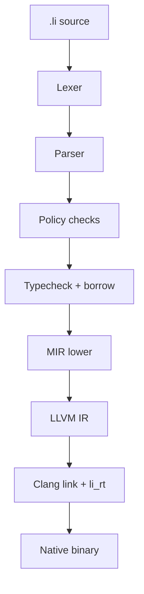

# How `lic build` works

When you run `lic build program.li -o app`, Li runs a **fixed pipeline**. If any stage fails, you get diagnostics — not a broken binary.

## Stages (in order)

| Stage | What it does |
|-------|----------------|
| **Lexer** | Text → tokens (indentation-aware) |
| **Parser** | Tokens → AST |
| **Policy** | Forbidden constructs (`Any`, bad parallel patterns, …) |
| **Typecheck** | Types, effects, contracts surface |
| **Borrow** | Memory exclusivity |
| **Lean** (full gate) | Discharge proof obligations — **not wired yet** ([gaps](../verification/provability-gaps.md) **G-lean**) |
| **MIR** | Typed AST → mid-level IR (SIMD, loops, calls) |
| **LLVM** | MIR → `.ll` IR |
| **Link** | Clang links IR + `runtime/li_rt.c` (+ OpenMP if needed) |

`lic parse` and `lic check` stop earlier for speed.

## What happens at compile time vs run time

| Compile time | Run time |
|--------------|----------|
| Type errors | — |
| Out-of-bounds proofs | Optional bounds trap in debug |
| Parallel race rejection | — |
| LLVM optimization (`--release`) | CPU executes machine code |
| OpenMP team creation | Threads run parallel loops |

Most safety wins are **before** you run the program. The full proof gate is still **in progress** — see **[Provability gaps](../verification/provability-gaps.md)**.

## Flags

| Flag | Effect |
|------|--------|
| `--release` | `-O2` style optimization at link |
| `--threads=N` | Sets `LI_OMP_THREADS` for parallel loops |
| `-o path` | Output binary path |

Environment:

| Variable | Effect |
|----------|--------|
| `LI_EXTRA_C` | Extra `.c` files to link (benchmarks) |
| `LI_OMP_THREADS` | OpenMP thread count |
| `CC` / `CXX` | C compiler for final link |

## Artifacts

- Intermediate LLVM IR is written temporarily during build.
- Final output is a native executable depending on `li_rt` (panic, print, OpenMP driver, math helpers).

## Architecture detail

Module layout: [Architecture overview](../architecture/overview.md).

## LLVM types and C ABI

Which LLVM types correspond to `int`, `str`, `bytes`, and `extern` calls — and how that must match `runtime/li_rt.c` — is documented in **[LLVM codegen and native ABI](llvm-abi.md)**. Read that before adding new `extern proc` or changing pointer parameter types.
