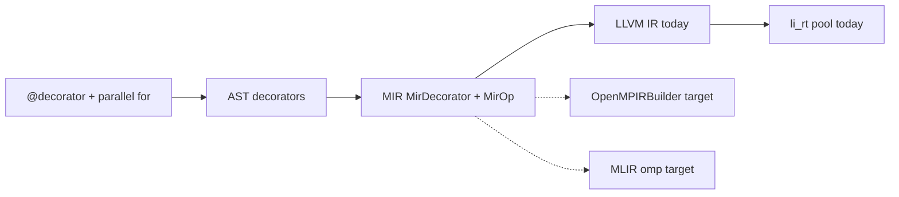

# Execution decorator lowering map (LLVM OpenMP IR / MLIR `omp`)

**Status:** Normative upstream map for **PH-7e** / **G-par** — documents how `std/execution` decorators lower today and how they should align with [LLVM `OpenMPIRBuilder`](https://llvm.org/doxygen/classllvm_1_1OpenMPIRBuilder.html) and the [MLIR `omp` dialect](https://mlir.llvm.org/docs/Dialects/OpenMPDialect/).

**Related:** [Execution decorators spec](../superpowers/specs/2026-05-16-li-execution-decorators.md), [execution surface](../superpowers/specs/2026-05-25-li-execution-surface.md), [SIMD and parallel](../language/simd-parallel.md), [OpenMP → li-parallel migration](../../packages/li-parallel/docs/migrate-openmp.md), [issue #34](https://github.com/li-langverse/lic/issues/34).

## Why this map exists

Li decorators are **compile-time only** — no runtime registry. G-par work needs a single upstream table so:

1. Compiler engineers know which MIR ops to emit and which LLVM/MLIR builders to target.
2. Proof engineers can tie `disjoint_*` witnesses to parallel-region semantics (not Kokkos-only analogies).
3. Benchmark rows can compare Li against OpenMP-backed C++ without guessing the lowering path.

**North star fit:** scientific_computing, hpc — **PH-7e** (SIMD/parallel lowering), **G-par** (portable parallel semantics).

## Pipeline slice



| Stage | Module | Role |
|-------|--------|------|
| Parse | `compiler/parser/parser.cpp` | `@name`, `@name(args)` on `def` / `for` / `parallel for` |
| Policy | `compiler/types/policy_module.cpp` | `disjoint=` required on `@parallel`; GPU/offload validation |
| MIR | `compiler/mir/lower.cpp` | `MirDecorator`, outlined `__li_par_*`, `OmpParallelFor`, SIMD scope |
| LLVM | `compiler/codegen/emit.cpp` | Vector ops, `li_parallel_for_i64` call, team constant |
| Runtime | `runtime/li_par_pool.c` | Native pthread pool (default user link path) |

## Decorator → MIR → LLVM (today)

Reserved names live in `std/execution/decorators.li`. Users never call them at runtime.

| Decorator | MIR surface | LLVM / runtime today | OpenMP team? |
|-----------|-------------|----------------------|--------------|
| `@parallel(disjoint=…)` on `def` | `MirDecorator.parallel`, `disjoint_proven`; inherited by nested `parallel for` | Indirect — sets policy on child `OmpParallelFor` | No — pool |
| `parallel for` + `disjoint_*` | `MirOp::OmpParallelFor`, outlined `__li_par_*` body, `parallel_disjoint_proven` | `call @li_parallel_for_i64(start, end, body, team)` | No — pool |
| `parallel for` + `reduce(+:\|min:\|max: v)` | `par_reduce_kind`, `li_parallel_for_reduce_*` | Tree reduce in `runtime/li_par_reduce.c` | No — pool |
| `@vectorized` / `@vectorized(lanes=N)` on `for` | `ArraySimdScope` push/pop; `Simd*` ops on `f64`×4 vectors | `llvm::VectorType` lane ops; **never** `OmpParallelFor` | No — SIMD in one thread |
| `@vectorized` on `def` | `MirDecorator.vectorized` proc tag | Enables SIMD lowering on inner loops | No |
| `@no_vectorize` on `def` | `fn.no_vectorize` | Suppresses vectorization hints | No |
| `@cpu` | Placement tag (telemetry) | No codegen change — CPU path default | No |
| `@gpu` / `@gpu(devices=N)` | `MirDecorator.gpu`, `gpu_devices`; verify telemetry | Placement metadata only (**G-gpu** open) | N/A |
| `@offload` | `exec_plan.offload_count`, xfer plan hooks | `li_exec_plan_apply` / xfer stubs (**WP-PAR-07**) | Future device |
| `@async` | `AsyncAwait`, frame enter/leave | Async lowering (separate track) | No |
| `@serial` | Policy / future MIR tag | Serial execution intent | No |
| `team(cores=N) { … }` | `TeamPush` / `TeamPop` | Scoped team override in MIR | No — pool |
| `distributed for` | `MirOp::DParFor` | `runtime/li_dpar.c` block partition (**G-par-dist**) | No |

**Important naming note:** `MirOp::OmpParallelFor` is a **historical label**. Today it lowers to the **native** `li_parallel_for_i64` pool, not to LLVM OpenMP IR. The `uses_openmp` MIR flag marks parallel loops for link-time runtime selection; user binaries do **not** require `libomp` on the default li-parallel path.

### `@vectorized` vs `@parallel` (hard separation)

From `compiler/codegen/emit.cpp`:

- **`@vectorized`** → `llvm::VectorType` + `ArraySimdScope` — one OS thread, N lanes.
- **`@parallel` / `parallel for`** → outlined body + `li_parallel_for_i64` — many cores.

`li-tests/execution_resources/smoke.sh` enforces: vectorized builds must **not** reference `li_parallel_for_i64`; parallel builds **must**.

## Target map — LLVM `OpenMPIRBuilder`

When Li adopts OpenMPIRBuilder (optional backend behind `LI_PAR_BACKEND=openmp` or similar), map Li surfaces to OpenMP IR constructs:

| Li surface | OpenMPIRBuilder entry point | OpenMP IR concept | G-par witness |
|------------|----------------------------|-------------------|---------------|
| `parallel for i in lo..<hi` with `disjoint_elem` | `createParallel` + `createLoop` / `createCanonicalLoop` | `#pragma omp parallel for` | `parallel_disjoint_proven` → `omp.parallel` + static schedule |
| `reduce(+: acc)` | `createReduction` on loop | `reduction(+:acc)` | Associative float reduce; proof in `Discharge.lean` |
| `@parallel(disjoint=disjoint_row(i, grid))` inherited | Same as loop; disjoint policy copied in `lower.cpp` | Shared-memory parallel region | `memory_disjoint_rows_spec` |
| `team(cores=N)` | `setNumThreads` / `createBarrier` in scoped region | `num_threads(N)` | Team size baked at build (`--cores`) |
| `@vectorized(lanes=4)` on inner `for` | **Not** `createSimdLoop` from outer `@parallel` — use `llvm::VectorType` or future `createSimd` only inside serial loop body | `#pragma omp simd` (serial lane SIMD) | No extra threads — stays PH-7e SIMD track |
| `distributed for` | `createSections` / custom — **defer** until G-par-dist needs MPI+OpenMP hybrid | Multi-rank + host OpenMP | `G-par-dist` block partition lemmas |

### Shared data and captures

Today, `emit.cpp` copies captured arrays to `shared` globals before `li_parallel_for_i64`. OpenMPIRBuilder equivalent:

| Li MIR | OpenMPIRBuilder | Notes |
|--------|-----------------|-------|
| `MirParCapture` array copy-in | `createCopyin` / `createCopyprivate` or `map(to:)` for device later | Proof: disjoint writes ⇒ no cross-iteration alias |
| Outlined `__li_par_*` body | `createOutlinedFunction` + `createLoop` body callback | Same outline pattern as today |
| `runtime_team_size` constant | `setNumThreads` at region entry | From `--cores` × `--threads-per-core`, cap 64 |

### Reduction lowering target

| Li | OpenMPIRBuilder | Current runtime |
|----|-----------------|-----------------|
| `reduce(+: s)` | `createReduction` with `OMP_REDUCTION_ADD` | `li_parallel_for_reduce_add_f64` |
| `reduce(min: s)` | `OMP_REDUCTION_MIN` | `li_parallel_for_reduce_min_f64` |
| `reduce(max: s)` | `OMP_REDUCTION_MAX` | `li_parallel_for_reduce_max_f64` |

## Target map — MLIR `omp` dialect

For an MLIR stage (future `lic build --mlir` or Flang-class bridge), map MIR ops to `omp` ops before LLVM translation:

| Li MIR | MLIR `omp` op | Attributes / regions |
|--------|---------------|----------------------|
| `OmpParallelFor` (disjoint proven) | `omp.parallel` → `omp.wsloop` | `schedule(static)`, `private`, `reduction` |
| `par_reduce_kind != None` | `omp.reduction` on `wsloop` | `addf` / `minf` / `maxf` |
| Outlined `__li_par_*` | `omp.parallel` region with `func.call` to outlined symbol | Same symbol naming as LLVM path |
| `@vectorized` inner loop (serial) | Prefer `vector` dialect + `llvm.intr.vector_*`; optional `omp.simd` only when OpenMP SIMD is selected | Keep disjoint from `omp.wsloop` |
| `TeamPush` / `TeamPop` | `omp.parallel` with `num_threads = N` | Scoped nest |
| `DParFor` | `omp.sections` or custom `li.dpar` dialect lowering to MPI + host `omp.parallel` | G-par-dist |
| `@offload` / `@gpu` | `omp.target` / `omp.target_data` (device track) | **G-gpu** / WP-PAR-07 — not G-par CPU |

Translation flow (target):

```
Li MIR  →  MLIR (func + scf + omp)  →  OpenMP dialect → LLVM dialect  →  libomp or li_rt
```

## Proof and policy hooks (G-par)

| Li source | Policy (`policy_module.cpp`) | Lean / AutoVC | Parallel semantics |
|-----------|------------------------------|---------------|-------------------|
| `requires disjoint_elem(i, a)` | Loop clause required | `memory_disjoint_elems_spec` | Distinct `i` ⇒ distinct slots |
| `@parallel(disjoint=disjoint_row(i, g))` | Decorator arg must be `disjoint_*` call | Inherited to nested `parallel for` | Row-disjoint writes |
| Missing disjoint | Compile error | — | Rejected before MIR |
| Fake disjoint | — | VC / `Discharge.lean` failure | No OpenMP IR emitted |

Portable semantics: **if `lic build` succeeds**, the outlined parallel loop is intended to be race-free on shared memory under the proved disjoint policy — independent of whether the backend is pthread pool or OpenMPIRBuilder.

## Backend selection (planned)

| Backend | When | Link |
|---------|------|------|
| **Native pool** (default) | `li_parallel_for_i64` in `li_par_pool.c` | No `libomp` |
| **OpenMPIRBuilder** | Opt-in toolchain flag / future `LI_PAR_BACKEND=openmp` | `libomp` or LLVM embedded OpenMP |
| **MLIR omp** | Compiler stage experiment | Lowers to same OpenMP IR as above |

`li_omp_parallel_for_i64` remains a **deprecated alias** that forwards to the native pool — not OpenMPIRBuilder output.

## File index (implementation)

| Path | Relevance |
|------|-----------|
| `std/execution/decorators.li` | Reserved names + resource knob comments |
| `compiler/mir/include/li/mir.hpp` | `MirOp`, `MirDecorator` |
| `compiler/mir/lower.cpp` | Decorator copy, `OmpParallelFor` outline |
| `compiler/codegen/emit.cpp` | LLVM emission, vectorized vs parallel split |
| `compiler/types/policy_module.cpp` | `disjoint=` enforcement |
| `runtime/li_par_pool.c` | `li_parallel_for_i64` |
| `runtime/li_par_reduce.c` | Tree reductions |
| `li-tests/execution_resources/smoke.sh` | Vectorized must not call parallel runtime |
| `scripts/check-mir-parallel-decorator.sh` | MIR disjoint telemetry + parallel build |

## Open work

| Item | Gap | Owner track |
|------|-----|-------------|
| Wire OpenMPIRBuilder backend | Optional `LI_PAR_BACKEND` | Compiler codegen |
| MLIR stage for `omp` | No `lic --mlir` yet | Compiler architecture |
| `@gpu` / `@offload` device lowering | G-gpu, WP-PAR-07 | Hetero execution |
| `omp task` / sections | Not in v1 surface | li-parallel backlog |
| Full float Lean props for SIMD math | G-math partial | PH-7e / 2i |

## Agent checklist (issue #34)

- [x] Single upstream map: decorator → MIR → LLVM today → OpenMPIRBuilder → MLIR `omp`
- [x] G-par / PH-7e linkage and proof hooks documented
- [x] Cross-links from execution specs and handbook
