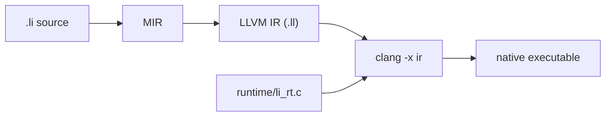

# LLVM codegen and native ABI (today)

This page documents **what `lic build` actually lowers to** in LLVM IR and how that must match **C runtime** symbols. There is no separate published “Li native ABI” spec yet — this file is the implementation contract agents and `extern` authors should follow.

See also: [Build pipeline](build-pipeline.md), `compiler/codegen/emit.cpp`, `compiler/mir/lower.cpp`, `runtime/li_rt.h`.

## End-to-end path

`lic build` does **not** emit machine code directly.



1. **MIR** — typed AST lowered to `MirInsn` (calls, locals, branches).
2. **LLVM IR** — `emit_llvm_ir()` writes a temp `.ll` module.
3. **Link** — `clang` compiles the `.ll` plus `runtime/li_rt.c` (and `li_rt_net.c` when present) into one binary.

Proof artifacts (`AutoVC.lean`, `lic verify`) are **not** linked into the binary.

## Three layers (do not mix them)

| Layer | Role |
|-------|------|
| **Li types** | `int`, `str`, `bytes`, `var bytes`, refinements, contracts — typechecker + borrow. |
| **MIR / codegen** | `MirParam.is_string` means “use **`i8*`** in LLVM”; `is_i64` means **`i64`**; default scalars are **`i32`** / **`double`**. |
| **Platform ABI** | After clang, calls use the normal C ABI for the target (e.g. x86-64 SysV: `rdi`, `rsi`, … for pointers, `eax` for `int32_t` return). |

A Li program can typecheck while LLVM IR is wrong (e.g. passing `i8*` to a callee still declared as `i32`). Clang then fails with `Call parameter type does not match function signature`.

## LLVM type map (implementation)

| Li type (surface) | MIR / codegen | LLVM type | C runtime (today) |
|-------------------|---------------|-----------|---------------------|
| `int`, `bool` | default | `i32` | `int32_t` |
| `float` | `is_float` | `double` | `double` |
| `int64`, `i64`, `long` | `is_i64` (not `str`/`bytes`) | `i64` | `int64_t` / `long long` |
| `str`, `string` | `mir_ptr_param_type_name` → `is_string` | `i8*` (NUL-terminated) | `const char*` |
| `bytes`, `var bytes` | same as `str` for codegen | `i8*` | `const char*` — see `li_rt.h` (*Bytes = str until distinct buffer ships*) |
| String literal `"GET"` | `MirArg.is_string` | `i8*` → private global `@.str.N` | `const char*` |
| `ptr` (type name) | `is_i64` in MIR for `.li` procs | `i64` in LLVM for user procs | call-site specific |
| Object by value | `return_object_layout` | LLVM `struct` | in-process only |
| `array[N, int]` (fixed) | `fixed_array_elems` | `[N x i32]` (or float) in allocas / structs | stack aggregates |

**Locals:** most scalars live in `alloca` slots on the stack in the entry block; clang later promotes to registers under `-O2` (`--release`).

**Imported / internal `.li` calls:** `CallProc` must see the callee already declared in the LLVM module. Codegen uses a **two-pass** emit: declare all MIR functions, then emit bodies (so `main` can call `match_route_fixture` defined later in the MIR list).

## String and bytes (same native ABI today)

At runtime, `str` and `bytes` both lower to a **C string pointer**:

- Literals: `emit_string_global` + `string_ptr` → `i8*`.
- Parameters: stored in `ptr_locals` (`ensure_ptr_local`), not `i64_locals`.
- Std / trusted C: `bytes_len(const char*)`, `li_rt_str_byte_at(const char*, int32_t)`, etc. — all declared with `i8*` in `emit.cpp` and implemented in `li_rt.c`.

When adding a real `Bytes` buffer (pointer + length, or opaque handle), introduce a **new** LLVM representation and update **both** `emit.cpp` and `runtime/li_rt.h` in the same change.

## `extern proc` and C link edge

Trusted C symbols are pre-declared in `emit_llvm_ir()` with explicit LLVM signatures, e.g.:

```text
li_rt_match_route_fixture(i8*, i8*) -> i32
bytes_len(i8*) -> i32
```

Li `extern proc` declarations in MIR use a separate rule: parameters with `is_string` **or** `is_i64` on the MIR extern record become `i8*` in LLVM. That matches current C shims (mostly `const char*` + `int32_t` returns). A true `i64` **extern** parameter would be mis-lowering today — avoid until the extern table is split (`is_string` vs `is_i64`).

**Checklist for new runtime C:**

1. C prototype in `runtime/li_rt.h` / `.c` uses normal C types.
2. Matching `getOrInsertFunction` in `emit.cpp` (`i8*`, `i32`, `double`).
3. Li wrapper uses `str` or `bytes` for pointer parameters, `int` for `int32_t`, not `int` for pointers.

## Common failure modes

| Symptom | Typical cause |
|---------|----------------|
| Binary returns garbage / wrong exit code | `CallProc` callee not declared yet → call silently skipped (fixed by two-pass emit). |
| Clang: parameter type does not match | Callee param still `i32` in LLVM but caller passes `i8*` (e.g. `bytes` before `mir_ptr_param_type_name`). |
| C oracle OK, Li binary wrong | Li never called the runtime function, or passed wrong pointer type. |

## Debug aids

| Variable / artifact | Use |
|---------------------|-----|
| Temp `li_build_*.ll` under `/tmp` | Inspect `define @li_user_main` and `call` sites (file removed after link unless you patch `compile.cpp` to keep it). |
| `objdump -d ./app \| rg match_route` | Confirm calls reach expected symbols. |
| `strings ./app \| rg GET` | Literal pool present in binary. |

## Related tests

| Test | What it guards |
|------|----------------|
| `li-tests/routing/match_routes.li` | `CallProc` + string args → `match_route_fixture` → exit 0 |
| `li-tests/run_httpd_config.sh` | Python oracle + Li binary |
| `li-tests/composable/import_http_lib.li` | `bytes` / literal → `http_is_get_method_line` |
| `li-tests/httpd/parse_request_smoke.li` | literal → `parse_request(...)` |
| `scripts/check-httpd-route-fixture.sh` | Pure C oracle for `li_rt_match_route_fixture` |
