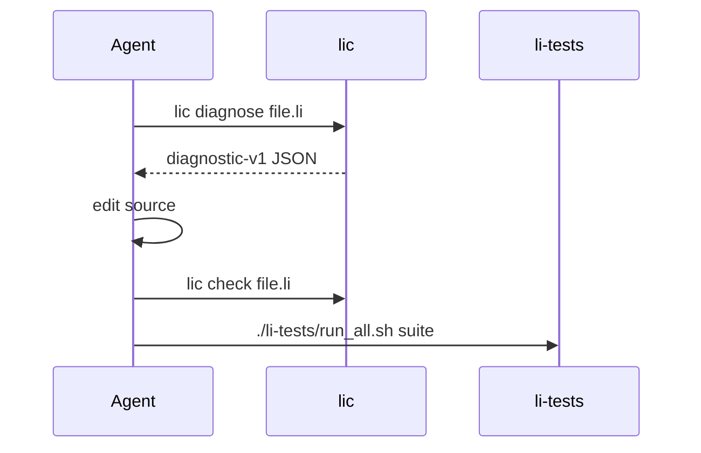

# Agent handover formats

**What this page is for:** Compare how coding agents discover repo context, tools, and errors — and what Li standardizes on.

**Prerequisites:** [agent-coordination.md](agent-coordination.md), [li-agent-manifest.toml](li-agent-manifest.toml).

## Comparison

| Format | Primary consumer | Strengths | Weaknesses for Li |
|--------|------------------|-----------|-------------------|
| **AGENTS.md** | Cursor, Codex, generic agents | Simple markdown at repo root; human + agent readable | Unstructured; drifts from CI truth |
| **Cursor rules (`.mdc`)** | Cursor | Always-on policy; globs | Editor-specific; not machine-validated |
| **A2A (Agent-to-Agent)** | Multi-agent orchestrators | Task/capability envelopes, RPC-ish | Heavy; Li not running agent mesh yet |
| **OpenAI function / tool schemas** | API agents | Strict JSON Schema; great for single-shot tools | Not a repo map; no file context |
| **MCP tool descriptors** | Cursor / Claude MCP | Discoverable tools + resources | Per-server; Li needs `lic` as first-class tool |
| **LSP** | IDEs | Locations, codes, incremental | No proof status; not all agents speak LSP |
| **Continue / Devin patterns** | SaaS agents | Handoff = issue + branch + test command | Proprietary; map to manifest commands |
| **li-agent-manifest.toml** | Li ecosystem | Canonical commands + schema paths | New; v0 stub |

## Li recommendation (v0)

Use a **layered handover**:

1. **`AGENTS.md`** — pillar order, PR-only, three gates (short; link out).
2. **`docs/ecosystem/li-agent-manifest.toml`** — canonical commands (`check_json`, `diagnose`, `tests`, `bench`).
3. **`docs/schemas/diagnostic-v1.json`** — stable error envelope for fix loops.
4. **`.cursor/rules/*.mdc`** — editor policy (provability, llm-first token discipline).
5. **Generated (optional):** `scripts/gen-li-agent-manifest.sh` → `li-agent.json` + `.cursor/AGENTS.generated.md`.

Do **not** duplicate full language spec in handover files — link to `docs/superpowers/specs/`.

### Agent fix loop (recommended)

## Learned from

- **LSP** — file/line/col + stable codes → Li `type.index`, `parse.indent`, etc.
- **MCP** — explicit tool list → manifest `[commands]` table.
- **AGENTS.md** — onboarding without reading entire handbook.

## Related

- [2026-05-16-li-llm-first-design.md](../superpowers/specs/2026-05-16-li-llm-first-design.md)
- [Engineering standards](https://github.com/li-langverse/roadmap/blob/main/docs/ecosystem/engineering-standards.md)
