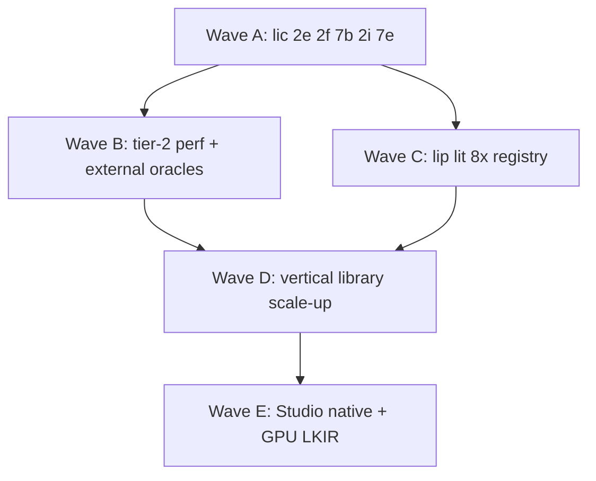

# Algorithms & libraries — ecosystem plan (full vertical spectrum)

**Status:** Active (rev. 1 — 2026-05-21)  
**Audience:** Architects, package owners, agents  
**Canonical product vision:** [world-studio-vision.md](../game-dev/world-studio-vision.md)  
**Compiler truth:** [master plan](../superpowers/plans/2026-05-14-li-master-plan.md) · [provability-gaps.md](../verification/provability-gaps.md)  
**Perf / validity:** [competitive-engines-plan.md](../benchmarks/competitive-engines-plan.md) · `benchmarks/competitive/registry.toml`

This page is the **algorithms-and-libraries** layer under World Studio — not the studio shell, not `lic` internals alone.

---

## 1. Executive assessment (2026-05-21)

| Dimension | Score | Notes |
|-----------|-------|-------|
| **Vision breadth** | Strong | [world-studio-vision.md](../game-dev/world-studio-vision.md) covers gaming → AM → drug/bio → QM → cinematic → MMO |
| **Vertical RFC depth** | Medium | Per-domain RFCs exist; many are API/stub-level, not algorithm SOTA tables |
| **HPC language competitor intel** | Strong | `registry.toml`, tier-12 harness, ≤1.2× C++ policy, NumPy BLAS labeled |
| **Domain-tool competitor intel** | Medium | [competitive-landscape.md](../game-dev/competitive-landscape.md) + [ui-ux-by-dimension.md](../game-dev/competitive-intel/ui-ux-by-dimension.md); thin on **library/API** parity per vertical |
| **Algorithm implementation map** | Weak | No single table tying vertical → kernel family → incumbent library → Li package → bench id |
| **`lic` maturity honesty** | Critical gap | Master tracker overstates proof gate; **2e/2f** open ([G-VERIFY-01](../verification/provability-gaps.md)) |
| **Large-scale library build** | **Blocked** | Do not scale domain code until Wave A gates below |

**Verdict:** The **studio + profile** plan is detailed enough to steer agents. The **algorithms/libraries** plan was implicit across RFCs — this document makes it explicit and adds missing competitor + scheduling discipline.

---

## 2. What we already have (do not duplicate)

| Asset | Location | Role |
|-------|----------|------|
| World Studio master vision | `docs/game-dev/world-studio-vision.md` | Profiles, packages, PH-* program IDs |
| PH program tracker | `docs/game-dev/PH-world-studio-program.md` | Sprint/composable status |
| HPC bench registry | `benchmarks/competitive/registry.toml` | cpp/rust/julia/numpy/li columns |
| Engine registry | `benchmarks/competitive/engines.toml` | UE/Unity/Gazebo proxies |
| Vertical bench stubs | `bioengineering.toml`, `mmorpg.toml`, `world-studio.toml` | Composable + timed hooks (stubs) |
| Physics packages | `packages/physics.*` | Tier-2 kernels, not full CAE/QM |
| UX competitive intel | `docs/game-dev/competitive-intel/` | 14 dimensions; steal patterns for Studio |
| Bio/drug plans | `competitive-bioengineering-plan.md`, `drug-design-lab-loop-rfc.md` | Best vertical example of competitor + bench rows |
| CAD (Li repo) | `li-language/docs/ecosystem/cad-fundamentals.md` | Gap analysis only — no kernel |

---

## 3. Vertical coverage matrix (applications → libraries)

**Legend:** UI = Studio shell · Algo = proved kernels · Bench = timed/validity row · Intel = competitor map maintained

| Vertical | Studio profile / workspace | Primary Li packages (target) | Incumbent algorithms/libs (track) | Plan depth today | Bench today |
|----------|---------------------------|--------------------------------|-----------------------------------|------------------|-------------|
| **Gaming** | `game` | `world`, `physics.*`, `render`, `player` | UE5, Unity, Godot, Bullet, PhysX, Jolt | RFC + UE proxy | `world-studio.toml`, tier-2 proxies |
| **HPC / physics sim** | `sim_scientific` | `sim.scientific`, `physics.*`, `math` | GROMACS, LAMMPS, OpenFOAM, PETSc, Kokkos | Medium | tier-2 MD/PDE + registry |
| **Computational chemistry** | `sim_scientific` / drug | `chem`, `chem.dft` | Psi4, ORCA, Gaussian, xTB, ASE | RFC (PH-QM) | DFT smoke stub; no external oracle column |
| **Drug design** | `sim_drug_design` | `sim.drug_design`, `chem`, `studio.adaptive` | Roche LITL, Schrödinger, DiffDock-class | Strong (PH-DRUG) | LITL composables |
| **Comp. biology / bioeng** | `sim_drug_design` + `bioeng` | `bioeng`, `chem`, `ml` | Benchling, Rosetta, ProteinMPNN, RFdiffusion | Strong (PH-BIOENG) | `bioengineering.toml` stub |
| **Engineering / CAE** | `sim_scientific` | `sim.scientific`, `voxel`, `math` | COMSOL, ANSYS, SimScale, CalculiX | Thin (folded into PH-SCI) | PDE proxies only |
| **Robotics** | `sim_robotics` | `sim.robotics`, `physics.rigid` | Gazebo, Isaac Sim, MoveIt, Drake | RFC (PH-ROBO) | composable only |
| **Automotive** | `sim_automotive` | `sim.automotive` | CARLA, AirSim | RFC | composable only |
| **Additive manufacturing** | `sim_additive` | `sim.additive`, `voxel`, heat | Cura, Prusa, Bambu, OpenFOAM thermal | RFC (PH-AM) | heat tier-2; no slicer oracle |
| **CAD / mechanical** | import → AM/sim | future `geometry.*` | OCCT, CGAL, Fusion, Onshape | Gap doc only (li-language) | none |
| **3D modeling / DCC** | `li-scene` + assets | `assets`, `render`, `scene` | Blender, Maya, Houdini | Creative RFC | none (UX intel only) |
| **Cinematic / animation** | `seq` workspace | `studio.publish`, scene/anim | UE Sequencer, Blender VSE, Resolve, CapCut | RFC (creative) | frame hash stub |
| **ML / RL** | `sim_rl` | `ml`, `gpu` | PyTorch, JAX, Ray, Triton | RFC (PH-ML) | tier-3 MLP planned |
| **MMO** | `mmo` profile | `mmo`, `store.realtime`, `net.httpd` | Photon, Spatial, custom shards | Plan + composables | `mmorpg.toml` stub |

---

## 4. Competitor intelligence — two layers (required)

### Layer A — HPC / language runtimes (mature)

**Source:** `benchmarks/competitive/registry.toml`, [competitive-engines-plan.md](../benchmarks/competitive-engines-plan.md).

| Competitor | Compared today | Gap to close |
|------------|----------------|--------------|
| C++/OpenMP | tier-1/2 kernels | Keep ≤1.2×; add Chapel/Kokkos drivers or stay on watch list with quarterly review |
| Rust/Julia | shared C oracle | Same |
| NumPy/BLAS | matmul, reductions | Label BLAS; add explicit “no BLAS” Li column for fair dot |
| **LAMMPS/GROMACS** | **Missing** | Add **external oracle** column for `md_lennard_jones` (pinned version) — roadmap item in competitive-engines-plan |

### Layer B — Domain tools & algorithm libraries (incomplete)

Each vertical needs a maintained row in **`benchmarks/competitive/verticals.toml`** (new file — see §7) with:

| Field | Purpose |
|-------|---------|
| `incumbent` | Product or library name |
| `kernel_or_api` | What we actually compare (e.g. “LJ cutoff force”, “SPH density”, “DFT energy”) |
| `workload_class` | `full` \| `v0_gaming` \| `stub` — per BENCH_WORKLOADS honesty |
| `oracle` | `cpp` \| `external_binary` \| `composable_only` |
| `li_package` | `import` path |
| `last_reviewed` | Quarterly SOTA review date |

**UX intel** (Layer C) stays in `competitive-intel/` — it does **not** replace Layer B algorithm tracking.

### Verticals missing Layer B tables (add in rev. 2)

- Engineering FEA (mesh solve, linear elasticity)
- CFD (pressure-velocity coupling, turbulence models)
- Computational chemistry (basis sets, DFT functionals — beyond stub API)
- CAD/B-rep (predicates, booleans)
- Slicer / toolpath (infill, support, thermal compensation)
- Cinematic (encode pipeline, color, audio sync)
- DCC mesh ops (subdiv, UV, rig skinning)

**Template:** copy structure from [competitive-bioengineering-plan.md](../game-dev/competitive-bioengineering-plan.md) §5 (benchmark registry slice).

---

## 5. `lic` maturity — gate before large-scale libraries

**Do not** interpret composable-import green or World Studio stub milestones as proof-certificate readiness.

### Wave A — compiler proof gate (blocking all “production” domain libs)

| Gate | Master phase | Gap ID | Exit evidence |
|------|--------------|--------|---------------|
| VC generation | **2e** | G-CONTRACT-01+ | `requires`/`ensures` checked beyond presence |
| Lean in `lic build` | **2f** | G-VERIFY-01 | `lic build` fails on open goals; not `verify_ok` ≡ compile |
| Loop proofs | **2e** | G-CONTRACT-02 | `invariant`/`decreases` enforced |
| Parallel disjointness | **7b** | G-POLICY-01 | AST-based disjoint, not pattern-only |
| Math → SIMD | **2i + 7e** | G-math | Tier-1 math-only Li ≤1.2× C++ |
| `import` + workspace | **8a** | — | Packages build via `lip` path (after **8b**) |

**Until Wave A:** domain packages stay **stub/composable**, `workload_class = stub`, no “on-par with GROMACS/Gaussian” marketing.

### Wave B — runtime perf gate (parallel Wave A tail)

| Gate | Phase | Exit evidence |
|------|-------|---------------|
| OpenMP + SIMD MD | **7** | `md_lennard_jones` tier-2 validity + perf row |
| Pure-Li hot paths | **7e** | `horner_pure_li`, `simd_dot` not stub |
| Benchmark honesty | **5b** | `verify.py` ≠ “compiled”; energy drift gates green |

### Wave C — package ecosystem gate (before scaling repo count)

| Gate | Phase | Exit evidence |
|------|-------|---------------|
| `lip install` + lock | **8b–8c** | Reproducible deps |
| `lit` ≥80% on publish | **8e** | Registry quality |
| Official PKG registry | **8d** | [official-packages.md](official-packages.md) rows live |

### Current snapshot (`li-language` / `lic` workspace)

| Signal | State |
|--------|--------|
| `li-tests` pass count | ~47–92 composable (lic); language repo smaller |
| Lean on `lic build` | **Not wired** (G-VERIFY-01 open) |
| `std/` production numerics | Partial / facades |
| Tier-2 external MD oracle | **Not yet** |
| Studio HTML demo | Strong UX/agent story |
| Domain QM/CAD kernels | Stubs + trusted FFI plan only |

**Honesty rule:** [PH-world-studio-program.md](../game-dev/PH-world-studio-program.md) “Done” on stubs ≠ algorithm parity. Rename mentally to **“interface landed”** until Wave A passes.

---

## 6. Implementation waves (when to start large-scale work)



| Wave | When to start | What to build at scale | What to avoid |
|------|---------------|------------------------|---------------|
| **A** | **Now** (sole priority) | 2e/2f plans, Lean bridge, contract checker, gap register | New `li-*` repos beyond scaffold |
| **B** | First Lean green on integer/real VCs | LAMMPS oracle, full tier-2 validity, NumPy fair columns | Domain “production” APIs |
| **C** | **8a** green in `lic` | Publish `li-math`, `li-physics-runtime`, `lip`/`lit` CI | 20+ empty org repos |
| **D** | **A+B+C** exit | Real kernels per vertical matrix (§3); `verticals.toml` drivers | Monolithic `li-science` mega-repo |
| **E** | **D** for one vertical pilot | Native `li-gui`, LKIR, cinematic encode | UE parity claims in CI |

### Recommended vertical order for Wave D (algorithm depth)

1. **Shared numerics** — `math`, `math.numerics`, `linalg` (all verticals depend on this)  
2. **Tier-2 physics core** — MD, PDE, N-body (already started; harden + external oracle)  
3. **Gaming rigid/soft body** — v1 gaming kernels per competitive-engines-plan  
4. **QM (`chem`)** — Psi4/ORCA trusted driver + one native small basis set  
5. **Drug / bioeng** — LITL + DBTL on real assay/oracle subset  
6. **Additive** — thermal + warp on `heat_equation` + export path  
7. **CAD/geometry** — predicates + mesh booleans (Manifold-class), not OCCT monolith  
8. **CFD/FEA** — single canonical cavity flow + linear elasticity (engineering)  
9. **Cinematic** — deterministic `seq` + ffmpeg-class trusted encode  
10. **DCC** — glTF + procedural mesh ops only (no Maya feature parity goal)

**Parallelism:** Studio UX/agent work continues in **stubs** during Wave A; do not staff >2 FTE-equivalent agents on kernel implementation until Wave A gate is green.

---

## 7. Package gap register (what to add vs implement)

**Monorepo index:** `packages/li.toml` (40+ members today). This table is the **execution backlog** for packages — not the Studio product vision alone.

**Legend:** `exists-stub` = folder + composable smoke · `exists-partial` = real code, incomplete · `missing` = not in workspace · `extend` = no new repo, expand in place

### 7.1 Numerics & spatial math (quaternions live here)

| `import` | Folder | Status | Action | Wave | Depends |
|----------|--------|--------|--------|------|---------|
| `math` | `packages/math` | exists-partial | **extend** — full quat + `Mat4` ops (see below) | A→D | `lic` 2i for array `@` |
| `math.numerics` | `packages/math.numerics` | exists-partial | **extend** — ODE/integrators; not quats | D | `math` |
| `linalg` | — | **missing** | **new package** `packages/linalg` — N×M, solve, decompositions, `tensor @` | B→D | compiler **2i/7e**, [math-linalg plan](../superpowers/plans/2026-05-16-li-math-linalg-surface.md) |

**Quaternions:** do **not** add `quaternion` or `li-quat` package. `math` already has `Quat`, `quat_identity`, `quat_mul`. Add in `math`:

- `quat_dot`, `quat_conj`, `quat_normalize`, `quat_from_axis_angle`, `quat_slerp`, `quat_rotate_vec3`, `quat_to_mat4`
- `mat4_mul`, `mat4_mul_mat4` (full 4×4)
- Wire `scene.Transform3` to use `math.Quat` (replace raw `qx..qw` helpers)

### 7.2 Graphics & UI stack (no proper GPU UI yet)

| `import` | Folder | Status | Action | Wave | Depends |
|----------|--------|--------|--------|------|---------|
| `gpu` | `packages/gpu` | exists-stub | **implement** — LKIR/device/backends (wgpu first) | D→E | `lic` codegen |
| `render` | `packages/render` | exists-stub | **implement** — swapchain, draw lists, PBR-lite | D→E | `gpu`, `math` |
| `scene` | `packages/scene` | exists-stub | **extend** — hierarchy, picks, transforms via `math` | D | `math` |
| `assets` | `packages/assets` | exists-stub | **implement** — glTF + image ingest (trusted decode at edge) | D | `render` |
| `ui` | `packages/ui` | exists-stub | **extend** — Studio chrome, ⌘K, agent cmds (no pixels) | D | — |
| `gui` | — | **missing** | **new package** `packages/gui` — `UiDocument`, layout, hit-test, paint IR | D→E | [li-native-gui plan](../game-dev/plans/li-native-gui-plan.md) |
| `studio` | `packages/studio` | exists-stub | **wire** — compose `ui` + `gui` + `render` + `world` | E | `gui`, `render` |
| `player` | `packages/player` | exists-stub | **wire** — load `gui/*.li` HUD | E | `gui`, `render` |

**Rule:** `ui` = editor chrome / MCP IDs; `gui` = widgets + draw lists consumed by `render`. Do not merge into one package.

### 7.3 Creative authoring (animation & cinematic)

| `import` | Folder | Status | Action | Wave | Depends |
|----------|--------|--------|--------|------|---------|
| `anim` | — | **missing** | **new** — keyframes, clips, blend trees (`anim/*.li`) | D | `math` quats, `scene` |
| `seq` | — | **missing** | **new** — shots, cameras, timeline (`seq/*.li`) | D→E | `scene`, `studio.publish` |
| `studio.publish` | in `studio` | exists-stub | **extend** — encode presets; trusted ffmpeg FFI | E | `seq` |

Start `anim` under `scene` if package count is a concern; split when `import anim` stabilizes.

### 7.4 CAD & geometry

| `import` | Folder | Status | Action | Wave | Depends |
|----------|--------|--------|--------|------|---------|
| `geometry` | — | **missing** | **new** — mesh predicates, booleans (Manifold-class); thin B-rep later | D | `math`, `voxel` |
| `voxel` | `packages/voxel` | exists-stub | **extend** — grids for AM/games/science | D | `math` |

CAD gap doc (li-language): merge into `lic/docs/ecosystem/cad-fundamentals.md` — **AL-4**.

### 7.5 Already exist — deepen in place (no new package name)

| Cluster | Members | Action |
|---------|---------|--------|
| Physics | `physics.core`, `physics.rigid`, `physics.runtime`, … (12) | Harden tier-2; rigid uses `math` quats |
| Sim profiles | `sim`, `sim.scientific`, `sim.additive`, `sim.robotics`, `sim.drug_design`, `sim.automotive` | Domain logic after Wave B |
| Science | `chem`, `bioeng`, `ml` | Trusted QM/ML drivers + native subsets |
| World / net | `world`, `mmo`, `store.realtime`, `net.httpd` | Composable → real protocols |

### 7.6 Do not add (common mistakes)

| Avoid | Why |
|-------|-----|
| `li-quaternion`, `li-3d-math` | Belongs in `math` |
| `li-graphics`, `li-viewport` duplicate | Use `render` + `gpu` |
| `li-cad-kernel` / full OCCT port | `geometry` thin + trusted FFI |
| 20 empty org repos before **8b** `lip` | Stay in `packages/` until publish path works |

### 7.7 Package implementation order (agent checklist)

```text
P0  math quat/Mat4 + scene transforms
P0  lic Wave A (2e/2f) — parallel with thin stubs only
P1  linalg package + li-tests/math_linalg green
P1  gpu → render present path (wgpu smoke)
P2  gui package + ui/studio wire-up
P2  assets glTF smoke
P3  anim → seq → studio.publish encode
P3  geometry mesh ops
P4  deepen physics.* / sim.* / chem per verticals.toml
```

---

## 8. Deliverables to add (plan maintenance)

| ID | Deliverable | Owner repo | Blocks |
|----|-------------|------------|--------|
| AL-1 | **`benchmarks/competitive/verticals.toml`** — Layer B registry | `lic` | Honest on-par claims |
| AL-2 | **`docs/ecosystem/vertical-algorithm-catalog.md`** — one page per vertical (kernel list) | `lic` | Agent implementation |
| AL-3 | **Phase 2e/2f plan files** (replace TBD in master plan) | `lic` | Wave A |
| AL-4 | **CAD fundamentals** merge into `lic` + link `geometry` PH | `lic` | CAD vertical |
| AL-5 | **Engineering/CAE RFC** (split from PH-SCI) | `lic` | FEA/CFD clarity |
| AL-6 | **Cinematic algorithm RFC** (encode, color, audio) | `lic` | Not only UX-6 |
| AL-7 | Quarterly **SOTA review** ritual — update `last_reviewed` in registries | `roadmap` | Stale intel |
| AL-8 | **`li` language repo** tracker honesty — unchecked 2e/2f/7 | `li-language` | Contributor confusion |
| AL-9 | **`packages/gui`** scaffold + composable `import gui` | `lic` | Native Studio |
| AL-10 | **`packages/linalg`** scaffold + `math_linalg` tests | `lic` | Tier-1 matmul |
| AL-11 | **`math` quaternion + Mat4** completion + `scene` wire-up | `lic` | Games/robotics/camera |
| AL-12 | **`packages/anim`**, **`packages/seq`** scaffolds | `lic` | Cinematic vertical |
| AL-13 | **`packages/geometry`** scaffold | `lic` | CAD/AM |

---

## 9. Package taxonomy (avoid studio-only trap)

| Tier | Examples | Proof / bench bar |
|------|----------|-------------------|
| **T0 Platform** | `lic`, `lip`, `lit`, `net.httpd` | Wave A gates |
| **T1 Numerics** | `math`, `math.numerics`, `linalg` | tier-1 ≤1.2× C++ |
| **T2 Physics/sim** | `physics.*`, `sim`, `sim.scientific` | tier-2 validity |
| **T3 Domain** | `chem`, `bioeng`, `sim.drug_design`, `sim.additive` | verticals.toml + domain oracle |
| **T4 Authoring** | `studio`, `world`, `render`, `seq` | composable + UX gates; perf via `world-studio.toml` |
| **T5 Trusted FFI** | ORCA, Psi4, ROS2, OctoPrint, ffmpeg | audited `extern`; no user `unsafe` |

**Rule:** T3+ features must cite a **`benchmarks/competitive/*` row** or be labeled `stub` in docs.

---

## 10. Agent routing (read order)

1. [vision-and-roadmap.md](vision-and-roadmap.md) — north star  
2. **This file** — algorithms/libraries scheduling  
3. [world-studio-vision.md](../game-dev/world-studio-vision.md) — product architecture  
4. [provability-gaps.md](../verification/provability-gaps.md) — what is not proved today  
5. [competitive-engines-plan.md](../benchmarks/competitive-engines-plan.md) — how to run benches  
6. Vertical RFC under `docs/game-dev/specs/` when implementing one domain  

---

## 11. Related links

- [Engineering standards](engineering-standards.md)  
- [Official packages](official-packages.md)  
- [CAD fundamentals (li-language)](https://github.com/li-langverse/li-language/blob/dev/docs/ecosystem/cad-fundamentals.md)  
- [Master plan phase map](../superpowers/plans/2026-05-14-li-master-plan.md)

**Maintainers:** Update §7 when adding/removing `packages/*` members. Bump `updated` in `verticals.toml` / `registry.toml` on quarterly SOTA review.

---

## 12. Fresh-machine agent handoff

Copy this block into the agent prompt on a new checkout.

```markdown
## Li ecosystem agent — fresh machine bootstrap

**Repos (clone `li-langverse`):**
- `lic` — compiler + `packages/*` + `benchmarks/` (primary workspace)
- `roadmap` — governance + agent-kit
- `lip`, `lit` — package manager + tests (optional until phase 8 work)
- `benchmarks` — dashboard ingest (optional)

**Read first (30 min):**
1. `lic/docs/ecosystem/algorithms-and-libraries-plan.md` — §7 package gap register + Wave A–E
2. `lic/docs/verification/provability-gaps.md` — do not overclaim proof
3. `lic/docs/superpowers/plans/2026-05-14-li-master-plan.md` — phase tracker (2e/2f partial)
4. `lic/docs/game-dev/world-studio-vision.md` — Studio profiles (if product-facing)

**Build `lic` (macOS example):**
export LLVM_DIR="$(brew --prefix llvm@18)/lib/cmake/llvm"
export CC=clang CXX=clang++
cd lic && ./scripts/build.sh
./build/compiler/lic/lic --version
./li-tests/run_all.sh

**Default task queue (unless user specifies otherwise):**
- Wave A only: contracts/Lean/compiler — do NOT scale domain kernels
- P0 package: extend `packages/math` quaternions + `Mat4`; wire `packages/scene`
- Next new packages: `gui`, `linalg`, then harden `gpu`→`render`
- New package: `./scripts/li-new-package <name> --kind library` then add to `packages/li.toml`

**Proof rule:** `lic build` certificate not complete (G-VERIFY-01). Composable green = interface only.

**Bench:** `python3 benchmarks/harness/bench.py --tier 0` then tier 12 when changing perf.

**Branch:** `feat/agent-first-gui` on `lic` has latest ecosystem plan; merge via PR to `main`.

**Do not:** create `li-quaternion` repo; port OCCT; claim GROMACS parity without `verticals.toml` oracle row.
```

---

**Maintainers:** Keep §12 in sync when default branch or bootstrap commands change.
