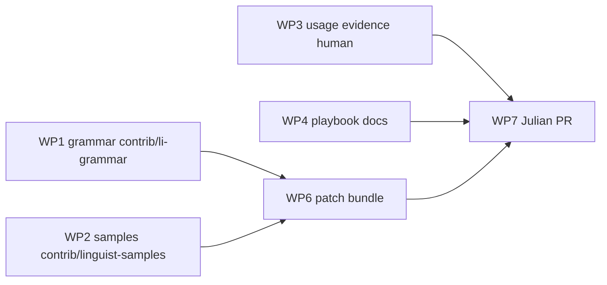

# GitHub Linguist — Li language playbook

End-to-end guide for adding **Li** (`.li`) to [github-linguist/linguist](https://github.com/github-linguist/linguist). Agents prepare artifacts in **lic**; **Julian** alone opens and commits the upstream PR (see [WP7 handoff](../../contrib/linguist-upstream/JULIAN_HANDOFF.md)).

**Status (2026-05-25):** Li is **not** on Linguist. Usage threshold for `.li` is **not met** for Li Langverse–identifiable code. Do not claim otherwise in PR text.

## Prerequisites

| Item | Owner | Detail |
|------|-------|--------|
| Ruby + Bundler + Docker | Julian (linguist fork) | [Linguist CONTRIBUTING](https://github.com/github-linguist/linguist/blob/main/CONTRIBUTING.md) — `script/bootstrap`, `bundle exec rake test` |
| GitHub fork of linguist | Julian | `https://github.com/<julian-user>/linguist` — **never** push from lic CI or agent automation |
| Grammar (redistributable license) | WP1 → human | [`contrib/li-grammar/`](../../contrib/li-grammar/) on branch `feat/linguist-wp1-grammar` ([tree](https://github.com/li-langverse/lic/tree/feat/linguist-wp1-grammar/contrib/li-grammar)); publish fork **TBD** → `https://github.com/li-langverse/li-grammar` for `script/add-grammar` |
| Samples (MIT, real code) | WP2 → human | [`contrib/linguist-samples/Li/`](../../contrib/linguist-samples/Li/) on branch `feat/linguist-wp2-samples` ([tree](https://github.com/li-langverse/lic/tree/feat/linguist-wp2-samples/contrib/linguist-samples)); manifest [`SAMPLES_LICENSES.md`](../../contrib/linguist-samples/SAMPLES_LICENSES.md) |
| Usage evidence | WP3 → **Julian only** | [github-linguist-usage-evidence.md](./github-linguist-usage-evidence.md) — ≥2000 indexed `.li` files with Li syntax, distributed across repos |
| Patch bundle | WP6 (lic) | [`contrib/linguist-upstream/`](../../contrib/linguist-upstream/) — `languages.yml` snippet, `PATCH_INSTRUCTIONS.md`, optional `heuristics.yml` fragment |

Merge order into **lic** `main`: WP1 grammar → WP2 samples → this playbook branch (`feat/linguist-wp346-handoff`). Upstream Linguist PR waits until WP1 grammar URL is real (no placeholder submodule).

## Parallel work packages

| WP | Repo | Branch (typical) | Agent may commit? |
|----|------|------------------|-------------------|
| WP1 | lic | `feat/linguist-wp1-grammar` | Yes (lic only) |
| WP2 | lic | `feat/linguist-wp2-samples` | Yes (lic only) |
| WP3 | org + lic | — | **No** — volume seeding is human |
| WP4 | lic | `feat/linguist-wp346-handoff` | Yes |
| WP6 | lic | `feat/linguist-wp346-handoff` | Yes (draft files only) |
| WP7 | github-linguist fork | `add-li-language` (example) | **No** — Julian only |

## Pre-submit checklist (G0–G8)

Complete on Julian's **linguist fork** before `gh pr create` against `github-linguist/linguist`.

| Gate | Check |
|------|--------|
| **G0** | WP1 merged to lic `main`; grammar repo published at `https://github.com/li-langverse/li-grammar` (replace TBD placeholder in WP6) |
| **G1** | WP2 merged; `contrib/linguist-samples/Li/` has ≥2 files per conflicting extension rules; `SAMPLES_LICENSES.md` commit pinned in PR body |
| **G2** | Usage bar met **or** maintainer exception documented — see [usage evidence](./github-linguist-usage-evidence.md). Saved weekly `gh search code` URLs in PR description |
| **G3** | Fork updated from `github-linguist/linguist` `main`; feature branch created |
| **G4** | `languages.yml` entry + `script/add-grammar` (real grammar URL, not placeholder) |
| **G5** | `samples/Li/` copied from lic; `bundle exec rake samples` green |
| **G6** | If `.li` collision remains: `heuristics.yml` fragment applied and classifier spot-check (`bundle exec script/cross-validation --test` if touched) |
| **G7** | `script/update-ids` run; `bundle exec rake test` green locally or on PR CI |
| **G8** | PR template filled: search links, per-sample licenses, grammar license, **no** inflated usage claims |

## Agent stop line

Agents **must stop** after lic-side deliverables are merged:

1. Do **not** `git push` to any `github-linguist/*` remote.
2. Do **not** commit as Julian or use Julian's credentials on the linguist fork.
3. Do **not** open the upstream Linguist PR — hand off [JULIAN_HANDOFF.md](../../contrib/linguist-upstream/JULIAN_HANDOFF.md).
4. Do **not** submodule `https://github.com/li-langverse/li-grammar` until WP1 publish branch is merged and URL is final.

## Julian execution (summary)

Detailed commands: [`contrib/linguist-upstream/PATCH_INSTRUCTIONS.md`](../../contrib/linguist-upstream/PATCH_INSTRUCTIONS.md) and [JULIAN_HANDOFF.md](../../contrib/linguist-upstream/JULIAN_HANDOFF.md).

1. Satisfy G0–G2 (grammar repo, samples, usage).
2. Apply WP6 patch on linguist fork (`script/add-grammar`, rsync samples, `heuristics` if needed).
3. `script/update-ids` → `bundle exec rake test`.
4. Push fork; `gh pr create` with search URLs and license table.

## Related docs

- [Usage evidence & search cadence](./github-linguist-usage-evidence.md)
- [WP1 grammar README](../../contrib/li-grammar/README.md) (after WP1 merge)
- [WP2 samples README](../../contrib/linguist-samples/README.md) (after WP2 merge)
- Linguist policy: [Language extension usage requirements](https://github.com/github-linguist/linguist/blob/main/CONTRIBUTING.md#language-extension-and-filename-usage-requirements)
