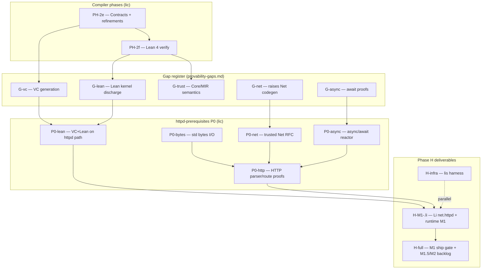

# Phase H — li-httpd M1 `.li` exit graph (blocked-by plan)

**Issue:** [lic#30](https://github.com/li-langverse/lic/issues/30) · **north_star_fit:** ecosystem · **PH-H**, **PH-2e**, **PH-2f**  
**Purpose:** Single dependency graph and exit checklist so agents stop re-deriving “when can H close?” from the master-plan tracker, v2 backlog, [httpd-prerequisites.md](httpd-prerequisites.md), and [provability-gaps.md](../verification/provability-gaps.md).

**Related:** [2026-05-16-li-httpd-plan.md](../superpowers/plans/2026-05-16-li-httpd-plan.md) · [2026-05-14-li-master-plan.md](../superpowers/plans/2026-05-14-li-master-plan.md) § Phase completion tracker · [proof-corpus-roadmap.md](../verification/proof-corpus-roadmap.md)

---

## Closure levels (do not conflate)

| Level | Master-plan row | Meaning | Status (2026-06-08) |
|-------|-----------------|---------|---------------------|
| **H-infra** | Phase H — li-httpd **infra** | `lis` harness, mitigations, CI, workspace stubs | **Closed** — tracker `[x]` |
| **H-M1-.li** | Phase H — li-httpd M1 **`.li`** | Li routing/config surface + runtime M1 on `lic`/`main` | **Partial** — tracker `[x]` with honest “partial” note; **not** full master-plan H close |
| **H-full** | v2 backlog **H** row | M1 ship gate Lean + remaining M1.5/M2 product scope | **Open** — see [exit checklist](#exit-checklist-h-m1-li-row) below |

The tracker marks **H-infra** and **H-M1-.li** both `[x]` because substantial M1 work landed (#153–#158, plan todos `m0-ship-gate-full`, `h-lean-server-modules`, …). The **v2 backlog** row stays open until **proof + ship gates** below are green without `--allow-open-vc` shortcuts on server modules.

---

## Dependency graph

**Read order for agents:** master-plan tracker row → this graph → [httpd-prerequisites.md](httpd-prerequisites.md) P0 table → [provability-gaps.md](../verification/provability-gaps.md) **G-vc** / **G-lean** rows.

---

## Blocked-by map (PH-2e / PH-2f → P0 → H)

| Blocker | Gap ID | Phase | httpd P0 row | What must be true for H-M1-.li |
|---------|--------|-------|--------------|----------------------------------|
| **PH-2e** | **G-vc** | 2e | **P0-lean** (VC emit) | `lic verify packages/li-http/src/lib.li` emits real Props; httpd smokes within open-VC budget (`check-httpd-lean-gate.sh`) |
| **PH-2f** | **G-lean**, **G-trust** | 2f | **P0-lean** (Lean gate) | `lic build` on server modules runs `lake build AutoVC` without `--allow-open-vc` / `--no-lean-verify` for ship path |
| — | **G-net** | H, 2f | **P0-net** | `raises Net` + `trusted.lean` v1 axioms; `li-tests/net_trusted/` green |
| — | **G-async** | 2+, 7d | **P0-async** | `async`/`await` + epoll/kqueue reactor; `check-w1-async-reactor.sh` |
| — | — | — | **P0-bytes** | `std/bytes`, Reader/Writer; `check-w0-bytes-io.sh` |
| — | **P-http** (backlog) | H | **P0-http** | Header FSM + Li reactor proofs; routing/TOML oracles already green |

**Already unblocked (P0 shipped):** P0-bytes, P0-net, P0-async — see [httpd-prerequisites.md](httpd-prerequisites.md).

**Still gating H-M1-.li close:** P0-lean composite (PH-2e/2f partial) and P0-http (parser FSM + Li reactor).

---

## G-vc / G-lean closure criteria (httpd-relevant slice)

From [provability-gaps.md](../verification/provability-gaps.md) — full register has more rows; **httpd M1** cares about these slices:

| Gap | Closure criterion (Done) | Today (Partial) | httpd gate script |
|-----|--------------------------|-----------------|-------------------|
| **G-vc** | VCs emitted per `requires`/`ensures`/loop clauses; no `True` stubs on ship paths | Call-site `requires`, refinements closed; float `abs`, opaque returns open | `lic verify packages/li-http/src/lib.li`; `check-autovc-open-goals.sh` |
| **G-lean** | `lic build` fails if any VC open; Lean kernel is certificate | Tier B `lake build AutoVC`; `--allow-open-vc` CLI escape; intentional open: `sqrt_open_bound` | `check-httpd-lean-gate.sh` (budget `HTTPD_LEAN_GATE_MAX_OPEN=8` on `parse_request_smoke.li`) |
| **G-trust** | `Core.lean` / `MIR.lean` semantics, not stub | File exists; semantics planned | Indirect — blocks full **2f** before universal ship gate |

**Honest httpd interim policy (w0-lean-gate):** composite httpd smokes may use `--allow-open-vc` with ≤8 documented open goals. **H-M1-.li row closes** when server packages build under **default strict** `lic build` (no lean skip) — plan todos `h-lean-server-modules` + `m0-ship-gate-full` document the target; tracker stays **partial** until **G-lean** httpd slice is **Done**, not budgeted Partial.

---

## Exit checklist: H-M1 `.li` row

Mark master-plan **Phase H — li-httpd M1 `.li`** fully closed (upgrade from “partial”) when **all** rows pass:

| # | Exit criterion | Evidence command / artifact |
|---|----------------|----------------------------|
| 1 | Li `packages/li-http` + `packages/li-net-httpd` workspace build | `./scripts/build-li-httpd.sh` or `httpd-plan-gates.sh` (no `HTTPD_GATES_SKIP_*`) |
| 2 | Routing / config oracles | `./li-tests/run_httpd_config.sh`; `lic validate-httpd-config` on shipped examples |
| 3 | P0-bytes / P0-net / P0-async | `./scripts/check-w0-bytes-io.sh`; `./scripts/check-w1-async-reactor.sh`; `li-tests/net_trusted/` |
| 4 | P0-lean strict (PH-2f) | `./scripts/check-httpd-lean-gate.sh` with **zero** open VCs on ship modules **or** documented closure of **G-lean** httpd slice in provability-gaps |
| 5 | M1 ship gate (runtime) | `./scripts/httpd-plan-gates.sh`; `./scripts/test-auth-bearer.sh` on live `build/li-httpd` |
| 6 | Exploit tiers A+B | tier5 exploit harness vs nginx — plan todo `m1-exploit-runtime` |
| 7 | `li-log` sinks | `packages/li-log` rotation + redact smoke (plan todo `li-log-package`) |
| 8 | Doc sync | Update this file + [httpd-prerequisites.md](httpd-prerequisites.md) P0 status + [provability-gaps.md](../verification/provability-gaps.md) if **G-vc**/**G-lean** move |

**H-full (v2 backlog) adds:** M1.5 SSE/TLS live gates, M2 TLS/H2/WS runtime parity — see [httpd plan § Parity milestones](../superpowers/plans/2026-05-16-li-httpd-plan.md#parity-milestones-agent-gateway-vs-nginx-oracle). Do **not** mark v2 **H** closed on M1 alone.

---

## Tracker ↔ backlog alignment (single sentence)

| Source | Says | Resolved reading |
|--------|------|------------------|
| Tracker **H-infra** `[x]` | `lis` done | Correct — independent of `lic` compiler gates |
| Tracker **H-M1-.li** `[x]` partial | M1 surface landed | **Partial ≠ closed** — blocked on **PH-2e/2f** via **P0-lean** + **P0-http** |
| v2 backlog **H** | M1 ship gate + M1.5 | Same as **H-full** above; stays open until exit checklist § strict Lean |

---

## Maintenance

When any P0 row, **G-vc**, **G-lean**, or httpd plan ship todo changes status, update in the **same PR**:

1. [httpd-prerequisites.md](httpd-prerequisites.md) — P0 table  
2. This file — exit checklist + graph footnotes  
3. [provability-gaps.md](../verification/provability-gaps.md) — gap row status  
4. [2026-05-14-li-master-plan.md](../superpowers/plans/2026-05-14-li-master-plan.md) — Phase H tracker + v2 backlog **H** row  

Agents: cite this file in handoffs instead of re-summarizing tracker + backlog + prerequisites separately.
