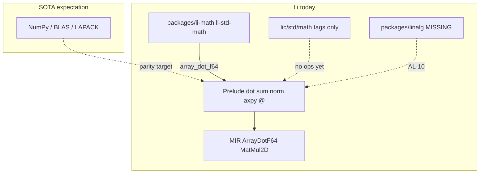

# Stdlib ecosystem — cycle 1 · `gap_vs_sota` (linear algebra)

**Session:** `cee09172-b61f-4f7b-84de-aae2d0e5972f` · **Goal:** `stdlib_ecosystem` · **Step:** `gap_vs_sota`  
**Agent:** `stdlib_researcher` · **north_star_fit:** ecosystem, scientific_computing, hpc · **PH:** 2i (partial), 7e (partial), AL-10/11  
**Audited:** `lic/std/**`, `lic/packages/li-math*`, `li-std-*`, prelude/MIR, tier-1 benches · **Repo:** `lic` (workflow)

---

## Executive summary

- **Li dense linalg lives in the compiler prelude**, not `lic/std/math` — `std/math/*.li` are policy/tag facades only (`math_std_tag` at `math.li:1-6`; no `dot`/`@`).
- **Shipped surface (2i/7e partial):** 1d/2d `@`, `dot`, `sum`, `norm`, `axpy`, element-wise ops + length-1 broadcast; **26** `li-tests/math_linalg/` cases (e.g. `dot_float_arrays.li:13-14`, `matmul_2x3_ok.li:21`).
- **SOTA gap (function):** no `packages/linalg`, no LAPACK-class solve/QR/eigen, no `std.tensor` / sparse, no full NumPy broadcast — planned AL-10 / Phase 3 ([algorithms-and-libraries-plan.md](../algorithms-and-libraries-plan.md) L213, L302).
- **SOTA gap (perf):** tier-1 `matmul_naive` ~0.90× C++ (green); **`matmul_blocked` / `horner_pure_li` fail strict ≤1.2×** per [wave-a-stdlib-unblock-checklist.md](../wave-a-stdlib-unblock-checklist.md) L30-31; briefing red rows `horner_pure_li`, `reduce_sum`.
- **`simd_dot` tier-1 Li driver is not math-first:** calls `extern proc li_simd_dot_kernel()` (`benchmarks/tier1_micro/simd_dot/li/main.li:4-22`) — contradicts [math-linalg-surface spec](../superpowers/specs/2026-05-16-li-math-linalg-surface.md) “zero `__li_simd_*` in user file”.
- **`li-std-math` / `packages/li-math`:** small **structural** LA (Vec3/4, Quat, Mat4, `vec3_dot`); bridge `array_dot_f64` → prelude `@` (`li-math/src/lib.li:246-251`). Weaker contracts in mirror (`li-std-math/src/lib.li:142-145` `ensures true` on `vec3_dot`).
- **`li-std-core`:** version stub only (`li-std-core/src/lib.li:2-8`) — no linalg.
- **Proof-before-perf:** closed int P-linalg + partial float slices (**G-math** Partial); float `vec3_dot` Props and general `@` Lean backlog open ([provability-gaps.md](../verification/provability-gaps.md) L40, L60).

---

## Deliverable / findings — gap vs linear-algebra SOTA

### Reference stack (incumbents)

| Layer | Representative | What “done” looks like |
|-------|----------------|------------------------|
| BLAS L1–3 | OpenBLAS, MKL | `ddot`, `dgemv`, `dgemm`, tuned tiles |
| LAPACK | Reference + vendor | LU/QR/Cholesky, eigen, SVD |
| Language std | NumPy, Julia `LinearAlgebra`, Eigen | N-d arrays, broadcast, decompositions, optional GPU |
| Li policy | [vision](https://github.com/li-langverse/roadmap/blob/main/docs/ecosystem/vision-and-roadmap.md) | **Prove first**, math syntax, ≤1.2× C++ tier-1 before claiming HPC parity |

### Where Li implements LA today (evidence)

| Locus | Role | Evidence |
|-------|------|----------|
| **Prelude + typechecker** | Primary user API | [linear-algebra.md](../../language/linear-algebra.md) L7-13: `ArrayDotF64`, `ArrayMatMul2DF64`, reductions |
| **Compiler MIR/codegen** | Lowering | `compiler/mir/lower.cpp` (`ArrayDotF64` L276, `ArrayMatMul2DF64` L1176); `compiler/codegen/emit.cpp` L1352-1387 |
| **`li-tests/math_linalg/`** | Contract/shape gates | `dot_len_mismatch.li` compile_fail L8 (`manifest.toml` L1066-1068); `axpy_float4.li` verify_ok L13 |
| **`packages/li-math`** | Composable 3D/4D graphics math | `vec3_dot` with explicit `ensures` L137-148; `array_dot_f64` → `@` L246-251 |
| **`li-std-math` mirror** | Published org package | Same shapes as `li-math`; `vec3_dot` `ensures true` L142-145 |
| **`lic/std/math`** | Std import facade | **No ops** — tags only (`numerics.li:5-10`, `math.li:1-6`) |
| **Tier-1 benches** | Perf honesty | `matmul_naive/li/main.li` — manual IKJ L98-108 (not surface `C=A@B`); `simd_dot` — extern kernel (see above) |
| **`packages/lig` / `li-ml`** | Optional FFI matmul | `lig_kernel_matmul_f32` — separate from prelude std path |

### Capability matrix (Li vs SOTA)

| Capability | NumPy / BLAS / LAPACK | Li today | Gap severity | Li path |
|------------|----------------------|----------|--------------|---------|
| 1d dot / sum | `np.dot`, `sum` | `dot`, `sum`, `a @ b` | **Low** (fixed `array[N,T]`) | Prelude + tests |
| 2d dense matmul | `np.matmul` / `gemm` | Nested `array[M, array[K,float]] @` | **Med** — no rank-N tensor | 2i-c done; general `tensor[(M,N)]` open |
| AXPY / scale | BLAS `daxpby` | `axpy(α,x,y)` prelude | **Low** | `axpy_float4.li` |
| Vector norm | `np.linalg.norm` | `norm(array)` | **Low** (array only; scalar rejected at compile) | reductions suite |
| Broadcast | Full rank rules | Length-1 → longer 1d only | **High** | `broadcast_invalid_len2_vs_len4.li` |
| LU/QR/Cholesky | LAPACK | — | **High** | **packages/linalg** (missing, AL-10) |
| Sparse | `scipy.sparse` | — | **High** | `std.sparse` planned, not on disk |
| Quat slerp / mat4×mat4 | Graphics libs | `quat_mul`, `mat4_mul_point`; no slerp | **Med** | AL-11; `li-math` only |
| GPU GEMM | cuBLAS | `lig` pilot | **High** (research) | Out of std scope |
| Proof on kernels | — | P-linalg partial, tier-1 checksum | **Differentiator** | G-math / G-lean Partial |
| Tier-1 perf vs C++ | Vendor BLAS | 2/4 strict failures | **High** (7e) | WA-4 pending |

### Architectural split (stdlib vs packages vs compiler)



**Placement decision (handoff):** Keep **language surface** in compiler/prelude; add **`packages/linalg`** for decompositions/solvers; add **`std.tensor`** when Phase 3 tensor types land — do not duplicate GEMM in `std/math` stubs.

### Benchmark / ingest signals

| Bench | Briefing (2026-05-28) | Notes |
|-------|----------------------|-------|
| `simd_dot` | near_threshold 1.08× | Driver uses C kernel, not pure-Li `dot` |
| `matmul_naive` | near_threshold 1.06× | Manual loop; advisory OK per WA-3 |
| `matmul_blocked` | strict fail ~1.76× | Blocks G-math Done |
| `horner_pure_li` | red 0.67× | Separate from LA but shares 7e codegen |

---

## Incremental outputs (cycle 1, step 2)

```yaml
packages_to_build:
  - packages/linalg          # AL-10: solve, decompositions, re-export prelude GEMM
  - std.tensor               # Phase 3 / AL-17; rank-N math surface
  - std.sparse               # Phase 3 sparse LA
packages_to_improve:
  - li-std-math              # sync contracts with packages/li-math (vec3_dot ensures)
  - packages/li-math         # AL-11: quat_dot/slerp, mat4_mul, scene wire-up
  - packages/li-math-numerics  # algo_id=1 num_dot_axpy (sim backlog); today integrators only
  - benchmarks/tier1_micro/simd_dot/li  # pure-Li dot per 7e-a exit gate
std_modules_to_add:
  - std.tensor
  - std.linalg               # optional facade importing packages/linalg — package_architect
connections:
  - prelude @ / dot → compiler/mir → codegen (ArrayDotF64, ArrayMatMul2DF64)
  - packages/li-math.array_dot_f64 → prelude @
  - li-std-math → mirror of lic/packages/li-math (org publish)
  - li-tests/math_linalg → compiler gates (not std/math)
  - packages/lig → FFI matmul_f32 (parallel track to pure-Li tier-1)
  - sim algo_registry num_dot_axpy → blocked on li-math-numerics implementation
```

---

## Recommended issues/PRs

| Repo | Title | Labels |
|------|-------|--------|
| **lic** | feat(AL-10): scaffold `packages/linalg` + composable `import` smoke | `PH-2i`, `stdlib`, `ecosystem` |
| **lic** | bench(7e-a): rewrite `simd_dot` Li driver to pure `dot`/`a @ b` (no extern kernel) | `PH-7e`, `benchmarks` |
| **lic** | perf(7e): close `matmul_blocked` + `horner_pure_li` for `LI_TIER1_PERF_STRICT=1` | `PH-7e`, `G-math` |
| **lic** | proof(2f): float `vec3_dot` / 2D `@` Lean Props (P-linalg backlog) | `PH-2f`, `provability` |
| **li-std-math** | chore: align `vec3_dot` contracts with `lic/packages/li-math` | `ecosystem`, `mirror` |
| **lic** | docs: `std/math` README — prelude vs std vs `li-math` placement | `documentation`, `stdlib` |
| **benchmarks** | tier-1: label NumPy/BLAS column explicitly in matmul reports (AL plan L79) | `ecosystem`, `benchmarks` |

---

## Deferred

- `audit_package: li-std-core` — session queue item; superseded for this cycle by cross-read above (stub only).
- `synthesize_step` — aggregate YAML after cycle summary step.
- Product implementation — `package_architect` → `code_implementer`.
- `trusted.lean` / MIR semantic proofs — human-gated.

---

## Handoff

**north_star_fit:** ecosystem, scientific_computing, hpc · **PH-2i**, **PH-7e**, **AL-10**, **AL-11**  
**Next focus:** `synthesize_step` — cycle summary  
**Whitepaper:** `research-findings/whitepapers/2026-05/stdlib_ecosystem/std-r0-cycle1-linalg-gap/`
