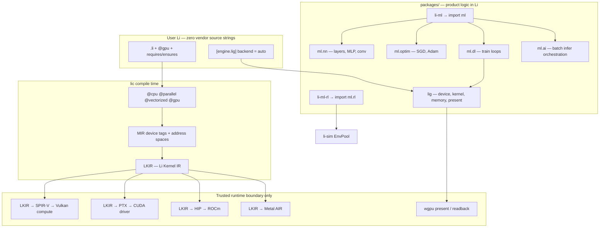
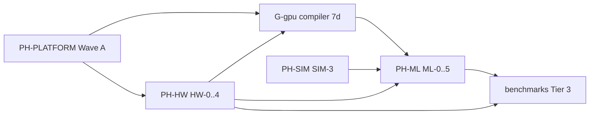

# PH-ML + PH-HW + `@gpu` Battle Plan

**Status:** Active battle plan  
**Date:** 2026-05-29  
**Audience:** Architects, parallel agents, package owners  
**Canonical refs:** [lig-rfc.md](specs/lig-rfc.md) · [PH-world-studio-program.md](PH-world-studio-program.md) · [studio-full-implementation-plan.md](studio-full-implementation-plan.md) · [provability-gaps.md](../verification/provability-gaps.md) (G-gpu) · [benchmarks Tier 3](../superpowers/plans/2026-05-14-benchmarks-and-simulations.md)

**Honesty rule:** No PyTorch/JAX parity claims until Tier 3 CSV rows exist with oracle correctness and timed columns. `lic check` green = interface landed, not SOTA performance.

---

## 1. Executive summary

### 1.1 North star (18-month)

User writes **pure Li** with contracts:

```li
@gpu
def train_step(batch: Batch784) -> float
  requires ml.nn.valid(batch)
  ensures result >= 0.0
=
  ml.dl.forward_backward_sgd(batch, lr = 0.01)
```

Compiler elaborates `@gpu` → LKIR → SPIR-V (default) / CUDA / HIP / Metal. RL runs async env pools via `ml.rl`. Studio `sim_rl` profile drives live training. Benchmarks show Li within policy vs NumPy/PyTorch on the same machine.

### 1.2 What “on par with big shots” means (tiered)

| Tier | Target | Comparable to | Gate |
|------|--------|---------------|------|
| **T0** | Packages compile, contracts hold | — | `lic check` smokes |
| **T1** | Forward MLP/conv correct vs oracle | NumPy reference | tier-3 correctness |
| **T2** | Train step (manual AD) + SGD/Adam | Hand-rolled PyTorch script | tier-3 `mlp_train_step` |
| **T3** | GPU matmul/MLP via LKIR | PyTorch CPU/GPU columns | `lig-kernels.toml` timed |
| **T4** | RL vectorized envs + policy stub | Gymnasium vector env | WP-RL-04 bench |
| **T5** | ResNet18 infer, LSTM forward | ONNX / PyTorch | Tier 4 benches |
| **T6** | Distributed JobGraph | Ray / Triton-distributed | PH-ML ML-5 |

**Today:** ~T0 partial (stubs). **Next 90 days:** solid T1–T2 CPU, T3 pilot (one kernel). **Not in 90 days:** full autograd, dynamic `tensor`, T6.

### 1.3 Current baseline (honest)

| Area | Status | Evidence |
|------|--------|----------|
| `@gpu` decorator | Parse only; **G-gpu Missing** | `prelude.cpp` reserved name; no MIR lowering |
| `device[T]` / `host[T]` | Spec only | language design Phase 3 |
| `lig` backends | Probe stubs (4–5 ids) | `runtime/li_rt.c` env probes |
| LKIR emit | **None** | All vendor columns `N/A` in `lig-kernels.toml` |
| `li-ml` | WIP scaffold | `ml`, `ml.nn`, `ml.optim`, `ml.dl`, `ml.ai` started |
| `li-ml-rl` | Contract stub | `EnvPoolStub`, serial pool |
| Tier-1 `ml_*` benches | Fake loops | Not real MLP |
| Autograd | **Zero** | No AD design |
| PyTorch parity | Docs only | `pytorch_cpu` column planned |

---

## 2. Architecture (Li-only stack)



**Li-only policy** (`.cursor/rules/li-native-li-only.mdc`): CUDA/HIP/Metal/Vulkan exist only at `runtime/**` plus PH-HW-gated `extern proc`. User never authors `.cu`, `.hip`, GLSL, or HLSL.

---

## 3. Program tracks and dependency graph

Four coupled programs — not one linear sprint:



| Program | Phases | Blocks ML until… |
|---------|--------|------------------|
| **PH-PLATFORM** | Wave A (2e/2f Lean) | Optional for T1; required for proof certificate |
| **PH-HW** | HW-0…4 | HW-2 for GPU kernels; HW-1 for device selection |
| **G-gpu** | 7d-gpu-a…e | 7d-gpu-c for `@gpu` on `def` |
| **PH-ML** | ML-0…5 | — |
| **PH-SIM** | SIM-3 | RL env pool persistence |

---

## 4. Phase definitions

### 4.1 PH-HW phases (GPU / LKIR / drivers)

| Phase | Name | Exit criterion | Owner |
|-------|------|----------------|-------|
| **HW-0** | Governance | `lig-rfc.md`, catalog, `lig-kernels.toml` | Docs ✅ |
| **HW-1** | Device layer | `lig_device_probe`, TOML backend, auto-select, capability JSON | `packages/lig` ✅ partial |
| **HW-2** | LKIR + SPIR-V | LKIR parser; first SPIR-V module; Vulkan shader validation smoke | Compiler + lig |
| **HW-3** | Present / viewport | wgpu swapchain, readback, Studio native pixels | lig + render + studio |
| **HW-4** | Vendor emit parity | CUDA + HIP + Metal emit; multi-GPU queue overlap; ROCm CI | HW + ML |

**Backend priority (RFC rule):** Li-owned kernels target **Vulkan/SPIR-V first**, then CUDA, HIP peer, Metal on Apple. `wgpu` = viewport adapter, not primary compute IR.

**Driver stack map:**

| Backend | User sees | Runtime loads | Probe today |
|---------|-----------|---------------|-------------|
| `vulkan_spirv` | `lig.kernel.launch` | Vulkan loader + ICD + SPIR-V module | id 5 (vulkan branch) |
| `cuda` | same | `libcuda` + driver | `CUDA_HOME` env |
| `hip` / `rocm` | same | ROCm + `hipcc` | `ROCM_PATH` env |
| `metal` | same | Metal.framework | `__APPLE__` |
| `webgpu` | `lig.present` | wgpu → native API | always 1 |

---

### 4.2 G-gpu phases (`@gpu` decorator — compiler track)

| Phase | ID | Deliverable | Gap closed | Evidence |
|-------|-----|-------------|------------|----------|
| **a** | 7d-gpu-a | `@gpu` reserved; parse on `def`/`for` | partial G-dec | policy + parse ✅ |
| **b** | 7d-gpu-b | `device[T]`, `host[T]` types; copy semantics | G-gpu types | typechecker + `li-tests/gpu/` |
| **c** | 7d-gpu-c | MIR `DeviceFn` tag; `@gpu` + `@cpu` mutual exclusion | G-gpu MIR | `mir/lower.cpp` |
| **d** | 7d-gpu-d | Lean address-space laws; no host alias of device | G-gpu proofs | `Discharge.lean` + corpus |
| **e** | 7d-gpu-e | Codegen: `@gpu def` → LKIR module + host launch glue | G-gpu codegen | `lig.kernel.launch` emit |

**Decorator stacking rules (normative):**

| Stack | Legal? | Meaning |
|-------|--------|---------|
| `@gpu` alone | ✅ | Whole function on device |
| `@gpu` + `@parallel` | ⚠️ Phase 2 | Device grid + host team — needs proof |
| `@cpu` + `@gpu` | ❌ | Compile error |
| `@vectorized` inside `@gpu` | ✅ | SIMD lanes within wave/warp (LKIR) |
| `@gpu` on `parallel for` | Phase 2 | Grid-stride kernel |

---

### 4.3 PH-ML phases

| Phase | Name | Scope | Depends | Exit |
|-------|------|-------|---------|------|
| **ML-0** | Scaffold + contracts | `li-ml`, `li-ml-rl` in workspace; activations, loss scalars; RL env contract | — | 6+ smokes green |
| **ML-1** | CPU forward | MLP 784→256→10, conv3×3 naive, softmax+CE; tier-3 correctness | ML-0, prelude `@` | Oracle ≤1e-4 vs NumPy |
| **ML-2** | CPU train | Manual backward 2-layer MLP; SGD, Adam; `mlp_train_step` bench | ML-1 | Train step smoke + loss decreases |
| **ML-3** | GPU integration | `@gpu` + `lig.kernel.matmul_f32` + `mlp_forward_f32` LKIR; device buffers | ML-2, HW-2, 7d-gpu-c | 1 timed GPU row honest |
| **ML-4** | RL production | Persistent `EnvPool`; async workers; policy net stub; Studio `sim_rl` | ML-2, SIM-3, WP-RL-04 | ≥4 envs/step bench |
| **ML-5** | Scale-out | JobGraph, stream prefetch, Triton interop optional, multi-GPU | ML-3, HW-4, ml-async RFC | Cluster smoke doc only |

---

## 5. Work packages — master register

**Fields:** ID · Title · Track · State · Target · Proof gate · Size · Depends · Parallel?

### 5.1 Section A — Compiler and `@gpu` (G-gpu)

| ID | Title | State | Target | Proof gate | Size | Depends | Par? |
|----|-------|-------|--------|------------|------|---------|------|
| **WP-GPU-01** | `@gpu` policy + illegal stacks | partial | Reject `@cpu`+`@gpu`, typosquat | `decorator_exploits/gpu_*` | S | 7d-a | Y |
| **WP-GPU-02** | `device[T]` / `host[T]` AST + types | stub | Phase 3 types in typechecker | `li-tests/gpu/device_host_types.li` | L | Wave A 2e | N |
| **WP-GPU-03** | `copy_to_device` / `copy_to_host` MIR | stub | Explicit copy ops, no implicit | memory contracts | M | WP-GPU-02 | N |
| **WP-GPU-04** | MIR `@gpu` elaboration | stub | `MirFn.device = true` | MIR dump test | M | WP-GPU-02 | N |
| **WP-GPU-05** | Lean device address space | stub | `DeviceArray` disjoint laws | `P-gpu-*` corpus | L | WP-GPU-04, 2f | N |
| **WP-GPU-06** | `@gpu` → LKIR codegen hook | stub | Host stub calls `lig.kernel.launch` | build smoke | L | WP-GPU-04, WP-HW-08 | N |
| **WP-GPU-07** | `@gpu` + `@vectorized` inner | stub | LKIR tile lanes | lkir smoke | M | WP-GPU-06 | Y |
| **WP-GPU-08** | Handbook + provability update | stub | `decorators.md`, G-gpu → Partial | doc CI | S | WP-GPU-04 | Y |

---

### 5.2 Section B — PH-HW / LKIR / backends (`lig`)

| ID | Title | State | Target | Proof gate | Size | Depends | Par? |
|----|-------|-------|--------|------------|------|---------|------|
| **WP-HW-01** | Backend identity + probe | **partial** | ids 1–5, TOML parse, auto-select | `lig_device_probe.li` | S | HW-0 | Y |
| **WP-HW-02** | `lig.memory` budget + alloc contracts | partial | VRAM ledger, OOB reject | `memory_budget.li` | S | HW-1 | Y |
| **WP-HW-03** | LKIR textual syntax RFC | stub | `.lkir` grammar EBNF | RFC PR | M | HW-0 | Y |
| **WP-HW-04** | LKIR parser in `lic` | stub | Parse `matmul_f32.lkir` | parser tests | L | WP-HW-03 | N |
| **WP-HW-05** | LKIR validity checker | stub | Well-formed tiles, barriers | catalog validity col | M | WP-HW-04 | N |
| **WP-HW-06** | **SPIR-V emitter** (priority) | stub | `matmul_f32` → SPIR-V binary | Vulkan shader module smoke | L | WP-HW-05 | N |
| **WP-HW-07** | Vulkan headless dispatch | stub | Compute pipeline, no swapchain | CI linux + lavapipe | L | WP-HW-06 | N |
| **WP-HW-08** | Host launch path | stub | `lig_kernel_run` executes module | `kernel_matmul_parity.li` | M | WP-HW-07 | N |
| **WP-HW-09** | CUDA PTX emit pilot | stub | `LIG_EMIT_CUDA=1` matmul only | RTX bench row | L | WP-HW-08 | N |
| **WP-HW-10** | HIP/ROCm emit pilot | stub | `LIG_EMIT_HIP=1` peer parity | AMD CI label | L | WP-HW-09 | N |
| **WP-HW-11** | Metal AIR emit | stub | macOS runner | M1 smoke | M | WP-HW-08 | Y |
| **WP-HW-12** | `mlp_forward_f32` LKIR tile | stub | Catalog kernel id 2 | `lig-kernels.toml` row | M | WP-HW-08 | Y |
| **WP-HW-13** | wgpu present readback B | partial | Studio viewport pixels | readback smokes | L | HW-3 | N |
| **WP-HW-14** | Multi-GPU queue scheduler | stub | Device 0/1 overlap | bench note | L | HW-4, ML-5 | N |
| **WP-HW-15** | GPU suite harness | **partial** | `bench-lig-gpu-suite.sh` | JSON snapshot | S | HW-1 | Y |

---

### 5.3 Section C — `li-ml` packages (AI / ML / DL)

| ID | Title | Module | State | Target | Proof gate | Size | Depends | Par? |
|----|-------|--------|-------|--------|------------|------|---------|------|
| **WP-ML-01** | Workspace membership | `ml` | WIP | Add to `packages/li.toml` | workspace script | S | — | Y |
| **WP-ML-02** | Core activations + loss | `ml` | WIP | relu, sigmoid, softmax, mse, CE | `activations.li` | S | WP-ML-01 | Y |
| **WP-ML-03** | Linear + MLP forward tiny | `ml.nn` | WIP | 4×4×2 + acc helpers | `mlp_forward.li` | M | WP-ML-02 | Y |
| **WP-ML-04** | MLP forward MNIST shape | `ml.nn` | stub | 784→256→10 loops | tier-3 oracle | L | WP-ML-03 | N |
| **WP-ML-05** | Conv2d naive 3×3 | `ml.nn` | stub | im2col or direct conv | `conv2d_forward` bench | M | WP-ML-03 | Y |
| **WP-ML-06** | SGD + Adam | `ml.optim` | WIP | scalar + vec4 | optim smokes | S | WP-ML-02 | Y |
| **WP-ML-07** | Manual backward 2-layer | `ml.dl` | WIP | `dl_train_step4` | `train_step.li` | L | WP-ML-03,06 | N |
| **WP-ML-08** | Full MNIST train step | `ml.dl` | stub | forward+backward+SGD | `mlp_train_step` bench | L | WP-ML-04,07 | N |
| **WP-ML-09** | Batch inference API | `ml.ai` | WIP | `ai_batch_predict4` | `ai_batch.li` | S | WP-ML-03 | Y |
| **WP-ML-10** | GPU matmul bridge | `ml` | WIP | `ml_lig_matmul_run_auto` | `gpu_bridge.li` | S | WP-HW-08 | Y |
| **WP-ML-11** | `@gpu` train hook | `ml.dl` | stub | `@gpu def forward_gpu` | WP-GPU-06 | M | WP-ML-08, WP-GPU-06 | N |
| **WP-ML-12** | `packages/linalg` or prelude BLAS | — | stub | Blocked matmul for perf | tier-1 ≤1.2× C++ | L | Wave A | N |
| **WP-ML-13** | Autograd design RFC | — | stub | Reverse-mode AD spec | RFC only | M | `tensor` Phase 3 | N |
| **WP-ML-14** | Dynamic `tensor[(M,N), f32]` | compiler | stub | Rank-N types | language Phase 3 | XL | WP-ML-13 | N |

---

### 5.4 Section D — RL (`li-ml-rl` + sim)

| ID | Title | State | Target | Proof gate | Size | Depends | Par? |
|----|-------|-------|--------|------------|------|---------|------|
| **WP-RL-01** | `env_obs_from_session` | **done** (worktree) | Merge to main | 3 smokes | S | SIM-3 | Y |
| **WP-RL-02** | Merge `li-ml-rl` package | WIP | workspace + studio dep | manifest | S | WP-RL-01 | Y |
| **WP-RL-03** | Persistent `EnvPool` | stub | Pool survives frames | composable | M | WP-RL-02 | N |
| **WP-RL-04** | Async worker processes | stub | ≥4 envs parallel sample | bench row | L | ML-4, WP-RL-03 | N |
| **WP-RL-05** | Policy net stub (MLP) | stub | `ml.rl.policy_forward` | smoke | M | WP-ML-04, WP-RL-03 | N |
| **WP-RL-06** | Studio `sim_rl` live loop | partial | train tick in viewport | demo script | M | WP-RL-03, WP-HW-13 | N |
| **WP-RL-07** | PPO/A2C RFC only | stub | Algorithm spec | doc | S | ML-4 | Y |

---

### 5.5 Section E — Benchmarks and parity

| ID | Title | State | Target | Proof gate | Size | Depends | Par? |
|----|-------|-------|--------|------------|------|---------|------|
| **WP-BENCH-ML-01** | Replace fake tier-1 `ml_*` | stub | Real Li kernels | compile + run | M | WP-ML-04 | N |
| **WP-BENCH-ML-02** | Tier-3 `mlp_forward` row | stub | batch=64, 784-256-10 | NumPy oracle | L | WP-BENCH-ML-01 | N |
| **WP-BENCH-ML-03** | Tier-3 `mlp_train_step` | stub | backward+SGD timed | PyTorch CPU col | L | WP-ML-08 | N |
| **WP-BENCH-ML-04** | `pytorch_cpu` baseline harness | stub | `torch.set_num_threads` | CSV column | M | WP-BENCH-ML-02 | Y |
| **WP-BENCH-ML-05** | `lig-kernels` CUDA timing | stub | matmul GPU ns | honesty JSON | M | WP-HW-09 | N |
| **WP-BENCH-ML-06** | Dashboard ingest ML family | stub | benchmarks repo row | green nightly | S | WP-BENCH-ML-02 | Y |
| **WP-BENCH-ML-07** | Tier-4 `resnet18_infer` | stub | ONNX oracle | long-horizon | XL | ML-3 | N |

**Regression policy (unchanged):** Tier 1–2 Li ≤ **1.2×** C++ same machine, or investigate before release tag.

---

### 5.6 Section F — Docs, RFCs, compliance

| ID | Title | State | Target | Size | Par? |
|----|-------|-------|--------|------|------|
| **WP-DOC-ML-01** | Fill `ml-async-parallel-rfc.md` | stub | 4 parallelism axes | M | Y |
| **WP-DOC-ML-02** | PH-ML battle plan (this doc) | **active** | Land in `docs/game-dev/` | S | Y |
| **WP-DOC-ML-03** | `li-ml` README + traceability | stub | PKG-li-ml | S | Y |
| **WP-DOC-ML-04** | Autograd RFC | stub | WP-ML-13 input | M | Y |
| **WP-DOC-ML-05** | COMPLY tier IMPORTANT audit | stub | `li-ml`, `lig` SBOM | M | N |

**WP count:** 56 work packages across PH-HW, G-gpu, PH-ML, RL, benchmarks, and docs.

---

## 6. Competitor parity matrix

| Capability | PyTorch | JAX | Ray RLlib | **Li plan** |
|------------|---------|-----|-----------|-------------|
| Dynamic tensor | ✅ | ✅ | via torch | **Phase 3** `tensor[(M,N),T]` |
| Autograd | ✅ | ✅ | — | **ML-2 manual → ML-13 AD RFC** |
| `nn.Module` | ✅ | Flax | — | **`ml.nn` typed objects + contracts** |
| CUDA kernels | `.cu` / Triton | XLA | — | **LKIR only — no user `.cu`** |
| ROCm | ✅ | ✅ | — | **HIP peer via LKIR (WP-HW-10)** |
| Vulkan compute | via PyTorch2/Vulkan | — | — | **SPIR-V first (WP-HW-06)** |
| Vectorized envs | — | — | ✅ | **WP-RL-04 async pools** |
| Distributed | torchrun | pmap | Ray | **ML-5 JobGraph** |
| Proof contracts | ❌ | ❌ | ❌ | **Li differentiator** |
| Hassle-free deps | pip hell | pip hell | cluster | **Li-only source + `lip`** |

---

## 7. Sprint timeline (90-day battle rhythm)

### Wave 0 — Foundation (Week 1–2) · ML-0 complete

| Deliverable | WPs |
|-------------|-----|
| `li-ml` + `li-ml-rl` workspace green | WP-ML-01, WP-RL-02 |
| All package smokes pass | WP-ML-02…03, 06…09 |
| Merge RL contract from worktree | WP-RL-01 |
| Battle plan + ml-async RFC skeleton | WP-DOC-ML-01, 02 |

**Exit gate:** `./scripts/build.sh && lic check packages/li-ml/** && lic check packages/li-ml-rl/**`

---

### Wave 1 — CPU ML truth (Week 3–5) · ML-1 + ML-2

| Deliverable | WPs |
|-------------|-----|
| Real MLP 784-256-10 forward | WP-ML-04, WP-BENCH-ML-01, 02 |
| Manual backward + SGD train step | WP-ML-07, 08, WP-BENCH-ML-03 |
| NumPy + PyTorch CPU baselines | WP-BENCH-ML-04 |
| Conv3×3 + softmax CE benches | WP-ML-05 |

**Exit gate:** Tier-3 correctness CSV ingested; loss decreases on fixed seed in smoke.

---

### Wave 2 — GPU spine (Week 6–9) · HW-2 + ML-3 pilot

| Deliverable | WPs |
|-------------|-----|
| LKIR syntax + parser | WP-HW-03, 04, 05 |
| SPIR-V emit + Vulkan validation | WP-HW-06, 07 |
| Host launch + parity vs CPU | WP-HW-08, WP-ML-10 |
| `@gpu` MIR tag (proofs may stay Partial) | WP-GPU-04 |
| First CUDA timed row (optional fast-follow) | WP-HW-09, WP-BENCH-ML-05 |

**Exit gate:** `lig.kernel.matmul_f32` validity ratio ≥ policy; one honest GPU timing JSON field populated.

---

### Wave 3 — RL + Studio (Week 10–12) · ML-4 start

| Deliverable | WPs |
|-------------|-----|
| Persistent env pool | WP-RL-03 |
| Policy MLP stub | WP-RL-05 |
| Studio sim_rl demo path | WP-RL-06 |
| Async pool design (implementation may slip) | WP-RL-04, WP-DOC-ML-01 |

**Exit gate:** 4-env serial pool bench documented; Studio profile runs train tick without crash.

---

### Wave 4 — Hardening (Month 4–6) · ML-3 full + HW-4

| Deliverable | WPs |
|-------------|-----|
| HIP/ROCm CI parity | WP-HW-10 |
| `mlp_forward_f32` on GPU | WP-HW-12, WP-ML-11 |
| Lean device proofs slice | WP-GPU-05 |
| `@gpu` codegen | WP-GPU-06 |
| Tier-3 GPU columns in dashboard | WP-BENCH-ML-06 |

---

### Wave 5 — Scale (Month 6–18) · ML-5 + T5–T6

| Deliverable | WPs |
|-------------|-----|
| `tensor` rank-N | WP-ML-14 |
| Autograd | WP-ML-13 + implementation |
| JobGraph / streams | ML-5 per ml-async RFC |
| ResNet18 / LSTM | WP-BENCH-ML-07 |
| Multi-GPU | WP-HW-14 |

---

## 8. Parallel agent dispatch (8 batches)

| Batch | WPs | Theme | Agents | File-lock risk |
|-------|-----|-------|--------|----------------|
| **B1** | WP-ML-01…03, 06, 09, WP-RL-02, WP-DOC-ML-02 | Package scaffold | 4–6 | Low |
| **B2** | WP-ML-04, 05, WP-BENCH-ML-01, 02 | CPU forward + benches | 2–3 | Med (`benchmarks/`) |
| **B3** | WP-HW-03…06 | LKIR + SPIR-V | 2 | High (`compiler/`) — serial steward |
| **B4** | WP-GPU-02…04 | `@gpu` types + MIR | 1–2 | High (`compiler/`) |
| **B5** | WP-HW-07…09, WP-ML-10, WP-BENCH-ML-05 | GPU launch + timing | 2 | Med |
| **B6** | WP-ML-07, 08, WP-BENCH-ML-03, 04 | Train step + PyTorch oracle | 2 | Med |
| **B7** | WP-RL-03…06 | RL + Studio | 2–3 | Med (`li-studio`, `li-sim`) |
| **B8** | WP-DOC-ML-01, 03, WP-GPU-08 | Docs + honesty | 2 | Low |

**Rule:** Only one agent touches `compiler/mir/` and `compiler/codegen/` per batch (B3/B4).

---

## 9. Four gates (every GPU + ML change)

| Gate | ML/DL application | GPU application |
|------|-------------------|-----------------|
| **Validity** | Output matches CPU oracle | LKIR well-formed; parity ratio |
| **Security** | No raw vendor strings in `.li` | `lig.custom` manifest; FFI SBOM |
| **Memory** | No OOB on weight buffers | `lig.memory` budget; device copy contracts |
| **Performance** | Tier-3 row or explicit “blocked” | `lig-kernels.toml` column or `N/A` |

---

## 10. Definition of done — milestones

### ML-0 DONE when

- [ ] `li-ml`, `li-ml-rl` in `packages/li.toml`
- [ ] ≥6 `li-ml` smokes + 3 `li-ml-rl` smokes `verify_ok`
- [ ] CHANGELOG + release note with scope fence
- [ ] No perf claims

### ML-1 DONE when

- [ ] `mlp_forward` tier-3 correctness vs NumPy
- [ ] `conv2d_forward` smoke runs real conv
- [ ] `algo_registry.json` honest (`implemented_smoke: true` only if real)

### ML-2 DONE when

- [ ] `mlp_train_step` runs backward + SGD
- [ ] Loss decreases on deterministic fixture
- [ ] `pytorch_cpu` column exists (even if slower)

### ML-3 DONE when

- [ ] `@gpu` elaborates to device tag (proofs may be Partial)
- [ ] `lig.kernel.matmul_f32` executes on ≥1 backend
- [ ] GPU timing in JSON without fake numbers

### ML-4 DONE when

- [ ] Persistent `EnvPool` across Studio frames
- [ ] Policy forward hooked to `ml.nn`
- [ ] `sim_rl` demo script recorded

### “Big shot parity” (public claim) allowed when

- [ ] Tier-3: Li within **2×** PyTorch CPU on `mlp_forward` same hardware (initial bar; tighten to 1.2× later)
- [ ] Tier-3: GPU matmul within **1.5×** cuBLAS reference or documented gap
- [ ] RL: ≥4 async envs at ≥1000 steps/s aggregate (document hardware)

---

## 11. Risk register

| Risk | Impact | Mitigation |
|------|--------|------------|
| No `tensor` rank-N blocks ergonomic API | High | Fixed-size arrays + codegen per shape in ML-1/2 |
| Autograd absent blocks true PyTorch parity | High | Manual backward ML-2; AD RFC before ML-5 claims |
| LKIR emit slips 6+ months | High | SPIR-V-only MVP; CPU train still valuable |
| ROCm CI hardware scarce | Med | Lavapipe/Vulkan first; HIP emulator docs |
| G-gpu proofs hard | Med | Partial G-gpu; trusted device kernels until Lean catches up |
| Agent overclaims in CHANGELOG | High | `check-doc-provability-claims.sh`; bench honesty JSON |
| `@gpu` + `@parallel` interaction bugs | Med | Defer combo to Phase 2; compile-error v1 |

---

## 12. ADR decision table

| ID | Decision | Options | **Recommended** | Evidence to flip |
|----|----------|---------|-----------------|------------------|
| D1 | Primary GPU IR | CUDA first / SPIR-V first | **SPIR-V first** | WP-HW-06 green |
| D2 | AD strategy | Manual / autograd / source transform | **Manual ML-2, AD RFC ML-3+** | WP-ML-13 signed |
| D3 | BLAS path | Prelude / `linalg` pkg / lig only | **Prelude loops ML-1; linalg ML-3** | tier-1 perf |
| D4 | RL async model | Threads / processes / `@async` | **Process isolate WP-RL-04** | security review |
| D5 | PyTorch interop | None / ONNX import / FFI | **None v1; ONNX Tier-4** | WP-BENCH-ML-07 |
| D6 | Package split | monolith `li-ml` / many packages | **`li-ml` + submodules + `li-ml-rl`** | workspace size |
| D7 | `@gpu` default backend | auto / vulkan_spirv | **auto: SPIR-V before CUDA on Linux** | probe order in `li_rt.c` |

---

## 13. Agent continuation block

```markdown
## PH-ML + GPU battle plan — agent kickoff

1. Read: docs/game-dev/PH-ML-GPU-battle-plan.md, specs/lig-rfc.md, packages/li-ml/, G-gpu in provability-gaps.md
2. Branch: feat/ph-ml-wave-0 from lic/main
3. Wave 0 WPs: WP-ML-01…03, WP-RL-02, finish smokes, merge workspace
4. Run: ./scripts/build.sh, lic check packages/li-ml/li-tests/smoke/*.li, same for li-ml-rl
5. Do not: claim PyTorch parity, GPU speedup, or @gpu proofs until §10 checklist green
6. Blocked on: WP-HW-06 (SPIR-V) for GPU perf; WP-ML-14 for dynamic shapes
```

---

## 14. Cross-links

| Doc | Role |
|-----|------|
| [lig-rfc.md](specs/lig-rfc.md) | PH-HW WP1–4, LKIR, vendor matrix |
| [ml-async-parallel-rfc.md](specs/ml-async-parallel-rfc.md) | ML-5 JobGraph (stub — fill WP-DOC-ML-01) |
| [studio-full-implementation-plan.md](studio-full-implementation-plan.md) | WP-RL-02, Batch 8 |
| [world-studio-vision.md](world-studio-vision.md) §16 | Four parallelism axes |
| [algorithms-and-libraries-plan.md](../ecosystem/algorithms-and-libraries-plan.md) | ML/RL competitor row |

**Maintainers:** Update WP **State** columns in this file when PRs land; link release notes under `docs/release-notes/`.
