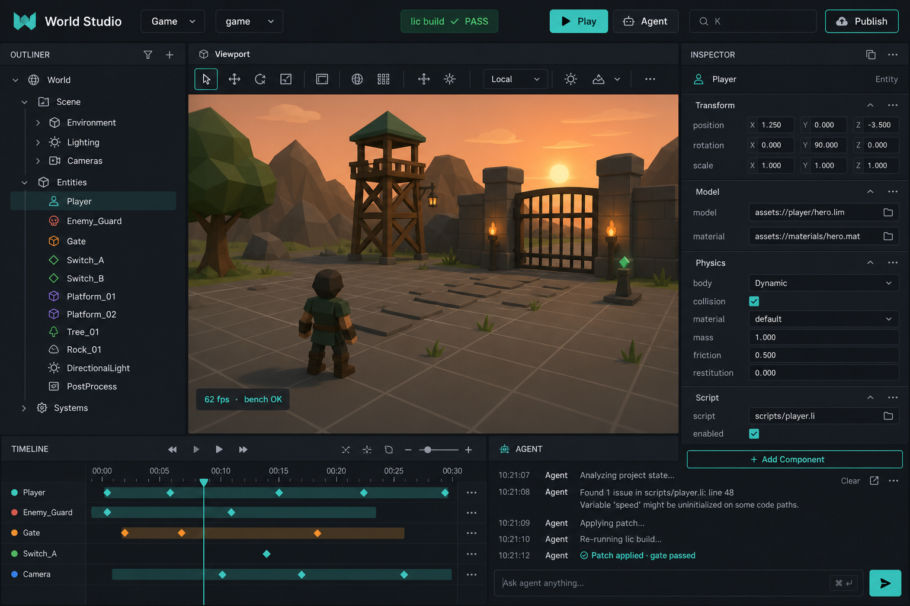
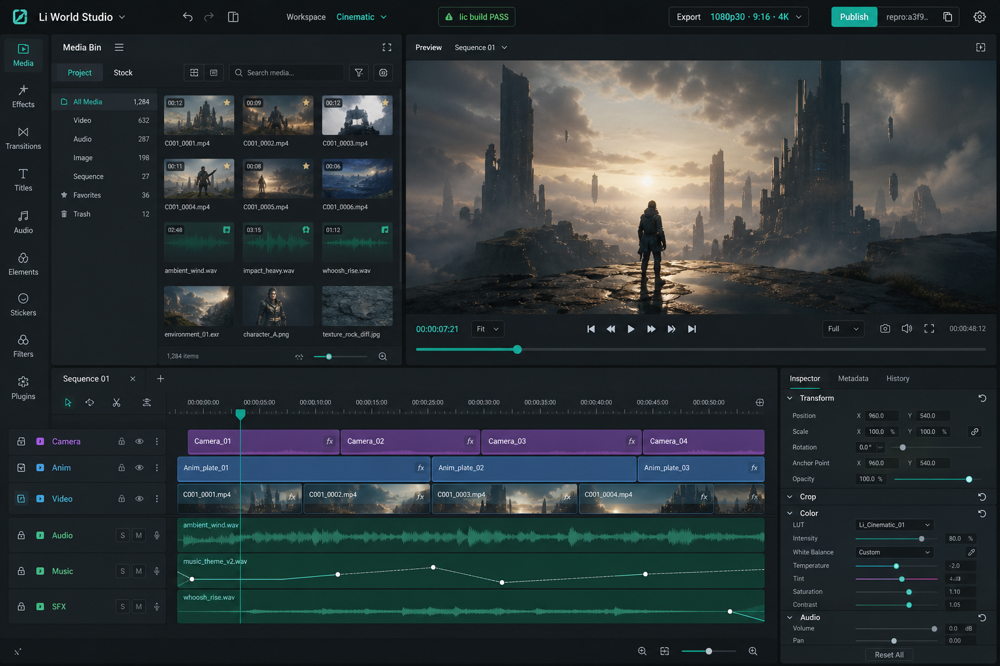
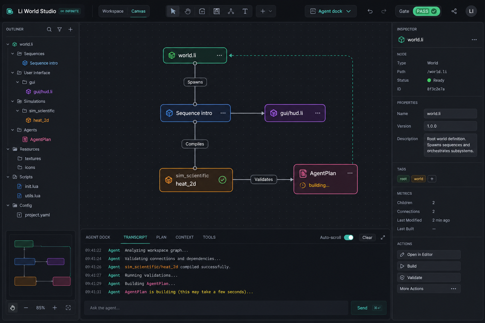
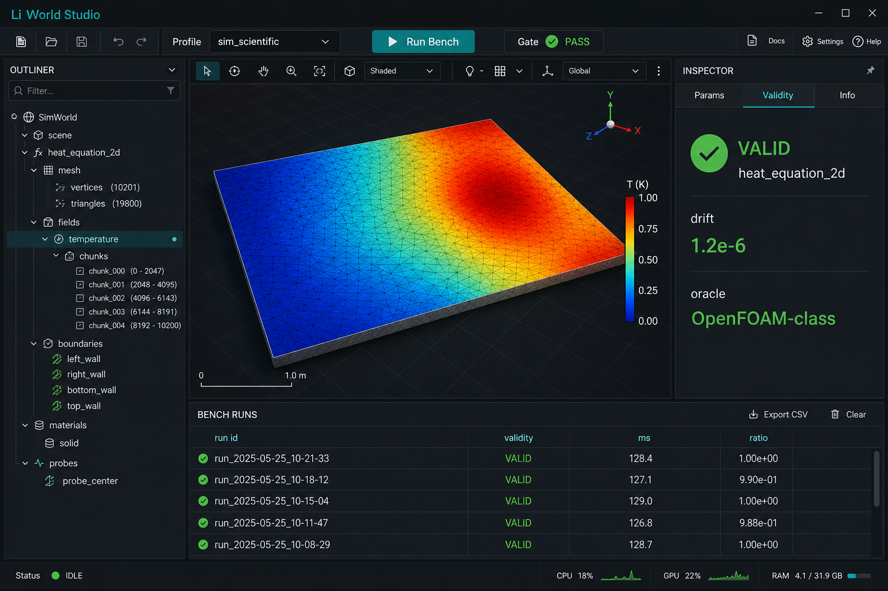

# Planned UI mockups (concept art)

Visual targets for **Li World Studio** native shell — generated from [unified-studio-ux-vision.md](unified-studio-ux-vision.md) and competitive material study.

**Files (in repo):** `lic/deploy/studio-demo/mockups/`

---

## 1. Game / viewport workspace

- Outliner + **3D viewport** + inspector  
- Toolbar: workspace, profile, **gate PASS**, Play, Agent, ⌘K, Publish  
- Bottom: timeline + **agent transcript**  
- Status overlay: fps + bench OK  

**Maps to:** G3 Studio shell · `engine.profile = game`

---

## 2. Cinematic — 4-panel NLE

- **Media bin** · **Preview** · **Timeline** · **Inspector** (CapCut/DaVinci pattern)  
- Export presets: 1080p30, 9:16, 4K + **repro hash**  
- Workspace: Cinematic  

**Maps to:** G7 `li-seq` · `studio.publish_video`

---

## 3. Infinite agentic canvas

- Spatial graph: `world.li`, `Sequence`, `gui`, `sim`, **AgentPlan**  
- Node status colors (pass / building)  
- Links: Spawns, Compiles, Validates  
- Default for drug/bio + agent-heavy sessions  

**Maps to:** G5 `gui.canvas` · [li-canvas-agentic-rfc](specs/li-canvas-agentic-rfc.md)

---

## 4. Scientific simulation

- Field viewport (heat map)  
- Inspector: **Params | Validity | Info**  
- Validity green: `heat_equation_2d`, drift, oracle name  
- Bottom: bench runs table  

**Maps to:** `sim_scientific` · tier-2 validity chrome

---

## Design tokens (target)

| Token | Value (mock) |
|-------|----------------|
| Background | `#1a1d23` charcoal |
| Accent | `#2dd4bf` teal |
| Pass | Green pill |
| Fail | Red pill (not shown) |
| Typography | System sans, 11–13px chrome |

Formalize in `specs/studio-ux-design-system-rfc.md` when native `li-ui` paint lands.

---

## Not shown (future mocks)

- AM / slicer plater + 3-step export wizard  
- LITL / bio adaptive stage strip  
- GUI theme editor (Roblox Style Editor class)  
- Publish drawer full layout  

Request additional mocks in `#ph-ux` when a workspace is ready to implement.
