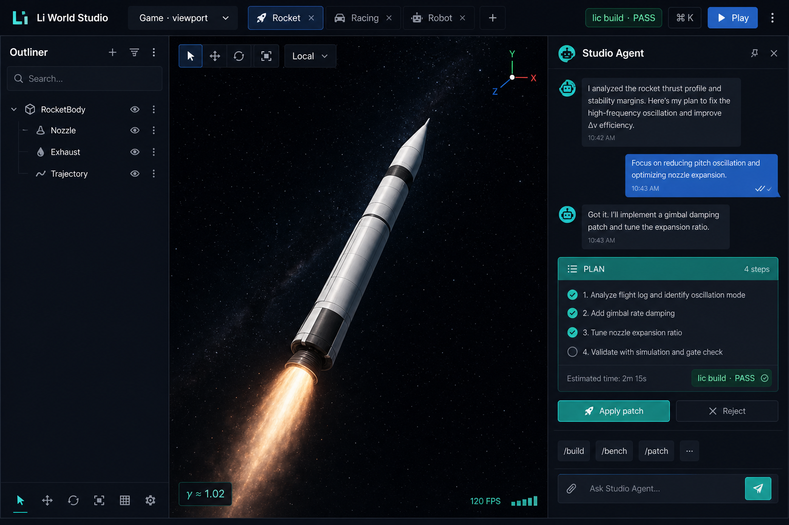
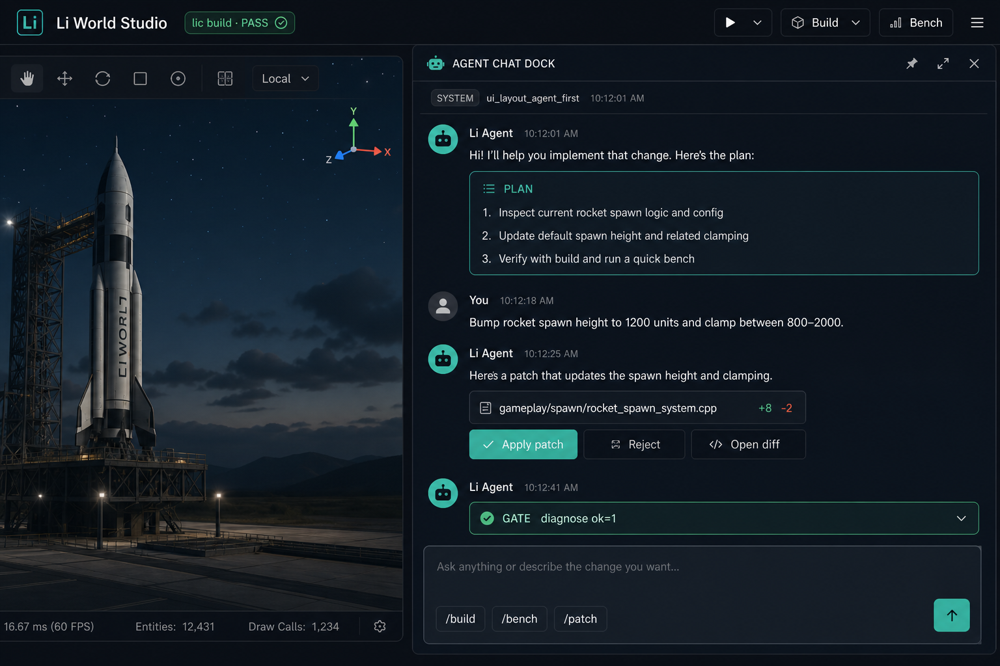
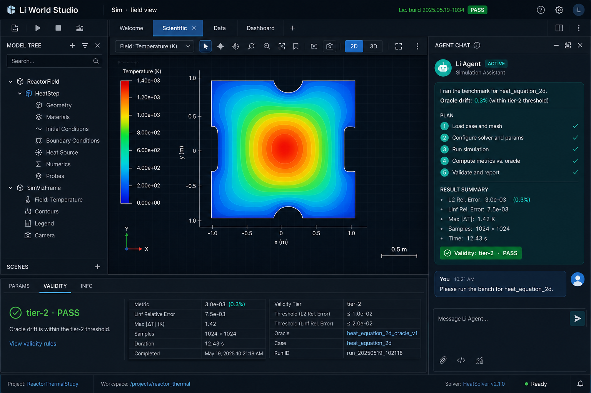
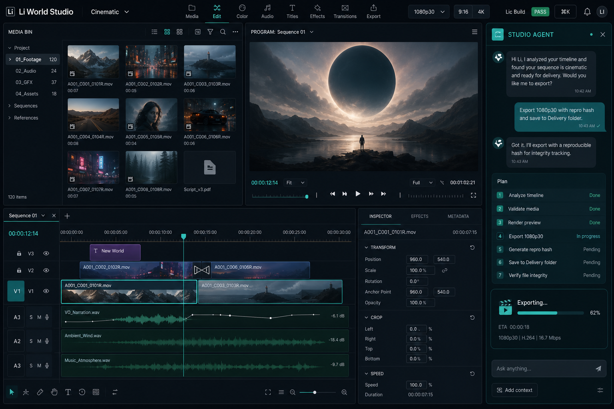
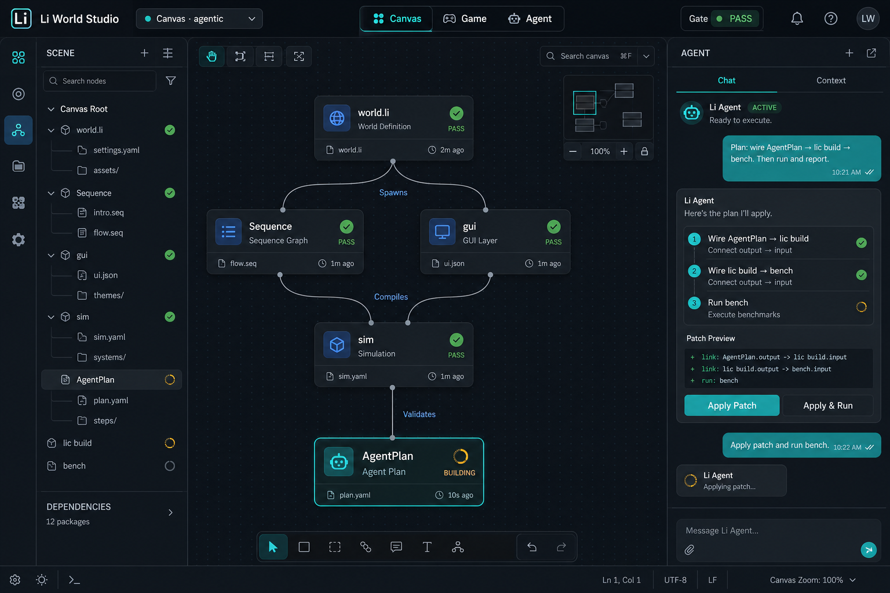
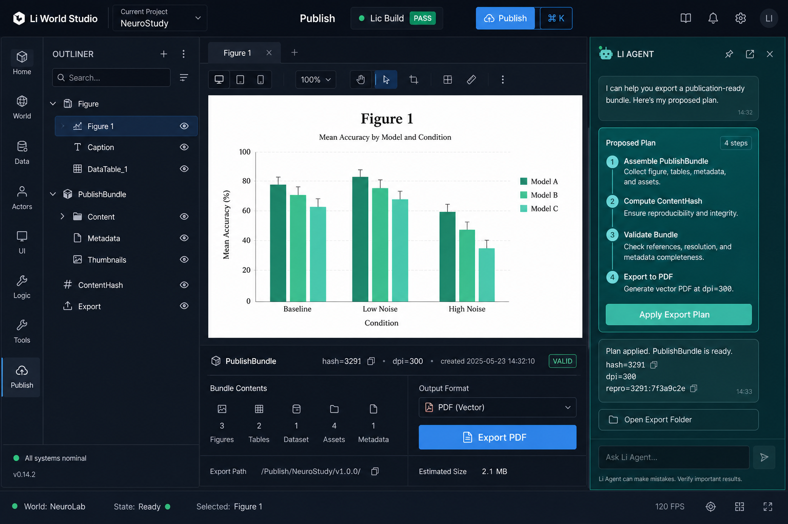

# Planned UI mockups (concept art)

Visual targets for **Li World Studio** native shell — v2 uses **teal agent dock** + navy shell (no violet).

**Folder:** `lic/deploy/studio-demo/mockups/` · **Live prototype:** [deploy/studio-demo/](../../deploy/studio-demo/)

---

## v2 gallery (current)

| | Workspace |
|---|-----------|
|  | **Game** — outliner · 3D viewport · **agent dock** |
|  | **Agent dock** — chat · plan · Apply/Reject |
|  | **Scientific** — heat field · validity · agent |
|  | **Cinematic** — 4-panel NLE + agent |
|  | **Canvas** — spatial graph · AgentPlan |
|  | **Publish** — figures · bundle hash |

---

## 1. Game / viewport workspace

- Outliner + **3D viewport** + **agent dock** (right, ~380px)  
- Toolbar: workspace, **gate PASS** (emerald), Play, ⌘K  
- Agent: plan → patch → `lic build`  

**Maps to:** G3 Studio shell · `engine.profile = game`

---

## 2. Cinematic — 4-panel NLE

- **Media bin** · **Preview** · **Timeline** · clip inspector  
- Export presets: 1080p30, 9:16, 4K + **repro hash**  
- Agent dock: export / seq steps  

**Maps to:** G7 `li-seq` · `studio.publish_video`

---

## 3. Infinite agentic canvas

- Spatial graph: `world.li`, `Sequence`, `gui`, `sim`, **AgentPlan**  
- Node status: pass / building  
- Agent dock: compile + validate loop  

**Maps to:** G5 `gui.canvas` · [li-canvas-agentic-rfc](specs/li-canvas-agentic-rfc.md)

---

## 4. Scientific simulation

- Field viewport (heat map)  
- **Params | Validity | Info** + agent discussing bench/oracle  
- Validity green: `heat_equation_2d`, drift, oracle  

**Maps to:** `sim_scientific` · tier-2 validity chrome

---

## 5. Agent dock (detail)

- **Chat bubbles** — user / agent / system  
- **Plan card** — steps before apply  
- **Gate inline** — `lic build · PASS`  
- **Apply / Reject** · composer `/build` `/bench` `/patch`  

**Maps to:** G3 `dock.agent` · `ui_layout_agent_first`

---

## 6. Publish

- Figure canvas + **PublishBundle** hash  
- Agent: export plan + repro gate  

**Maps to:** `studio.publish` · PH-PUB

---

## Design tokens (v2)

| Token | Value |
|-------|--------|
| `--bg-deep` | `#0f1219` |
| `--bg-surface` | `#161b26` |
| `--bg-elevated` | `#1c2233` |
| `--accent-agent` | `#2dd4bf` (teal) |
| `--accent-workspace` | `#5b9cf5` |
| `--pass` | `#34d399` |
| `--fail` | `#f87171` |
| Typography | IBM Plex Sans / Mono · 12–13px chrome |

Formalize in `specs/studio-ux-design-system-rfc.md` when native `li-ui` paint lands.

---

## v1 (legacy)

Older mocks without hero agent dock: `li-studio-viewport-game.png`, `li-studio-cinematic-nle.png`, etc. Prefer **`*-v2.png`** for reviews.

---

## Not shown (future)

- AM / slicer plater + export wizard  
- LITL / bio adaptive stage strip  
- GUI theme editor  

Request in `#ph-ux` when a workspace is ready to implement.
