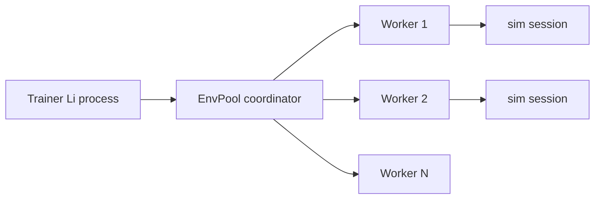

# Design: Async RL env pool (WP-RL-04)

**Status:** In-process serial batch **done** (Wave 4c/4d); fork IPC **blocked** — [issue template](../../../.github/ISSUE_TEMPLATE/wp-rl-04-fork-ipc.md)  
**Date:** 2026-05-29  
**Related:** [ml-async-parallel-rfc.md](ml-async-parallel-rfc.md) axis 2 (process isolation)

## Problem

`EnvPoolPersistent` in `li-ml-rl` steps environments **serially** inside one process. ML-4 needs ≥4 envs/sample for honest bench rows without claiming Gymnasium parity.

## Target architecture

- **Coordinator:** `ml.rl.async_pool_submit` enqueues `(session_id, dt)`; collects `EnvStepResult` batches.
- **Workers:** separate OS processes (not threads) running `sim_step` on isolated `SimSessionStub` copies.
- **IPC:** length-prefixed binary frames (obs/reward/done); no shared mutable session in workers.

## Wave 4c — in-process serial batch (done)

| API | Behavior |
|-----|----------|
| `async_env_worker_slot_count()` | Returns `8` |
| `async_env_pool_tick_serial_batch` | Loops `env_pool_stub_step` `worker_count` times in one process |
| `async_env_pool_tick_stub(n)` | Default pool/session; delegates to serial batch |

## Next step — fork worker RFC (Wave 5b)

Process isolation remains **blocked** until `posix_spawn` IPC lands.

**Verify:** `lic check packages/li-ml-rl/li-tests/smoke/async_env_pool_serial.li`

## Process workers (blocked)

`async_env_pool_tick_stub` does **not** fork. Process path:

1. Parent serializes `SimSessionStub` snapshot per worker slot.
2. `posix_spawn` / `clone` worker with read-only session copy (platform policy TBD).
3. Length-prefixed frames: obs, reward, terminal flag (see diagram above).

Until spawn lands, bench rows must not claim multi-process throughput.

## Blocked on

| Item | WP |
|------|-----|
| Process spawn + sandbox policy | Platform / security review |
| Persistent session snapshot serialize | SIM-3 + world format |
| Bench harness `rl_vector_env` row | WP-BENCH-ML + WP-RL-04 impl |

**Honesty:** Do not claim ≥4 async envs or steps/s until bench JSON exists with hardware footnote.
