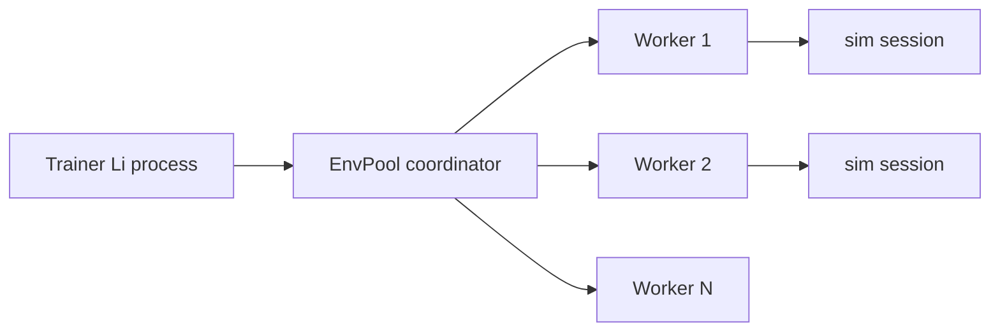

# Design: Async RL env pool (WP-RL-04)

**Status:** Design + minimal worker stub — not production throughput  
**Date:** 2026-05-29  
**Related:** [ml-async-parallel-rfc.md](ml-async-parallel-rfc.md) axis 2 (process isolation)

## Problem

`EnvPoolPersistent` in `li-ml-rl` steps environments **serially** inside one process. ML-4 needs ≥4 envs/sample for honest bench rows without claiming Gymnasium parity.

## Target architecture

- **Coordinator:** `ml.rl.async_pool_submit` enqueues `(session_id, dt)`; collects `EnvStepResult` batches.
- **Workers:** separate OS processes (not threads) running `sim_step` on isolated `SimSessionStub` copies.
- **IPC:** length-prefixed binary frames (obs/reward/done); no shared mutable session in workers.

## Minimal stub (Wave 5)

`async_env_worker_slot_count()` returns configured slot count (default 1).  
`async_env_pool_tick_stub(pool, n_workers)` returns `0` when `n_workers <= 1`, else `-1` (blocked: no fork IPC yet).

## Blocked on

| Item | WP |
|------|-----|
| Process spawn + sandbox policy | Platform / security review |
| Persistent session snapshot serialize | SIM-3 + world format |
| Bench harness `rl_vector_env` row | WP-BENCH-ML + WP-RL-04 impl |

**Honesty:** Do not claim ≥4 async envs or steps/s until bench JSON exists with hardware footnote.
