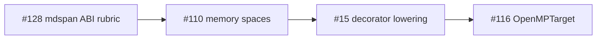

# Kokkos 4.6+ mdspan View refactor — tier-2 strided buffer ABI rubric

**Status:** Spec-only (plan-approved, #128) — no compiler codegen yet  
**Issue:** [#128](https://github.com/li-langverse/lic/issues/128)  
**Plan:** [2026-06-07-kokkos-mdspan-tier2-strided-abi-128.md](../superpowers/plans/2026-06-07-kokkos-mdspan-tier2-strided-abi-128.md)  
**north_star_fit:** HPC / tier-2 physics · **PH-7e**, **PH-7d**, **G-par**  
**Vision:** Provable layout + explicit sync before device perf; SoA/AoS field buffers without C oracle; no silent host↔device copies

---

## Context

After Kokkos **4.6.0** (2025-03-29), `Kokkos::View` is refactored around **`std::mdspan`** ([blog](https://kokkos.org/blog/2025-04-view-refactor), [release](https://github.com/kokkos/kokkos/releases/tag/4.6.00)). Li tier-2 physics benches still rely on **`shared_c_kernel`** catalog rows with no first-class **memory space / strided layout** model beyond minimal `std/execution` decorators.

This rubric defines what Li must specify before pure-Li tier-2 kernels can replace shared-C oracles without weakening proof or bench honesty.

**Sibling issues (do not duplicate):**

| Issue | Owns |
|-------|------|
| [#110](https://github.com/li-langverse/lic/issues/110) | Memory-space enums + View lifecycle policy matrix |
| [#15](https://github.com/li-langverse/lic/issues/15) | `@cpu` / `@parallel` decorator elaboration → copy/sync hooks |
| [#116](https://github.com/li-langverse/lic/issues/116) | OpenMPTarget offload checklist |
| [#129](https://github.com/li-langverse/lic/issues/129) | NUMA / affinity maps to parallel policies |

---

## Competitive rubric (Kokkos 4.6+ → Li ABI)

| Kokkos 4.6+ / mdspan concept | Li ABI requirement | Proof / gate |
|------------------------------|-------------------|--------------|
| `extents` / `layout_left` / `layout_right` | `ndview[Shape, T]` with static or dynamic rank; default layout for `grid[N,M,T]` documented | Shape types in MIR; no runtime shape drift in release |
| `layout_stride` / non-contiguous access | Stride tuple in type or proven view constructor; reject silent re-interpret cast | **G-par** disjoint rules apply per stride slice |
| SoA vs AoS field structs | Tier-2 **field bundle** aliases (`FieldSoA` / `FieldAoS`) with explicit migration note per bench | Catalog row notes which layout oracle uses |
| `Kokkos::View` host / device tags | `hostbuffer[T]` / `devicebuffer[T]` placement (spec-only until #110) | Copy/sync **must** be explicit in lowering — no implicit DualView |
| `deep_copy` / `DualView` deprecation | Decorator lowering emits **named** sync points (`@sync_host`, `@sync_device` — names TBD in #110) | Compile error on device read without prior sync proof obligation |
| Execution space + NUMA | Map to `parallel for` + `[execution]` config ([#129](https://github.com/li-langverse/lic/issues/129)) | **G-par** disjoint + documented affinity deferrals |

---

## Field buffer patterns (SoA vs AoS)

Tier-2 physics kernels carry multi-field state (positions, velocities, temperature, etc.). Kokkos 4.6+ encodes layout in mdspan mapping; Li must make the choice explicit in type aliases and bench migration notes.

### Structure-of-Arrays (SoA) — `FieldSoA`

Best for vectorized / parallel force loops where each field is accessed across all particles.

```text
# Conceptual (spec-only — not yet in compiler)
type FieldSoA[N, T] = bundle {
  px: ndview[(N,), T, layout_stride=(1,)],
  py: ndview[(N,), T, layout_stride=(1,)],
  vx: ndview[(N,), T, layout_stride=(1,)],
  vy: ndview[(N,), T, layout_stride=(1,)],
}
```

**Worked example — `md_lennard_jones`:** The existing pure-Li oracle in `packages/li-sim-scientific` uses separate `array[4, float]` for `px`, `py`, `vx`, `vy` — already SoA. Migration target: wrap in `FieldSoA[4, float]` once `ndview` lands; `parallel for` disjoint over particle index `i` with stride-1 slices.

| Bench id | Current layout | Target Li layout |
|----------|----------------|------------------|
| `md_lennard_jones` | SoA (`px`, `py`, `vx`, `vy` arrays) | `FieldSoA[N, f64]` |
| `three_body` | SoA (separate position/velocity arrays) | `FieldSoA[N, f64]` |

### Array-of-Structs (AoS) — `FieldAoS`

Best when kernels access all fields of one entity together (stencil neighbors, rigid-body state).

```text
# Conceptual (spec-only)
type Particle[T] = struct { x: T, y: T, vx: T, vy: T }
type FieldAoS[N, T] = ndview[(N,), Particle[T], layout_stride=(sizeof Particle[T],)>
```

**Worked example — `heat_equation_2d`:** The 1D heat stencil oracle uses a single `array[8, float]` for temperature — effectively AoS with one field. A 2D grid migration would use `grid[N, M, f64]` (contiguous row-major, `layout_right`) or `ndview` with custom strides for ghost-cell padding.

| Bench id | Current layout | Target Li layout |
|----------|----------------|------------------|
| `heat_equation_2d` | AoS (single `u[N]` field) | `grid[N, M, f64]` or `ndview` with ghost stride |
| `rigid_body_stack` | AoS (body struct per entity) | `FieldAoS[B, BodyState]` |

### Layout selection rule

| Pattern | Choose | Reason |
|---------|--------|--------|
| Force / reduction over N entities | **SoA** | SIMD + `parallel for` over index; disjoint per row |
| Stencil / neighbor access on grid | **AoS** or **`grid`** | Spatial locality; boundary helpers on `grid` |
| Mixed (MD + grid coupling) | **SoA** per subsystem | Separate buffers; explicit sync at coupling boundary |

---

## Copy / sync contract (decorator lowering)

Kokkos 4.6+ deprecates implicit `DualView` sync. Li requires **named, compile-visible** sync points. Final decorator names are owned by [#110](https://github.com/li-langverse/lic/issues/110); this table is the #128 layout-side contract.

| Decorator stack | Buffer state | Required sync before read | MIR tag (planned) |
|-----------------|-------------|---------------------------|-------------------|
| `@cpu` only | `hostbuffer[T]` | None (host is authoritative) | `mem_host` |
| `@gpu` kernel body | `devicebuffer[T]` | `@sync_device` after host write | `mem_device` |
| `@gpu` → host reduction | `devicebuffer[T]` → `hostbuffer[T]` | `@sync_host` before host read | `mem_sync_host` |
| `parallel for` on `hostbuffer` | host, shared RAM | None (disjoint= required) | `mem_host_par` |
| `parallel for` on `devicebuffer` | device | `@sync_device` if host wrote since last launch | `mem_device_par` |
| Tier-2 `shared_c_kernel` oracle | extern C (opaque) | Document as `mem_extern` until pure-Li lands | `mem_extern` |

**Compile-time obligations (post-#15 / #110):**

1. Reading `devicebuffer[T]` after a host-side write without `@sync_device` → **compile error** (E-mem-sync).
2. Passing `hostbuffer` slice to `@gpu` proc without proven pinned placement → **compile error** (E-mem-space).
3. `ndview` stride mismatch at view constructor → **compile error** (E-layout-stride).

Cross-links: [execution decorators spec](../superpowers/specs/2026-05-16-li-execution-decorators.md) · [execution resources](../superpowers/specs/2026-05-25-li-execution-resources.md) · [language design §Phase 3](../superpowers/specs/2026-05-14-li-language-design.md#phase-3--hpc--scientific-shapes).

---

## Pilot migration plan — `heat_equation_2d`

Single staged path from shared-C oracle to pure-Li strided buffer. Implementation **after** this rubric merges; codegen blocked on #110.

| Stage | State | Catalog `variant` | Gate |
|-------|-------|-------------------|------|
| **0** (today) | `shared_c_kernel` C oracle + Li wrapper checksum | `shared_c_kernel` | Checksum + ratio unchanged |
| **1** | Pure-Li 1D stencil (`heat_oracle_stencil_step` in `li-sim-scientific`) | `li_pure` (oracle only, not bench row) | `sim_scientific_oracle_checksum_heat` in `li-tests` |
| **2** | `grid[N, M, f64]` typed buffer + ghost cells | `li_pure` (harness row) | `bench.py --tier 2 --only heat_equation_2d` green |
| **3** | `parallel for` over interior rows + `disjoint=` | `li_pure` | **G-par** strided disjoint proof obligation |
| **4** | Optional `@vectorized` on stencil inner loop | `li_pure` | Tier-1-style ratio gate (no threshold weakening) |

**Do not:** weaken `threshold_ratio_cpp`, re-label tier-2 rows green while still on shared C, or edit `trusted.lean` without human-approved issue.

---

## Benchmarks catalog honesty (sub-phase E — benchmarks repo)

Tier-2 `shared_c_kernel` rows in **benchmarks** `catalog.toml` need annotation with target Li layout + migration phase. That PR is **benchmarks-only** (separate agent run); no threshold changes.

| Catalog id | Current `variant` | Target layout | Migration phase |
|------------|-------------------|---------------|-----------------|
| `heat_equation_2d` | `shared_c_kernel` | `grid[N,M,f64]` AoS | Stage 2 |
| `md_lennard_jones` | `shared_c_kernel` | `FieldSoA[N,f64]` | Stage 1 (oracle exists) |
| `three_body` | `shared_c_kernel` | `FieldSoA[N,f64]` | Stage 2 |

---

## Tests / evidence (post-codegen)

| Artifact | Tier | Purpose |
|----------|------|---------|
| `heat_equation_2d` | 2 | Pilot migration target |
| `md_lennard_jones` | 2 | SoA field stress |
| `li-tests/hpc/` (new suite) | — | `compile_ok` / `compile_fail` for illegal device read without sync |
| `benchmarks/harness/bench.py --tier 2` | 2 | Checksum + ratio gates unchanged |

---

## Sequencing



- **#128 first:** layout / stride / SoA-AoS rubric (this doc).
- **#110 next:** memory-space enums + View lifecycle.
- **#15 / #116:** lowering and offload after ABI is frozen.
