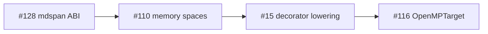

# Kokkos memory + execution spaces rubric (PH-7e, G-par, G-gpu)

**Issue:** [#110](https://github.com/li-langverse/lic/issues/110)  
**Plan:** [2026-06-07-kokkos-memory-execution-spaces-110.md](../superpowers/plans/2026-06-07-kokkos-memory-execution-spaces-110.md)  
**Std surface:** `std/execution/spaces.li` (spec-only v1)

## North star fit

Li tier-2 physics must migrate from **`shared_c_kernel`** catalog rows to pure-Li kernels **without silent host↔device copies**. Kokkos 4.6 deprecated implicit DualView sync; Li aligns by requiring **named sync points** before cross-space reads.

## Competitive rubric (Kokkos 4.6 → Li)

| Kokkos 4.6 concept | Li requirement | Proof / gate |
|--------------------|----------------|--------------|
| `Kokkos::MemorySpace` (`HostSpace`, `CudaSpace`, `HIPSpace`, `SYCLSpace`, `HBWSpace`) | `MemorySpace` tags: `Host`, `Device`, `Unified`, `HostPinned` (`memory_space_*()` in `std/execution/spaces.li`) | Static placement tag on buffer/View; no runtime space discovery in v1 |
| `Kokkos::ExecutionSpace` (`Serial`, `OpenMP`, `Threads`, `Cuda`, `HIP`, `SYCL`) | `ExecutionSpace` tags: `Serial`, `OpenMP`, `Threads` (v1); `SYCL`/`Cuda`/`HIP` reserved (#116) | Decorator stack selects space; default **OpenMP** for tier-2 |
| `Kokkos::View` allocation + deallocation | `View1D` metadata + `array[N,T]` host backing (v1); `View[T, Space, Layout]` in language design | Construct → use → destroy in **same** space unless explicit sync |
| `deep_copy(src, dst)` | `view_copy_host8` (host v1); future `@sync_host` / `@sync_device` (#15) | Sync points appear in MIR telemetry when lowering lands |
| `DualView` deprecation (4.6) | **No implicit dual view** — host mirror is explicit `hostbuffer[T]` paired with `devicebuffer[T]` | Reject API that auto-syncs on read |
| Graph API / composite loops (4.6 #7513) | Defer graph capture to #15 / #116 | Serial staging path documented for tier-2 pilot |
| H100-oriented reductions | Map to `@parallel(reduction=…)` + execution-space tag | Perf after proof |
| OpenMP vs Threads pool conflict | **Policy:** default `OpenMP`; `Threads` opt-in with documented hazard ([Trilinos #1391](https://github.com/trilinos/Trilinos/issues/1391)) | See execution-space policy below |

## Execution-space policy (REQ-ES-02)

| Space | Default? | Hazard |
|-------|----------|--------|
| `OpenMP` | **Yes** for tier-2 CPU physics | Requires libomp; matches `lic build --threads=N` |
| `Threads` | Opt-in only | **Conflict** if libomp also linked — nested thread pools, oversubscription |
| `Serial` | Staging / debug | Safe baseline for migration step 1 |
| `SYCL` / `Cuda` / `HIP` | Reserved (#116) | Offload codegen not in v1 |

## Copy / sync contract (REQ-SYNC-01, sub-phase C)

| Decorator stack | Required sync before device read | MIR tag (future #15) |
|-----------------|----------------------------------|----------------------|
| `@cpu` only | None (host-only) | `mir_cpu_def` |
| `@cpu @parallel` | None (shared RAM, G-par disjoint) | `mir_parallel_for` + disjoint witness |
| `@gpu` + host buffer | `@sync_device(view)` before kernel launch | `mir_sync_device` |
| `@gpu` kernel → host read | `@sync_host(view)` before host access | `mir_sync_host` |
| Cross-space without sync | **Compile error** (post-approval tests) | `compile_fail` in `li-tests/hpc/` |

**G-par:** disjoint iteration proofs remain valid within a single host address space. Execution-space choice does not weaken disjoint requirements.

**G-gpu:** cross-space access without prior sync is an **open proof obligation** — see [provability-gaps.md](../verification/provability-gaps.md).

## Kokkos 4.6.02 external signals

1. [Kokkos 4.6.02 release](https://github.com/kokkos/kokkos/releases/tag/4.6.02) — SYCL production, graph API, DualView deprecation trajectory.
2. [Composite loops / reductions (#7513)](https://github.com/kokkos/kokkos/issues/7513) — H100 patterns; defer to #15.
3. [LAMMPS Kokkos+OpenMP guide](https://www.hpc-carpentry.org/tuning_lammps/07-kokkos-openmp/index.html) — explicit execution-space staging for tier-2.

## Vendor policy handoff (sub-phase F)

Lic tracks Kokkos in `benchmarks/competitive/registry.toml` (`track = "watch"`). Version pin **4.6.x** is owned by [benchmarks#27](https://github.com/li-langverse/benchmarks/issues/27); lic does not change bench thresholds.

## Sequencing

