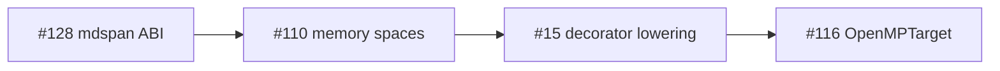

# Kokkos 4.6 memory + execution spaces rubric (Li tier-2)

**Issue:** [lic#110](https://github.com/li-langverse/lic/issues/110)  
**north_star_fit:** HPC / tier-2 physics · **PH-7e**, **PH-7d**, **G-par**, **G-gpu**  
**Status:** Policy matrix (spec enums in `std/execution/memory_spaces.li`; parser/codegen deferred)

## Purpose

Define a **minimal, provable** Li memory-space and execution-space model aligned with Kokkos 4.5–4.6 production semantics so tier-2 physics can migrate from `shared_c_kernel` catalog rows to pure-Li kernels **without silent host↔device copies**.

## Kokkos 4.6 → Li mapping

| Kokkos 4.6 concept | Li requirement | Proof / gate |
|--------------------|----------------|--------------|
| `Kokkos::MemorySpace` (`HostSpace`, `CudaSpace`, `HIPSpace`, `SYCLSpace`, `HBWSpace`) | `MemorySpace`: `Host`, `Device`, `Unified` (`HBWSpace` documented as `Unified` alias) | Compile-time placement tag on buffer type; no runtime space discovery |
| `Kokkos::ExecutionSpace` (`Serial`, `OpenMP`, `Threads`, `Cuda`, `HIP`, `SYCL`) | `ExecutionSpace`: `Serial`, `OpenMP`, `Threads` (v1); `SYCL`/`Cuda`/`HIP` reserved (#116) | Decorator stack selects space; **Threads vs OpenMP** conflict documented |
| `Kokkos::View` allocation + deallocation | `View[T, Space, Layout]` lifecycle: construct → use → destroy in **same** space unless explicit sync | Compile error on cross-space read without prior `@sync_*` |
| `deep_copy(src, dst)` | Named sync intrinsics: `@sync_host(view)`, `@sync_device(view)` (names TBD; spec-only) | **G-par** + **G-gpu**: sync points appear in MIR telemetry |
| `DualView` deprecation (4.6) | **No implicit dual view** — host mirror is explicit `hostbuffer[T]` paired with `devicebuffer[T]` | Reject API that auto-syncs on read |
| Graph API / composite loops (#7513) | Defer graph capture to #15 / #116; serial staging path for tier-2 pilot | Plan-only; no graph codegen in v1 |
| H100-oriented reductions | Map to `@parallel(reduction=…)` + execution-space tag; perf after proof | Tier-2 bench unchanged until pure-Li lands |

## Li enum surface (v1)

Import: `import std.execution.memory_spaces`

| Tag | Accessor | Value |
|-----|----------|------:|
| `MemorySpace::Host` | `memory_space_host()` | 0 |
| `MemorySpace::Device` | `memory_space_device()` | 1 |
| `MemorySpace::Unified` | `memory_space_unified()` | 2 |
| `ExecutionSpace::Serial` | `execution_space_serial()` | 0 |
| `ExecutionSpace::OpenMP` | `execution_space_openmp()` | 1 |
| `ExecutionSpace::Threads` | `execution_space_threads()` | 2 |
| `ExecutionSpace::SYCL` | `execution_space_sycl()` | 3 |
| `ExecutionSpace::Cuda` | `execution_space_cuda()` | 4 |
| `ExecutionSpace::HIP` | `execution_space_hip()` | 5 |

**Default tier-2 execution space:** `OpenMP` (`execution_space_default_tier2()`).

## OpenMP vs Threads policy

Kokkos and Trilinos document runtime conflicts when both `Kokkos::OpenMP` and `Kokkos::Threads` backends link libomp ([Trilinos#1391](https://github.com/trilinos/Trilinos/issues/1391)). Li policy:

1. **Default:** `execution_space_openmp()` for tier-2 `@parallel` lowering.
2. **Opt-in:** `execution_space_threads()` only when the build explicitly selects a thread-pool backend without OpenMP.
3. **Hazard:** linking both OpenMP and a Kokkos Threads pool in the same process is **unsupported** — document in package README and bench harness notes.

## Copy / sync contract

`sync_required_before_read(src, dst)` returns true when an explicit sync is required before a cross-space read. Rules:

- Same space → no sync.
- Either side `Unified` → no explicit sync (unified memory model; proofs still open under **G-gpu**).
- `Host` ↔ `Device` → **must** call `@sync_host` or `@sync_device` before read (compile error when parser lands).

Decorator stack → sync point table (feeds #15):

| Decorator stack | Required sync before device kernel |
|-----------------|-----------------------------------|
| `@cpu` only | None (host-resident) |
| `@cpu` `@parallel` | None (OpenMP on host buffers) |
| `@gpu` + host `View` | `@sync_device(view)` before kernel launch |
| `@gpu` + device `View` | `@sync_host(view)` before host readback |

## External signals

1. [Kokkos 4.6.02 release](https://github.com/kokkos/kokkos/releases/tag/4.6.02) — SYCL production, graph API, DualView deprecation trajectory.
2. [Kokkos 4.6 composite loops (#7513)](https://github.com/kokkos/kokkos/issues/7513) — H100 reductions; graph deferred.
3. [Trilinos#1391](https://github.com/trilinos/Trilinos/issues/1391) — OpenMP vs Threads pool conflict.
4. [LAMMPS Kokkos+OpenMP guide](https://www.hpc-carpentry.org/tuning_lammps/07-kokkos-openmp/index.html) — tier-2 staging patterns.

## Sequencing

## Related

- Plan: [2026-06-07-kokkos-memory-execution-spaces-110.md](../superpowers/plans/2026-06-07-kokkos-memory-execution-spaces-110.md)
- Migration: [tier2-shared-c-migration-heat-equation-2d.md](tier2-shared-c-migration-heat-equation-2d.md)
- Decorators: [execution decorators spec](../superpowers/specs/2026-05-16-li-execution-decorators.md)
- Vendor pin: [benchmarks#27](https://github.com/li-langverse/benchmarks/issues/27)
