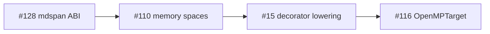

# Tier-2 `shared_c_kernel` → explicit copy migration rubric

**Status:** Active (rev. 1 — 2026-06-08)  
**Issue:** [lic#110](https://github.com/li-langverse/lic/issues/110)  
**Parent:** [kokkos-memory-execution-spaces-rubric.md](kokkos-memory-execution-spaces-rubric.md)

Today tier-2 physics rows (`md_lennard_jones`, `heat_equation_2d`, …) compare **cpp** (native reference) against **rust** / **julia** / **li** variants that often link the **same C core** (`kernel_honesty = shared_c_kernel`). The C oracle owns allocation and any implicit host↔device copies. Pure-Li kernels must **name** every cross-space transfer.

## Honesty labels (unchanged)

| Label | Meaning | Migration target |
|-------|---------|------------------|
| `reference_native` | cpp driver owns full kernel | Stay reference |
| `shared_c_kernel` | Non-cpp langs link `LI_EXTRA_C` core | → `pure_li` with explicit sync |
| `pure_li` | Li source only, no shared C | Required for green tier-2 claims |
| `mixed` | Per-benchmark honesty in CSV notes | Split rows as pure-Li lands |

See `benchmarks/competitive/registry.toml` and competitive landscape docs.

## Migration stages (all tier-2 rows)

| Stage | C oracle behavior | Pure-Li requirement | Bench gate |
|-------|-------------------|---------------------|------------|
| **0** (today) | `LI_EXTRA_C` + implicit host buffer | Li may call same C via extern | Checksum match; `shared_c_kernel` label |
| **1** | Reference only | Host-only pure-Li `@cpu` `@parallel` | `li_pure=True`; checksum green |
| **2** | Reference only | `hostbuffer` + `devicebuffer` pair + `@sync_device` before kernel | MIR shows sync; no silent copy |
| **3** | Retired from li column | Drop `LI_EXTRA_C` from li harness | `pure_li` only in CSV |

**Do not** lower `threshold_ratio_cpp` or re-label rows green while stage 0–1 still uses shared C.

## Pilot: `heat_equation_2d`

| Step | Work | Owner | Exit |
|------|------|-------|------|
| 1 | Host-only pure-Li stencil (mirror `sim_scientific_oracle_checksum_heat`) | lic | `li_pure=True`, checksum in `verify.py` |
| 2 | Add `hostbuffer[float]` / `devicebuffer[float]` pair per [#128](https://github.com/li-langverse/lic/issues/128) layout ABI | lic + #128 | Types compile; no codegen yet OK |
| 3 | `@sync_device(u)` before `@gpu` stencil step | lic #15 / #116 | MIR sync tag present |
| 4 | Remove `LI_EXTRA_C` from li harness driver | lic benchmarks | CSV `kernel_honesty=pure_li` |

**Secondary row:** `md_lennard_jones` — host-only path first; SoA layout blocked on #128.

## Pilot: `md_lennard_jones`

Same stage table. Stage 1 priority: velocity-Verlet host `@parallel` with proved `disjoint_*`. Device staging follows `heat_equation_2d` after layout ABI freeze.

## Kokkos vendor policy handoff

Lic does **not** own the benchmarks vendor pin. Track Kokkos **4.6.x** in [benchmarks#27](https://github.com/li-langverse/benchmarks/issues/27):

- [ ] Pin `KOKKOS_VERSION=4.6.02` (or current 4.6.x) in bench vendor policy when Kokkos driver lands
- [ ] Note SYCL backend + DualView deprecation in vendor changelog review
- [ ] No threshold changes from lic PRs

Registry watch row `kokkos` in `benchmarks/competitive/registry.toml` updated to cite 4.6.02 (lic side).

## Sequencing

