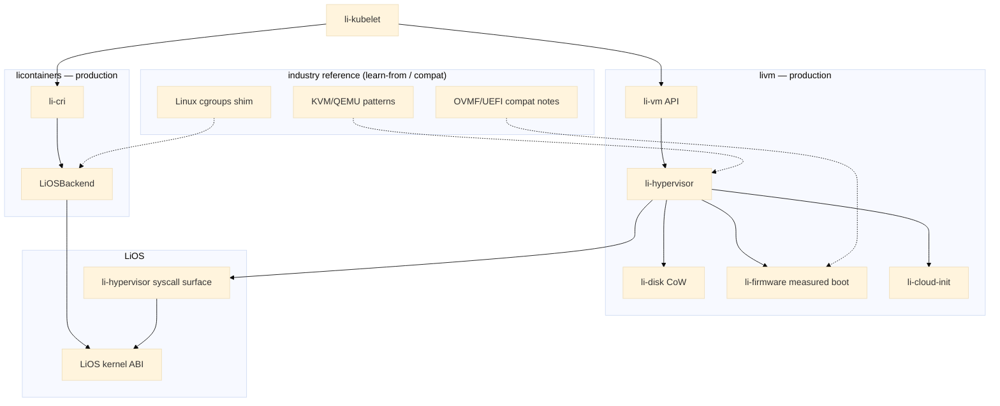

<!--
Tweet / thread bullets (copy-paste):

1. libernetes = a 100% Li-language Kubernetes control plane — containers AND VMs, one API, built on LiOS instead of forking Go k8s.

2. Li-native first: li-hypervisor, li-firmware, LiOSBackend, li-disk, li-cni ship as production. KVM/QEMU/containerd are learn-from baselines, not the north star.

3. Four pillars: libernetes (control plane) + licontainers (CRI) + livm (VM runtime) + LiOS (kernel ABI + hypervisor syscall surface).

4. Delivery is wave-gated on homelab K8s runners (W0–W9). Waves 0–2 merged; Wave 3 ACTIVE — single-node libernetes-run-local with four parallel tracks.

5. Follow along: roadmap + architecture diagrams in lic/docs — GitLab origin gitlab.lilangverse.xyz, GitHub mirror read-only.
-->

# libernetes: a Li-native Kubernetes control plane for containers and VMs

**libernetes** is a Kubernetes-shaped control plane written in the Li language — not a fork of the Go upstream — that schedules **containers** and **virtual machines** through one API. The goal is homelab-to-production clusters where every layer that matters is Li-native: hypervisor, firmware, container isolation, disk, and networking, all sitting on **LiOS** instead of bolting foreign runtimes together and calling it done.

---

## Li-native first, industry-informed

Most “build your own k8s” efforts inherit someone else’s stack wholesale. libernetes inverts that: **every subsystem has a Li-native production path**, and industry tools exist only where they help you move faster without becoming the architecture.

| Area | What ships | What we learn from (not ship as north star) |
|------|------------|---------------------------------------------|
| **Hypervisor** | `li-hypervisor` via LiOS ABI | KVM/QEMU design patterns, cold-boot benchmarks |
| **Firmware** | `li-firmware` measured boot | OVMF/UEFI notes for guest image compat only |
| **Containers** | `LiOSBackend` in licontainers | OCI image spec, CRI v1 gRPC, containerd API shape |
| **Disk** | `li-disk` copy-on-write | qemu-img CoW patterns |
| **CNI** | `li-cni` native plugins | CNI spec, bridge plugin compat |
| **API** | `li-apiserver` native | K8s API parity matrix |

Interim dev shims — `kvm.li` stubs, `linux_backend.li` cgroups on Linux hosts — exist for Wave 1–3 gates only. They are explicitly **not** production backends. Diagrams show Li-native nodes as solid boxes; foreign stacks appear dashed or in footnotes.

---

## Target architecture

Four pillars hold the system up:

1. **libernetes** — control plane: `li-apiserver`, `li-scheduler`, `li-controller-manager`, etcd client, unified workload APIs.
2. **licontainers** — OCI/CRI runtime; `LiOSBackend` isolates workloads through the LiOS kernel ABI.
3. **livm** — VM runtime: `li-vm` API → `li-hypervisor` → `li-disk`, `li-firmware`, `li-cloud-init`.
4. **LiOS** — kernel ABI plus the hypervisor syscall surface both runtimes depend on.

On each node, **li-kubelet** dual-syncs container (CRI) and VM APIs. **li-cni** and **li-kube-proxy** handle the data plane. KubeVirt-shaped `VirtualMachine` CRDs provide API compatibility; the implementation underneath is Li-native.



**Static diagram (Explorer-friendly):** `../../libernetes-architecture-post/architecture.png`

Worker join auto-discovers arch, GPU, and runtimes; nodes with the LiOS hypervisor register `libernetes.io/hypervisor=li-native`. Product UX target:

```bash
libernetes init --profile homelab
libernetes worker join https://cp:6443 --token <token> --profile auto
```

---

## Delivery waves (W0–W9)

libernetes ships in **gated waves** across four parallel tracks (platform, licontainers, livm, control). **Waves 0–2** — specs, package scaffolds, etcd/CRI/livm API foundations — are **merged to `main`**. **Wave 3 is ACTIVE**: a single-node runnable stack (`libernetes-run-local`, control-plane daemons, kubelet sync) with completion gates per track (`check-libernetes-*-wave3-gate.sh`). **Waves 4–9** have gate scripts in-tree but stay unwired until the prior wave lands: multi-node worker join (4), scheduler dispatch (5), `li-cluster-bench` + distributed e2e (6), ReplicaSet/Node self-healing via `self_heal.li` (7), PV/PVC + etcd backup + reboot recovery (8), and `li-metrics` + node conditions + dashboard (9). **Wave 10+** targets conformance, homelab k3s cutover, and LiOS-native nodes end-to-end.

```mermaid
%%{init: {'theme': 'base', 'flowchart': {'nodeSpacing': 40, 'rankSpacing': 60, 'padding': 16}}}%%
flowchart LR
  subgraph done ["Merged"]
    W0["Wave 0\nspecs + easy-setup"]
    W1["Wave 1\npackage scaffolds"]
    W2["Wave 2\netcd CRI livm APIs"]
  end

  subgraph dist ["Distributed workloads"]
    W3["Wave 3 ACTIVE\nlibernetes-run-local"]
    W4["Wave 4\nmulti-node join"]
    W5["Wave 5\nscheduler dispatch"]
    W6["Wave 6\nbench + e2e"]
  end

  subgraph cluster ["Cluster operations"]
    W7["Wave 7\nself-healing"]
    W8["Wave 8\nreboot persistence"]
    W9["Wave 9\nmetrics + dashboard"]
  end

  W10["Wave 10+\nconformance + k3s cutover"]

  W0 --> W1 --> W2 --> W3 --> W4 --> W5 --> W6 --> W7 --> W8 --> W9 --> W10
```



**Waves diagram:** `../../libernetes-architecture-post/waves.png`

---

## Homelab runners and Git policy

Today, four **goal-directed K8s workers** on a homelab engine cluster (k3s / li-swarm) implement Waves 3–9 until libernetes replaces k3s:

| Runner | Branch |
|--------|--------|
| `li-libernetes-platform` | `cursor/libernetes-platform` |
| `li-libernetes-licontainers` | `cursor/libernetes-licontainers` |
| `li-libernetes-livm` | `cursor/libernetes-livm` |
| `li-libernetes-control` | `cursor/libernetes-control` |

Git policy keeps velocity without losing provenance: **`li-libernetes-git-bundle`** supplies entrypoint + k8s-git-auth; runners **push and pull from GitLab** (`gitlab.lilangverse.xyz`) and **fetch GitHub read-only** as a mirror. Future state: the same agent workloads run on libernetes itself, scheduled by `WorkerProfile` instead of hardcoded `nodeSelector: engine`.

---

## Where we are now

| Status | Waves | What it means |
|--------|-------|---------------|
| **Merged** | 0–2 | Docs, stubs, etcd/CRI/livm foundations on `main` |
| **ACTIVE** | 3 | Single-node runnable stack; four track gates wired |
| **Scripted, unwired** | 4–9 | Gate scripts ship; activation waits on prior wave merge |
| **Future** | 10+ | Conformance, k3s cutover, LiOS-native worker fleet |

livm’s multi-OS matrix targets LiOS amd64/arm64 workers with Li-native firmware for Linux, Windows, and BSD guests; Linux/macOS/Windows **hosts** without LiOS are container-only or out of Wave 3 scope — the hypervisor story is LiOS-first.

---

## Get involved

- **Roadmap (diagrams + wave table):** [libernetes-roadmap.md](libernetes-roadmap.md)
- **Architecture detail:** [libernetes/architecture.md](libernetes/architecture.md)
- **Master plan:** [libernetes/master-plan.md](libernetes/master-plan.md)
- **livm multi-OS matrix:** [libernetes/multi-os-matrix.md](libernetes/multi-os-matrix.md)
- **Package repo:** [github.com/li-langverse/libernetes](https://github.com/li-langverse/libernetes)
- **Share assets (short paths):** `libernetes-architecture-post.png` and `libernetes-architecture-post/` at the `li` workspace root

Wave 3 is the inflection point: one machine, full control-plane daemons, kubelet syncing both CRI and VM workloads. If Li-native infrastructure interests you — hypervisor through API — follow the roadmap, run the wave gates locally, or open issues on the track you care about.

---

*libernetes — Kubernetes ergonomics, Li-native guts.*
