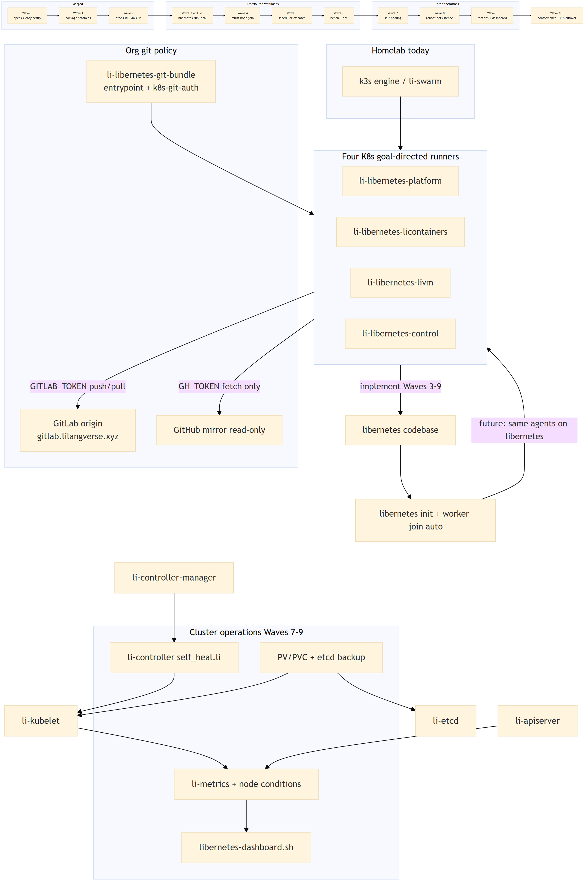
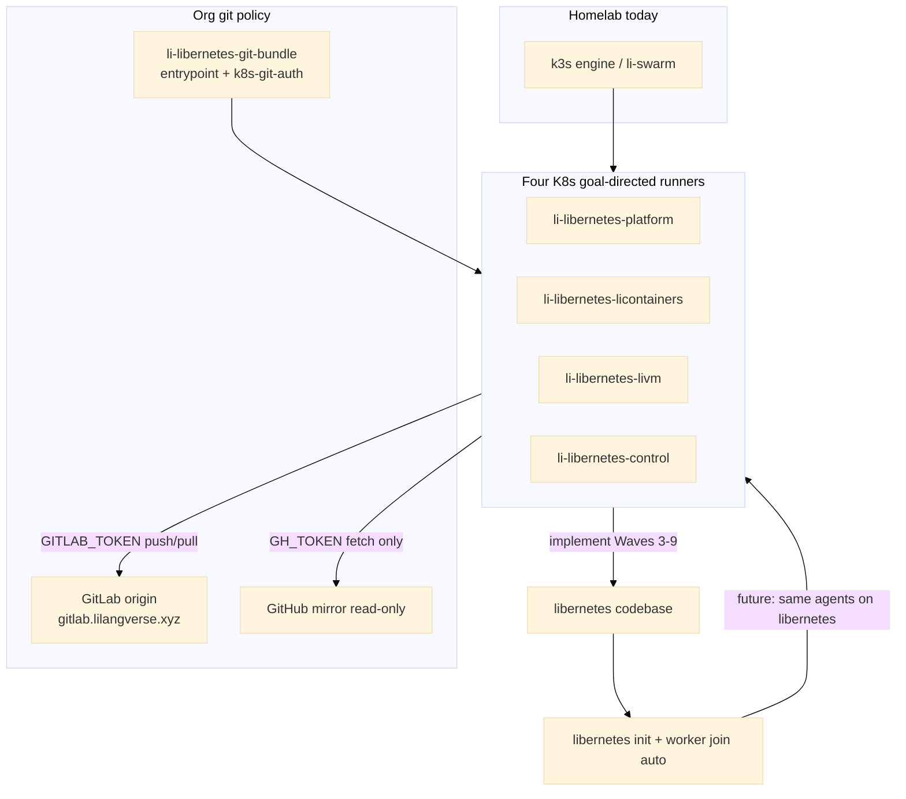
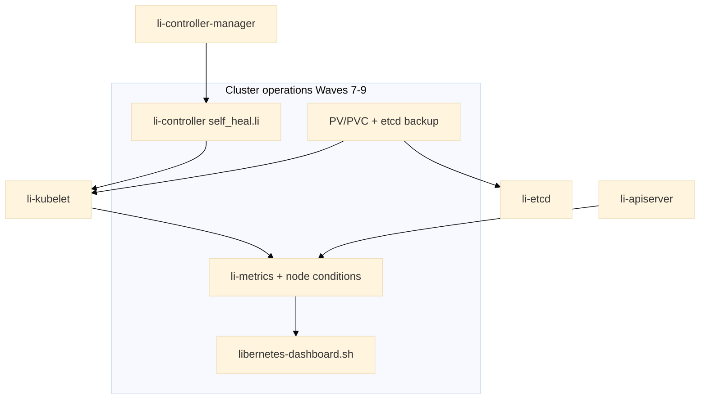
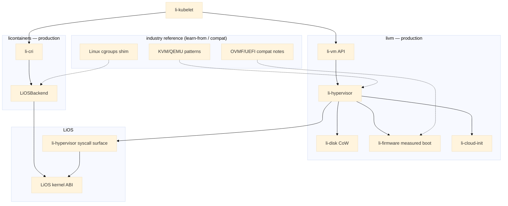

# libernetes delivery roadmap

Standalone rendered view of delivery waves, K8s runner topology, and cluster-operations scope.

**Canonical detail:** [libernetes/master-plan.md](libernetes/master-plan.md)  
**Full plan (Cursor):** `libernetes_master_plan_bc3b669a.plan.md` in Cursor plans

**Rendered diagrams:** [waves (W0–W10+)](libernetes-roadmap-waves.png) · [bootstrap & git policy](libernetes-roadmap-bootstrap.png) · [cluster operations (W7–9)](libernetes-roadmap-cluster-ops.png)

---

## Li-native first, industry-informed

Every libernetes subsystem has a **Li-native production path**. Industry stacks (KVM, QEMU, OVMF/UEFI, containerd/runc, KubeVirt, bridge CNI) remain useful as **learn-from**, **API-compat**, **benchmark baseline**, or **interim dev shim** — never as the north-star architecture.

| Area | Li-native way (ship) | Industry reference (OK to cite) | Interim shim (dev-only) |
|------|----------------------|----------------------------------|-------------------------|
| Hypervisor | `li-hypervisor` / LiOS ABI | KVM/QEMU design patterns | `kvm.li` Wave 1 stub filename |
| Firmware | `li-firmware` measured boot | OVMF/UEFI guest-compat notes | — |
| Containers | `LiOSBackend` + licontainers | OCI/CRI spec, containerd API shape | `linux_backend.li` cgroups shim |
| Disk | `li-disk` CoW native | qemu-img CoW as reference | — |
| CNI | `li-cni` native plugins | CNI spec, bridge plugin compat | — |
| API | `li-apiserver` native | K8s API parity matrix | k3s migration context |

**Pattern for docs and diagrams:** Li-native nodes are solid and primary; foreign stacks appear dashed or in footnotes when shown at all.

---

## K8s runner waves (W0–W10+)

Each wave gates four parallel tracks (platform, licontainers, livm, control). Wave 3 is wired into completion gates; Waves 4–9 ship gate scripts but stay unwired until the prior wave merges.

```mermaid
%%{init: {'theme': 'base', 'flowchart': {'nodeSpacing': 40, 'rankSpacing': 60, 'padding': 16}}}%%
flowchart LR
  subgraph done ["Merged"]
    W0["Wave 0\nspecs + easy-setup"]
    W1["Wave 1\npackage scaffolds"]
    W2["Wave 2\netcd CRI livm APIs"]
  end

  subgraph dist ["Distributed workloads"]
    W3["Wave 3 ACTIVE\nlibernetes-run-local"]
    W4["Wave 4\nmulti-node join"]
    W5["Wave 5\nscheduler dispatch"]
    W6["Wave 6\nbench + e2e"]
  end

  subgraph cluster ["Cluster operations"]
    W7["Wave 7\nself-healing"]
    W8["Wave 8\nreboot persistence"]
    W9["Wave 9\nmetrics + dashboard"]
  end

  W10["Wave 10+\nconformance + k3s cutover"]

  W0 --> W1 --> W2 --> W3 --> W4 --> W5 --> W6 --> W7 --> W8 --> W9 --> W10
```

| Wave | Focus | Active gate | Status |
|------|-------|-------------|--------|
| 0–2 | Docs, stubs, etcd/CRI/livm foundations | merged to `main` | **merged** |
| 3 | Single-node runnable (`libernetes-run-local`, daemons, kubelet sync) | `check-libernetes-*-wave3-gate.sh` | **ACTIVE** |
| 4 | Multi-node registry + worker join persistence | scripted, unwired | pending |
| 5 | Scheduler + kubelet workload dispatch | scripted, unwired | pending |
| 6 | `li-cluster-bench` + distributed e2e | scripted, unwired | pending |
| 7 | ReplicaSet/Node self-healing (`self_heal.li`) | scripted, unwired | pending |
| 8 | PV/PVC + etcd backup + reboot recovery | scripted, unwired | pending |
| 9 | `li-metrics` + node conditions + dashboard | scripted, unwired | pending |
| 10+ | Conformance, homelab k3s cutover, LiOS native nodes | — | future |

### Active K8s runners (Wave 3)

| Deployment | Branch | Active gate |
|------------|--------|-------------|
| `li-libernetes-platform` | `cursor/libernetes-platform` | `check-libernetes-platform-wave3-gate.sh` |
| `li-libernetes-licontainers` | `cursor/libernetes-licontainers` | `check-libernetes-licontainers-wave3-gate.sh` |
| `li-libernetes-livm` | `cursor/libernetes-livm` | `check-libernetes-livm-wave3-gate.sh` |
| `li-libernetes-control` | `cursor/libernetes-control` | `check-libernetes-control-wave3-gate.sh` |

---

## Bootstrap, workers, and GitLab git policy

Goal-directed K8s workers on the homelab engine cluster implement Waves 3–9 until libernetes replaces k3s.

Future: same agent workloads run on libernetes with `WorkerProfile` scheduling instead of hardcoded `nodeSelector: engine`.

---

## Cluster operations (Waves 7–9)

Waves 7–9 extend the control plane with self-healing, persistence, and observability. See [cluster-operations.md](libernetes/cluster-operations.md) for full detail.

| Wave | Deliverable | Outcome |
|------|-------------|---------|
| **7** | ReplicaSet/Node controllers — `self_heal.li` | Self-healing replicas; reschedule on `NodeNotReady` |
| **8** | PV/PVC + etcd backup + reboot recovery | Workload storage survives node reboot |
| **9** | `li-metrics` + node conditions + `libernetes-dashboard` | Homelab cluster monitoring and dashboard |

---

## Target runtime stack (Li-native primary)

**livm** ships on `li-hypervisor` + `li-firmware` (measured boot) + `li-disk` + `li-cloud-init`. **licontainers** ships on `LiOSBackend`; Linux cgroups is an interim dev shim only. Worker join registers `libernetes.io/hypervisor=li-native` when the LiOS hypervisor is present.

> **Industry reference:** KubeVirt API compat for `VirtualMachine` CRDs; cold-boot benchmarks in `li-cluster-bench` may compare against KVM/QEMU baselines during transition. OVMF/UEFI cited only for guest image compat notes — production firmware is Li-native.

---

## Related docs

- [libernetes/master-plan.md](libernetes/master-plan.md) — condensed master plan in-repo
- [libernetes/distributed-workloads.md](libernetes/distributed-workloads.md) — Waves 3–6 distributed track
- [libernetes/cluster-operations.md](libernetes/cluster-operations.md) — Waves 7–9 ops track
- [libernetes/easy-setup.md](libernetes/easy-setup.md) — `libernetes init` / worker join UX
