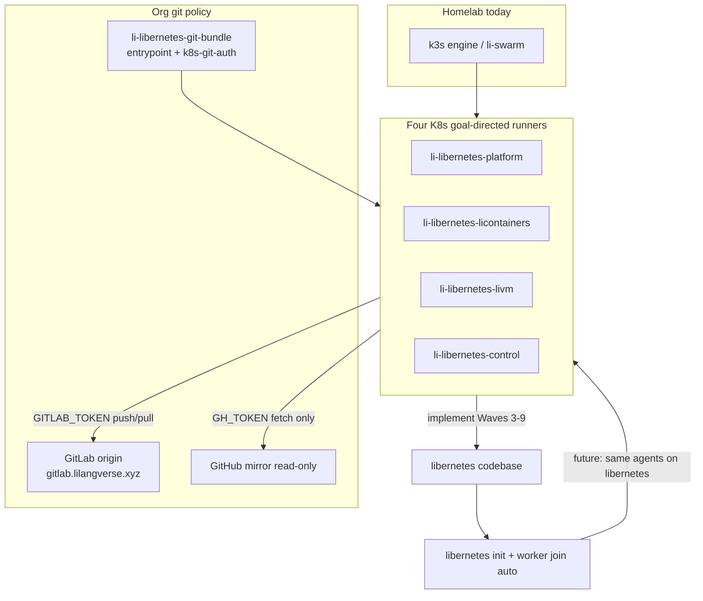
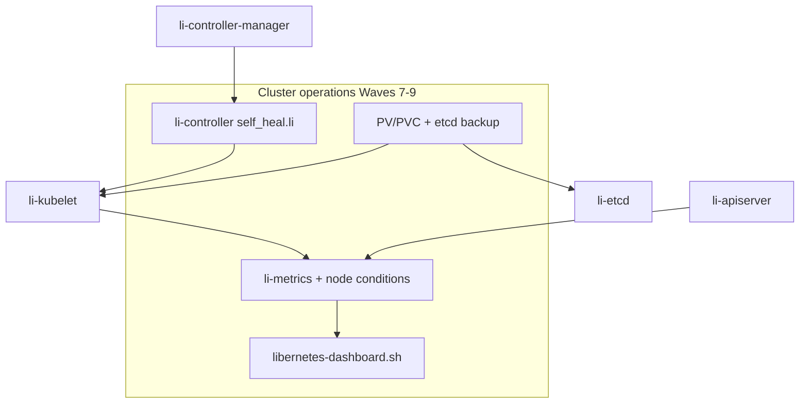

# libernetes delivery roadmap

Standalone rendered view of delivery waves, K8s runner topology, and cluster-operations scope.

**Canonical detail:** [libernetes/master-plan.md](libernetes/master-plan.md)  
**Full plan (Cursor):** `libernetes_master_plan_bc3b669a.plan.md` in Cursor plans

---

## K8s runner waves (W0–W10+)

Each wave gates four parallel tracks (platform, licontainers, livm, control). Wave 3 is wired into completion gates; Waves 4–9 ship gate scripts but stay unwired until the prior wave merges.

```mermaid
flowchart LR
  subgraph done [Merged]
    W0[Wave 0<br/>specs + easy-setup]
    W1[Wave 1<br/>package scaffolds]
    W2[Wave 2<br/>etcd CRI livm APIs]
  end

  subgraph dist [Distributed workloads]
    W3[Wave 3 ACTIVE<br/>libernetes-run-local]
    W4[Wave 4<br/>multi-node join]
    W5[Wave 5<br/>scheduler dispatch]
    W6[Wave 6<br/>bench + e2e]
  end

  subgraph cluster [Cluster operations]
    W7[Wave 7<br/>self-healing]
    W8[Wave 8<br/>reboot persistence]
    W9[Wave 9<br/>metrics + dashboard]
  end

  W10[Wave 10+<br/>conformance + k3s cutover]

  W0 --> W1 --> W2 --> W3 --> W4 --> W5 --> W6 --> W7 --> W8 --> W9 --> W10
```

| Wave | Focus | Active gate | Status |
|------|-------|-------------|--------|
| 0–2 | Docs, stubs, etcd/CRI/livm foundations | merged to `main` | **merged** |
| 3 | Single-node runnable (`libernetes-run-local`, daemons, kubelet sync) | `check-libernetes-*-wave3-gate.sh` | **ACTIVE** |
| 4 | Multi-node registry + worker join persistence | scripted, unwired | pending |
| 5 | Scheduler + kubelet workload dispatch | scripted, unwired | pending |
| 6 | `li-cluster-bench` + distributed e2e | scripted, unwired | pending |
| 7 | ReplicaSet/Node self-healing (`self_heal.li`) | scripted, unwired | pending |
| 8 | PV/PVC + etcd backup + reboot recovery | scripted, unwired | pending |
| 9 | `li-metrics` + node conditions + dashboard | scripted, unwired | pending |
| 10+ | Conformance, homelab k3s cutover, LiOS native nodes | — | future |

### Active K8s runners (Wave 3)

| Deployment | Branch | Active gate |
|------------|--------|-------------|
| `li-libernetes-platform` | `cursor/libernetes-platform` | `check-libernetes-platform-wave3-gate.sh` |
| `li-libernetes-licontainers` | `cursor/libernetes-licontainers` | `check-libernetes-licontainers-wave3-gate.sh` |
| `li-libernetes-livm` | `cursor/libernetes-livm` | `check-libernetes-livm-wave3-gate.sh` |
| `li-libernetes-control` | `cursor/libernetes-control` | `check-libernetes-control-wave3-gate.sh` |

---

## Bootstrap, workers, and GitLab git policy

Goal-directed K8s workers on the homelab engine cluster implement Waves 3–9 until libernetes replaces k3s.

Future: same agent workloads run on libernetes with `WorkerProfile` scheduling instead of hardcoded `nodeSelector: engine`.

---

## Cluster operations (Waves 7–9)

Waves 7–9 extend the control plane with self-healing, persistence, and observability. See [cluster-operations.md](libernetes/cluster-operations.md) for full detail.

| Wave | Deliverable | Outcome |
|------|-------------|---------|
| **7** | ReplicaSet/Node controllers — `self_heal.li` | Self-healing replicas; reschedule on `NodeNotReady` |
| **8** | PV/PVC + etcd backup + reboot recovery | Workload storage survives node reboot |
| **9** | `li-metrics` + node conditions + `libernetes-dashboard` | Homelab cluster monitoring and dashboard |

---

## Related docs

- [libernetes/master-plan.md](libernetes/master-plan.md) — condensed master plan in-repo
- [libernetes/distributed-workloads.md](libernetes/distributed-workloads.md) — Waves 3–6 distributed track
- [libernetes/cluster-operations.md](libernetes/cluster-operations.md) — Waves 7–9 ops track
- [libernetes/easy-setup.md](libernetes/easy-setup.md) — `libernetes init` / worker join UX
