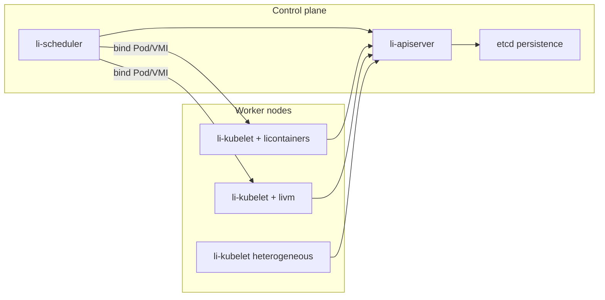

# libernetes distributed workloads

How libernetes runs work **across nodes** — from single-node stubs to multi-node dispatch and benchmarks.

## Current baseline (Wave 0–2 merged)

- Package scaffolds, gate scripts, and Li stub APIs exist on `main`.
- Homelab still runs **k3s**; goal-directed K8s workers build the `lic` repo.
- **No live libernetes cluster** yet — completion gates verify files and selftests, not production traffic.

## Target: unified distributed model



| Workload | Runtime | Node requirement | Scheduler signal |
|----------|---------|------------------|------------------|
| Container pod | licontainers / CRI | cgroups v2, namespaces | `libernetes.io/container=true` |
| VM (Linux/Windows/…) | livm | `/dev/kvm` | `libernetes.io/kvm=true` |
| Mixed node | both | auto join `--profile auto` | WorkerProfile + labels |

## Implementation waves (K8s runner)

Goal-directed workers on homelab `engine` implement one wave at a time. Completion gate calls the **active** wave script only; later wave scripts ship early but stay unwired until the prior wave merges.

| Wave | Theme | Exit criteria |
|------|-------|---------------|
| **3** | **Single-node runnable stack** | `libernetes init` invokes `libernetes-run-local.sh`; kubelet sync stub; licontainers/livm daemons; leader + informer packages |
| **4** | **Multi-node registry** | Worker join writes kubelet config; node registry + cluster state; remote CRI/VM stubs |
| **5** | **Dispatch** | Scheduler binds workloads to nodes; kubelet pod/VMI sync; cross-node integration selftest |
| **6** | **Performance + e2e** | `li-cluster-bench` harness; pod churn gate; distributed workload e2e |
| **7** | **Self-healing** | ReplicaSet + Node controllers; restart policies; `self_heal.li` integration |
| **8** | **Reboot persistence** | PV/PVC stubs, etcd backup, volume/disk persist, `reboot_recovery.li` |
| **9** | **Monitoring + dashboard** | `li-metrics`, node conditions, `libernetes-dashboard.sh`, runtime metrics |

After Wave 9: conformance subset, homelab cutover from k3s (Phase 7 in master plan). See [cluster-operations.md](cluster-operations.md).

## Wave 3 deliverables (active)

### Platform (`cursor/libernetes-platform`)

- `packages/li-leader/` — lease election stub
- `packages/li-json/src/lib.li` — API serialization stub
- `packages/li-watch/src/informer.li` — cache/informer stub

### Control (`cursor/libernetes-control`)

- `scripts/libernetes-run-local.sh` — start or dry-run local stack
- `packages/li-libernetes-kubelet/src/sync.li` — node sync loop stub
- `libernetes init` calls run-local (dry-run OK in Wave 3)

### licontainers (`cursor/libernetes-licontainers`)

- `src/cri/serve.li` — CRI serve stub
- `src/runtime/cri_socket.li` — local Unix socket stub

### livm (`cursor/libernetes-livm`)

- `src/hypervisor/lios_probe.li` — Li-native hypervisor probe (production path; KVM is dev-only)

## Wave 4 — multi-node

- `packages/li-libernetes-core/src/node_registry.li`
- `packages/li-libernetes-core/src/cluster_state.li`
- Worker join writes `/etc/libernetes/kubelet.conf`
- `remote.li` runtime stubs for cross-node CRI/VM
- Integration: `multi_node_join.li`

## Wave 5 — dispatch

- `scheduler/src/schedule.li` — bind pod → node
- `kubelet/src/pod_sync.li` — reconcile assigned workloads
- `workload/exec.li` in licontainers + livm
- Integration: `distributed_pod.li`

## Wave 6 — perf + e2e

- `packages/li-cluster-bench/`
- `scripts/bench-libernetes-pod-churn-gate.sh`
- `benchmarks/libernetes/README.md`
- E2E: `distributed_workload.li`

## Wave 7 — self-healing

- `packages/li-libernetes-controller/` — ReplicaSet + Node controller stubs
- licontainers/livm restart policy modules
- Integration: `self_heal.li`

## Wave 8 — persistence across reboots

- `packages/li-pv/`; `scripts/libernetes-etcd-backup.sh`; `libernetes-reboot-recovery.sh`
- licontainers volume persist; livm disk persist
- Integration: `reboot_recovery.li`

## Wave 9 — monitoring + dashboard

- `packages/li-metrics/`; kubelet `node_status.li`
- `scripts/libernetes-dashboard.sh`; `docs/libernetes/cluster-operations.md`
- Runtime metrics in licontainers + livm

## Testing philosophy

| Layer | What “pass” means in Waves 3–5 | Real cluster |
|-------|--------------------------------|--------------|
| Gate scripts | Required files + grep checks | CI on every PR |
| Li selftests | Stub tag functions return expected values | Same as Wave 0–2 |
| Integration | Simulated multi-node in-process | Wave 4–5 |
| e2e / bench | Harness exists; numbers vs k3s | Wave 6+ on homelab |

## K8s runner operation

```bash
export KUBECONFIG=~/.kube/config-homelab
kubectl -n li-swarm rollout restart deploy/li-libernetes-platform deploy/li-libernetes-licontainers deploy/li-libernetes-livm deploy/li-libernetes-control
kubectl -n li-swarm logs -f deploy/li-libernetes-control
```

Workers should report `GOAL_INCOMPLETE` until the active wave gate passes, then `GOAL_COMPLETE`.

See [master-plan.md](master-plan.md) and [implementation-workers.md](implementation-workers.md).
