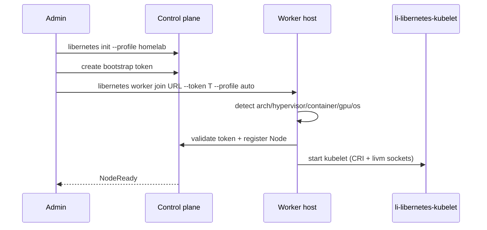

# libernetes worker join flow

Wave 1 documents the heterogeneous worker registration path. Scripts are scaffolds
(`scripts/libernetes-worker-join.sh`) that validate inputs, auto-discover labels,
and print planned bootstrap steps.

## Prerequisites

1. Control plane initialized — see [easy-setup.md](easy-setup.md):

   ```bash
   libernetes init --profile homelab --bind-address 0.0.0.0
   export KUBECONFIG=/etc/libernetes/admin.conf
   ```

2. Bootstrap join token issued by the control plane (Wave 1: placeholder until
   `li-libernetes-apiserver` bootstrap API lands).

3. Worker host can reach the apiserver URL on port `6443`.

## Join command

```bash
libernetes worker join https://cp.homelab.lan:6443 \
  --token <bootstrap-token> \
  --profile auto
```

| Flag | Purpose |
|------|---------|
| `<cp-url>` | apiserver endpoint |
| `--token` | one-time bootstrap token |
| `--profile` | `auto` (default) or a [WorkerProfile](crd-workerprofile.yaml) name |

## Auto-discovery

On join, the worker script probes local hardware and applies default labels —
no manual `kubectl label` for the baseline set.

| Signal | Label |
|--------|-------|
| `uname -m` | `libernetes.io/arch` |
| LiOS kernel + `li-hypervisor` available | `libernetes.io/hypervisor=li-native` |
| cgroups v2 (`cgroup.controllers`) | `libernetes.io/container=true` |
| `nvidia-smi` or `/dev/vfio` | `libernetes.io/gpu=true` |
| `/etc/lios-release` | `libernetes.io/os=lios` |

> **Production label:** `libernetes.io/hypervisor=li-native` — not `kvm`. KVM/QEMU cited as industry learn-from only; `/dev/kvm` is not probed on join.

Profiles such as `vm-gpu-pool` add scheduling constraints on top of discovered
labels. See [heterogeneous-workers.md](heterogeneous-workers.md).

## Sequence



## Verify

```bash
libernetes doctor
kubectl get nodes -o wide
kubectl get nodes -o jsonpath='{range .items[*]}{.metadata.name}{"\t"}{.metadata.labels}{"\n"}{end}'
```

Expected: worker node shows `libernetes.io/*` labels matching local capabilities.

## Related

- [easy-setup.md](easy-setup.md) — homelab init
- [heterogeneous-workers.md](heterogeneous-workers.md) — WorkerProfile CRD
- [architecture.md](architecture.md) — control vs data plane
