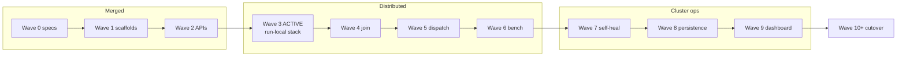

# libernetes master plan (Wave 0–9)

**Rendered roadmap (diagrams + wave table):** [../libernetes-roadmap.md](../libernetes-roadmap.md)

Canonical detailed plan: Cursor plan `libernetes_master_plan_bc3b669a.plan.md`.

## Delivery waves (K8s runners)



| Wave | Focus | Active gate |
|------|-------|-------------|
| 0–2 | Docs, stubs, etcd/CRI/livm foundations | merged to `main` |
| 3 | Single-node runnable (`libernetes-run-local`, daemons, kubelet sync) | `check-libernetes-*-wave3-gate.sh` |
| 4 | Multi-node registry + worker join persistence | scripted, unwired |
| 5 | Scheduler + kubelet workload dispatch | scripted, unwired |
| 6 | `li-cluster-bench` + distributed e2e | scripted, unwired |
| 7 | ReplicaSet/Node self-healing (`self_heal.li`) | scripted, unwired |
| 8 | PV/PVC + etcd backup + reboot recovery | scripted, unwired |
| 9 | `li-metrics` + node conditions + dashboard | scripted, unwired |

## Pillars

1. **libernetes** — 100% Li Kubernetes control plane (containers + VMs)
2. **licontainers** — OCI/CRI runtime
3. **livm** — multi-OS VM runtime (KVM + LiOS hypervisor)
4. **LiOS** — kernel ABI + native hypervisor (parallel track)

## Easy setup (product requirement)

```bash
libernetes init --profile homelab
libernetes worker join https://cp:6443 --token <token> --profile auto
```

Auto-discover: arch, KVM, GPU, container/VM runtimes. See [easy-setup.md](easy-setup.md) and [heterogeneous-workers.md](heterogeneous-workers.md).

## Goal-directed workers

| Track | Branch | Goal file |
|-------|--------|-----------|
| platform | `cursor/libernetes-platform` | `data/goal-directed-sprints/libernetes-platform.md` |
| licontainers | `cursor/libernetes-licontainers` | `data/goal-directed-sprints/libernetes-licontainers.md` |
| livm | `cursor/libernetes-livm` | `data/goal-directed-sprints/libernetes-livm.md` |
| control | `cursor/libernetes-control` | `data/goal-directed-sprints/libernetes-control.md` |
