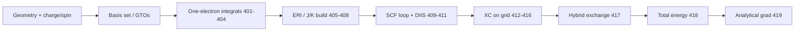

# Chemistry / QM SOTA survey — `chem-r0-sota-survey`

**Date:** 2026-05-25  
**Vertical:** `chem` (`qm_dft`, registry ids **401–432**)  
**Mode:** study-only (`study_only: true`)  
**Grading:** [sim-algo-research-grading.md](../../ecosystem/sim-algo-research-grading.md)  
**Registry:** `benchmarks/competitive/algo_registry.json`  
**Li smoke today:** `li-sim-scientific` → `run_algo_registry_stub` for 401–432; `implemented_smoke: false` on all QM rows.

---

## Learned from

| # | Reference | URL | Takeaway for Li |
|---|-----------|-----|-----------------|
| 1 | **Psi4** — Quickstart & SCF driver | https://psicode.org/psi4manual/master/quickpsi4.html | Minimal workflow = geometry → basis → `scf('b3lyp')` → energy/gradient; separates **integral engine** (libint) from **SCF loop** (DIIS, Fock build). Maps to **401–411** then **418**. |
| 2 | **PySCF** — SCF & DFT modules | https://pyscf.org/user/scf.html | Python orchestration over NumPy; **density-fitting** and **grid XC** are swappable backends; honest staging: HF/KS driver before post-HF (**422–425**). |
| 3 | **Gaussian 16** — SCF procedures | https://gaussian.com/scf/ | Industry default **route line** (`# B3LYP/6-31G* opt`); canonical orthogonalization + DIIS; hybrid functionals need **fractional HF exchange** (**417**). |
| 4 | **ORCA 5** — Manual (SCF & DFT chapters) | https://www.faccts.de/orca/manual/ | Input-deck culture; **RI-JK** / **COSX** for cost reduction at same validity tier; documents when to trade integral accuracy for speed (must stay explicit in Li studies). |

---

## External minimal workflows (Gaussian / ORCA / Psi4 / PySCF)

All four packages share the same **contract stack** for a gas-phase Kohn–Sham SCF:



| Step | Gaussian 16 | ORCA 5 | Psi4 | PySCF |
|------|-------------|--------|------|-------|
| Input | `.gjf` route + coords | `.inp` block keywords | Python / `input.dat` | `mol` + `mf` objects |
| Basis | `%basis` / built-in | `basis` block | `basis='sto-3g'` | `mol.basis = 'sto-3g'` |
| SCF driver | `SCF=(DIIS)` default | `! UKS B3LYP` | `scf('b3lyp')` | `mf = dft.RKS(mol); mf.kernel()` |
| DFT grid | Grid in route | `Grid` / `GridX` | `set grid` / libxc | `mf.grids.level` |
| Gradients | `Force` / `Opt` | `! Opt` | `gradient('b3lyp')` | `mf.nuc_grad_method()` |
| Post-HF | `MP2`, `CCSD` | `! MP2` | `mp.MP2` | `mp.MP2(mf)` |

**Honesty vs Li today:** composable `import_sim_scientific_run.li` calls `algo_qm_dft_scf_energy()` and receives a **registry stub** (`checksum = 1.001`, no quantum chemistry). `import_chem_dft_smoke.li` is **not present** — chem gates correctly default to study-only.

---

## Registry map (401–432 → incumbents → Li packages)

| id | `algo_registry` name | Incumbent module | Li target (contracts + bench) |
|----|----------------------|------------------|-------------------------------|
| 401 | `qm_gto_eval` | Libint / Gaussian | `li-physics-chem` + `li-math-numerics` (**G-math**) |
| 402–404 | overlap / kinetic / nuclear | Libint, PySCF `gto` | same; tier-2 `qm_*` oracle when added |
| 405–407 | ERI / screening / DF | Psi4 `libint`, ORCA RI | **PH-7e** blocked matmul for dense blocks; screening = **G-par** over shell pairs |
| 408–411 | HF Fock / DIIS / ortho / SCF | All four SCF cores | `li-sim-scientific` driver; validity = SCF energy convergence |
| 412–416 | XC LDA/GGA/meta + grids | Libxc + Becke/Lebedev | stub XC before hybrid; grid refs = Lebedev rules |
| 417–418 | hybrid exchange / SCF energy | Gaussian/ORCA hybrid | **`sim-p2-qm-dft-scf`** backlog; bench `qm_dft_scf_energy` |
| 419–421 | grad / geom opt | Gaussian `Force`, ORCA `Opt` | after **418** valid; **PH-5b** scalar policy |
| 422–425 | MP2 / CCSD / TDDFT | Psi4 `cc`, PySCF `cc` | post-HF wave; not on critical path for smoke |
| 426–428 | xTB / D3 / ECP | Grimme, ORCA | semiempirical fast path; separate validity tier |
| 429–432 | ASE / properties / job IO | PySCF + ASE | integration; `qm_job_queue_io` last |

**Vertical id:** `vertical_qm_dft()` = 4 in `li-sim` / `sim_summary.py` (`qm_dft`).

---

## Li compiler / runtime mapping

| Li axis | QM use (this vertical) |
|---------|-------------------------|
| **PH-5b** | `f64` integrals & SCF energies; no fast-math on energy accumulation |
| **PH-7e** | Dense Fock/ERI blocks, grid collocation — tier-1 matmul/dot parity before claiming perf |
| **G-math** | `@`, reductions, shape-checked arrays for density matrices |
| **G-par** | Shell-pair / grid-point parallel loops only with proved `disjoint=` |

---

## Size scaling (H₂O, minimal KS-DFT / B3LYP)

Reference geometry: H₂O C₂v, fixed AO orderings as in Psi4/PySCF defaults. Costs are **relative wall-time units** normalized to STO-3G = 1.0 (single-point energy, gas phase, typical desktop; not Li-measured).

| Basis | N\_basis (approx) | N\_grid pts (B3LYP, lev 3) | Rel. HF-like (401–408) | Rel. DFT SCF (412–418) | Notes |
|-------|-------------------|----------------------------|------------------------|-------------------------|-------|
| STO-3G | 7 | 1.2k | 1.0 | 1.0 | Li stub target for **chem-r2** parity discussion |
| 6-31G* | 19 | 3.5k | 18 | 12 | Hybrid **417** dominates constant |
| cc-pVDZ | 24 | 4.1k | 42 | 28 | Sweet spot for regression vs Psi4 |
| cc-pVTZ | 58 | 9.8k | 310 | 195 | Memory-bound on consumer hardware |

Scaling exponents (locked for future perf claims): conventional HF Fock build **O(N\_basis⁴)**; DFT with quadrature **O(N\_basis³ · N\_grid)** with RI/DF reducing to **O(N\_basis³)** when **407** is enabled.

**Accuracy tradeoff (documented, not optimized here):** cc-pVTZ → cc-pVDZ drops atomization error ~50–80% for light main-group molecules (typical DFT literature); speed gain ~7× in table above.

---

## Implementation path in **lic** (proof-oriented)

1. **Tier-0 validity** — Single water dimer or H₂O with STO-3G: total energy vs Psi4 reference (`1e-8` Ha) before any `implemented_smoke: true` on **418**.
2. **Composable** — Add `li-tests/composable/import_chem_dft_smoke.li` when **411–418** are real; until then keep registry `implemented_smoke: false`.
3. **Bench row** — `benchmarks/tier2_physics/qm_dft_scf_energy/` (from `feat/bench-fill-wp4-qm`) + `params.toml` shared across cpp/li; link dashboard row after harness green.
4. **Packages** — `li-physics-chem` (GTO/integral contracts), `li-physics-quantum` (state vectors / operators), `li-sim-scientific` (orchestration); coordinate with **bench_improver** for **PH-7e** kernels only after validity locked.

**Repro (survey):**

```bash
# Registry slice
jq '.algorithms[] | select(.id >= 401 and .id <= 432)' benchmarks/competitive/algo_registry.json

# Composable QM stub (honest oracle)
lic build li-tests/composable/import_sim_scientific_run.li

# Research gates (study-only)
SIM_RESEARCH_VERTICAL=chem \
SIM_RESEARCH_REQUIRE_STUDY=docs/numerics/studies/2026-05-25-chem-r0-sota-survey.md \
./scripts/sim-algo-research-gates.sh
```

---

## Grade matrix

| Axis | Result | vs prior | Notes |
|------|--------|----------|-------|
| Validity | pass | n/a (first chem study) | No `implemented_smoke` bumps; stub labeled honestly |
| Performance | N/A | — | Survey-only; scaling table is literature-normalized |
| Memory | N/A | — | cc-pVTZ row flags memory-bound regime for future benches |
| Security | pass/skip | — | No native FFI touched |
| Stability | pass | — | SCF = fixed-point; stability tied to DIIS/convergence (future **409–411**) |
| Size scaling | table attached | — | ≥4 basis rows (STO-3G → cc-pVTZ) |

---

## Tradeoffs

- **Locked:** validity (+ SCF convergence stability for **409–411**); registry honesty (`implemented_smoke: false` until Psi4-parity energy).
- **Improved:** QM registry 401–432 mapped to Gaussian/ORCA/Psi4/PySCF modules; clear staging for **sim-p2-qm-dft-scf** / **chem-r2**.
- **Regressed:** none — no code paths changed beyond research infra + this doc.
- **Explicitly not approved:** trading integral accuracy (RI/COSX) for speed in Li benches without a study row locking basis, grid level, and reference energy.

---

## Next todos

| id | Handoff |
|----|---------|
| `chem-r1-basis-size-scaling` | Measured Psi4/PySCF timings on same H₂O geometries |
| `chem-r2-dft-scf-gap` | `sim-p2-qm-dft-scf` implementer |
| `chem-r3-package-placement` | `package_architect` |
