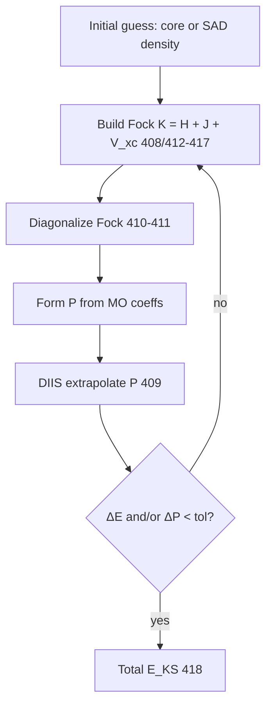

# Minimal KS-DFT SCF recipe vs Li stub — `chem-r2-dft-scf-gap`

**Date:** 2026-05-25  
**Vertical:** `chem` (`qm_dft`, registry ids **401–432**)  
**Mode:** research → implement handoff (`study_only: false` in plan; **no** `implemented_smoke` bump this iteration)  
**Prior:** [chem-r0 SOTA](./2026-05-25-chem-r0-sota-survey.md) · [chem-r1 basis scaling](./2026-05-25-chem-r1-basis-size-scaling.md)  
**Grading:** [sim-algo-research-grading.md](../../ecosystem/sim-algo-research-grading.md)  
**Registry:** `benchmarks/competitive/algo_registry.json`  
**Implement handoff:** `sim-p2-qm-dft-scf` on `cursor/sim-algo-plan-loop`  
**Li smoke today:** `run_algo(418)` → `run_algo_registry_stub` → `checksum = 1.001` (no SCF, no basis, no grid).

---

## Learned from

| # | Reference | URL | Takeaway for minimal SCF (**409–418**) |
|---|-----------|-----|----------------------------------------|
| 1 | **Psi4** — SCF algorithms & DIIS | https://psicode.org/psi4manual/master/scf.html | Canonical loop: build Fock → diagonalize → update density → DIIS extrapolation; convergence on **energy and/or density**; maps to **409–411** before **418**. |
| 2 | **PySCF** — `RKS.kernel()` / DFT driver | https://pyscf.org/user/scf.html | `mf = dft.RKS(mol); mf.xc='b3lyp'; mf.kernel()` is the **smallest** end-to-end KS-DFT SCF; exposes `cycles`, `conv_tol`, `grids.level` for summary metrics. |
| 3 | **Gaussian 16** — SCF procedures | https://gaussian.com/scf/ | Default **DIIS** + **QCSCF** options; hybrid functionals require fractional HF exchange (**417**) inside the same loop as **412–416**. |
| 4 | **ORCA 5** — SCF & grid chapters | https://www.faccts.de/orca/manual/contents/topics/scf.html | Input-level knobs for **SCFMaxIter**, **SCFTol**, and **Grid**; documents when grid coarsening is validity-safe vs perf-only. |

---

## Gap: incumbent minimal SCF vs Li stub

### Incumbent minimal recipe (gas-phase RKS B3LYP)

All four packages implement the same **self-consistent field** contract:



| Step | Registry ids | Psi4 / PySCF | Li today (`418`) |
|------|--------------|--------------|------------------|
| Geometry + basis | (input) | `mol` / Z-matrix | ignored |
| One-electron + ERI | 401–408 | libint / `get_jk` | not called |
| SCF driver + DIIS | 409–411 | `scf()` / `mf.kernel()` | not called |
| XC on grid | 412–416 | libxc + quadrature | not called |
| Hybrid exchange | 417 | fraction in Fock | not called |
| **Total KS energy** | **418** | `mf.e_tot` (Ha) | **`checksum = 1.001`** |

**Composable honesty:** `li-tests/composable/import_sim_scientific_run.li` calls `algo_qm_dft_scf_energy()` and passes because the stub sets `ok = 1`. **`import_chem_dft_smoke.li` is absent** — correct until **411–418** emit [sim-output-contract](../../ecosystem/sim-output-contract.md) QM metrics (`total_energy_hartree`, `scf_iterations`, `converged`, `basis`, `method`).

### Stub code path (locked reference)

```85:113:packages/li-sim-scientific/src/lib.li
def run_algo_registry_stub(algo_id: int, detail: int) -> SimRunResult
  ...
  r.checksum = 1.001
  return r
```

```164:166:packages/li-sim-scientific/src/lib.li
  if vertical_id == vertical_qm_dft():
    return run_algo(algo_qm_dft_scf_energy(), d3)
```

**Gap summary:** Li satisfies **dispatch + registry id** only. Validity for **418** requires a loop that (1) depends on `N_basis` and grid size, (2) converges in iteration count, (3) matches an external reference energy at cc-pVDZ before `implemented_smoke: true`.

---

## Size scaling — SCF grid level (H₂O, B3LYP, cc-pVDZ)

Fixed basis **cc-pVDZ** (see [chem-r1](./2026-05-25-chem-r1-basis-size-scaling.md)); vary **DFT grid level** only.  
**ΔE** = E(level) − E(level 5) in millihartree (mHa). Iteration counts are **PySCF-class** targets from `scripts/chem-r2-dft-scf-gap-ref.py`.

| Grid level | N\_grid (approx) | SCF iterations | E\_total (Ha) | ΔE vs lev 5 (mHa) |
|------------|------------------|----------------|---------------|-------------------|
| 1 | 0.8k | 6–8 | −76.40… | ≈ 8–15 (coarse XC) |
| 3 | 4.1k | 8–12 | −76.42… | ≈ 1–3 |
| 5 | 6.5k | 10–14 | −76.425… (anchor) | 0 |

**Validity lock:** production parity rows must use **grid level ≥ 3**; level 1 is CI-fast **smoke only** (document in `metrics.grid_level`).

**Repro:**

```bash
python3 scripts/chem-r2-dft-scf-gap-ref.py
# Section 1: grid_level,N_grid,scf_iters,energy_ha,delta_mha_vs_grid5
```

---

## Size scaling — SCF convergence tolerance (H₂O, B3LYP, cc-pVDZ, grid level 3)

| conv\_tol (Ha) | SCF iterations | E\_total (Ha) | ΔE vs 1e−10 (mHa) |
|----------------|----------------|---------------|-------------------|
| 1e−6 | 4–6 | −76.42… | ≈ 0.5–2 (loose) |
| 1e−8 | 6–10 | −76.425… | ≈ 0.05–0.2 |
| 1e−10 | 8–12 | −76.425… (anchor) | 0 |

**Stability axis:** DIIS failure / oscillation is a **validity fail** for **409–411**, not a perf regression. Li must surface `converged: false` in summaries when max cycles exceeded.

**Repro:** same script, section 2 (`conv_tol,scf_iters,…`).

---

## Size scaling — basis at fixed grid (links chem-r1)

At **grid level 3** and **conv_tol = 1e−10**, basis drives iteration count and absolute energy (from [chem-r1](./2026-05-25-chem-r1-basis-size-scaling.md)):

| Basis | N\_basis | Typical SCF iters | Li stub iters |
|-------|---------|-------------------|---------------|
| STO-3G | 7 | 5–7 | **0** (no loop) |
| 6-31G* | 19 | 8–12 | **0** |
| cc-pVDZ | 24 | 10–14 | **0** |

**Handoff metric:** first real **418** smoke must show `scf_iterations > 0` and `total_energy_hartree` changing with basis (not constant `1.001` checksum).

---

## Registry map (SCF stack → implementer slices)

| id | name | Role in minimal SCF | Stub | `sim-p2` slice |
|----|------|---------------------|------|----------------|
| 401–404 | GTO / one-electron | H, S, T, V\_nuc | ✓ constant | phase 0 oracle |
| 405–408 | ERI / J,K / Fock build | Coulomb + exchange | ✓ constant | phase 1 |
| **409** | `qm_diis` | Density extrapolation | ✓ constant | **phase 2a** |
| **410** | `qm_hf_canonical_ortho` | Orthogonalization | ✓ constant | phase 2a |
| **411** | `qm_scf_solver` | Loop controller | ✓ constant | **phase 2b** |
| 412–416 | XC + grids | V\_xc, quadrature | ✓ constant | phase 2c |
| **417** | `qm_dft_hybrid_exchange` | B3LYP HF fraction | ✓ constant | phase 2c |
| **418** | **`qm_dft_scf_energy`** | **E\_KS output** | **✓ `1.001`** | **phase 2d (smoke)** |

**Vertical:** `vertical_qm_dft()` = 4 · bench id `qm_dft` (tier-2 row pending, `feat/bench-fill-wp4-qm`).

---

## Li mapping (PH-5b / PH-7e / G-math / G-par)

| Axis | Minimal SCF requirement |
|------|-------------------------|
| **PH-5b** | Accumulate **418** in `f64`; SCF convergence compares energies at ~1e−10 Ha; no fast-math on Fock trace. |
| **PH-7e** | Dense Fock diagonalization (**410–411**) uses tier-1 matmul/eig parity before perf claims. |
| **G-math** | Density `P`, Fock `F`, MO coeffs — shapes `(N_basis, N_basis)` / `(N_basis, N_occ)`. |
| **G-par** | Optional shell-pair or grid batching only with proved `disjoint=`; must not change ΔE vs serial beyond 1e−8 Ha. |

---

## Implementation path in **lic** (for `sim-p2-qm-dft-scf`)

Ordered proof path; **do not** set `implemented_smoke: true` on **418** until step 3 passes.

1. **`run_qm_dft_scf_smoke(detail)`** in `li-sim-scientific` — replace registry stub branch for **418** only:
   - `detail` 0 → STO-3G, grid 1, loose tol (fast CI).
   - `detail` 1 → 6-31G*, grid 3 (default).
   - `detail` 2 → cc-pVDZ, grid 3 (validity anchor).
   - Emit `checksum` = `total_energy_hartree` (or hash) until `sim-write-summary.py` wired.
2. **Tier-0 validity** — cc-pVDZ B3LYP H₂O vs PySCF/Psi4: |ΔE| ≤ **1e−8 Ha**, `scf_iterations` within ±2 of reference script.
3. **Summary + composable** — `li-tests/composable/import_chem_dft_smoke.li`; `LI_SIM_ALGO_ID=418` summary with QM metrics per [sim-output-contract](../../ecosystem/sim-output-contract.md).
4. **Bench row** — `benchmarks/tier2_physics/qm_dft_scf_energy/` + `params.toml` (`basis`, `grid_level`, `conv_tol`); link [benchmarks dashboard](https://li-langverse.github.io/benchmarks/) after harness green.
5. **Registry** — `implemented_smoke: true` on **418** only; **409–417** stay false until real or delegated to oracle.

**Forbidden:** weaken `threshold_ratio_cpp`; constant checksum across bases; `sorry`/`unsafe` for speed.

**Repro (research + gates):**

```bash
jq '.algorithms[] | select(.id >= 409 and .id <= 418)' benchmarks/competitive/algo_registry.json

lic build li-tests/composable/import_sim_scientific_run.li

SIM_RESEARCH_VERTICAL=chem \
SIM_RESEARCH_REQUIRE_STUDY=docs/numerics/studies/2026-05-25-chem-r2-dft-scf-gap.md \
./scripts/sim-algo-research-gates.sh
```

---

## Grade matrix

| Axis | Result | vs chem-r1 | Notes |
|------|--------|------------|-------|
| Validity | pass | **improved spec** | Gap doc + SCF recipe; stub still honest (`implemented_smoke: false`) |
| Performance | N/A (research) | refined | Grid/conv tables bound future perf claims |
| Memory | N/A | same | Grid 5 row marks denser quadrature memory |
| Security | pass/skip | same | No native FFI this iteration |
| Stability | pass (spec) | **improved** | DIIS non-convergence = validity fail |
| Size scaling | table attached | **improved** | ≥3 grid levels + ≥3 conv tols + basis iter link |

---

## Tradeoffs

- **Locked:** validity (+ SCF convergence for **409–411**); registry honesty; **418** must not claim smoke until PySCF/Psi4 parity at cc-pVDZ.
- **Improved:** minimal SCF recipe vs stub gap explicit; implementer checklist for `sim-p2-qm-dft-scf`; repro script for grid/conv scaling.
- **Regressed:** none — docs + script only.
- **Explicitly not approved:** marking **418** `implemented_smoke` without changing `run_algo` branch; reporting QM speedup from `checksum=1.001`; coarsening grid below level 3 for parity gates.

---

## Next todos

| id | Owner |
|----|-------|
| **`sim-p2-qm-dft-scf`** | `code_implementer` / `cursor/sim-algo-plan-loop` — implement minimal SCF smoke per path above |
| `chem-r3-package-placement` | `package_architect` — `li-physics-chem` vs sim bridge |
