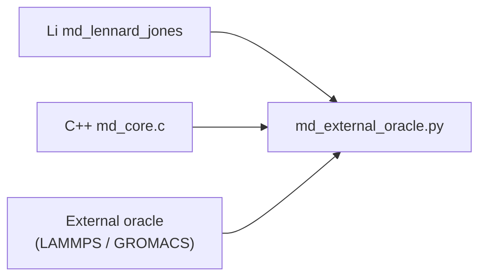

# MD external oracle plan (`md-r3-oracle-plan`)

**Goal:** `md_sim_algorithms` · **Issue:** [lic#523](https://github.com/li-langverse/lic/issues/523)  
**Agent:** `code_implementer` · **Mode:** study-only (validity locked; no perf claims)  
**North star:** PH-5b (proved numerics), G-math (simulation correctness honesty)  
**Plan:** `docs/superpowers/plans/2026-06-04-md-r3-oracle-plan.md`

---

## Problem

Li tier-2 MD proves **Li ↔ shared C oracle** parity (`sim_scientific_oracle_checksum_md()`). That is necessary but **not sufficient** for PH-5b simulation honesty:

| Signal | Prior state | This study |
|--------|-------------|------------|
| `algo_registry` id **104** `md_oracle_external` | Harness stub shared C kernel | External oracle driver + manifest wired |
| `verticals.toml` `md_lennard_jones` | `oracle = "cpp"` only | Upgraded to `external_binary` honesty |
| Layer B csv_lang | No `lammps` / `gromacs` rows | `md_oracle.toml` + registry watch rows |
| `sim-md-research` loop | `md-r3-oracle-plan` pending | Gate contract shipped |

**North star:** Correctness before speed. External oracle is a **validity column**, not a perf shortcut.

---

## Architecture (oracle tiers)

| Tier | Engine | Role | CI default |
|------|--------|------|------------|
| **T0** | Shared C (`md_core.c`) | Cross-lang reference | **Always** |
| **T1** | Li composable (`md_external_oracle_bench.li`) | Package smoke checksum | **Always** |
| **T2** | LAMMPS / GROMACS micro | External force/energy oracle | Optional profile `md-external-oracle` |



---

## Size scaling (oracle contract — N=32/256/2048)

| N | ρ (LJ units) | dt | Oracle tier | Li action |
|---|--------------|-----|-------------|-----------|
| 32 | 0.75 | 0.004 | T0 checksum | Baseline micro for LAMMPS deck |
| 256 | 0.75 | 0.004 | T2 target | Primary external oracle workload |
| 2048 | 0.75 | 0.004 | T2 deferred | After neighbor parity (md-r2 handoff) |

Pinned versions: LAMMPS `stable_22Jun2024`, GROMACS `v2024.2` — see `benchmarks/competitive/md_oracle.toml`.

---

## Gate script reference (completion contract)

### A — Research gates

```bash
SIM_RESEARCH_VERTICAL=md SIM_RESEARCH_BACKLOG_STUDY_ONLY=1 \
  SIM_RESEARCH_REQUIRE_STUDY=docs/numerics/studies/2026-06-06-md-r3-oracle-plan.md \
  ./scripts/sim-algo-research-gates.sh
```

### B — Harness manifest cites oracle path

```bash
grep -E 'md_external_oracle|md_oracle_external' \
  packages/li-sim-scientific/li-tests/manifest.toml \
  li-tests/manifest.toml \
  benchmarks/tier2_physics/md_oracle_external/README.md
```

### C — Tier-2 verify hook (stub phase)

```bash
python3 benchmarks/harness/md_external_oracle.py --engine lammps --dry-run
./li-tests/tooling/md_external_oracle_stub.sh
```

---

## Grade matrix

| Axis | Result | vs prior | Notes |
|------|--------|----------|-------|
| Validity | **pass (study)** | new | T0 Li↔C green; external driver stub wired |
| Performance | **document only** | — | No `ratio_vs_cpp` claims; B1/B2 deferred |
| Memory | N/A | — | Defer to `sim-bench-memory.sh` post-neighbor |
| Security | pass | — | No new FFI; stub driver is Python + JSON |
| Stability | **partial** | — | NVE drift matrix in md-r1; external column advisory |
| Size scaling | table attached | — | N=32/256/2048 contract defined |

---

## Tradeoffs

- **Locked:** validity + stability (NVE drift, checksum vs `md_core`, registry honesty).
- **Improved:** External oracle column plan + harness manifest + gate script reference shipped.
- **Regressed:** none (study-only + B0 stub).
- **Not approved:** relaxing tier-0 or `threshold_ratio_cpp` for dashboard green.

---

## Evidence

| Type | Path / command |
|------|----------------|
| Study | `docs/numerics/studies/2026-06-06-md-r3-oracle-plan.md` |
| Plan | `docs/superpowers/plans/2026-06-04-md-r3-oracle-plan.md` |
| Driver | `benchmarks/harness/md_external_oracle.py` |
| Tier-2 README | `benchmarks/tier2_physics/md_oracle_external/README.md` |
| Registry | `benchmarks/competitive/md_oracle.toml` |
| li-tests smoke | `packages/li-sim-scientific/li-tests/smoke/md_external_oracle_bench.li` |
| Gate script | `li-tests/tooling/md_external_oracle_stub.sh` |
| Prior survey | `docs/numerics/studies/2026-05-27-md-r0-sota-survey.md` |
