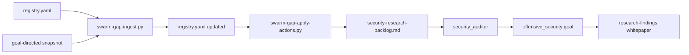

# Swarm gap orchestration — security dimension (2026-06-06)

**Goal id:** `swarm_coverage`  
**Dimension:** `security`  
**Publish target:** `research-findings/whitepapers/2026-06/swarm_coverage/security/`  
**north_star_fit:** ecosystem orchestration under the **secure** pillar; proof-before-perf on security research (no unproved exploit shortcuts)

---

## Abstract

This pass audits how the Li agent swarm routes **security plan_debt** from the swarm-gap registry through backlog apply into research-lane handoffs. The control plane can patch orchestration metadata unattended, but **CVE catalog governance** and **httpd fuzz product work** remain human-gated.

---

## Signals (2026-06-06)

| Signal | Value | Source |
|--------|-------|--------|
| Ecosystem grade | C (73.6) | `benchmarks/data/latest/ecosystem-quality-report.json` |
| Top25 CWEs in catalog | 6/25 present | `benchmarks/data/latest/security-cwe-feed.json` |
| Top25 missing | 19 | same |
| Open registry gaps | 64 | `lic/data/swarm-gap-registry/registry.yaml` |
| Security plan todos pending | `sec-r1`, `sec-r2`, `sec-r3` | `lic/docs/ecosystem/security-research-backlog.md` |
| Security runner | supervisor off (4d+) | `lic/data/goal-directed-agents/snapshot.json` |

---

## Gap taxonomy — security lens

| `gap_kind` | Security examples | Orchestrator action |
|------------|-------------------|---------------------|
| `plan_debt` | `sec-r1` httpd fuzz, `sec-r2` tier5 exploit, `sec-r3` runtime surface | Patch backlog; handoff `security_auditor` via `offensive_security` |
| `competitor_feature` | httpd tier5 parity rows (indirect) | Defer to `numerics_researcher` / httpd plan — proof-gated |
| `missing_package` | — | N/A this pass |
| Audit feed | 19 CWE catalog holes | Human PR on `cve-catalog.json`; `security_auditor` prepares mapping |

---

## Orchestration model

Retired **systemd** `security-research-plan-loop` is not restarted; the async swarm research lane (`config/research-goals.yaml` → `offensive_security`) owns dispatch.

---

## Recommendations

1. **`security_auditor`** — next cadence tick on `sec-r1-httpd-fuzz-smoke` with tier5 smoke gates.
2. **Human catalog PR** — map 19 Top25 CWEs; link to `li-tests` security harness rows.
3. **Control plane** — bake `python3-yaml`; persist observer `retry_counts` on disk.
4. **`ci_maintainer`** — green metrics PRs before next scorecard refresh churn.

---

## Deferred publish

Promote this staging doc to `research-findings` when the repo is mounted in the org-research Job workspace.

---

## References

- `lic/docs/ecosystem/orchestrator-notes/2026-06-06-orch-security-gap-handoffs-0cac634a.md`
- `/app/data/runs/swarm_observer-1780727084886.md`
- `docs/ecosystem/research-verticals.md` — `offensive_security` / `swarm_coverage` goals
