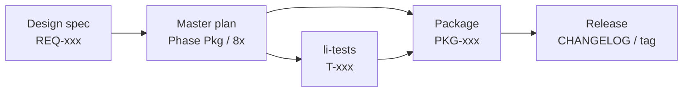

# Li ecosystem governance — GitHub org, standards, traceability

> **Applies to:** [package-scaffold](2026-05-16-li-package-scaffold.md), [package-manager-lip](2026-05-16-li-package-manager-lip.md), [li-httpd](2026-05-16-li-httpd-plan.md), and all **first-party** / **standard** libraries.

**Goal:** Official Li software and standard packages live under a **defined GitHub organization**, with documentation and metadata that meet **international conventions** and a **traceability chain** from requirements → design → tests → releases.

---

## GitHub organization policy

| Category | Where it lives | Naming |
|----------|----------------|--------|
| **Language + compiler** | [`li-langverse/lic`](https://github.com/li-langverse/lic) | single source of truth (`li-language` deprecated) |
| **Package manager** | [`li-langverse/lip`](https://github.com/li-langverse/lip) | `lip`, registry |
| **Test + coverage** | [`li-langverse/lit`](https://github.com/li-langverse/lit) | `lit`, ≥80% gate |
| **Standard library slices** | `li-langverse/li-std-<area>` e.g. `li-std-math`, `li-std-io` | when `std/` outgrows monorepo |
| **Infrastructure packages** | `li-langverse/li-net`, `li-tls`, `li-crypto`, … | per [li-httpd](2026-05-16-li-httpd-plan.md) |
| **User / third-party** | Author’s org or user account | `lip publish` + registry; not `li-langverse` unless adopted |

**Canonical org:** **[`li-langverse`](https://github.com/li-langverse)** — all official Li software and standard packages MUST live here.

**Canonical remote:** `https://github.com/li-langverse/lic.git` — docs and `mkdocs.yml` use `li-langverse`. See [master plan § Repository separation](2026-05-14-li-master-plan.md#repository-separation--when-to-create-repos).

**Agents:** For **any human-only action** (new repo, GitHub settings, org apps, secrets, notifications setup) — post **“Action needed from you”**, list exact steps, **wait for confirmation**. See [master plan — human-only actions](2026-05-14-li-master-plan.md). Do not proceed without confirmation.

### When to create an org repo (mandatory)

Create a **new repository** under **`li-langverse`** when **any** of:

1. Package is listed as **Li standard** (`docs/ecosystem/official-packages.md`).
2. Package is a **dependency of more than one** first-party product (httpd, compiler std, benchmarks).
3. Package will be **`lip publish`**’d to the public registry as **maintained by the Li project**.
4. Release cadence is independent of **`lic`** (own semver tags).

**Stay in monorepo** (`packages/<name>/`) when:

- Experimental / single-consumer only.
- Tightly coupled to compiler bring-up (until `import` + `lip` stable).
- Promote to org repo at **1.0.0** or when a second consumer appears (document promotion in CHANGELOG).

### Repo creation checklist (human or agent)

```bash
# After li-new-package locally validates
gh repo create li-langverse/li-foo --public --description "Li package: one line" \
  --license apache-2.0
git remote add origin git@github.com:li-langverse/li-foo.git
# push; enable branch protection on main; link lic / lip / lit in README
```

**Templates:** `scripts/templates/github-repo/` — `README.md`, `SECURITY.md`, `CHANGELOG.md`, `.github/PULL_REQUEST_TEMPLATE.md`, `PUBLISH.md`.

**Agent skill:** extend [create-li-package](../../../.cursor/skills/create-li-package/SKILL.md) — if `official` or `std`, run org checklist and link traceability IDs.

---

## Cross-repo dependency notifications

When **`lic`**, **`lit`**, **`lip`**, or any official **`li-*`** package releases, dependents **MUST** be notified so pins (`li-toolchain.toml`, `li.lock`) and CI are updated.

### Required per repository (official / std)

| File | Purpose |
|------|---------|
| `li-toolchain.toml` | Pin `lic_version`, `lit_version` (and later registry deps in `li.toml`) |
| `.github/dependabot.yml` | GitHub Actions updates; group weekly |
| `.github/workflows/ecosystem-upstream.yml` | On `repository_dispatch` from **`lic`** (and optionally **`lit`**) — open issue or bump PR |
| `scripts/check-li-toolchain.sh` | CI: compare pin to latest upstream release tag |

### Upstream release hub (`lic` repo)

- `.github/workflows/notify-downstream.yml` — runs on release `v*`
- `.github/li-downstream-repos.txt` — one repo per line: `li-langverse/lip`, `li-langverse/lit`, `li-langverse/li-std-core`, …
- Dispatches event `li-upstream-release` with payload: `component`, `version`, `url`

**Agents:** On new official repo, append to `li-downstream-repos.txt` in the same PR that adds the repo to [official-packages.md](../../ecosystem/official-packages.md). Remind human to enable **Renovate** on the org if TOML pins should auto-PR.

### Optional (recommended org-wide)

- [Renovate](https://github.com/apps/renovate) on **`li-langverse`** — regex managers for `lic_version` / `lit_version` in `li-toolchain.toml`
- Org team **Watching** releases on **`lic`**, **`lit`**, **`lip`**
- Phase **8d** registry: webhook when a depended package publishes (complements GitHub)

**Master plan phase:** **8-sync** — see [master plan](2026-05-14-li-master-plan.md#cross-repo-dependency-notifications-every-official-package).

---

## International documentation standards (practical subset)

Li docs align with widely used **de facto international practice** (not certifying to ISO unless explicitly required):

| Standard / spec | How Li uses it |
|---------------|----------------|
| [SemVer 2.0.0](https://semver.org/) | `version` in `li.toml`; git tags `vMAJOR.MINOR.PATCH` |
| [Keep a Changelog](https://keepachangelog.com/en/1.1.0/) | Every package repo + **`lic`** root |
| [SPDX](https://spdx.dev/) | `license` field in `li.toml`; `LICENSE` file; SPDX id in headers where applicable |
| [README / repoconfig](https://repoconfig.com/) habits | README: install, build, license, conduct, security contact |
| [RFC 2119](https://www.ietf.org/rfc/rfc2119.txt) keywords | **MUST** / **SHOULD** in normative spec + ecosystem policy only |
| ISO/IEC/IEEE 26514 (user docs) | **Style:** task-oriented, defined audience, tested examples — see [documentation.md](../../contributing/documentation.md) |
| ISO/IEC/IEEE 12207 / 15288 (lifecycle) | **Traceability IDs** below — lightweight RTM, not full QMS |

**Language:** Primary docs in **English (en)**. User-facing strings in code: English first; i18n out of scope until std stabilizes.

**Accessibility:** MkDocs Material theme; semantic headings; alt text on diagrams in docs; no information conveyed by color alone in published plots.

---

## Traceability model

Every **normative** or **release-blocking** item gets an ID and backlinks.



### ID prefixes

| Prefix | Example | Where recorded |
|--------|---------|----------------|
| `REQ-` | `REQ-PROOF-01` | [language design spec](../specs/2026-05-14-li-language-design.md) |
| `PH-` | `PH-Pkg`, `PH-8b` | [master plan](2026-05-14-li-master-plan.md) |
| `T-` | `T-modules-import-ok` | `li-tests/manifest.toml` `note = "T-..."` |
| `PKG-` | `PKG-li-std-math` | `docs/ecosystem/official-packages.md` + package `PUBLISH.md` |
| `DOC-` | `DOC-lip-user-guide` | `docs/ecosystem/lip.md` front matter |

### Required files per **org package** repo

| File | Purpose |
|------|---------|
| `README.md` | Audience, build, links to docs site + traceability table |
| `CHANGELOG.md` | Keep a Changelog format; link `PKG-` / `T-` on fixes |
| `LICENSE` | SPDX identifier matching `li.toml` |
| `SECURITY.md` | Reporting; supported versions |
| `PUBLISH.md` | Exports, `PKG-` id, registry name, proof/coverage tier |
| `li.toml` | [lip § A3](2026-05-16-li-package-manager-lip.md) |
| `docs/traceability.md` | RTM: REQ/PH ↔ tests ↔ this package version |

### Monorepo `packages/` traceability

- Root [docs/ecosystem/official-packages.md](../../ecosystem/official-packages.md) lists all `PKG-*` with path or org repo URL.
- Each `packages/*/PUBLISH.md` includes `Traceability: PH-…, T-…, REQ-…`.

### Update discipline (when anything ships)

1. **Code/test change** → update `li-tests/manifest.toml` `note` with `T-` id if new behavior.
2. **New package** → assign `PKG-`; add row to official-packages; create org repo if policy says so.
3. **Release** → CHANGELOG section with version + date; tag `vX.Y.Z`; bump `li.toml` `version`.
4. **Spec change** → new or updated `REQ-`; link from master plan phase row.
5. **Docs** → mkdocs nav + cross-links; `DOC-` id in page HTML comment or first line `<!-- DOC-lip-user-guide -->`.

**CI (planned):** `scripts/check-traceability.sh` — fails if `PKG-` in official-packages has no `PUBLISH.md`; manifest tests missing `note` for `verify_ok` suites.

---

## Standard packages registry (documentation)

**File:** [docs/ecosystem/official-packages.md](../../ecosystem/official-packages.md) (create on execute)

| PKG id | GitHub repo | Role | Phase |
|--------|-------------|------|-------|
| `PKG-li-language` | [`li-langverse/li-language`](https://github.com/li-langverse/li-language) | Compiler, runtime, li-tests | 0–7 |
| `PKG-li-std-*` | `li-langverse/li-std-*` | Standard library modules | 4+ |
| `PKG-li-http` | `li-langverse/li-http` (or monorepo path until split) | HTTP stack | H |

Third-party packages are **not** listed here; they appear only in the public `lip` registry index.

---

## Integration with scaffold + lip

| Step | Governance action |
|------|-------------------|
| `li-new-package --official` | Emit `PKG-` stub in `PUBLISH.md`; print org repo creation checklist |
| `lip publish` (8d) | Verify `CHANGELOG`, `SECURITY`, SPDX, coverage; registry metadata includes `PKG-` + `proof_digest` |
| Promote monorepo → org | Open tracking issue in `li-language`; copy history with `git filter-repo` or subtree split; update `li.lock` git URLs |

**Scaffold flag (planned):** `--official` sets `package.metadata.lip.maintainer = "li-langverse"` and generates `docs/traceability.md` skeleton.

---

## Master plan placement

| Item | Tracker |
|------|---------|
| Governance doc (this file) | Sub-plan index + ecosystem section |
| `official-packages.md` + `check-traceability.sh` | **Pkg** or **8b** exit gate |
| Org repo templates | **Pkg** |
| Registry metadata `PKG-` field | **8d** |

---

## Agent coordination (documented)

| Doc | Role |
|-----|------|
| [engineering-standards.md](../../ecosystem/engineering-standards.md) | **Strict** functionality, security, performance; CVE; learn-from-other-ecosystems |
| [vision-and-roadmap.md](../../ecosystem/vision-and-roadmap.md) | Master plan vs roadmap repo vs package vision |
| [agent-coordination.md](../../ecosystem/agent-coordination.md) | `.li-agent-coord.json`, claims, checklist |
| [language-evolution.md](../../ecosystem/language-evolution.md) | Downstream pins when `lic` changes |

---

## Exit gate (governance slice)

- [x] Confirm org access: `gh api orgs/li-langverse` (or org owner invites bot/users) — evidence: `gh api orgs/li-langverse` → `li-langverse` (2026-05-25)
- [x] `docs/ecosystem/official-packages.md` with `PKG-` table (all repos under `li-langverse`) — evidence: `docs/ecosystem/official-packages.md` rows `PKG-lic` … `PKG-li-httpd`
- [ ] On execute: align `mkdocs.yml` `repo_url` / GitHub Pages with `li-langverse/li-language` when repo home moves — **Open:** site still `li-langverse/li-language`; compiler home is `li-langverse/lic` (rename/docs migration pending)
- [x] `docs/ecosystem/governance.md` user-facing summary (links here) — evidence: stub + links to roadmap canonical + master plan
- [x] `scripts/templates/github-repo/` + `scripts/check-traceability.sh` — evidence: templates dir; `scripts/ci.sh` runs `check-traceability.sh`
- [x] `create-li-package` skill: `--official` → org checklist — evidence: `.cursor/skills/create-li-package/SKILL.md` `--official` section
- [x] At least one example package `PUBLISH.md` with full traceability block in monorepo — evidence: `packages/li-core/PUBLISH.md` + `packages/li-core/docs/traceability.md` (`PKG-`, `PH-`, `T-` rows)
