# li-httpd — minimal, proved, nginx-competitive

## Honest starting point

Li today is optimized for **proved HPC kernels** (Tetris/SDL, physics benchmarks), not servers:


| Area       | Today                                                                                                                                                                            | Needed for nginx-class                                                  |
| ---------- | -------------------------------------------------------------------------------------------------------------------------------------------------------------------------------- | ----------------------------------------------------------------------- |
| Proof gate | Contracts parsed; **no `li_verify/` / Lean VC pipeline** ([master plan](docs/superpowers/plans/2026-05-14-li-master-plan.md) phases **2e–2f** still TBD)                         | Every server module must pass `lic build` = Lean kernel                 |
| Trusted IO | [trusted.lean](docs/semantics/trusted.lean): SDL/frame axioms only                                                                                                               | Syscalls, sockets, timers, process spawn — **RFC-reviewed axioms only** |
| Stdlib     | `std/` effectively empty; heap `str`/`bytes`/`list` mostly **spec** ([data structures roadmap](docs/superpowers/specs/2026-05-14-li-language-design.md#data-structures-roadmap)) | Full bytes I/O, config, containers, regex, compression                  |
| Async      | Spec: `async`/`await` + `raises Async` — **not shipped**                                                                                                                         | Event loop driving 100k+ connections                                    |
| Networking | **None** in repo                                                                                                                                                                 | TCP/UDP, DNS, TLS, HTTP/1.1–3, stream proxy                             |


**Product goal:** **AI/agent-native HTTP gateway** — long-lived **streaming** (SSE), **safe header policy**, **rate limits**, **load balancing** to inference/tool backends, **secure-by-design TOML** (no misconfig vulns). Beat nginx on clarity and assurance at **far lower LOC**; match perf on agent workloads (many concurrent streams, fewer trivial GETs).

**Not a goal:** generic nginx clone, blog static hosting as primary story, or porting `src/http/*.c`.

---

## Design pillars (in order)


| #   | Pillar            | Rule                                                              |
| --- | ----------------- | ----------------------------------------------------------------- |
| 1   | **Provable core** | `lic build` = Lean OK; specs **are** the security implementation  |
| 2   | **Minimal LOC**   | Proofs replace defensive branches—track `cloc` vs nginx in CI     |
| 3   | **Performance**   | Thin stack + LLVM; bench vs nginx                                 |
| 4   | **Easy TOML**     | Simple `[routes]` map → desugar → validate; errors at `lic check` |


Nginx source is **read-only** (what invariants matter). Li makes enforcing them **smaller** than C, not harder.

---

## Self-contained delivery (you publish packages later)

**Rule:** implementation does **not** wait on crates, npm, or unpublished third-party Li packages. We **write every dependency ourselves**, split into publishable packages, and publish to a registry **later**; until **lip** (phase 8b+), use **path / workspace** deps only.

### Package creation — master plan (do not hand-roll)

Follow **[Phase Pkg — package scaffold](2026-05-16-li-package-scaffold.md)** and canonical **`li.toml` in [lip plan § A3](2026-05-16-li-package-manager-lip.md)**. Never invent a second manifest format.

| Step | Tool | When |
| ---- | ---- | ---- |
| Create package tree | `./scripts/li-new-package <name> --kind library\|binary --workspace packages` | **Pkg** (in [li-langverse/li](https://github.com/li-langverse/li)) |
| Init / lock (later) | `lip init` / `lip install` | **8b+** — wraps same scaffold |
| Org-only numerics | `li-new-package li-math` in **li-langverse/li-math** repo | When splitting from lis |

**Agents:** use skill `.cursor/skills/create-li-package` — run `li-new-package`, do not mkdir/copy `li.toml` by hand.

**lis repo note:** infra stubs under `packages/li-*` were pre-Pkg placeholders; **re-scaffold each** with `li-new-package` once the script lands, then diff only intentional `description` / deps.

```bash
# From li compiler repo (after Pkg ships):
./scripts/li-new-package li-net --kind library --workspace packages --out /path/to/lis/packages
./scripts/li-new-package li-httpd --kind binary --workspace packages --out /path/to/lis/packages
```

**Standard layout** (scaffold output — same as lip):

```text
packages/li-net/
  li.toml              # lip § A3 (edition, metadata.lip.min_coverage, …)
  li.lock              # lip install (8b+)
  README.md
  PUBLISH.md
  src/lib.li           # or src/main.li for binary (li-httpd)
  li-tests/manifest.toml
  li-tests/smoke/builds.li
```

**Workspace root** `packages/li.toml` or repo-root `li.toml`:

```toml
[workspace]
members = ["li-bytes", "li-net", "li-rng", "li-prob", "li-crypto", "li-tls", "li-acme", "li-schema", "li-log", "li-http", "li-httpd"]
```

**`li.toml` excerpt** (full schema: lip § A3):

```toml
[package]
name = "li-http"
version = "0.1.0"
edition = "2026"
license = "Apache-2.0 OR MIT"
description = "HTTP parser, router, proxy, leak_censor"

[dependencies]
li-net = { path = "../li-net" }

[package.metadata.lip]
min_coverage = 80
```

| Do | Don't |
| -- | ----- |
| `li-new-package` + lip § A3 | Hand-written `li.toml` / missing `edition` / `li-tests/` |
| Path deps until registry | `lip install` from registry before **8a+8c+8e** policy |
| Vendor nginx submodule, test vectors as read-only | Treat vendored C as Li packages |

**Default package split** (each via `li-new-package`):

```text
packages/
  li-bytes/ li-net/ li-rng/ li-prob/ li-crypto/ li-tls/ li-acme/
  li-schema/ li-log/ li-http/ li-httpd/
benchmarks/tier5_http/
```

`li-httpd` = **binary** (`--kind binary`); others = **library**. Publish via `lip publish` (8d) after proof + signature + coverage — not required for lis infra phase.

**Harness / tooling:** `bench_http.py`, `exploit_http.py`, `audit_nginx_src.py` in-repo (Python OK). **Crypto:** `li-crypto` in Li first; optional `li-crypto-hacl` org package later.

**Agent discipline:** [engineering-standards.md](../ecosystem/engineering-standards.md) (mandatory gates). **Vision:** product here; language/ecosystem in [master plan](2026-05-14-li-master-plan.md). **Learn from others:** nginx/Envoy/LiteLLM for algorithms — not C ports; CVE rows in `nginx_mitigations.toml` + tier5 exploits must stay green.

---

## Why provability makes li-httpd easier (not harder)

nginx stays secure by **volume**: checks scattered across modules, runtime limits, years of CVE patches, fuzzing, and ops lore. Li stays secure by **theorem**: one parser, one state machine, obligations that **cannot compile** if wrong.


| nginx (C) cost                                       | Li replacement (usually fewer LOC)                                          |
| ---------------------------------------------------- | --------------------------------------------------------------------------- |
| Ad-hoc bounds checks on every read                   | Refinement `Index` + `invariant 0 <= off and off <= buf.len`                |
| “Can this smuggle?” manual review                    | **One** parse path; `ensures` no duplicate `Content-Length`                 |
| TSan/ASan + pray on races                            | Borrowck + `Send`/`Sync` on worker boundaries                               |
| Huge `if` trees for malformed input                  | Parse returns `Result[Request, Reject]` — illegal states unrepresentable    |
| Config → vuln (alias traversal, open proxy, TLS off) | **Config schema + `lic validate-config`** — illegal configs do not start    |
| Re-read nginx CHANGES every release                  | `nginx_mitigations.toml` → `li_invariant` → already in `requires`/`ensures` |


**What you write once (M1 core):**

```nim
proc parse_request(buf: bytes, limits: Limits) -> Result[Request, HttpError]
  requires buf.len <= limits.max_header_block
  ensures result.ok -> result.value.body_len <= limits.max_body
  decreases buf.len
```

If it builds, buffer over-reads and unbounded header growth are **not** “hopefully caught by tests”—they are obligations the toolchain rejected.

**What stays small and trusted (explicit, RFC-capped):**

- Syscalls (`recv`/`send`/`epoll`) in `li_rt_net.c` + `trusted.lean`
- Optional crypto extern boundary (M2) with contracts at the seam only

**Exploit suite role (smaller than nginx QA):** confirms `[expect]` on the **trusted seam** and that specs match reality—not to re-prove what Lean already proved.

**Prerequisite:** phases **2e–2f** (VC → Lean on `lic build`). That gate is the reason M1 is tractable; without it, li-httpd is just another memory-safe language. **P0 = turn on the proof pipeline, then M1 is mostly writing specs + thin code.**

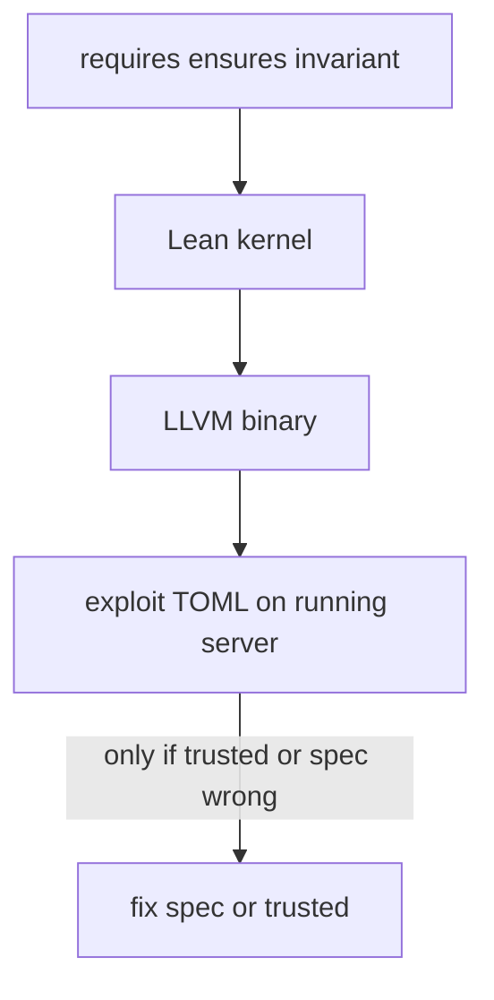


---

## Strategy: minimal implementation, nginx as oracle

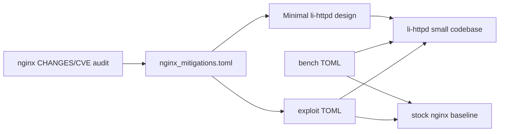


| Step | What                                                             | Output                                                                                  |
| ---- | ---------------------------------------------------------------- | --------------------------------------------------------------------------------------- |
| 1    | Audit nginx **source + security history** (submodule, read-only) | `nginx_mitigations.toml` — checklist of invariants to enforce                           |
| 2    | Write **specs first** (`li_invariant` → `proc` contracts)        | `docs/superpowers/specs/li-httpd.md` + `std/http/*.li` skeletons that `lic build`       |
| 3    | Fill implementations until proofs close (thin bodies)            | LOC counter; no duplicate defensive paths                                               |
| 4    | **Bench + exploit** TOML vs nginx                                | CSV; li must meet or beat nginx on perf rows, **meet or exceed** on security `[expect]` |


**No porting:** do not mirror nginx modules, structs, or config grammar. Where nginx has three parsers/paths, li-httpd uses **one** proved front-end.

---

## LOC budget (enforced)


| Component                  | nginx (order of magnitude)  | li-httpd target                                                        |
| -------------------------- | --------------------------- | ---------------------------------------------------------------------- |
| HTTP core + static + proxy | ~80k+ C (whole tree ~200k+) | **< 8k** `.li` M1 — achievable because proofs replace defensive C bulk |
| TLS + HTTP/2 (M2)          | +40k+                       | **+3k** `.li` or proved extern crypto boundary                         |
| **Total M1**               | —                           | gate releases on `cloc examples/li-httpd std/http std/net`             |


CI job: `scripts/loc_httpd.sh` fails if M1 exceeds budget without RFC. Prefer deleting features over growing LOC.

---

## Capability scope (functionality without nginx parity)

Ship **workloads**, not **nginx.conf compatibility**:

**M1 (v1 — minimal competitive server):**


| Capability       | In scope                                                         | Out of scope (save LOC)                                  |
| ---------------- | ---------------------------------------------------------------- | -------------------------------------------------------- |
| HTTP/1.1         | keep-alive, static, reverse proxy, sane limits                   | pipelining tricks, HTTP/0.9                              |
| Routing          | **named routes** + typed `match` blocks (no PCRE)                | nginx `location ~` / `if` / rewrite                      |
| **Load balance** | upstream pools, RR + least_conn, passive health                  | ip_hash, active health probes (M1.5), gRPC LB            |
| TLS              | TLS 1.3 + **auto** (`self_signed` dev, `lets_encrypt`)           | manual cert paths only; legacy SSL                       |
| Ops              | one `li-httpd.toml`, reload, `**li-log`** rotation + audit JSONL | nginx `access_log` dialect, Lua                          |
| Security         | one parser, typed config, exploit suite                          | dynamic `.so` modules                                    |
| Perf             | workers = cores, sendfile, epoll/kqueue                          | thread pool, open file cache until benchmark proves need |


**M2:** HTTP/2 + gzip only if M1 meets perf gates under LOC cap.

**M3 (optional):** stream TCP proxy, WebSocket — RFC + LOC justification.

**Explicit non-goals:** HTTP/3, nginx config drop-in, mail module, module ecosystem.

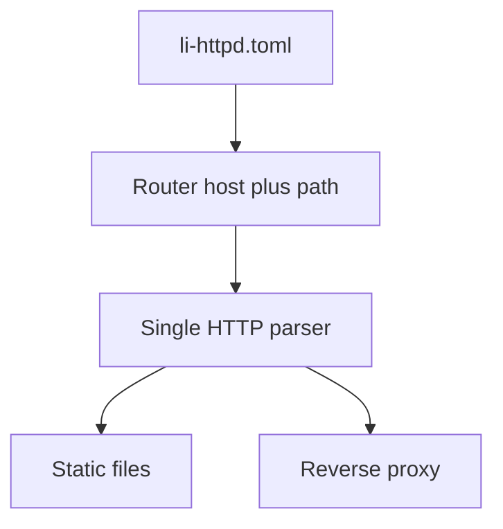


---

## Secure-by-design configuration (no user-induced vulns)

**Principle:** misconfiguration is a bug class nginx accepts (string DSL, sharp edges). li-httpd **refuses to start** on configs that could enable known vulnerability patterns—same rigor as parser proofs, applied to ops surface.

### What nginx allows that we forbid


| Misconfig pattern                        | Typical vuln                   | li-httpd rule                                                                 |
| ---------------------------------------- | ------------------------------ | ----------------------------------------------------------------------------- |
| `alias` + bad trailing slash             | path traversal                 | no `alias`; `root` only with `canonical_root` check at validate               |
| `proxy_pass` + user-controlled URI       | SSRF / open proxy              | `proxy` only to **allowlisted** `UpstreamId`; backends fixed at validate time |
| `upstream` + bad peer / no health        | traffic to dead nodes          | pool `[[upstream.peer]]` only; passive health + optional bounded active probe |
| Client picks backend via header/cookie   | bypass policy                  | **no** `X-Backend` / dynamic peer; algorithm from config enum only            |
| `if` / `rewrite` in location             | request smuggling, logic bugs  | **no** conditional routing DSL — static route table only                      |
| `include /etc/nginx/*.conf`              | supply-chain / surprise        | **no** includes; one file or explicit `[[route]]` list                        |
| `load_module` / Lua                      | arbitrary code                 | **no** dynamic modules or scripting                                           |
| TLS off on public listener               | cleartext credentials          | `listen` requires `tls = true` unless `listen = "127.0.0.1:…"` (refinement)   |
| Wildcard `add_header` / pass-all headers | header injection, cache poison | fixed safe header set; `forward_headers` allowlist only                       |
| Huge/unbounded buffers in config         | DoS                            | `max_body`, `max_header`, timeouts **required** with schema max               |
| `proxy_set_header Host $host` mistakes   | poison                         | typed `forward_host = Origin                                                  |


### Config pipeline (validate before bind)

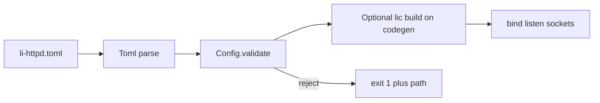


1. `**lic validate-config**` — simple TOML → desugar → validate canonical
2. `**li-httpd` start** — refuse listen on error
3. `**li-httpd explain-config`** — show desugared TOML for debugging

### Easy TOML (default — write this)

Ambiguous input → **desugar error** at line number (never guess).

```toml
[server]
listen = ":443"
host = "api.example.com"
tls = "lets_encrypt"
email = "ops@example.com"

[limits]
max_body = "1m"

[upstreams.inference_pool]
peers = ["http://10.0.0.1:8000", "http://10.0.0.2:8000"]

[routes]
"GET  /health"                  = "static:healthcheck"
"POST /v1/chat/completions"     = "proxy:inference_pool"
"POST /v1/*"                    = "proxy:inference_pool"
"POST /v1/*  x-model=gpt-4"     = "proxy:pool_gpt4"
```


| You write                       | Meaning                     |
| ------------------------------- | --------------------------- |
| `"METHOD /path" = "proxy:pool"` | method + path → action      |
| `/api/*` or `/api/`             | prefix match                |
| `/files/**`                     | prefix strip + tree         |
| `/health`                       | exact path                  |
| `x-model=gpt-4` in key          | header equals (literal)     |
| `[server] host`                 | default Host for all routes |
| **File order**                  | first line wins             |


**Flatter:** `routes = ["GET /health -> static:healthcheck", ...]` — do not mix with `[routes]` map.

**Tests:** `li-tests/config_desugar/` golden files; `li-httpd explain-config` prints canonical form.

### Typed schema (canonical — after desugar)

Config deserializes into `HttpdConfig` in `std/http/config.li`:

```nim
type UpstreamId = enum
  api_backend
  internal_only

type Route = object
  name: RouteName         # stable id for logs and tests
  match: MatchExpr        # structured — see "Readable routing" below
  action: RouteAction    # StaticRoot | Proxy(UpstreamId)

type HttpdConfig = object
  listen: ListenAddr
  routes: seq[Route]      # sorted by explicit priority at validate
  limits: Limits
```

### Readable routing (replaces nginx regex)

**Problem with nginx:** `location ~* ^/api/v[0-9]+/` is hard to read, order-dependent (`=`, `^~`, `~`), and easy to misconfigure into smuggling or accidental broad matches.

**li-httpd rule:** **no PCRE / no user-supplied regex strings** in config. Use a small **MatchExpr** algebra that reads top-to-bottom like a route table.

#### Match types (enum per field)


| `match.path.type` | Meaning                                    | nginx analog                             |
| ----------------- | ------------------------------------------ | ---------------------------------------- |
| `exact`           | path == value                              | `location = /health`                     |
| `prefix`          | path starts with value (normalized)        | `location /api/`                         |
| `prefix_strip`    | prefix match; strip prefix before upstream | `location ^~ /api/` + proxy path rewrite |
| `glob_one`        | one segment: `/static/`*                   | clearer than regex extension match       |
| `glob_rest`       | suffix: `/files/`**                        | directory trees (optional M1.5)          |


| `match.host.type` | Meaning                 |
| ----------------- | ----------------------- |
| `exact`           | `api.example.com`       |
| `suffix`          | `.internal.example.com` |


| Other           | Meaning                                                     |
| --------------- | ----------------------------------------------------------- |
| `match.methods` | `["GET", "POST"]` — omit = any                              |
| `match.headers` | `{ name = "x-model", equals = "gpt-4" }` — **literal only** |


**Priority:** simple `[routes]` map uses **file order** (first line wins). Canonical `[[routes]]` may set explicit `priority`; ties → **compile error**.

Logs use route **name** from desugar (`openai_chat` auto from `"POST /v1/*"` → `post_v1_wildcard` or explicit name in advanced block).

#### nginx → li-httpd cheat sheet (migration doc)


| nginx                         | **Easy li-httpd**                            |
| ----------------------------- | -------------------------------------------- |
| `location = /x`               | `"GET /x" = "static:..."`                    |
| `location /api/`              | `"POST /api/*" = "proxy:pool"`               |
| `location ^~ /api/`           | `"POST /api/**" = "proxy:pool"` (strip rest) |
| `location ~ \.php$`           | **not supported** — list explicit paths      |
| `if ($request_method = POST)` | `POST` prefix in route key                   |
| `if ($http_x_model = gpt-4)`  | `"POST /v1/* x-model=gpt-4" = "proxy:..."`   |
| `rewrite ^/api/(.*)$ /$1`     | use `/`** path sugar                         |


Optional later: `**li-httpd import-nginx-locations`** suggests li routes from nginx.conf (best-effort, never emits regex — flags manual review).

#### Proved router (`std/http/router.li`)

```nim
proc match_route(table: RouteTable, req: RequestView) -> Option[RouteName]
  requires table.sorted_valid
  ensures result.isSome -> route_matches(table[result.get], req)
  ensures result.isNone -> forall r in table, not route_matches(r, req)
  decreases table.len
```

`route_matches` is total and composed only from structurally recursive matchers (no backtracking regex engine).

#### Routing tests (functionality guaranteed)

**Layout:**

```
li-tests/routing/
  manifest.toml              # lists case files
  cases/
    api_prefix.toml          # table: request -> expect route
    host_suffix.toml
    method_reject.toml
    overlap_reject.toml      # config that must fail validate
  good/
    deterministic_order.li   # compile-time router unit tests (lic build)
```

**Case file format (TOML — same ergonomics as bench):**

```toml
[[case]]
id = "chat_completions"
request = { method = "POST", host = "api.example.com", path = "/v1/chat/completions" }
expect = { route = "openai_chat", action = "proxy" }

[[case]]
id = "health"
request = { method = "GET", host = "api.example.com", path = "/health" }
expect = { route = "health", action = "static" }

[[case]]
id = "no_match"
request = { method = "GET", host = "api.example.com", path = "/unknown" }
expect = { status = 404 }
```

**Harness:** `./li-tests/run_routing.sh` (or `run_all.sh routing` suite):

1. Load `examples/li-httpd/fixtures/routing.toml` config
2. For each case: build `RequestView`, call `match_route`, assert `route` / `status`
3. CI: **must pass** on every PR touching `std/http/router.li` or match types

**Validate-config tests** (`li-tests/config_reject/routing_*.toml`):

- two routes same `priority` + overlapping match → **reject**  
- `glob_rest` on public listener without `max_depth` → **reject**  
- path containing `..` or unnormalized → **reject**

**Property / golden tests:**

- Normalize path: `/v1//chat` → `/v1/chat` (single algorithm, tested)  
- `prefix_strip`: `/api/v1/foo` + strip `/api` → upstream path `/v1/foo` (golden vectors)

**Bench (optional):** micro-bench `match_route` 10k paths — guard perf regression, not correctness.

**M1 gate:** routing suite green + `config_reject` overlap cases + router in `lic build`.

`**proc validate(c: HttpdConfig) -> Result[unit, ConfigError]`** with contracts:

- `ensures` no ambiguous overlap on same `priority` (validator rejects)  
- `ensures` every `StaticRoot` path ⊆ allowed filesystem roots (declared in config)  
- `ensures` every `Proxy` target ∈ `c.upstreams` allowlist  
- `ensures` each upstream has `1 <= peers.len <= MaxPeers` (e.g. 32)  
- `ensures` peer URLs are literal `http(s)://host:port` — no request-derived host  
- `ensures` `c.limits.max_body <= MaxBodyCap` (compile-time constant)

Invalid configs = **proof obligations fail** or validator returns error—never “warn and run.”

### Secure defaults (user omits dangerous knobs)

```toml
[server]
listen = ":443"
host = "api.example.com"
tls = "lets_encrypt"
email = "ops@example.com"

[limits]
max_body = "1m"

[upstreams.api]
peers = ["http://127.0.0.1:3000", "http://127.0.0.1:3001"]

[routes]
"GET  /health"     = "static:healthcheck"
"POST /v1/*"       = "proxy:api"
```

- User **cannot raise** limits above schema ceiling (only tighten)  
- Public bind without TLS → **validation error** (unless valid `server.tls` mode configured)  
- `proxy = "http://evil.com"` → **unknown upstream id** error  
- Upstream with **zero peers** or **> MaxPeers** → validation error  
- `weight` outside `1..100` or sum over cap → validation error

### Automatic TLS certificates (setup-time, config-driven)

On first start (or `li-httpd setup-tls`), provision certs **before** binding public `:443` — no manual openssl steps for the default path.

**Three modes (enum — user picks one per listener):**


| Mode           | Use case                    | Secure-by-design guard                                                     |
| -------------- | --------------------------- | -------------------------------------------------------------------------- |
| `manual`       | Production with own CA/cert | `cert` + `key` paths required; files must exist at validate                |
| `self_signed`  | Local dev / CI              | Only if `listen` is loopback **or** `tls.dev = true` explicitly set        |
| `lets_encrypt` | Public agent API            | Requires `email`, `domains[]` matching `[[route]].host`; HTTP-01 reachable |


```toml
[server]
listen = "0.0.0.0:443"

[server.tls]
mode = "lets_encrypt"              # manual | self_signed | lets_encrypt
min_protocol = "1.3"
cert_dir = "/var/lib/li-httpd/certs"   # created 0700 on setup; paths in config

# --- mode: manual ---
# [server.tls.manual]
# cert = "/etc/li-httpd/fullchain.pem"
# key  = "/etc/li-httpd/privkey.pem"

# --- mode: self_signed (dev) ---
# [server.tls.self_signed]
# dev = true                         # required for non-loopback bind
# valid_days = 90                    # schema max 365

# --- mode: Let's Encrypt ---
[server.tls.lets_encrypt]
email = "ops@example.com"            # required; ACME account contact
domains = ["api.example.com"]        # must match a route host
environment = "production"           # staging | production
renew_before = "30d"                 # renew when <30d left
http01_bind = "0.0.0.0:80"           # challenge listener (or share :80 vhost)
```

**Setup flow:**

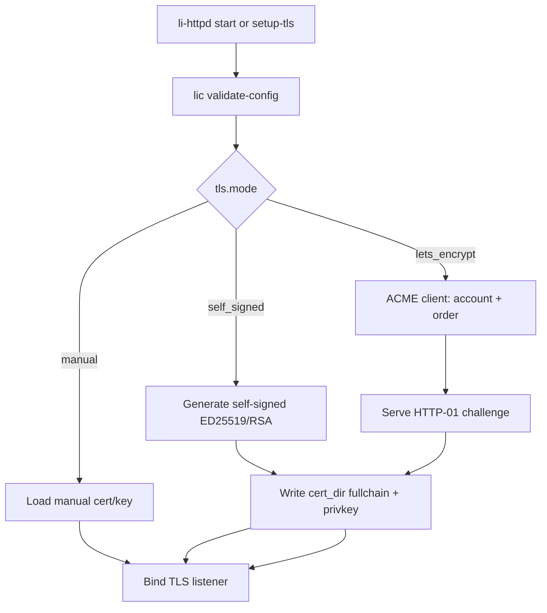


1. `**li-httpd setup-tls**` — only TLS provisioning + exit (good for CI/images)
2. `**li-httpd setup-censor**` — read migrations/OpenAPI → `leak_censor.generated.toml` (see leak censorship section)
3. `**li-httpd setup**` — interactive/full: TLS + censor + default config paths (recommended first install)
4. `**li-httpd` normal start** — if `cert_dir` missing certs and mode is `self_signed` or `lets_encrypt`, run setup then listen
5. **Background renew** (Let's Encrypt): timer per `renew_before`; **reload** TLS context atomically (no drop active streams mid-charge if possible — document graceful)

**Let's Encrypt assistance (built-in, not “install certbot”):**

- Integrated **ACME v2** client (`std/tls/acme.li` + thin trusted HTTP to Let's Encrypt directory)  
- **HTTP-01** challenge: auto route `/.well-known/acme-challenge/` (cannot be overridden by user routes — reserved)  
- **Staging** environment for tests (`environment = "staging"`)  
- Clear errors: `dns not pointing to this host`, `port 80 blocked`, `rate limited`  
- Optional later: **TLS-ALPN-01** (M2+) if :443 up before :80

**Self-signed auto-generate:**

- Generate on first run; store under `cert_dir`  
- Log fingerprint + **one-line trust hint** for dev  
- Browser/agent clients: document `tls.dev_skip_verify` for local SDKs only — **never** a production config flag

**Validation rules (`HttpdConfig.validate`):**

- `lets_encrypt` → every domain ∈ `domains` appears on at least one `[[route]].host`  
- `lets_encrypt` on public listener → `email` present and valid format  
- `self_signed` + public bind → **error** unless `tls.self_signed.dev = true`  
- `manual` → cert/key readable, not expired at startup (warn if `< renew_before`)  
- Forbidden: `mode = "off"` on `0.0.0.0`

**Proof / trust boundary:**

- Cert parsing + TLS handshake: Li crypto / `std/tls` (M2)  
- ACME signing (account key, JWS): v1 in **trusted extern** with contracts on URL and nonce handling; migrate to Li as crypto matures  
- File write: only under `cert_dir`; `ensures` paths ⊆ cert_dir

**Bench / tests:**

- `li-tests/tls_setup/` — staging ACME with pebble or LE staging  
- `config_reject/tls_public_self_signed.toml` — must fail validate  
- Exploit: cannot request cert for domain not in config

**Milestone:** `self_signed` + `manual` in **M1.5** with TLS terminate; **Let's Encrypt obtain + renew** in **M1.5** (agent public APIs need real certs) or early **M2** if ACME LOC is tight.

---

## Load balancing (M1 core)

Minimal L7 balancer inside reverse proxy—no separate binary, no nginx `upstream {}` grammar clone.

### In scope (M1)


| Feature            | Behavior                                                                 |
| ------------------ | ------------------------------------------------------------------------ |
| **Pool**           | Named `[[upstream]]` with `[[upstream.peer]]` (literal URLs)             |
| **Algorithms**     | `round_robin`, `least_conn`                                              |
| **Passive health** | Mark peer down after `max_fails` within `fail_timeout`; proved retry cap |
| **Sticky**         | **none** in M1 (avoids session fixation misconfig)                       |
| **Failover**       | Next peer on connect error / selected 5xx; `decreases` on retry count    |


### Secure-by-design LB rules

- Peer list **fixed at validate** — request headers/cookies **never** select backend  
- `balance` is **enum** in TOML — no custom Lua/hash from user string  
- Active health `GET /path` (M1.5): probe URL must be relative on peer base URL only; interval/fail bounds in schema  
- Connection limits per peer optional (`max_conns`) — schema max to prevent DoS misconfig

### Proved core (`std/http/upstream.li`)

```nim
proc pick_peer(pool: var UpstreamPool, ctx: RequestCtx) -> Result[PeerId, UpstreamError]
  requires pool.peers.len > 0
  requires pool.active.len > 0
  ensures result.ok -> pool.peer_active(result.value)
  decreases pool.retry_budget
```

`reload` re-validates full config before swapping pools (no half-applied upstream).

### Bench / exploit


| Scenario                    | Purpose                                                   |
| --------------------------- | --------------------------------------------------------- |
| `lb_round_robin`            | 3 peers; wrk; verify even distribution ± tolerance        |
| `lb_least_conn`             | skewed latency peer; majority traffic avoids hot peer     |
| `lb_peer_down`              | kill one peer; traffic shifts; no crash                   |
| `config_lb_open_proxy.toml` | must **fail** validate (e.g. peer URL with user variable) |


Nginx oracle: same `bench.toml` topology against nginx `upstream` block for RPS/latency row.

### Out of scope until RFC + LOC

`ip_hash`, consistent hash, random two, gRPC LB, slow-start, backup tier, zone shared memory across workers (M1: per-worker pools OK for v1; document stickiness limitation).

---

## AI / agent-native gateway (product direction)

li-httpd is the **edge in front of models and tools** — not a human-facing website server. Design every feature for: long requests, **streaming bodies**, many parallel agents, observability, and **policy at the edge** (headers, auth, limits).

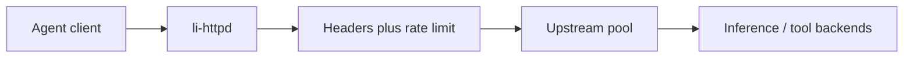


### Approach: header controls (secure by design)

**Three explicit phases** — no “pass all headers” default:


| Phase        | Direction          | Policy                                                                                                                                    |
| ------------ | ------------------ | ----------------------------------------------------------------------------------------------------------------------------------------- |
| **Ingress**  | Client → gateway   | **Allowlist** only (`authorization`, `content-type`, `accept`, `traceparent`, `x-request-id`, `x-agent-id`, `x-model`, `idempotency-key`) |
| **Egress**   | Gateway → upstream | Smaller allowlist; **strip** client junk; **inject** only static literals (`traceparent` forward, `x-request-id`)                         |
| **Response** | Upstream → client  | Allowlist response headers; strip internal `x-`* from backends                                                                            |


**Rules (non-negotiable):**

- Policies are **per-route** in TOML — enums and literal sets, not regex strings from users  
- Clients **cannot** set `x-upstream-`*, `x-route-`*, or hop-by-hop headers — rejected at parse or dropped before upstream  
- `inject` values are **LiteralString** in config — no `$variable` substitution (prevents header injection via config)  
- Hop-by-hop / connection headers handled only by gateway — never forwarded blindly

```toml
[[route]]
host = "api.example.com"
path = "/v1/"
proxy = "inference_pool"

[route.headers.ingress]
allow = ["authorization", "content-type", "accept", "traceparent", "x-request-id", "x-agent-id", "x-model", "idempotency-key"]

[route.headers.egress]
allow = ["content-type", "traceparent", "x-request-id", "x-model"]
inject = { "via" = "li-httpd/1" }   # literals only

[route.headers.response]
allow = ["content-type", "cache-control", "retry-after", "x-request-id"]
```

**Proof hook:** `forward_ingress(h, policy) -> Headers` with `ensures` every outgoing name ∈ policy.egress.allow`.

**Agent-native:** treat `traceparent` / `x-request-id` as **required** on inference routes (config `require = ["traceparent"]`) — validate fails at request time with 400, not silent drop.

### Runtime leak censorship (optional — user can turn off)

**Yes, partially.** Upstream frameworks can leak secrets; li-httpd can **censor egress** when enabled. Censorship is **opt-in per deployment** (`enabled = false` is valid); production profile may **warn** but does not hard-require it (unlike rate limits on public routes).

**Best setup path:** during **`li-httpd setup`**, read the **DB schema the user already defined via migrations** and **generate** `deny_paths` + sensitive field hints — user reviews, edits, or disables censorship entirely.

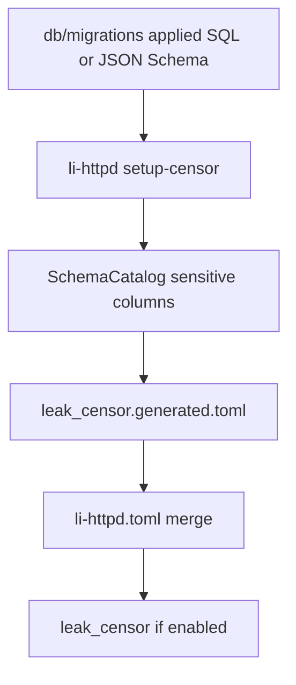

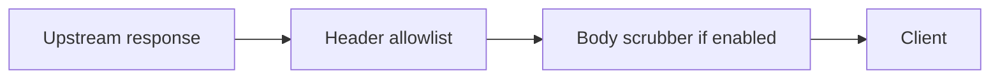


| Layer                    | What gateway censors                                                                                                                                                | Provable / testable obligation                                   |
| ------------------------ | ------------------------------------------------------------------------------------------------------------------------------------------------------------------- | ---------------------------------------------------------------- |
| **Response headers**     | Strip all except `[route.headers.response].allow`; drop `x-internal-`*, `set-cookie` unless explicitly allowed                                                      | `ensures ∀ h ∈ out.headers, h.name ∈ policy.response.allow`      |
| **Error bodies**         | Upstream 4xx/5xx with HTML/stack trace → **generic JSON** (`{"error":"upstream_error","request_id":"..."}`) unless route `expose_upstream_errors = true` (dev only) | `ensures ¬expose → out.body ∉ UpstreamRawError`                  |
| **JSON fields**          | Denylist paths: `$.api_key`, `$.env.`*, `$.system_prompt`, `$.tool_result.internal_*` — replace with `null` or `"[REDACTED]"`                                       | Bounded walker; `ensures` no output field name ∈ denylist        |
| **Pattern scrubber**     | Literal + typed detectors (see below) on **every** chunk before flush                                                                                               | `ensures` scanner bounded; on hit → redact or **502** per policy |
| **SSE / chunked stream** | Scrub **per event** / per chunk; cancel upstream if leak repeats N times                                                                                            | `ensures` bytes forwarded to client = scrub(bytes_upstream)      |
| **Logs / metrics**       | `**li-log`** + `redact_log()` — secrets never in access/audit/error sinks                                                                                           | `ensures` on log procs; Tier G `leak_logged_secret.toml`         |


**Easy TOML — global off switch + per-route override:**

```toml
# Global default — user may disable censorship entirely
[leak_censor]
enabled = false                 # true = scrub on routes that do not override

[route.leak_censor]
enabled = true                  # overrides global for this route only
on_detect = "redact"            # redact | block_502 | abort_stream
max_scrub_bytes = "4m"

[route.leak_censor.headers]
deny_names = ["x-api-key", "x-debug-stack"]

[route.leak_censor.json]
deny_paths = ["$.api_key", "$.secret"]   # often auto-filled by setup-censor
include_generated = true               # merge leak_censor.generated.toml

[route.leak_censor.patterns]
allow = ["openai_sk", "pem_private", "jwt_bearer"]   # enum IDs only
```

| Config | Behavior |
| ------ | -------- |
| `[leak_censor] enabled = false` | **No body/SSE scrub**; response header allowlist still applies (separate feature) |
| Route omits `[route.leak_censor]` | Inherit global `enabled` |
| `include_generated = true` | Merge paths from setup (below) |
| `profile = production` + `enabled = false` | **Warn** in validate-config; allow if `ack_disable_censor = true` |

Detectors are **built-in enums** in `packages/li-http/leak_detect.li` — not user regex.

#### `li-httpd setup-censor` — schema from migrations (server setup)

Runs as part of **`li-httpd setup`** (with `setup-tls`) or standalone after the user has applied DB migrations.

```bash
li-httpd setup-censor \
  --migrations ./db/migrations \
  --dialect postgres \
  --openapi ./api/openapi.yaml    # optional: response field paths
```

**Inputs (v1):**

| Source | Extracts |
| ------ | -------- |
| **SQL migrations** (`*.sql`) | `CREATE TABLE` / `ALTER ADD` column names → sensitive if name ∈ `{password, secret, token, api_key, private_key, ssn, ...}` or `-- li:censor` comment |
| **Applied manifest** (optional) | `--migrations-applied migrations_applied.toml` — only tables/columns that exist in prod |
| **OpenAPI / JSON Schema** (optional) | Response object properties marked `format: password` or extension `x-li-censor: true` |
| **Agent routes default** | Always suggest OpenAI-shaped paths: `$.choices[*].message.tool_calls[*].raw_stderr` |

**Output:** `leak_censor.generated.toml` (checked in or gitignored per team policy):

```toml
# generated by li-httpd setup-censor @ 2026-05-16T12:00:00Z
# source: db/migrations/003_api_keys.sql
[generated.json_paths]
paths = [
  "$.api_keys[*].token",
  "$.users[*].password_hash",
  "$.settings.secret_value",
]

[generated.headers]
deny_names = ["x-internal-api-key"]
```

**Merge at validate-config:** `deny_paths = user_paths ∪ generated_paths` when `include_generated = true`. **`explain-config`** prints merged censor policy.

**SQL migration convention (documented):**

```sql
-- li:censor
ALTER TABLE api_keys ADD COLUMN token TEXT NOT NULL;
```

Explicit marker always generates `$.api_keys[*].token` (and table-qualified variants).

**Package:** `packages/li-schema/` — parse SQL (subset), build `SchemaCatalog`, map column → JSONPath heuristics (`snake_case` → `$.snake_case`, nested `users.password` → `$.users[*].password`).

**Proof:** when `enabled = false`, censor procs are **not invoked** (`ensures bypass_censor → out = forward_raw` disallowed for headers-only path — header allowlist still runs). When enabled, same obligations as before.

**Proof + probability story:**

- **Deterministic:** header allowlist, JSON path denylist, bounded buffer, no forward until scrub pass completes on chunk (or redact in place within cap).
- `**prob_ensures`:** for configured detector set `D`, bound false-negative rate on corpus `C` in CI: `P(leak in C reaches client) < ε` via Monte Carlo + golden leak fixtures.
- **Tier G exploits** (`exploits/leak_*.toml`): run with `leak_censor.enabled = true` in server config — expect **redact** or **502**; separate row `censor_disabled.toml` confirms passthrough when user turned censorship off (documented insecure mode).

**What censorship cannot guarantee (honest limits):**


| Limit                         | Why                                                                                 |
| ----------------------------- | ----------------------------------------------------------------------------------- |
| Unknown secret formats        | No detector → may pass until someone adds an ID to `patterns.allow`                 |
| Encoded / split across chunks | Base64 split across SSE events needs reassembly buffer (bounded; `max_scrub_bytes`) |
| Side channels                 | Timing, response size, model metadata — need app cooperation, not just proxy        |
| Client already compromised    | Censor protects **egress to untrusted clients**, not insider with upstream access   |
| WebSocket binary (M2)         | Needs binary scrubber profile; same architecture, later milestone                   |


**Recommended (not forced):** enable censorship on public `proxy:*` routes after `setup-censor`; validate-config prints **hint** if global and route both disabled on public listeners.

**vs nginx:** nginx has no schema-driven scrub; li-httpd generates policy from **your migrations** at setup time.

**Packages:** `packages/li-http/leak_censor.li`, `leak_detect.li`, `packages/li-schema/` (migration parser); tests `li-tests/leak_censor/`, `li-tests/schema_catalog/`, `benchmarks/tier5_http/exploits/leak_*.toml`.

**CLI:** `li-httpd setup` orchestrates `setup-tls` → **`setup-censor`** → write default `li-httpd.toml` stub with `# include generated censor file`.

---

### Logging engine (`packages/li-log`) — we build it

**No third-party log libraries** (no spdlog, zap, winston). `li-log` is a **publishable package** with secure defaults; `li-httpd` depends on it for every line emitted.

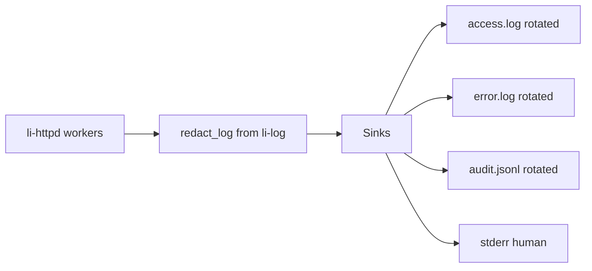


#### Defaults (best practices — zero config beyond path)


| Default                  | Value                                                                                                             | Why                                                                   |
| ------------------------ | ----------------------------------------------------------------------------------------------------------------- | --------------------------------------------------------------------- |
| **Timestamp**            | RFC3339 UTC `2006-01-02T15:04:05.000Z` in human lines; `ts` field in JSON                                         | Sortable, grep-friendly, operator-standard                            |
| **Rotation**             | **On** — `max_size = "100m"`, `max_age = "7d"`, `max_backups = 10`, `compress = true`                             | Disk cannot fill silently                                             |
| **Line format (access)** | `ts level request_id route peer status latency_ms bytes_in bytes_out`                                             | One line per request; no multiline bodies                             |
| **Line format (error)**  | `ts level request_id msg` + optional `err` code enum                                                              | No stack traces to clients; stacks only at `level=error` in error log |
| **Audit**                | **JSONL** one object per line — `api_key_id`, `route`, `model`, `decision`, `tokens`, `latency_ms`                | Ship to Loki/ELK without a parser fork                                |
| **Secret redaction**     | **Always on** — `Authorization`, `Cookie`, detector hits, pre-censor bodies never logged                          | Wired to `leak_detect` IDs + header denylist                          |
| **File mode**            | `0640`, create dir `0750`                                                                                         | Group-readable, not world                                             |
| **Flush**                | Async queue per worker; `ensures` queue bounded; drop **oldest** diagnostic on overload (never block accept loop) | Agent bursts must not stall TLS                                       |
| **stderr**               | Human color optional `color = "auto"` when TTY                                                                    | Dev ergonomics                                                        |
| **Startup banner**       | One line: version, config hash, listen addresses, log paths                                                       | Supportability                                                        |


#### Easy TOML

```toml
[log]
# omitted = all defaults below apply
dir = "/var/log/li-httpd"
level = "info"              # trace | debug | info | warn | error
format = "human"            # human | json — per-sink override allowed

[log.access]
path = "access.log"         # under dir; rotated automatically
format = "human"

[log.error]
path = "error.log"
level = "warn"

[log.audit]
path = "audit.jsonl"
format = "json"
enabled = true              # required on public listeners (validate-config)

[log.rotation]
max_size = "100m"
max_age = "7d"
max_backups = 10
compress = true

[log.redact]
headers = ["authorization", "cookie", "x-api-key"]
patterns = ["openai_sk", "jwt_bearer", "pem_private"]   # same enum IDs as leak_censor
```

Desugar: if `[log]` absent → use defaults with `dir = "./logs"` for dev profile.

#### API (proved core)

```nim
type LogLevel = enum trace, debug, info, warn, error

proc log_access(e: AccessEvent) raises Log
  ensures e.authorization == Redacted or e.authorization == Absent

proc log_audit(e: AuditEvent) raises Log
  ensures ∀ k ∈ e.fields, k ∉ SecretFieldNames

proc redact_log(msg: string) -> string
  ensures no SecretPattern in result
```

- Effect `**raises Log**` — separate from `IO`/`Net`; only `li-log` performs file I/O (thin `extern` write/rotate in `li_rt_log.c` if needed).
- **Hot reload:** `SIGUSR1` reopens log files (rotation-safe) — same pattern as nginx `reopen`.

#### Channels (li-httpd wiring)


| Channel     | M1                     | M1.5                                                              |
| ----------- | ---------------------- | ----------------------------------------------------------------- |
| **access**  | every request complete | + `stream_duration_ms`, `upstream_peer`                           |
| **error**   | parse/proxy/TLS errors | + scrub hit counts                                                |
| **audit**   | —                      | allow/deny, rate limit, model route, token/cost fields            |
| **metrics** | —                      | Prometheus on `:metrics` (separate from log files; shares labels) |


`Prometheus` stays a **metrics endpoint**, not a log backend — but histograms use the same `request_id` / route labels as audit JSONL.

#### Tests + exploits

- `li-tests/log/` — rotation creates `access.log.1.gz`, timestamp format golden, redaction golden
- `li-tests/log/exploits/` — log line must not contain injected `sk-...` from upstream response
- Tier G extension: `leak_logged_secret.toml` — upstream leak → censored on wire **and** absent from `audit.jsonl`

#### Docs

- `docs/superpowers/specs/li-log.md` — sinks, rotation, redaction contract
- `PUBLISH.md` in `packages/li-log/` — reusable by non-httpd binaries later

---

### Approach: rate limiting (agent workloads)

Agents generate **few connections, long streams, bursty JSON** — limits differ from CDN/static traffic.


| Limit type              | Purpose                      | Config key (schema-capped)                 |
| ----------------------- | ---------------------------- | ------------------------------------------ |
| **Requests/sec**        | burst chat/tool calls        | `requests_per_sec`, `burst`                |
| **Concurrent streams**  | open SSE/chunked completions | `concurrent_streams` (critical for agents) |
| **Connections per key** | slowloris / conn exhaustion  | `max_connections`                          |
| **Ingress bytes/sec**   | huge prompt bodies           | `bytes_in_per_sec`                         |
| **Stream duration**     | runaway generation           | `stream_max_duration`                      |
| **Inter-chunk idle**    | hung upstream token stream   | `stream_idle_timeout`                      |
| **TTFB**                | slow first token             | `ttfb_timeout`                             |


**Key selection (enum, not free string):**

- `api_key` — from `Authorization: Bearer` (hash at edge, never log raw)  
- `agent_id` — from allowlisted `x-agent-id`  
- `ip` — optional for internal routes only (config must say `allow_ip_key = true`)

**Secure by design:**

- Public routes: **must** define `[route.rate_limit]` — validator error if missing  
- User cannot set `requests_per_sec = unlimited` — schema max + default below nginx-equivalent abuse threshold  
- On deny: **429** + `Retry-After` (proved header present) + structured log (no body leak)

```toml
[route.rate_limit]
key = "api_key"
requests_per_sec = 60
burst = 30
concurrent_streams = 100
stream_max_duration = "600s"
stream_idle_timeout = "120s"
```

**Implementation:** token bucket per key in shared memory (per-worker v1; document sharding in M2). Proved: `check_rate` returns within bounded time; `decreases` on window bookkeeping.

**Bench:** `rate_limit_429`, `stream_cap_exceeded`, `sse_long_stream` scenarios in tier5_http.

---

### Streaming (M1.5 — core agent path)


| Mechanism                     | Support                                                       |
| ----------------------------- | ------------------------------------------------------------- |
| **SSE** (`text/event-stream`) | First-class; flush per event boundary                         |
| **Chunked HTTP/1.1**          | Upload/download streams                                       |
| **Client disconnect**         | Cancel upstream + free buffers (`ensures` resources released) |
| **HTTP/2 DATA**               | M2 for multiplexed streams                                    |


**Not in v1:** bidirectional gRPC streaming (M3/RFC); use HTTP + WS for tools in M2.

---

### Model / agent routing (M1.5)

Route to different upstream pools without user-controlled URLs:

```toml
[[route.match]]
header = "x-model"
value = "gpt-4"
proxy = "pool_gpt4"

[[route.match]]
header = "x-model"
value = "claude-3"
proxy = "pool_claude"
```

- `value` must be enum/literal in config — not regex from operator  
- Unknown model → **404** with safe JSON body (no upstream leak)

Optional: path prefix `/v1/models/{model}/` with same literal map.

---

### Other agent-native features (phased)


| Feature                     | Milestone | Why                                                                             |
| --------------------------- | --------- | ------------------------------------------------------------------------------- |
| **API key / mTLS auth**     | M1        | identity for rate keys; reject unauthenticated on public listeners              |
| **Request cancellation**    | M1        | client close → upstream abort (save GPU)                                        |
| **Idempotency-Key**         | M1.5      | forward only if in ingress allowlist; optional dedup hint header to backend     |
| **OTel (traceparent)**      | M1.5      | required on inference routes; inject if missing internal edge                   |
| **Inference health**        | M1.5      | `/ready` (model loaded) vs `/live` (process up) on peers                        |
| **JSON body default**       | M1        | `content-type` validation on POST routes                                        |
| **Queue / backpressure**    | M2        | 429 when all peers saturated; `Retry-After` from proved policy                  |
| **Circuit breaker**         | M2        | open circuit after peer error rate; half-open probe                             |
| **WebSocket**               | M2        | tool / agent bidirectional channels                                             |
| **Webhook egress policy**   | M2        | if gateway calls agent callbacks — URL allowlist type (SSRF-safe)               |
| **Token budget hook**       | M3        | header `x-token-budget` → rate dimension (app cooperates; gateway enforces cap) |
| **HTTP/2 multiplex**        | M2        | many streams per connection                                                     |
| **TLS 1.3 + auto certs**    | M1.5      | `setup-tls`, self-signed dev, Let's Encrypt ACME + renew                        |
| **OpenAI-compatible `/v1`** | M1        | drop-in `base_url` for agents (chat/completions, models list)                   |
| **Upstream keepalive pool** | M1        | reuse connections to inference nodes; avoid stale-pool 400s                     |
| **Stream stall detector**   | M1.5      | idle between SSE chunks → 504 + cancel (community #1 proxy pain)                |
| **Cost / token accounting** | M1.5      | per `api_key` prompt/completion tokens + optional USD estimate in logs          |
| **Fallback model chain**    | M2        | primary upstream fails → next model in TOML enum chain                          |
| **Response cache**          | M2        | optional semantic or exact cache per route (TTL in schema)                      |
| **Cold-start queue**        | M2        | buffer requests while peer `/ready` false; max queue in config                  |
| **Canary / mirror traffic** | M3        | % traffic to shadow upstream for safe rollouts                                  |
| **Provider format bridge**  | M2        | OpenAI ↔ Anthropic tool/message shapes at edge (optional route flag)            |
| **Logging (`li-log`)**      | M1        | access + error logs, rotation, RFC3339, redact-by-default                       |
| **Audit log**               | M1.5      | JSONL via `li-log` audit sink: key id, model, latency, tokens, decision         |
| **Prometheus `/metrics`**   | M1.5      | RPS, streams, 429s, upstream latency histograms (labels match audit)            |


---

### Community research — what operators ask for (Reddit-adjacent)

**Note:** Reddit search/API returned **403** in this environment; synthesis uses the **same communities** (r/LocalLLaMA, r/selfhosted, r/devops patterns) via HN, GitHub wishlists, and Ollama/nginx operator guides that quote those pain points.


| Source                                                  | Recurring asks                                                                                         |
| ------------------------------------------------------- | ------------------------------------------------------------------------------------------------------ |
| **Ollama + nginx threads** (LocalLLaMA ecosystem)       | Auth in front of Ollama (it has none), `proxy_buffering off`, **long read timeouts**, TLS, rate limits |
| **LiteLLM proxy** (HN #37095542, GitHub #361)           | Per-user **budgets**, spend dashboard, **fallback** models, caching TTL, multi-provider routing        |
| **Self-hosted routers** (Routerly, NadirClaw, routiium) | OpenAI-compatible URL, **cost tracking**, auto route cheap vs expensive models                         |
| **A3S / APISIX AI gateway** docs                        | **Unbuffered streaming**, token rate limits, **queue on cold start**, circuit breaker, prompt guards   |
| **Agent infra posts** (2025)                            | Observability, trace IDs, **multi-tenant keys**, burst scaling, health checks                          |
| **Client bugs** (OpenCode, LangChain)                   | Proxies that **hang silently** on SSE — need idle-chunk timeouts + cancel                              |


**Mapped to li-httpd (prioritized backlog):**


| Priority | Feature                                 | Milestone    | Rationale from community                             |
| -------- | --------------------------------------- | ------------ | ---------------------------------------------------- |
| P0       | OpenAI-compatible `/v1` + SSE no-buffer | M1           | Every agent SDK expects this                         |
| P0       | API keys + rate limits + header policy  | M1           | Ollama exposed without auth is top self-host mistake |
| P0       | `stream_idle_timeout` + client cancel   | M1.5         | Silent hangs dominate support threads                |
| P1       | Cost/token logs per key                 | M1.5         | “How much did agents spend?” — LiteLLM #1 wish       |
| P1       | Let's Encrypt + TLS 1.3                 | M1.5         | Public agent endpoints                               |
| P1       | Model routing + LB + `/ready` health    | M1–M1.5      | Multi-GPU / multi-model homes                        |
| P2       | Fallback chain + retry                  | M2           | LiteLLM core value prop                              |
| P2       | Queue while backend cold                | M2           | Scale-to-zero GPU pods                               |
| P2       | Prometheus + audit log                  | M1.5         | Production agent fleets                              |
| P3       | Response cache                          | M2–M3        | Cost savings; cache poisoning → strict cache keys    |
| P3       | Canary/mirror                           | M3           | Safe model updates                                   |
| P3       | Prompt guard / moderation               | M3           | Enterprise; keep out of minimal LOC core             |
| —        | Admin UI / 50-model dashboard           | **non-goal** | Use TOML + Grafana; not li-httpd’s job               |


**Config sketch (community-driven additions):**

```toml
[server.api]
openai_compatible = true
base_path = "/v1"

[route.fallback]
chain = ["pool_gpt4", "pool_claude", "pool_local"]

[route.cache]
enabled = true
ttl = "5m"
key = ["model", "api_key"]   # never user-supplied body fields alone

[route.queue]
max_wait = "30s"
max_depth = 100              # when peers not ready
```

**Reddit follow-up (manual):** periodically search r/LocalLLaMA, r/selfhosted, r/MachineLearning for `ollama proxy`, `litellm`, `vllm production`, `openai compatible gateway` — append to `docs/research/community-backlog.md` (living doc).

**Explicit non-goals (agent edition):** HTML caching, `if`/`rewrite`, browser-oriented optimizations, arbitrary third-party modules, **full LiteLLM feature parity**.

---

### Milestone map (agent-native)


| Milestone | Ships                                                                                                           |
| --------- | --------------------------------------------------------------------------------------------------------------- |
| **M1**    | HTTP/1.1, **route DSL + routing test suite**, OpenAI `/v1`, proxy, LB, headers, limits, auth, validate-config   |
| **M1.5**  | SSE + **stall detector**, stream caps, model routing, TLS auto, **metrics + audit + cost logs**, cancel, traces |
| **M2**    | HTTP/2, WS, circuit breaker, **fallback chain**, **cold queue**, optional cache, gzip off on SSE                |
| **M3**    | Token-budget integration, L4 optional                                                                           |


LOC: agent features live in `std/http/agent/` — still count toward cap; drop static-file polish before dropping stream limits.

---

## What Li must gain (language + compiler + semantics)

### 1. Finish pillar 1 for real (blocker for everything)

Before any “ultra secure” claim ships:

- **2e:** VC generation from `requires`/`ensures`/`invariant`/`decreases`
- **2f:** `lic build` invokes Lean 4 kernel; cache by VC hash
- **MIR:** proved bounds on dynamic indices (today: partial — see [architecture overview](docs/architecture/overview.md))
- `**li-tests`:** expand `verify_ok` / `verify_fail` beyond skeleton ([contracts_verify](li-tests/contracts_verify/))

Without this, a webserver is “memory-safe-ish C++ via LLVM,” not Li’s thesis.

### 2. Systems type + memory model for wire protocols

From the [design spec](docs/superpowers/specs/2026-05-14-li-language-design.md):

- `**bytes` / `bytearray` / `memoryview[T]` / `stringview`** with linear ownership for parse buffers
- `**ringbuffer[N, T]`** (already on roadmap) for socket read paths without per-read `Alloc`
- **Refinement types for protocol limits:** e.g. `HeaderName = {s: stringview | len(s) <= 256}`, `BodyLen = {n: u64 | n <= max_body}`
- `**Reader` / `Writer` protocols** (PEP 3.14 direction) for incremental parse
- `**checked int` / `wrapping int`** for length arithmetic in parsers (forbid silent overflow)

### 3. Effects and IO model

Extend effects beyond `raises IO` / `raises Alloc`:


| Effect         | Use                                        |
| -------------- | ------------------------------------------ |
| `raises Net`   | Socket create/bind/listen/accept/send/recv |
| `raises Async` | Await on reactor (spec already mentions)   |
| `raises Proc`  | Worker fork/exec (master/worker model)     |


**Rule:** user handlers prove against **abstract** `Net`/`Async` in Lean; implementations live in trusted runtime + thin `extern` only where unavoidable.

### 4. Concurrency (small surface)

- **Workers = cores**; one async event loop per worker — no thread pool until benchmarks require it
- epoll/kqueue for M1 only
- `parallel for` **not** used on the connection path

Prove:

- No cross-worker mutable aliasing without `Sync`
- Connection state machine transitions are total (`decreases` on state depth)
- Timeouts and body draining always advance or close (no stuck connections)

### 5. Async runtime (language + std)

Ship:

- `async proc` / `await` lowering to state machines (MIR)
- Timer wheel, cancellation, backpressure
- Integration with reactor: readiness → resume tasks

Benchmark gate: see **Nginx benchmark harness** below — correctness and config parity before any published RPS numbers.

### 6. No dynamic modules (LOC + security)

Extensibility = edit `li-httpd.toml` and redeploy, or fork li-httpd. **No** `.so` plugins in M1–M2.

---

## Stdlib and libraries to build (new `std/net`, `std/http`, `std/tls`, `std/crypto`)

### Layer 0 — OS interface (trusted, minimal)

Expand [trusted.lean](docs/semantics/trusted.lean) **only** with:

- File descriptors as opaque `Fd`
- `read`/`write`/`recv`/`send`/`poll`/`epoll_wait` as axioms with **contracts** (bytes written ≤ buffer len, no phantom FDs)
- **Not** the whole HTTP stack

Prefer **one** audited syscall shim in C (`li_rt_net.c`) called from Li via `extern proc` with full contracts — keeps kernel ABI in one place.

### Layer 1 — TCP/UDP + DNS

- `TcpListener`, `TcpStream`, `UdpSocket`
- Non-blocking mode + edge/level triggered readiness
- DNS resolver (async; bounded cache; proved cache size)

### Layer 2 — HTTP/1.1 (first shipping milestone)

Proved components:

- **Request-line + header parser** (state machine + `invariant` on cursor ≤ buffer.len)
- **Chunked encoding** (proved termination via `decreases` on remaining chunk bytes)
- **Response serializer**
- **Connection lifecycle** (keep-alive limits)

Security properties to **prove** (examples):

- No read past buffer end
- Total header bytes ≤ `max_header_bytes` ⇒ reject before `Alloc`
- Body read loops terminate or return `413`/`408`
- No unbounded header continuation without `decreases`

Fuzz + differential tests against nginx/httpbin (outside Lean, CI).

### Layer 3 — Reverse proxy + stream

- Upstream selection, health checks (state machines with contracts)
- Full-duplex TCP proxy (`stream` module analog)
- WebSocket upgrade (proved handshake state machine)

### Layer 4 — HTTP/2 + compression

- HPACK (dynamic table bounds proved)
- Huffman (constant stack or bounded heap)
- gzip/brotli: start as **optional modules**; compression bombs mitigated by proved output size caps

### Layer 5 — HTTP/3 / QUIC (nginx 1.25+ territory)

Largest sub-project: QUIC state machine, loss recovery, TLS 1.3 integration. Plan as **separate program** once HTTP/2 + Li TLS stable.

---

## Pure Li crypto (your choice) — architecture

**Functional correctness** (Lean): algorithm specs (AES-GCM, ChaCha20-Poly1305, X25519, ECDSA, RSA-PSS, SHA-2/3) match reference vectors.

**Side-channel resistance** (partially axiomatic): full timing proofs are research-grade; pragmatic approach:

1. `**packages/li-crypto`** — implementations in Li with:
  - `requires`/`ensures` on lengths and key sizes
  - No secret-dependent branches / indices **enforced by checker + lint** where possible
2. `**trusted.lean` axioms** only for syscall/RNG seam; constant-time may be axiomatic per primitive until measured
3. **Roadmap:** v1 ship **Li-written ChaCha20-Poly1305 + X25519 + TLS 1.3** in `li-crypto` / `li-tls`; optional later `**packages/li-crypto-hacl`** (proved `extern` to HACL*/Fiat) — you publish separately, not a dev blocker

TLS stack in Li:

```
TLS = record_layer + handshake_state_machine + cert_parser(X.509 subset) + LiCrypto
```

Prove: handshake states only advance on valid messages; transcript hash matches; no buffer overflow on cert chains (depth/size limits as refinements).

**Reality check:** “Pure Li crypto” for production TLS still needs **audited** constant-time and platform RNG (`getrandom`) in trusted base — document in RFC.

---

## Randomness: deterministic proofs + probabilistic contracts + OS uniformity

Randomness is **in scope** end-to-end: deterministic `Prng` proofs, **probabilistic `prob_ensures`** (Monte Carlo + Lean measure theory), an explicit **uniform `OsRng` contract** for `getrandom`, and **configurable `Prng` for TLS** (lab vs production profiles). Simulation and Tier F exploits are how we **validate** probabilistic claims at runtime—not a substitute for specs, but part of the certificate story.

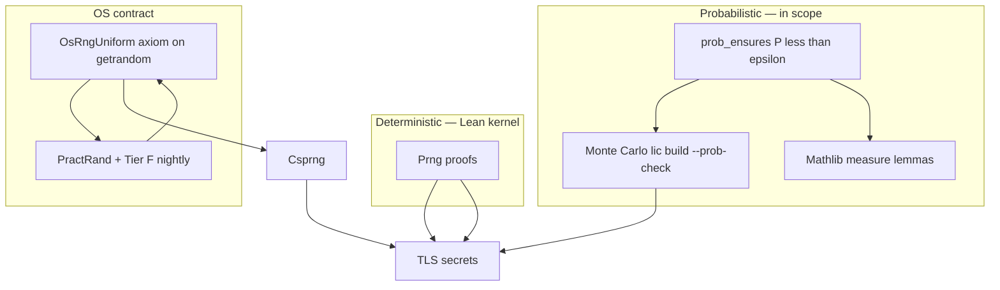


### Concept A — `Prng` (deterministic, fully provable)

For benchmarks, tests, load-balancer tie-breaks, fuzz **schedules**, and any “random” that must **replay**:


| Property | Treatment                                                                                                             |
| -------- | --------------------------------------------------------------------------------------------------------------------- |
| State    | `type Prng = object` with opaque `state: uint64[4]` (e.g. xoshiro256)                                                 |
| Step     | **Pure** `prng_next(p: var Prng) -> uint64` with `ensures` state advances, no I/O                                     |
| Seed     | `prng_seed(p: var Prng, seed: uint64)` — total, deterministic                                                         |
| Proofs   | No OOB; `decreases` on batch fill loops; optional lemma “different seeds → different first output” for test PRNG only |
| Package  | `packages/li-rng/prng.li` — **no** `raises Rng`                                                                       |


Aligns with existing bench rule: **deterministic seeds** in `params.toml` ([benchmarks plan](docs/superpowers/plans/2026-05-14-benchmarks-and-simulations.md)).

### Concept B — `Csprng` + `raises Rng` + **uniform OS contract**

For TLS key shares, IVs, session tickets, ACME account keys (default source):


| Property                          | Treatment                                                                                                                                                           |
| --------------------------------- | ------------------------------------------------------------------------------------------------------------------------------------------------------------------- |
| Effect                            | `raises Rng` (separate from `IO` / `Net`)                                                                                                                           |
| API                               | `fill_bytes(r: var Csprng, buf: var bytes) raises Rng` — deterministic `ensures` on length, no partial read without error                                           |
| Implementation                    | `extern` → `getrandom` / `BCryptGenRandom` in `li_rt_rng.c`                                                                                                         |
| **Uniformity (in scope)**         | Named contract `OsRngUniform` in `trusted.lean`: outputs on `{0..255}^n` are **i.i.d. uniform** (formalized in Lean via `Finset.uniformity` / measure on `Fin 256`) |
| **Derived (proved in user code)** | From `OsRngUniform` + TLS construction: `prob_ensures collision_iv < ε` for N records; `prob_ensures guess_session_id < 2^-128`                                     |
| **Evidence (not a fake proof)**   | Nightly PractRand + Tier F on live binary **bound empirical divergence** from axiom; failure → downgrade release or fix OS/seam                                     |


```lean
-- trusted.lean — explicit RNG contract (RFC-reviewed, still minimal)
axiom rng_fill_bytes : (n : Nat) → IO (Vector UInt8 n)

/-- OS CSPRNG: i.i.d. uniform bytes. Evidence obligations in CI, not sorries. -/
axiom OsRngUniform :
  ∀ n (k : Vector UInt8 n),
    Pₒₛ(output = k) = (1 / 256) ^ n
```

User modules **prove implications** from `OsRngUniform`; they do not re-prove physics of `/dev/urandom`. Wrong axiom + passing Tier F = **spec bug** (same class as wrong `ensures`).

**Default production:** `[server.rng] mode = "os"`. `**Prng` for TLS is allowed** when explicitly configured (see Concept D + config profiles)—not banned by the typechecker.

### Concept C — `RngSource` trait + **simulation** (testing without lying to Lean)

**Simulation technique:** parametrize crypto-adjacent code over an `**RngSource`** interface; prove against the interface; swap implementation at link time or via test-only module.

```nim
type RngSource = object
  VTable  # fill_bytes, maybe label for logs

proc tls_generate_iv(src: RngSource, ...) -> bytes
  requires ...
  ensures result.len == IV_LEN
  # deterministic ensures + prob_ensures on collision given OsRngUniform or PrngSeed
```


| Implementation | Use                                                                                          |
| -------------- | -------------------------------------------------------------------------------------------- |
| `OsCsprng`     | Default production — `OsRngUniform` contract                                                 |
| `PrngRng`      | **Allowed** — `fill_bytes` from `Prng`; TLS secrets OK when `mode = "prng"` + seed in config |
| `SimRng`       | Tests / replay — schedule or seed from TOML                                                  |
| `BadRng`       | Tier F — adversarial; must drive `prob_ensures` failure or safe abort                        |


### Concept D — **Probabilistic Hoare** (`prob_ensures`) — **in scope**

Li extends contracts with **probability bounds**, discharged by **Lean (measure theory)** and/or **Monte Carlo evidence** at build time.

```nim
proc issue_iv(r: RngSource, key_id: uint64) -> bytes
  requires ...
  ensures result.len == IV_LEN
  prob_ensures collision_iv(key_id, result) < 1e-12
    given OsRngUniform
    samples 100_000   # Monte Carlo trials for lic build --prob-check
```


| Mechanism                                  | Role                                                                                                                            |
| ------------------------------------------ | ------------------------------------------------------------------------------------------------------------------------------- |
| `prob_ensures Q < ε`                       | VC obligation: prove `Q` from axioms **or** estimate `P(Q)` by simulation with Chernoff/confidence bound ≥ requested confidence |
| `given OsRngUniform` / `given PrngSeed(s)` | Hypothesis for the probability space                                                                                            |
| `lic build --prob-check`                   | Runs MC harness; fails if empirical `P̂(Q) > ε` at confidence `1-δ`                                                             |
| `packages/li-prob/`                        | Sampling, collision estimators, Lean export of finite-support lemmas                                                            |
| Mathlib                                    | `ProbabilityTheory`, finite product measures for byte vectors                                                                   |


**Monte Carlo is not “instead of proof”:** for finite combinatorial events (IV collision in N draws, duplicate session id in N handshakes), MC **estimates** `P` with a **reported confidence interval** attached to the build log. For structural implications (`OsRngUniform → prob_ensures`), Lean proves the implication; MC validates the **axiom’s** empirical plausibility on the shipped binary.

**Tier F + probabilistic:** exploits with `BadRng` must violate `prob_ensures` predictions (handshake abort rate, collision rate) — ties runtime attacks to probabilistic specs.

### Concept E — **Config: `Prng` on TLS allowed (profile-gated)**

```toml
[server.rng]
mode = "prng"       # os | prng | sim | bad (bad = exploit harness only)
seed = 42
```


| Profile                | `mode = "prng"` for TLS                                                 |
| ---------------------- | ----------------------------------------------------------------------- |
| `dev` / `lab`          | **Allowed** — `lic validate-config` warns: `insecure_rng_prng_tls`      |
| `production` (default) | **Rejected** unless `allow_insecure_rng = true` (explicit escape hatch) |
| `prob-test`            | Allowed for MC reproducibility                                          |


Typed config records `RngMode` enum; **no effect lint ban** on `Prng` feeding TLS—policy is **validate-config + ship profile**, not compiler rejection.

`**li-tests/rng/`:**

- Golden vectors: seed → N outputs (xoshiro / ChaCha20 DRBG vectors)
- **Replay:** `SimRng` schedules
- `**li-tests/prob/`:** MC estimators, CI for `prob_ensures` discharge helpers
- **PractRand / SP 800-22:** **evidence for `OsRngUniform` axiom** — failure blocks release (M1.5+)

### HTTP / li-httpd usage


| Need                         | Mechanism                                                                           |
| ---------------------------- | ----------------------------------------------------------------------------------- |
| TLS 1.3 keys / IVs (default) | `mode = "os"` + `prob_ensures` collision bounds                                     |
| TLS with fixed seed (lab)    | `mode = "prng"` + `seed` — **allowed**; warns in dev; blocked in production profile |
| Session ID                   | Same `RngSource`; probabilistic uniqueness under `OsRngUniform`                     |
| LB `random` two pick         | `Prng` — deterministic; no probabilistic claim                                      |
| Exploit: predictable nonce   | Tier F + must break `prob_ensures` or safe-abort under `BadRng`                     |


### RNG exploit testing (mandatory — Tier F)

Proofs do not replace **runtime** checks that the trusted RNG seam and TLS code behave under adversarial entropy. Every RNG-related invariant gets a **Tier F** row in `nginx_mitigations.toml` and a matching `exploits/rng_*.toml`.

**Injection (li-httpd only):** harness sets server RNG from TOML — nginx/OpenSSL cannot use `BadRng`; compare nginx on **behavioral** rows only where injection is N/A.

```toml
# scenarios/tls_handshake/bench.toml (or exploit-only overlay)
[server.rng]
mode = "bad"              # os | sim | bad | prng
bad_pattern = "constant"  # constant | repeat | short_cycle | partial_fill
bad_seed = 0
sim_schedule_file = "fixtures/rng_low_entropy.bin"   # when mode = sim
```

`exploit_http.py` merges `[server.rng]` into li-httpd env / config before `[attack]`; restarts server per exploit.

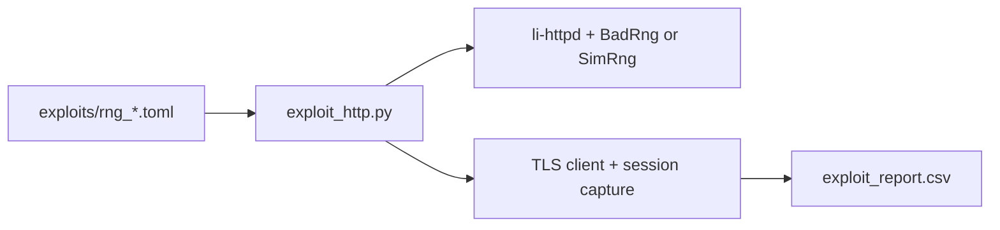


**Tier F exploit files** (`benchmarks/tier5_http/exploits/`):


| File                              | `bad_pattern` / attack                           | `[expect]` (li-httpd)                                                                                                                                              |
| --------------------------------- | ------------------------------------------------ | ------------------------------------------------------------------------------------------------------------------------------------------------------------------ |
| `rng_constant_bytes.toml`         | All-zero `fill_bytes`                            | `tls_handshake_fails` or `no_duplicate_record_keys`; `no_crash`                                                                                                    |
| `rng_repeat_iv.toml`              | Same 12 bytes every IV call                      | Connection closed; no two records share key+IV pair                                                                                                                |
| `rng_short_cycle.toml`            | 4-byte repeating schedule                        | Handshake abort before application data                                                                                                                            |
| `rng_partial_fill.toml`           | Returns `len < buf.len` once                     | `no_crash`; error surfaced; no read past filled prefix                                                                                                             |
| `rng_prng_on_tls_prod.toml`       | `mode = "prng"` + `profile = production`         | `**validate_config_fails`** (policy, not crypto impossibility)                                                                                                     |
| `rng_prng_on_tls_dev.toml`        | `mode = "prng"` + `profile = dev`                | Server starts with **warning**; Tier F checks `prob_ensures` bounds for **known seed** (attacker can predict — documented)                                         |
| `rng_fork_duplicate.toml`         | SimRng: parent+child same stream after fake fork | After worker fork, `ensures` reseed — exploit expects **distinct** streams post-fork                                                                               |
| `rng_session_id_predictable.toml` | SimRng known schedule; N handshakes              | `session_id_entropy_bits >= 128` **or** `session_id_unique_across_n` when using `OsCsprng`; with `BadRng`, expect `reject_or_fail` not “success with guessable id” |
| `rng_acme_key_reuse.toml`         | BadRng during `setup-tls`                        | ACME account key not written / setup aborts                                                                                                                        |
| `rng_lb_deterministic.toml`       | `Prng` seed fixed; document only                 | Same peer sequence across restart — **pass** by spec (not a vuln)                                                                                                  |


**Example exploit TOML:**

```toml
id = "rng_repeat_iv"
tier = "F"
enabled = true
refs = ["CWE-330", "CWE-338"]

[nginx_src]
mitigation_id = "tls_record_iv_unique"
notes = "OpenSSL RAND_bytes — oracle behavior only; no BadRng inject"
li_invariant = "TLS record layer never emits two AEAD records with same (key, IV)"

[targets]
langs = ["li"]                # primary; optional nginx row = behavioral baseline
server_config = "../scenarios/tls_handshake/bench.toml"

[server.rng]
mode = "bad"
bad_pattern = "repeat"
bad_seed = 42

[attack]
driver = "python"
script = "drivers/tls_many_handshakes.py"
handshakes = 200
capture = ["session_id", "first_record_iv"]

[expect]
no_crash = true
no_duplicate_aead_iv = true
tls_handshake_fails_or_all_closed = true
legitimate_client_ok = false      # intentional — only attack traffic

[report]
severity = "critical"
pass_message = "predictable IV did not produce valid duplicate records"
```

`**li-tests/rng/exploits/**` (fast, no full server): unit-level `BadRng` into `li-rng` and `li-tls` record layer; `lic build` + `run_rng_exploits.sh` in PR when `packages/li-rng/**` changes.

`**nginx_mitigations.toml` rows** (examples):

```toml
[[mitigation]]
id = "tls_record_iv_unique"
cve = []
li_invariant = "AEAD IV unique per record under fixed key"
exploit = "exploits/rng_repeat_iv.toml"

[[mitigation]]
id = "rng_no_partial_read"
cve = []
li_invariant = "fill_bytes errors if fewer than requested bytes"
exploit = "exploits/rng_partial_fill.toml"

[[mitigation]]
id = "config_prng_tls_production_gate"
cve = []
li_invariant = "HttpdConfig rejects mode=prng for TLS on production profile unless allow_insecure_rng"
exploit = "exploits/rng_prng_on_tls_prod.toml"

[[mitigation]]
id = "prob_iv_collision_bound"
cve = []
li_invariant = "prob_ensures iv_collision < epsilon given OsRngUniform"
exploit = "exploits/rng_repeat_iv.toml"
```

**CI:**


| Profile       | RNG exploits                                                                                   |
| ------------- | ---------------------------------------------------------------------------------------------- |
| `pr`          | Tier F subset + `lic build --prob-check` on `li-rng`/`li-tls` collision lemmas                 |
| `nightly`     | Full Tier F + PractRand evidence for `OsRngUniform` + MC refresh of all shipped `prob_ensures` |
| Compare nginx | Rows marked `langs = ["nginx","li"]` only for DoS/timeouts — not BadRng injection              |


**Pass criteria (RNG-specific):** same as global exploit policy — crash/ASan/RSS + `**[expect]` booleans** on crypto outcomes. Failing Tier F with `OsCsprng` in nightly = release blocker for M1.5+.

**Docs:** extend `docs/security-http-exploits.md` with Tier F table + ethics (lab-only `BadRng`).

### Packages + docs (when executing)

- `packages/li-rng/` — `prng.li`, `rng_source.li`, `sim_rng.li`, `prng_rng.li`, `os_csprng.li`
- `packages/li-prob/` — MC estimators, `prob_ensures` discharge helpers, Lean lemma exports
- `docs/superpowers/specs/li-rng.md` — `OsRngUniform`, `prob_ensures`, evidence pipeline
- `docs/superpowers/specs/li-probabilistic-contracts.md` — syntax, MC confidence, Mathlib obligations
- `docs/semantics/trusted.lean` — `rng_fill_bytes`, `**OsRngUniform`** (explicit axiom + evidence duties)
- `li-tests/rng/` — vectors, replay, **production profile rejects prng without flag**
- `li-tests/prob/` — MC regression for shipped ε bounds
- `li-tests/rng/exploits/` — unit BadRng/SimRng (fast PR gate)
- `benchmarks/tier5_http/exploits/rng_*.toml` — Tier F integration exploits
- `benchmarks/tier5_http/harness/drivers/tls_many_handshakes.py` — capture IVs/session ids
- P0 RFC: **trusted surface budget** includes RNG lines + forbidden axioms list

### Compiler work (P0 → P2)

- **P0:** `raises Rng` effect tracking; only `li-rng` calls `extern` fill
- **P1:** parse `prob_ensures`, `given OsRngUniform` / `given PrngSeed(s)`; emit VC to Lean + MC metadata
- **P2:** `lic build --prob-check` runs MC, attaches confidence to build certificate
- **Config:** no compile-time ban on `Prng` → TLS; validate-config enforces profile policy
- `lic build --test-rng=sim` for test targets (harness)

---

## Security model: proofs first, exploits second


| Threat class                 | Li mechanism                                                           | Full nginx parity caveat                                                        |
| ---------------------------- | ---------------------------------------------------------------------- | ------------------------------------------------------------------------------- |
| Memory corruption            | Borrow + bounds + no UB                                                | Strong if `lic build` includes Lean                                             |
| Parser overflows             | Refinements + proved loops                                             | Strong for **your** parsers                                                     |
| Logic bugs in routing        | Contracts on `RequestCtx`                                              | Only as good as specs                                                           |
| Races in workers             | `Send`/`Sync` + disjoint proofs                                        | Must not share mut connection state                                             |
| TLS bugs                     | Pure Li crypto + tests                                                 | Needs crypto audit + timing story                                               |
| Weak / predictable entropy   | `OsRngUniform` + `prob_ensures`; prod gate on `prng` TLS               | MC + PractRand evidence; Tier F `BadRng`; dev allows `prng` with warning        |
| DoS (slowloris, huge bodies) | Proved limits + timeouts                                               | Match nginx `client_`* knobs; **exploit suite** must hold                       |
| Request smuggling            | Single parser front-end; no dual interpretation                        | **exploit suite** CL.TE / TE.CL cases                                           |
| Config injection             | `LiteralString` / typed config                                         | Design config as **typed Li**, not string eval                                  |
| Upstream secret leak         | **leak_censor** (headers, JSON denylist, pattern detectors, SSE scrub) | Tier G exploits; not 100% on unknown formats; `prob_ensures` on detector corpus |
| Known CVE-class bugs         | nginx-src checklist + exploit TOML                                     | li may **reject stricter** than nginx (acceptable)                              |


Li’s edge: **security = what compiles** (plus a tiny trusted base). nginx’s edge: maturity and features. li-httpd trades features for **certified core**.

**M1 ship gate:** `lic build` + `lic validate-config` on all shipped examples + **config_reject** + exploit **A+B** + LOC + bench + `**li-log` access/error with rotation smoke test**.

**M1.5 ship gate:** above + exploit **Tier F** (RNG) + **Tier G** with censorship **enabled** in test config + `setup-censor` golden; TLS scenarios enabled.

**Honesty:** wrong `ensures` → wrong theorem. Exploits + nginx audit catch that; Lean catches memory, bounds, and totality in user code.

---

## Milestones (not nginx port phases)


| Milestone | Deliverable                                                          | Exit gate                                                        |
| --------- | -------------------------------------------------------------------- | ---------------------------------------------------------------- |
| **P0**    | **2e–2f Lean gate** + bytes + `raises Net` + async reactor           | `lic build` on `parse_request` with real proofs                  |
| **P0b**   | tier5 harness + nginx audit (`li_invariant` list only)               | `nginx_mitigations.toml`; nginx bench baseline                   |
| **M1**    | Core + LB + header policy + rate limit + validate-config             | `lic build`; lb_* + rate_limit bench; config_reject; exploit A+B |
| **M1.5**  | SSE, stream caps, model routing, TLS auto (LE + self_signed), cancel | stream_* bench; staging ACME; tls config_reject                  |
| **M2**    | HTTP/2, WebSocket, circuit breaker, 429 backpressure                 | agent workload bench vs nginx                                    |
| **M3**    | Token-budget hooks, optional L4                                      | RFC only                                                         |


Drop features from M1 before raising LOC cap.

---

## Nginx benchmark harness (TOML-configurable, correctness-first)

Extend the existing [benchmarks harness](benchmarks/harness/bench.py) pattern — same CSV schema, same “verify before timing” rule as [benchmarks plan](docs/superpowers/plans/2026-05-14-benchmarks-and-simulations.md).

**Design principle:** users never edit Python to add a scenario — only TOML. `bench_http.py` merges config layers, starts servers, runs load tools, writes CSV.

### Layout

```
benchmarks/
  tier5_http/
    defaults.toml          # global: workers, warmup, ports, binary paths, load defaults
    suite.toml             # profiles (ci, nightly, baseline) + enable/disable scenarios
    fixtures/              # static files, certs (sizes from [fixtures] in defaults.toml)
    scenarios/
      static_small/bench.toml
      static_large/bench.toml
      proxy_loopback/bench.toml
      ...
    templates/
      nginx.conf.in        # rendered from bench.toml [server] (keeps nginx in sync)
  harness/
    bench_http.py          # reads TOML only
    verify_http.py         # reads [verify] from merged bench.toml
    plot_http.py
    params_schema.toml     # documented keys for tier5_http
```

`lang` column values: `nginx`, `li` (nginx **is** the reference impl).

### CLI (easy local use)

```bash
./benchmarks/harness/bench_http.py                          # default profile in suite.toml
./benchmarks/harness/bench_http.py static_small             # one scenario
./benchmarks/harness/bench_http.py --profile ci             # verify only, no timing
./benchmarks/harness/bench_http.py --profile baseline     # nginx-only baselines
./benchmarks/harness/bench_http.py static_small --set load.connections=500
./benchmarks/harness/bench_http.py static_small --render-nginx-only
```

### TOML layers (three files + optional sweep)

**1. `defaults.toml`** — machine-wide defaults:

```toml
[global]
workers = "auto"
port_base = 18080
warmup_sec = 30
measured_runs = 5

[servers.nginx]
binary = "nginx"

[servers.li]
binary = "../../../build/examples/li-httpd/li-httpd"

[load.wrk]
threads = 8
connections = 200
duration_sec = 30
pipeline = 1
```

**2. `suite.toml`** — what runs (toggle without touching scenarios):

```toml
[profiles.ci]
scenarios = ["static_small"]
timing = false

[profiles.baseline]
scenarios = ["static_small", "static_large"]
timing = true
langs = ["nginx"]

[default]
include = ["static_small", "static_large"]
exclude = ["h2_static"]
```

**3. `scenarios/<name>/bench.toml`** — self-contained scenario:

```toml
name = "static_small"
phase = "w2"
enabled = true

[server]
kind = "static"
document_root = "../../fixtures/static/1k"
sendfile = true

[verify]
requests = [
  { method = "GET", path = "/file.bin", expect_status = 200, body_sha256 = "..." },
]

[load]
tool = "wrk"
threads = 8
connections = 200

[[load.sweep]]
connections = [50, 200, 1000]
variant_prefix = "c"

[metrics]
collect = ["rps", "p50_latency_ms", "p99_latency_ms"]
```

**li-httpd** reads `[server]`, `[proxy]`, `[tls]` from the same `bench.toml`. Nginx gets a generated `.conf` from `templates/nginx.conf.in` + merged TOML (no hand-duplicated nginx.conf per scenario).

**Merge order:** `defaults.toml` ← `scenarios/*/bench.toml` ← `--set key=value` overrides.

### Add a benchmark in 2 minutes

1. `cp -r scenarios/static_small scenarios/my_bench` and edit `bench.toml`
2. Add `"my_bench"` to `suite.toml` `[default].include`
3. `./benchmarks/harness/bench_http.py my_bench`

### Fairness rules (non-negotiable for published numbers)


| Rule                  | Detail                                                                                      |
| --------------------- | ------------------------------------------------------------------------------------------- |
| **Same workload**     | Identical URL set, body sizes, `Host`, keep-alive settings from `params.toml`               |
| **Same machine**      | Pin CPU governor `performance`; record `cpu_model`, kernel, `git_sha` in CSV                |
| **Same worker model** | `worker_processes = auto` (or fixed = physical cores); li-httpd matches                     |
| **Same listen**       | `SO_REUSEPORT` on/off documented per row `variant`                                          |
| **Warmup**            | 30s wrk warmup discarded; report median of ≥5 measured runs                                 |
| **No debug**          | nginx: `nginx -V` release build; li: `lic build --release` only                             |
| **TLS parity**        | Same cert chain, cipher suite list, session tickets on/off as labeled `variant`             |
| **Filesystem**        | Static files on local ext4/APFS; preload page cache or document cold-start separately       |
| **Load generator**    | `bench.toml` `[load].tool` + optional `[[load.sweep]]` (wrk, h2load, openssl_s_time)        |
| **Correctness first** | `[verify]` must pass before `[load]`; `suite.toml` `timing = false` skips load (CI profile) |


Label rows when parity is incomplete (e.g. `variant=no_sendfile`, `variant=li_crypto_v0`) — never compare unfair configs without explicit `variant`.

### Starter scenarios (each = `scenarios/<name>/bench.toml`)


| Scenario               | `[load].tool`                  | `[metrics]`        | Milestone | Ship with `enabled` |
| ---------------------- | ------------------------------ | ------------------ | --------- | ------------------- |
| `tcp_echo`             | `tcpkali`                      | conn/s, p50        | P0        | false               |
| `static_small`         | `wrk`                          | rps, p50, p99      | M1        | true (baseline)     |
| `static_large`         | `wrk`                          | transfer_mb_s, rps | M1        | true                |
| `static_many`          | `wrk`                          | rps                | M1        | false               |
| `proxy_loopback`       | `wrk`                          | rps                | M1        | false               |
| `lb_round_robin`       | `wrk`                          | rps, peer_balance  | M1        | false               |
| `lb_least_conn`        | `wrk`                          | rps                | M1        | false               |
| `lb_peer_down`         | `wrk` + peer kill              | failover           | M1        | false               |
| `proxy_upstream_nginx` | `wrk`                          | rps                | M1        | false               |
| `tls_handshake`        | `openssl_s_time` + `wrk`       | handshakes/s, rps  | M2        | false               |
| `keepalive_pipelining` | `wrk` (`pipeline = 8`)         | rps                | M1        | true                |
| `h2_static`            | `h2load`                       | rps, streams       | M2        | false               |
| `gzip_static`          | `wrk` (`[server].gzip = true`) | rps                | M2        | false               |
| `stream_tcp`           | `tcpkali`                      | throughput         | M3        | false               |


Fixture sizes declared in `defaults.toml` `[fixtures]`; harness generates files before verify.

### CSV schema (reuse existing)

Same columns as [bench.py](benchmarks/harness/bench.py): `benchmark, lang, variant, threads, metric, value, unit, git_sha, cpu_model, flags`.

Example rows:

- `static_small, nginx, sendfile_on, 8, rps, 125000, req/s, ...`
- `static_small, li, sendfile_on, 8, rps, 98000, req/s, ...`
- `static_small, li, sendfile_on, 8, p99_latency, 4.2, ms, ...`

Add optional `verify.csv` pass/fail per scenario (mirror [verify.csv](benchmarks/results/verify.csv)).

### `bench_http.py` flow

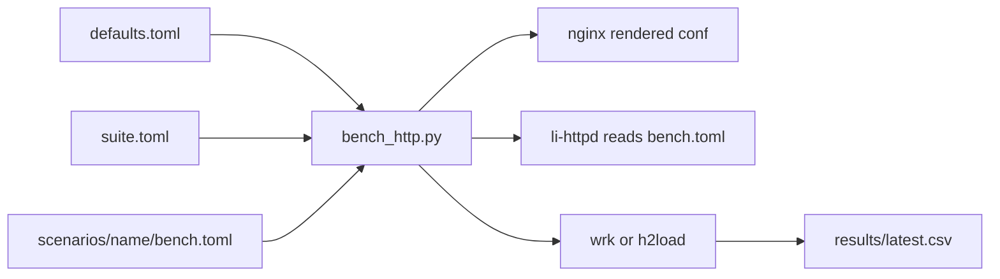


1. Merge TOML; generate fixtures if missing.
2. For each `lang` in profile: start server → `[verify]` → if timing, `[load]` (+ sweeps) → CSV.
3. `plot_http.py` → `benchmarks/results/share/http_*.png`.

### CI integration

- **Tier 0 (no timing):** `verify_http.py` only in PR CI — fast, no flakiness.
- **Nightly:** full `bench_http.py` on `linux-x86_64` runner with perf governor; upload `latest.csv` artifact.
- **Regression policy:** investigate if li p99 > **2×** nginx after **M1**; track LOC in same report.

### Early spike (before li-httpd)

Land **TOML + harness + nginx audit** first (no li-httpd):

- `defaults.toml`, `suite.toml`, `scenarios/static_small/bench.toml`
- `bench_http.py --profile baseline` → nginx verify + timing → CSV
- `benchmarks/tier5_http/README.md` — copy-paste: install wrk, run one command

### Docs to add

- `docs/benchmarks-http.md` — TOML key reference (links to `params_schema.toml`), fairness checklist, example `bench.toml`
- Extend `.cursor/rules/benchmarks.mdc` — **all tier5_http config lives in TOML; do not hardcode scenarios in Python**

---

## Security via nginx source audit (+ exploit replay)

**Read nginx source** to build a **checklist of invariants** (what went wrong historically)—then implement those invariants in **minimal Li code**, not by translating C.

Replay exploits against **stock nginx** (baseline) and **li-httpd**. Li may **fail closed stricter** than nginx (e.g. always 400 on ambiguous `Content-Length`); document in exploit TOML `[expect].li_behavior = "stricter"`.

Generic “hacker toolkit” fuzzing is **secondary**; every exploit file should cite **where nginx mitigates** (or where a CVE fixed it).

### `nginx_mitigations.toml` (machine-readable audit)

```toml
[[mitigation]]
id = "duplicate_content_length"
cve = ["CVE-2019-20372"]
nginx_version_fixed = "1.17.7"
src = "src/http/ngx_http_parse.c"
symbol = "ngx_http_parse_header_line"
notes = "reject duplicate Content-Length"
exploit = "exploits/request_smuggling_cl_te.toml"
li_invariant = "single parser rejects duplicate Content-Length"
li_done = false
```

Generated/updated by `audit_nginx_src.py`:

- Scan `third_party/nginx/CHANGES` for `Security:` lines
- `git log -S` / blame on keywords (`client_header_timeout`, `large_client_header_buffers`, `merge_slashes`, …)
- Emit mitigation rows + stub `exploits/<id>.toml` if missing

Human review fills `notes` and `li_invariant`.

### Key nginx source trees to audit (checklist)


| Area            | nginx paths                                              | Typical bugs                                     |
| --------------- | -------------------------------------------------------- | ------------------------------------------------ |
| HTTP/1 parse    | `src/http/ngx_http_parse.c`, `ngx_http_request.c`        | smuggling, oversized line/header, invalid method |
| Limits/timeouts | `ngx_http_core_module.c`, `ngx_http_variables.c`         | slowloris, body size                             |
| Static          | `src/http/ngx_http_static_module.c`                      | path traversal, `alias` bugs                     |
| Proxy           | `src/http/modules/ngx_http_proxy_module.c`               | header forwarding, hop-by-hop                    |
| Upstream / LB   | `ngx_http_upstream.c`, `ngx_http_upstream_round_robin.c` | peer selection, failover, health, buffer limits  |
| HTTP/2          | `src/http/v2/ngx_http_v2*.c`                             | CONTINUATION, reset floods                       |
| TLS             | `src/event/ngx_event_openssl.c`                          | handshake, buffer bounds                         |
| Crypto / RAND   | OpenSSL `RAND_*` (via nginx link)                        | weak keys, IV reuse (compare baseline only)      |
| Stream          | `src/stream/`                                            | TCP proxy desync                                 |
| Event loop      | `src/event/ngx_event.c`, `ngx_connection.c`              | connection exhaustion                            |


### Exploit harness layout

```
benchmarks/tier5_http/
  third_party/nginx/          # submodule
  nginx_mitigations.toml      # audit output (source of truth)
  suite_exploits.toml
  exploits/
    slowloris.toml
    slow_post_rudys.toml
    oversized_request_line.toml
    oversized_headers.toml
    chunked_encoding_abuse.toml
    request_smuggling_cl_te.toml
    request_smuggling_te_cl.toml
    path_traversal_encoded.toml
    host_header_poison.toml
    crlf_injection_headers.toml
    http_pipeline_desync.toml
    connection_flood.toml
    gzip_bomb.toml
    tls_invalid_handshake.toml
    tls_heartbleed_style_read.toml   # if custom TLS — probe overshoot reads
    h2_continuation_flood.toml       # M2
    hpack_table_bomb.toml            # M2
    proxy_ssrf_header.toml           # M1
    rng_constant_bytes.toml          # Tier F — BadRng inject
    rng_repeat_iv.toml
    rng_short_cycle.toml
    rng_partial_fill.toml
    rng_prng_on_tls_prod.toml
    rng_prng_on_tls_dev.toml
    rng_fork_duplicate.toml
    rng_session_id_predictable.toml
    rng_acme_key_reuse.toml
    rng_lb_deterministic.toml        # documentation / non-vuln
    leak_openai_key_in_sse.toml      # Tier G — upstream leaks sk- in stream
    leak_stack_trace_500.toml
    leak_json_nested_secret.toml
    leak_header_x_api_key.toml
    leak_logged_secret.toml          # Tier G — secret not in audit.jsonl
    censor_disabled_passthrough.toml # Tier G — global enabled=false, expect leak reaches client
    ...
  harness/
    exploit_http.py           # reads TOML only; merges [server.rng] for li-httpd
    drivers/tls_many_handshakes.py
  fixtures/
    rng_low_entropy.bin
li-tests/net_exploits/        # compile-fail / micro unit tests for parser rejects
li-tests/rng/exploits/        # unit BadRng into li-rng / record layer (PR-fast)
```

### CLI

```bash
./benchmarks/harness/exploit_http.py                    # default profile
./benchmarks/harness/exploit_http.py slowloris
./benchmarks/harness/exploit_http.py --profile pr       # fast subset, <2 min
./benchmarks/harness/exploit_http.py --langs li         # only li-httpd
./benchmarks/harness/exploit_http.py --compare-nginx    # run same exploit vs nginx + li; diff [expect]
```

### Exploit TOML schema (example)

```toml
id = "slowloris"
tier = "A"
enabled = true
refs = ["CAPEC-469"]

[nginx_src]
mitigation_id = "client_header_timeout"
src = "src/http/ngx_http_request.c"
config_keys = ["client_header_timeout", "client_body_timeout"]

[targets]
langs = ["nginx", "li"]       # always run nginx first — oracle
nginx_tag = "1.26.2"          # submodule pin
server_config = "../scenarios/static_small/bench.toml"

[attack]
driver = "python"             # python | raw_socket | h2_flood | tlsfuzzer | nuclei
script = "drivers/slowloris.py"
connections = 500
header_byte_interval_sec = 10
duration_sec = 60

[expect]
no_crash = true               # process exit 0 throughout
no_asan_error = true          # CI runs under -fsanitize=address
max_rss_mb = 512              # memory cap — detect leaks/exhaustion
responds_within_sec = 120     # no indefinite hang
legitimate_client_ok = true   # parallel GET /file.bin still returns 200
reject_or_close_attack = true # attack conns closed or 400, not queued forever

[report]
severity = "high"
pass_message = "limits and timeouts held"
```

**Merge order:** `defaults.toml` ← `exploits/<id>.toml` ← `--set` overrides (same as benchmarks).

### Exploit tiers (map to W phases)


| Tier  | Classes                      | Representative tests                                                           | Phase gate                                   |
| ----- | ---------------------------- | ------------------------------------------------------------------------------ | -------------------------------------------- |
| **A** | HTTP/1.1 DoS + parser abuse  | slowloris, oversized line/headers, bad chunked, connection flood               | M1                                           |
| **B** | Smuggling + proxy abuse      | CL.TE, TE.CL, path traversal, header forwarding                                | M1                                           |
| **C** | TLS attacks                  | malformed records, tlsfuzzer flows                                             | M2                                           |
| **D** | HTTP/2 + compression         | CONTINUATION, Rapid Reset, HPACK/gzip bombs                                    | M2                                           |
| **E** | Stream                       | TCP proxy flood                                                                | M3                                           |
| **F** | **RNG / entropy injection**  | constant/repeat IV, partial fill, prng-on-TLS config, fork reseed, ACME key    | **M1.5** (subset in PR once `li-rng` exists) |
| **G** | **Upstream leak censorship** | leak tests when enabled; `censor_disabled` passthrough when user opts out | **M1.5** (Tier G required only if `leak_censor.enabled = true`) |


### Tooling integration (referenced from TOML, not hardcoded)


| Tool                                 | Use                                                                                  |
| ------------------------------------ | ------------------------------------------------------------------------------------ |
| **Custom Python/raw socket drivers** | Precise byte sequences for smuggling and slowloris                                   |
| **libFuzzer / AFL++**                | Standalone `http_parse_fuzz` target + in-process corpus; 24h nightly                 |
| **tlsfuzzer**                        | TLS handshake/record attacks (M2)                                                    |
| **h2spec** (negative tests)          | HTTP/2 protocol violations (M2)                                                      |
| **Nuclei** (optional)                | Community templates tagged `http`, `misconfig` — run via `[attack] template = "..."` |
| **ffuf** (optional)                  | Path traversal wordlists against static root                                         |


Pin tool versions in `defaults.toml` `[tools]` for reproducible CI.

### CI policy


| Job                              | When                                                                            | Requirement                                                                                             |
| -------------------------------- | ------------------------------------------------------------------------------- | ------------------------------------------------------------------------------------------------------- |
| `exploit_http --profile pr`      | Every PR touching `std/http`, `std/net`, `li-httpd`, `**li-rng`**, `**li-tls`** | Tier A + **Tier F subset** (`rng_partial_fill`, `rng_prng_on_tls`, `rng_constant_bytes`); **must pass** |
| `exploit_http --profile nightly` | Nightly                                                                         | Tiers A–D + **full Tier F**; ASan+UBSan; `OsCsprng` uniqueness smoke                                    |
| Fuzz                             | Nightly                                                                         | No new crashes in 24h corpus; minimize and add to `li-tests/net_exploits/corpus/`                       |
| Compare nginx                    | Weekly optional                                                                 | Same TOML vs nginx — document when nginx passes but li fails (regression) or li is stricter (win)       |


**Fail conditions:** crash, ASan report, RSS above cap, legitimate client cannot connect, attack connections consume unbounded worker slots past `bench.toml` limits, **duplicate AEAD IV / valid TLS on `BadRng` / uninitialized bytes after partial `fill_bytes`**.

**Pass ≠ “invulnerable”:** pass means **documented expectations** in `[expect]` held. Update TOML when adding mitigations.

### Pass criteria

1. **nginx** satisfies `[expect]` (documents real-world baseline).
2. **li-httpd** satisfies `[expect]` (or documented stricter variant).
3. `li_invariant` in `nginx_mitigations.toml` is implemented with matching `requires`/`ensures`.

`results/exploit_report.csv`: `exploit_id, mitigation_id, lang, passed, li_invariant, git_sha, loc_httpd`

### Link audit → proofs


| nginx source check               | Li obligation                          |
| -------------------------------- | -------------------------------------- |
| header/body size guards in parse | `requires` / `ensures` on parser state |
| timeout / discard body paths     | `decreases` or timeout contract        |
| `client_max_body_size`           | refinement `body_len ≤ limit`          |


If Li proof passes but nginx-src audit shows a missing check → **incomplete port**, not “secure.”

### Docs / tests to add

- `docs/security-nginx-src-audit.md` — how to run `audit_nginx_src.py`, read `nginx_mitigations.toml`, port checklist
- `docs/security-http-exploits.md` — exploit TOML + ethics (lab-only)
- `li-tests/net_exploits/` — one-shot bytes copied from CVE advisories linked in mitigations table

---

## Repository / docs to add (when execution starts)

- `packages/` — workspace above; each subdir has `li.toml`, `src/`, `PUBLISH.md`, `li-tests/` or re-exports tests from root
- `packages/li-log/` — sinks, rotation, redaction, `raises Log`
- `packages/li-schema/` — SQL migration + OpenAPI → `SchemaCatalog` for setup-censor
- `packages/li-httpd/` — binary + CLI (not `examples/` only)
- `docs/superpowers/specs/li-log.md`
- `li-tests/log/` — rotation + redaction goldens
- `docs/superpowers/specs/li-httpd.md` — minimal architecture, LOC budget, threat model, `li_invariant` list, package dependency graph
- Compiler `std/` may re-export from packages during bootstrap; long-term logic lives in publishable packages
- `li-tests/net/` — parse limits, race fixtures, TLS vectors
- `li-tests/net_exploits/` — malformed HTTP bytes
- `li-tests/config_reject/` — TOML that must fail `lic validate-config`
- `li-tests/routing/` — table-driven `match_route` cases + `run_routing.sh`
- `li-tests/config_desugar/` — simple TOML → golden canonical
- `std/http/desugar.toml` — simple surface parser (Python or Li in harness)
- `std/http/router.li` — `MatchExpr`, `match_route` (proved)
- `std/http/config.li` — `HttpdConfig`, `validate`, secure defaults
- `std/tls/acme.li`, `li-httpd setup-tls` — ACME obtain/renew; reserved `/.well-known/acme-challenge/`
- `li-tests/tls_setup/`, `config_reject/tls_*.toml`
- `benchmarks/tier5_http/third_party/nginx/` (submodule), `nginx_mitigations.toml`
- `harness/audit_nginx_src.py`, `bench_http.py`, `exploit_http.py`, …
- `docs/security-nginx-src-audit.md`
- `docs/benchmarks-http.md`
- `docs/research/community-backlog.md` — operator demand from Reddit/HN/GitHub (living)
- `li-httpd` reads scenario `bench.toml` `[server]` (typed config, no second format)

---

## Critical risks (plan for them early)

1. **Proof cost:** HTTP/TLS specs explode VC size — need proof caching and lemma libraries in Mathlib.
2. **Async + Lean:** Totality on `async` loops needs careful `decreases` on logical steps, not OS callbacks.
3. **Pure Li crypto vs LOC:** small proved subset or thin extern at crypto boundary — pick smallest that passes M2 exploit tier.
4. **Scope creep:** every nginx feature request fights LOC budget — default **no**.
5. **Compiler correctness:** C++ `lic` is not meta-proved — server security still depends on codegen soundness ([verification overview](docs/verification/overview.md)).
6. **Package sprawl:** too many `packages/*` before 2e–2f — start with `li-net` + `li-http` + `li-httpd`, split crypto/TLS when M1.5 needs them.
7. **Probabilistic VC cost:** `prob_ensures` + MC can be slow — cache by `(proc_hash, ε, samples)`; cap samples in PR CI.
8. **OsRngUniform honesty:** axiom can be wrong on broken OS — PractRand + Tier F are **mandatory evidence**, not optional docs.

---

## Recommended immediate next steps (before writing server code)

1. **Land 2e–2f** so “secure” is provable, not aspirational.
2. **RFC: `li-rng`** — `Prng` (proved) vs `Csprng`/`raises Rng` (trusted); `SimRng` for replay tests; see **Randomness** section above.
3. **Spec `std/bytes` + HTTP parser contracts** as first `li-tests/contracts_verify` real proofs.
4. **Spike:** proved HTTP/1.1 header parser only (no sockets) — validates refinement + state-machine story.
5. **Crypto:** implement `**packages/li-crypto`** in Li + vector tests; optional later `li-crypto-hacl` publish package — not a blocker.
6. **Benchmarks:** scaffold `tier5_http` + nginx baseline CSV **before** li-httpd ships — methodology frozen early.
7. **P0:** finish **2e–2f** — this unlocks the “easy” path (write spec, implement, `lic build` or fail).
8. **P0b:** nginx audit → `li_invariant` list + bench baseline (no li-httpd).
9. **M1:** for each invariant, add `proc` + proof + minimal code; run bench/exploit.

Order: **proof pipeline → spec from nginx lessons → small implementation → oracle tests** (implementation is the easy part once specs compile).