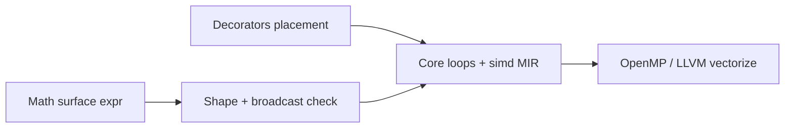

# Mathematical linear-algebra surface (user syntax → SIMD / parallel)

> **Depends on:** **2h** (scalar Python-math), **2g** (`def`), **7a–7b** (SIMD + `parallel for` lowering), **7d** (decorators)  
> **Blocks:** Tier 1 `matmul_*` / `simd_dot` benchmarks with **pure math source** (no user `simd(...)` / intrinsics)  
> **Design spec addendum:** `docs/superpowers/specs/2026-05-16-li-math-linalg-surface.md` (to land with phase)

**Proof gaps (Doc-c):** [G-math](../../verification/provability-gaps.md#g-math) · [G-lean](../../verification/provability-gaps.md#g-lean) · [G-dec](../../verification/provability-gaps.md#g-dec) · [still open](../../verification/provability-gaps.md#still-open-report-every-session) · [Master plan](2026-05-14-li-master-plan.md) § Phase 2i/7e

## Principle (binding)

**Users write mathematics.** The compiler and stdlib lower to `simd`, `parallel for`, OpenMP, and (later) GPU — same as today’s proved cores.

| Layer | Who sees it | Examples |
|-------|-------------|----------|
| **Surface** | Every scientist / agent | `C += A @ B`, `y = alpha * x + beta * y`, `norm(v)`, `sum(a * b)` |
| **Execution control** | HPC authors | `@cpu`, `@parallel(disjoint=...)`, `@vectorized(lanes=8)` on `def` / loops |
| **Internal / audit only** | Compiler tests, “expanded form” appendix | `simd[f64, 8]`, `__li_simd_*`, MIR dumps |

**Forbidden as primary style:** asking users to call `simd(...)`, `__li_simd_mul_f64`, or manual lane loops in handbook, Tetris-adjacent tutorials, or Tier 1–2 benchmark **Li** sources.

---

## Surface syntax (v1 → Phase 3 tensor)

### Scalars and element-wise (v1 on `array[N, T]`)

```li
def axpy(alpha: float64, x: array[N, float64], y: array[N, float64]) -> None:
  requires N > 0
  @cpu
  @parallel(disjoint=disjoint_index)
  @vectorized(lanes=8, T=float64)
  for i in 0..<N:
    y[i] = alpha * x[i] + y[i]   # infix *, + — not simd intrinsics
```

### Inner products and norms (v1)

```li
def dot(x: array[N, float64], y: array[N, float64]) -> float64:
  requires N > 0
  ensures result == sum_{i in 0..<N} x[i] * y[i]
  var acc: float64 = 0.0
  @vectorized(lanes=8)
  for i in 0..<N:
    acc += x[i] * y[i]   # lowers to simd horizontal sum + FMA chain
  return acc
```

### Matrix multiply (Tier 1 benchmark shape)

```li
# types: tensor[(M,K), f64] when Phase 3 lands; v1 may use array + refinements
@cpu
@parallel(disjoint=disjoint_tile)
def matmul_add(C: tensor[(M, N), float64],
               A: tensor[(M, K), float64],
               B: tensor[(K, N), float64]) -> None:
  requires shapes_compatible(A, B, C)
  C += A @ B    # mathematical matrix multiply — NOT simd(A) or @vectorized(...)
```

### Blocked cache-friendly variant (Tier 1 `matmul_blocked`)

```li
@cpu
@parallel(disjoint=disjoint_block)
def matmul_blocked(C, A, B, block: int) -> None:
  for bi in blocked_range(0, M, block):
    for bj in blocked_range(0, N, block):
      for bk in blocked_range(0, K, block):
        C[bi:bi+block, bj:bj+block] += A[bi:bi+block, bk:bk+block] @ B[bk:bk+block, bj:bj+block]
```

Slice + infix `@` desugar to proved index loops; inner micro-kernel gets `@vectorized` from the loop or block `def`.

---

## Lowering pipeline



| Surface form | Lowers to (v1 CPU) |
|--------------|-------------------|
| `a * b` on compatible arrays/tensors | element-wise loop → `@vectorized` → `simd` lanes |
| `sum(expr)` / `dot(x,y)` | reduction with proved associativity where needed |
| `A @ B` | ikj/ikj-blocked loops + SIMD inner + optional `@parallel` on outer |
| `alpha * x + y` | AXPY → FMA vectorized loop |

**Proofs:** shape/dimension errors at compile time; `A @ B` requires inner dim match; parallel outer loops still need `disjoint=`.

---

## Sub-phases

| Sub | Deliverable | Exit |
|-----|-------------|------|
| **2i-a** | Infix `*`, `+`, `-`, `/`, `**` on numeric arrays; `sum`; parse + types | `li-tests/math_linalg/scalar_elementwise/` |
| **2i-b** | `dot`, `norm`, `axpy`, `**`, reductions | **partial** — prelude `dot`/`norm`/`axpy`; `math_linalg/reductions/`; float Lean Props open |
| **2i-c** | Binary `@` for 2D matmul desugar (fixed small shapes + `tensor` when ready) | **done** — `matmul_*.li` on `main` |
| **2f / P-linalg** | `requires`/`ensures` on fixed dot/sum/matmul entry | **partial (#151)** — closed int specimens; loop dot open |
| **7e-a** | Connect math expr lowering to existing 7a SIMD MIR | `simd_dot` Li source has **zero** `__li_simd_*` in user file |
| **7e-b** | Matmul math + decorators in Tier 1 benches | `bench.py --tier 1` CSV: li vs cpp/rust/julia |
| **7e-c** | Docs + gallery | See below |

---

## Documentation deliverables

| Doc | Content |
|-----|---------|
| `docs/language/linear-algebra.md` | Math surface, shapes, `@` vs element-wise `*` |
| `docs/guide/math-hpc-examples.md` | Full samples: dot, axpy, matmul, MD force as math |
| Update `docs/guide/fast-math-and-parallelism.md` | Lead with math + decorators; move intrinsics to “compiler expansion” |
| Update `docs/guide/examples-gallery.md` | Side-by-side: math source vs expanded audit form |
| `README.md` hello | One line `sum(a * b)` not `simd` |

---

## Tests

| Suite | Role |
|-------|------|
| `li-tests/math_syntax/` | Scalar `**`, `//`, `%` (Phase **2h**) |
| `li-tests/math_linalg/` | Shape errors, broadcast rules, `A @ B` dim mismatch **fail** |
| `li-tests/math_linalg/golden/` | Optional MIR/LLVM snapshot for `dot` / small `matmul` |
| Harness | Tier 1 `simd_dot`, `matmul_naive`, `matmul_blocked` — **Li column uses math-only sources** |

---

## Benchmarks vs reference HPC (mandatory)

Use existing [benchmarks plan](2026-05-14-benchmarks-and-simulations.md) harness (`bench.py`, cross-lang CSV, plots).

| Benchmark | Li source style | Compare |
|-----------|-----------------|---------|
| `simd_dot` | `sum(a * b)` or `dot(a,b)` + `@vectorized` | C++ Clang, Rust `--release`, Julia |
| `matmul_naive` | `C += A @ B` + `@parallel` where legal | Same + Python+NumPy column |
| `matmul_blocked` | blocked slices + math `@` | Eigen C++ optional column |

**Regression policy (unchanged):** Li within **1.2×** C++ on same machine for Tier 1–2, or investigate before release.

**Report columns:** ns/element or GFLOPS; 1-thread and N-thread; label `li_math` vs legacy `li_intrinsic` during migration only.

---

## Relation to decorators (7d)

- **Math** = what you compute (`A @ B`, `alpha * x + y`).
- **Decorators** = how / where it runs (`@cpu`, `@parallel`, `@vectorized`, `@gpu`).
- Never require `simd(...)` in user code to get vectorization — `@vectorized` + math lowering does.

---

## Exit gate

- [x] `./li-tests/run_all.sh math_linalg`
- [x] Tier 1 Li benchmarks use math-only sources (`li_pure=True` on `simd_dot`, `matmul_*`)
- [x] Handbook pages published (`linear-algebra.md`, `math-hpc-examples.md`)
- [x] No user-facing doc recommends `__li_simd_*` as the default path
- [x] **2i-b** `norm`, `sum`/`dot`, `reductions/` suite; same-length `**` / prelude `axpy` / scalar×array (no broadcast) — float Lean Props still open
- [x] **2i-broadcast** length-1 element-wise broadcast (`broadcast_len1_*.li`); non-broadcast length mismatch (`broadcast_invalid_len2_vs_len4.li`, `elementwise_len_mismatch.li`) — full NumPy rank rules open
- [x] **P-linalg** loop implementation ≡ closed-form `ensures` in Lean (**G-lean**) (`linalg_dot4_int_loop_open.li` + `discharge_linalg_int_lean.sh`; float Props still **G-math** open)
- [ ] Tier 1 perf ≤1.2× C++ (benchmarks dashboard)
