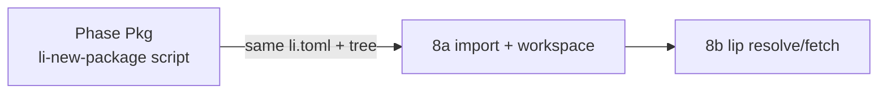
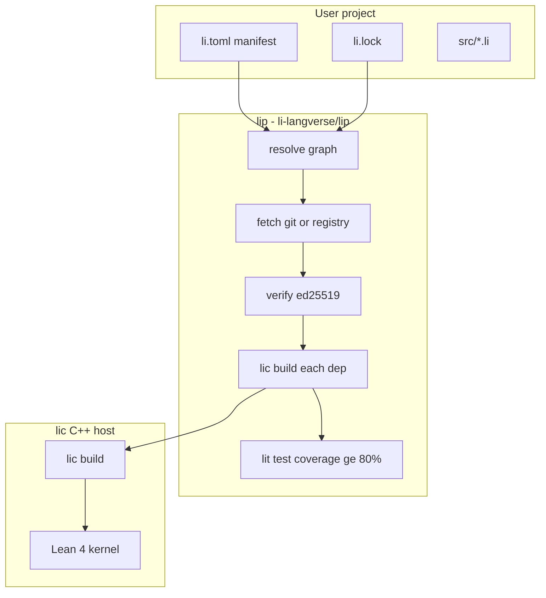

# Li package manager (`lip`) + `lit` test/coverage

> **Canonical ecosystem plan.** Package **layout/scaffold** is [2026-05-16-li-package-scaffold.md](2026-05-16-li-package-scaffold.md) — same `li.toml` schema, same directory tree; `lip init` eventually wraps `scripts/li-new-package`.

**Goal:** `lip` resolves and installs dependencies with **proof + signature + coverage** gates; `lit` enforces **≥ 80% line coverage** on publish/install.

**Master plan phase:** **8-repo, 8a–8e, 8e-li** (Ecosystem). **Phase 7** remains Native HPC. **Phase Pkg** (scaffold) ships first.

**GitHub (three repos — locked):**

| Repo | URL |
|------|-----|
| Compiler | https://github.com/li-langverse/lic |
| Package manager | https://github.com/li-langverse/lip |
| Test + coverage | https://github.com/li-langverse/lit |

**8-repo:** org repos created; push split trees, `li-toolchain.toml` in **lip**/**lit**, CI clones **lic**. See [master plan](2026-05-14-li-master-plan.md) tracker.

---

## Context and constraints

Li’s **proof gate** is the primary security differentiator: unproved user code does not compile ([language design spec](../specs/2026-05-14-li-language-design.md)). A package manager must **compose** that gate with supply-chain basics (checksums, signatures, lockfiles), not replace it.

**Current gaps:**

- No `import` / multi-module support in the compiler ([compiler/ast/include/li/ast.hpp](../../compiler/ast/include/li/ast.hpp)).
- No `std/` tree in-repo yet (Phase 4); packages depend on path/git/registry deps.
- Bootstrap Li CLI ([bootstrap/lic/main.li](../../bootstrap/lic/main.li)) — pattern for Li tools until self-host.

**Locked decisions:**

| Decision | Choice |
|----------|--------|
| Discovery | **Hybrid** — git URLs + semver tags; central registry recommended for publish |
| Third-party trust | **Proof + signature** — `lic build` required; unsigned third-party **rejected by default** |
| Package quality | **≥ 80% line coverage** — `lit test --coverage` on publish/install |

---

## Relationship to package scaffold (Pkg)



| Layer | Tool | When |
|-------|------|------|
| **Directory + manifest** | `./scripts/li-new-package` | **Now** — no compiler import required |
| **Init UX** | `lip init` | **8b** — calls scaffold; adds lockfile hooks |
| **Deps** | `lip add` / `lip install` | **8b–8d** |
| **Publish** | `lip publish` | **8d** — after 8c + 8e |

**Rule:** Never fork `li.toml` — scaffold templates are generated from the schema in **§ A3** below.

---

## Architecture overview



| Binary | Role |
|--------|------|
| `lic` | Compile, verify, proof cache; `lic test --coverage` instrumentation |
| `lit` | Test discovery, coverage aggregation, 80% gate |
| `lip` | Resolve, fetch, lock, publish; orchestrates `lic build` + `lit` on deps |

---

## Phase 8a — Module system and workspace (compiler)

### A1. Language surface

- `import foo` / `import foo as bar` / `from foo import baz`
- One module per file; path → module name (`src/foo/bar.li` → `foo.bar`)
- Cycle detection at resolve time

### A2. Compiler pipeline

```
parse → name resolve (imports) → per-module typecheck → workspace proof → MIR/link
```

### A3. Canonical `li.toml` schema (shared with scaffold)

**This section is the single source of truth** for [package-scaffold](2026-05-16-li-package-scaffold.md) templates and `lip`:

```toml
[package]
name = "my_sim"
version = "0.1.0"
edition = "2026"          # language / proof ABI version
license = "Apache-2.0 OR MIT"
description = "One-line summary"

[dependencies]
linalg = "1.2.0"                                    # registry (8d+)
md_core = { git = "https://github.com/org/md_core", tag = "v0.3.1" }
local = { path = "../local" }                       # path (8b+)

[dev-dependencies]
# same shape

[[bin]]
name = "my_sim"
path = "src/main.li"

[package.metadata.lip]
min_coverage = 80            # default 80; publish/install reject below
maintainer = "li-langverse"  # required for official/std packages (see governance plan)
pkg_id = "PKG-my-sim"        # traceability id; listed in official-packages.md when official

[package.metadata.lit]
# optional test/coverage overrides

[package.repository]
url = "https://github.com/li-langverse/my-sim"
documentation = "https://li-langverse.github.io/li-language/ecosystem/my-sim/"
changelog = "https://github.com/li-langverse/my-sim/blob/main/CHANGELOG.md"

[workspace]
members = ["../other-crate"]   # optional monorepo root
```

- `edition`: incompatible deps rejected by resolver
- `min_coverage`: default **80**; overridable locally only with `--allow-low-coverage` (not publish)

### A4. Lockfile sketch — `li.lock` (8b+)

Pinned closure: version/git SHA, tree digest SHA-256, manifest signature, `proof_digest`, `coverage_pct`, `coverage_digest`.

### A5. Tests

`li-tests/modules/` in [manifest.toml](../../li-tests/manifest.toml).

**Exit gate:** `lic build` on 2–3 module workspace without `lip`.

---

## Phase 8e — `lit` + coverage gate

- `lic --coverage-instrument`
- `lit test` / `lit coverage report`
- 80% gate on fixture packages
- Coverage fields in `li.lock`

**Depends on:** 8a. **Parallel with:** 8b once multi-file tests build.

---

## Phase 8b — `lip` core (path + git)

| Command | Behavior |
|---------|----------|
| `lip init` | **`li-new-package` +** empty `li.lock` stub |
| `lip add` | Add dep; resolve; update lock |
| `lip install` | Fetch; verify; `lic build` deps |
| `lip build` | Install + build root |
| `lip update` / `lip tree` | Lock refresh / graph print |

Implementation: **`li-langverse/lip`** (`lip/` sources, Li), `scripts/bootstrap_lip.sh`. **`lit`** in **`li-langverse/lit`**. Compiler in **`li-langverse/lic`**.

**Exit gate:** App + path + git dep; reproducible `li.lock` on CI.

---

## Phase 8c — Security (proof + ed25519)

- SHA-256 tree digest; signed manifest
- Every dep: `lic build` → `proof_digest` in lock
- ed25519 publisher keys; reject unsigned registry packages by default
- Git deps: `trusted.git` allowlist or `li.toml.sig` on tag

---

## Phase 8d — Central registry

REST index, `lip publish` (local `lic build` + `lit test --coverage`), registry CI attestation, yank/blocklist.

**Do not ship** third-party `lip install` before **8a + 8c + 8e**.

---

## Documentation (ecosystem)

| Doc | Contents |
|-----|----------|
| [docs/ecosystem/overview.md](../../ecosystem/overview.md) | How Pkg + lip + lit fit together |
| [docs/ecosystem/governance.md](../../ecosystem/governance.md) | GitHub org, SemVer/SPDX/Changelog, traceability IDs |
| [docs/ecosystem/official-packages.md](../../ecosystem/official-packages.md) | `PKG-*` ↔ [`li-langverse/*`](https://github.com/li-langverse) repos |
| [2026-05-16-li-ecosystem-governance.md](2026-05-16-li-ecosystem-governance.md) | Normative governance plan |
| [docs/ecosystem/lip.md](../../ecosystem/lip.md) | `init`, `add`, `publish`, trust flags |
| [docs/ecosystem/lit.md](../../ecosystem/lit.md) | Coverage gate, CLI |
| [docs/ecosystem/registry.md](../../ecosystem/registry.md) | API, signing, attestation; index includes `PKG-` + `proof_digest` |
| [docs/guide/creating-packages.md](../../guide/creating-packages.md) | User tutorial (starts with `li-new-package`) |
| [docs/verification/packages.md](../../verification/packages.md) | Threat model |

**Publish metadata (8d):** registry entries MUST include `pkg_id` (`PKG-`), `spdx_license`, `changelog_url`, `repository` (GitHub org URL), `proof_digest`, `coverage_pct`.

---

## Master plan tracker IDs

| ID | Name |
|----|------|
| Pkg | Scaffold (`li-new-package`, skill, guide) — **lic** repo |
| 8-repo | Push **lic** / **lip** / **lit**; toolchain + CI |
| 8a | Modules + workspace `lic build` — **lic** |
| 8e-li | `lic --coverage-instrument` — **lic** |
| 8e | `lit` + 80% coverage — **lit** |
| 8b | `lip` path/git + lock — **lip** |
| 8c | Signatures + proof digests — **lip** |
| 8d | Registry + publish — **lip** |
| 8-sync | Upstream notifications (Dependabot + `lic` dispatch) — **all official repos** |

---

## Risks

| Risk | Mitigation |
|------|------------|
| Import not ready | 8a gate before `lip install` hype |
| Lean slow on dep trees | VC-hash proof cache; parallel builds |
| Two `li.toml` schemas | **One schema (§ A3)**; scaffold generated from it |
| Coverage gaming | `src/` only; `run_ok` tests; registry reproduces profile |

---

## Implementation order (after plan approval)

1. **Pkg** — [package-scaffold](2026-05-16-li-package-scaffold.md)
2. **8-repo** — push **lic**, **lip**, **lit**; CI smoke
3. **8a** — `import` + `li-tests/modules/` (**lic**)
4. **8e-li** — `lic --coverage-instrument` (**lic**)
5. **8e** — **lit** repo + 80% gate
6. **8b** — **lip** path deps; `lip init` → scaffold
7. **8c** — signatures + `proof_digest`
8. **8d** — registry client + publish
9. **8-sync** — Dependabot + `lic` release → downstream dispatch (see [governance](2026-05-16-li-ecosystem-governance.md#cross-repo-dependency-notifications))
