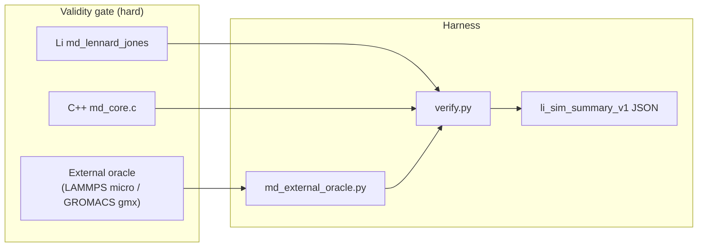

# MD external oracle plan (`md-r3-oracle-plan`)

**Issue:** [lic#523](https://github.com/li-langverse/lic/issues/523)  
**Runner:** `sim-md-research` · **Branch:** `cursor/sim-md-research-loop`  
**Prior research:** `md-r0-sota-survey`, `md-r1-stability-matrix`, `md-r2-neighbor-list-gap` (completed)

---

## Problem

Li tier-2 MD today proves **Li ↔ shared C oracle** parity (`md_core.c`, `sim_scientific_oracle_checksum_md()`). That is necessary but **not sufficient** for PH-5b simulation honesty:

| Signal | Current state | Gap |
|--------|---------------|-----|
| `algo_registry` id **104** `md_oracle_external` | Harness stub shares `md_lennard_jones` C kernel | No LAMMPS/GROMACS column |
| `verticals.toml` `md_lennard_jones` | `oracle = "cpp"`; notes admit Layer B csv_lang stubs | `lammps` / `gromacs` not wired |
| `competitive/registry.toml` | No `lammps` / `gromacs` ecosystem rows | Layer A competitor missing |
| Catalog `md_oracle_external` | WP2 stub via `scaffold_md_catalog_benches.py` | 117 catalog path gaps (benchmarks#179) |
| Plan verifier | `sim-md-research.plan_pending = ["md-r3-oracle-plan"]` | Research loop blocked |

**North star:** Correctness before speed. External oracle is a **validity column**, not a perf shortcut — we do not weaken `threshold_ratio_cpp` to green the dashboard.

---

## Scope (this plan)

| In scope | Out of scope (defer) |
|----------|----------------------|
| Oracle architecture doc + gate script contract | Full LAMMPS/GROMACS binary CI on every PR |
| Harness path manifest (`li-tests` + tier-2) | Neighbor-list implement (`sim-p1-md-neighbor-cell`) |
| `verticals.toml` / `registry.toml` honesty rows | PME/Ewald long-range (algo 113–114) |
| Study deliverable template for `numerics_researcher` | Weakening tier-0 stability or `threshold_ratio_cpp` |
| Cross-link wave-b-md-oracle (compiler-studio loop) | New org repo or trusted.lean changes |

**Plan home:** `lic` (language + harness contracts). **Benchmarks repo** owns catalog ingest paths only — no kernel code migration.

---

## Architecture



### Oracle tiers

| Tier | Engine | Role | CI default |
|------|--------|------|------------|
| **T0** | Shared C (`md_core.c`) | Cross-lang reference; existing green | **Always** |
| **T1** | Li composable (`scientific_oracle_bench.li`) | Package smoke checksum | **Always** |
| **T2** | LAMMPS **micro** (pinned `pair/lj/cut/coul/long` off, N=32–256) | External force/energy oracle | **Optional** profile `md-external-oracle` |
| **T2b** | GROMACS **gmx mdrun** (minimal LJ system) | Second incumbent column | Same optional profile |

**Pinned versions (implement phase):** document in `benchmarks/tier2_physics/md_oracle_external/PINNED.md` — e.g. LAMMPS stable tag + GROMACS 2024.x; no floating `apt install lammps`.

---

## Work packages

todos:
- id: wp-oracle-doc
  content: "Canonical plan + study template (this doc); orchestrator mapping note"
  status: completed
  agent: issue_planner
- id: wp-oracle-harness-manifest
  content: "Cite oracle paths in li-tests/manifest.toml + packages/li-sim-scientific/li-tests/manifest.toml + tier2 md_oracle_external README"
  status: pending
  agent: numerics_researcher
  handoff_implement: sim-md-r3-oracle-harness
- id: wp-oracle-driver-stub
  content: "Add benchmarks/harness/md_external_oracle.py stub + verify.py hook (--external-oracle lammps|gromacs|skip)"
  status: pending
  agent: numerics_researcher
  depends: wp-oracle-harness-manifest
- id: wp-oracle-registry-honesty
  content: "verticals.toml md_lennard_jones oracle=external_binary; registry.toml lammps+gromacs watch rows; algo_registry research_map for id 104"
  status: pending
  agent: numerics_researcher
- id: wp-oracle-gate-wire
  content: "sim-algo-research-gates.sh: SIM_RESEARCH_REQUIRE_STUDY + manifest path check for md-r3"
  status: pending
  agent: numerics_researcher
  depends: wp-oracle-driver-stub
- id: wp-oracle-study
  content: "Study docs/numerics/studies/YYYY-MM-DD-md-r3-oracle-plan.md with grade matrix + size table N=32/256/2048"
  status: pending
  agent: numerics_researcher
  study_only: true
  depends: wp-oracle-gate-wire

---

## Gate script reference (completion contract)

`md-r3-oracle-plan` todo flips to **completed** only when **all** gates below pass.

### A — Research gates (study iteration)

```bash
cd lic
export SIM_RESEARCH_VERTICAL=md
export SIM_RESEARCH_BACKLOG_STUDY_ONLY=1
export SIM_RESEARCH_REQUIRE_STUDY=docs/numerics/studies/YYYY-MM-DD-md-r3-oracle-plan.md
./scripts/sim-algo-research-gates.sh
```

### B — Harness manifest cites oracle path

At least one manifest entry must reference the external oracle harness path:

| File | Required entry |
|------|----------------|
| `packages/li-sim-scientific/li-tests/manifest.toml` | `smoke/md_external_oracle_bench.li` **or** extend `scientific_oracle_bench.li` note with `md_external_oracle.py` path |
| `li-tests/manifest.toml` | Monorepo mirror of package smoke |
| `benchmarks/tier2_physics/md_oracle_external/README.md` | `Oracle driver: benchmarks/harness/md_external_oracle.py` |

Verify:

```bash
grep -E 'md_external_oracle|md_oracle_external' \
  packages/li-sim-scientific/li-tests/manifest.toml \
  li-tests/manifest.toml \
  benchmarks/tier2_physics/md_oracle_external/README.md
```

### C — Tier-2 verify hook (implement phase)

```bash
python3 benchmarks/harness/verify.py --tier 2 --only md_oracle_external --write-summary
python3 benchmarks/harness/md_external_oracle.py --engine lammps --dry-run
./scripts/validate-sim-summary.sh benchmarks/results/md_oracle_external/
```

### D — Plan verifier / snapshot

```bash
python3 scripts/goal-directed-agents-snapshot.py
# expect sim-md-research.plan_pending = [] after backlog todo completed
python3 scripts/swarm-gap-ingest.py   # clears gap-plan-pending-sim-md-research-md-r3-oracle-plan
```

---

## PH / REQ / test mapping

| ID | Requirement | Evidence |
|----|-------------|----------|
| **PH-5b** | Tier-2 physics correctness + cross-lang CSV honesty | External oracle column documented; no stub-only claims |
| **PH-7e** | Math→SIMD only after validity | Oracle plan blocks PH-7e SIMD on MD until T0+T2 green |
| **G-math** | Simulation correctness honesty | `verticals.toml` oracle field upgraded from `cpp`-only narrative |
| **REQ-MD-ORACLE-01** | Pinned LAMMPS micro reproduces `params.toml` energy at t=0 | Study size table + `md_external_oracle.py` |
| **REQ-MD-ORACLE-02** | `md_oracle_external` catalog row has real lic path | benchmarks#179 ingest after harness lands |
| **REQ-MD-ORACLE-03** | `li_sim_summary_v1` records `variant=lammps\|gromacs` | `sim-output-contract.md` |

### Tests / benches

| Artifact | Suite | Purpose |
|----------|-------|---------|
| `scientific_oracle_bench.li` | smoke | Existing T0 Li↔C checksum |
| `md_external_oracle_bench.li` (new) | smoke | Invokes external oracle path when `LI_MD_EXTERNAL_ORACLE=1` |
| `md_oracle_external` | tier-2 | Catalog bench id 104 |
| `md_lennard_jones` | tier-2 | Primary MD row (unchanged) |
| `sim-algo-research-gates.sh` | research | Loop grade.json |

---

## Learned from

1. **md-r0 SOTA survey** — algo 104 mapped to LAMMPS/GROMACS micro; honesty gap explicit.  
   `docs/numerics/studies/2026-05-27-md-r0-sota-survey.md`

2. **Algorithms & libraries plan §4** — Layer A requires external oracle column for `md_lennard_jones`.  
   `docs/ecosystem/algorithms-and-libraries-plan.md`

3. **Sim output contract** — `md_external_oracle.py` already named as harness target; JSON summary schema fixed.  
   `docs/ecosystem/sim-output-contract.md`

4. **LAMMPS run docs** — micro input decks for NVE LJ with fixed seed; minimum-image cutoff.  
   https://docs.lammps.org/Commands_run.html

---

## Implement handoff

After human labels **plan-approved** on #523:

1. **`numerics_researcher`** on `cursor/sim-md-research-loop` executes `wp-oracle-harness-manifest` → `wp-oracle-study`.
2. **`bench_improver`** optional: wire optional CI profile (no new `schedule:` cron).
3. **`plan_verifier`**: re-run snapshot; close registry row `gap-plan-pending-sim-md-research-md-r3-oracle-plan`.
4. **benchmarks#179**: add catalog lic path once `benchmarks/tier2_physics/md_oracle_external/` is non-stub.

**Cross-link:** `wave-b-md-oracle` in `2026-05-22-compiler-studio-plan-loop.md` — mark completed when this plan's WP-oracle-driver-stub merges.

---

## Vision / defer checks

| Check | Result |
|-------|--------|
| Conflicts with strict-by-default? | **No** — external oracle strengthens validity |
| Duplicates package mirror without P0 CI? | **No** — harness-first in lic |
| Weaken `threshold_ratio_cpp` only? | **Rejected** — explicit in scope table |
| New org repo? | **No** |

---

## Human approval

- [ ] Review plan doc
- [ ] Label issue #523 `plan-approved`
- [ ] Remove `plan-needed`
- [ ] Do **not** self-merge draft PR
