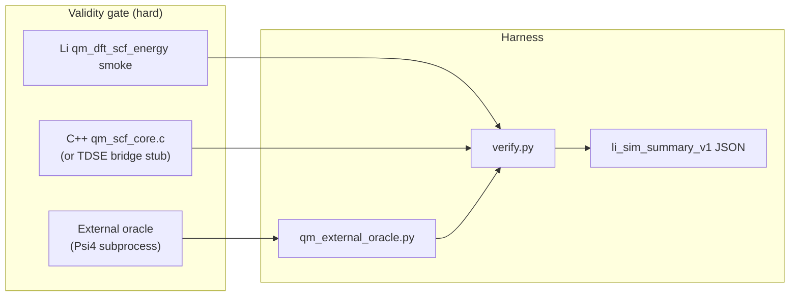

# QM DFT SCF harness + package placement (`chem-r2` / `chem-r3`)

**Issue:** [lic#522](https://github.com/li-langverse/lic/issues/522)  
**Runner:** `sim-chem-research` · **Branch:** `cursor/sim-chem-research-loop`  
**Prior research:** `chem-r0-sota-survey`, `chem-r1-basis-size-scaling` (completed)  
**Related implement issue:** [lic#355](https://github.com/li-langverse/lic/issues/355) (chem-r2 harness handoff)

---

## Problem

Li tier-2 QM today proves **Li ↔ shared C TDSE stub** parity via the **`schrodinger_1d_barrier` family template** — not quantum-chemistry kernels. That is necessary scaffolding but **not sufficient** for PH-5b chemistry honesty:

| Signal | Current state | Gap |
|--------|---------------|-----|
| `algo_registry` id **418** `qm_dft_scf_energy` | Routes through `run_algo_registry_stub` (checksum **1.001**) | No SCF energy / Psi4 column |
| `li-sim-scientific` `vertical_qm_dft()` | Calls stub path for all QM ids 401–432 | No real `run_qm_dft_scf_energy_smoke` |
| `verticals.toml` `qm_dft` | `workload_class=stub`, `oracle=external_binary` | Psi4 subprocess not wired |
| Catalog `qm_dft_scf_energy` | `size_label=harness pending`; 32 `qm_*` unknown | benchmarks#179 lic path blocked |
| Package surface | `li-chem` stub, `li-physics-quantum` TDSE-only, `std/physics/chem.li` tag | No canonical placement doc |
| Plan verifier | `sim-chem-research.plan_pending = ["chem-r2-dft-scf-gap", "chem-r3-package-placement"]` | Research loop blocked |

**North star:** Correctness before speed. Psi4 oracle is a **validity column**, not a perf shortcut — we do not weaken `threshold_ratio_cpp` (default **1.2**) to green the dashboard.

---

## Scope (this plan)

| In scope | Out of scope (defer) |
|----------|----------------------|
| chem-r2: harness + Psi4 oracle architecture + gate contract | Full native RKS implementation (401–404 integral chain) |
| chem-r3: package placement ADR (li-chem vs li-physics-quantum vs li-sim-scientific) | Gaussian/ORCA binary CI on every PR |
| Study deliverable template for `numerics_researcher` | Post-HF rows 422–425 (MP2/CCSD/TDDFT) |
| Cross-link closure criteria with #355 | Grid/XC 412–417 until LDA (412) ref energy |
| Manifest + tier-2 README cites for `qm_dft_scf_energy` | Weakening tier-0 tolerances or `threshold_ratio_cpp` |
| Composable gate spec (`import_chem_dft_smoke.li`) | New org repo or `trusted.lean` changes |

**Plan home:** `lic` (language + harness contracts). **Benchmarks repo** owns catalog ingest paths only — no kernel code migration.

---

## Architecture (chem-r2)



### Oracle tiers

| Tier | Engine | Role | CI default |
|------|--------|------|------------|
| **T0** | Shared C (`qm_scf_core.c` or bridged TDSE checksum) | Cross-lang reference | **Always** |
| **T1** | Li composable (`import_chem_dft_smoke.li`) | Package smoke | **Always** (after implement) |
| **T2** | **Psi4** subprocess (H₂ STO-3G, RHF/DFT single-point) | External Ha oracle | **Optional** profile `chem-external-oracle` |
| **T2b** | PySCF (secondary column) | Cross-check Psi4 refs | Same optional profile |

**Pinned versions (implement phase):** document in `benchmarks/tier2_physics/qm_dft_scf_energy/PINNED.md` — e.g. Psi4 **1.9** + basis library tag; no floating `pip install psi4`.

**Reference geometry (v1):** H₂ bond length **0.74 Å**, basis **STO-3G**, method **RHF** then **B3LYP** (418 row); expand to H₂O in study table only.

---

## Package placement (chem-r3)

Canonical boundaries — resolves `li-physics-quantum` vs `std/physics/quantum.li` vs `li-chem` debate:

| Package / surface | Import | Owns | Does **not** own |
|-------------------|--------|------|------------------|
| **`li-chem`** | `import chem.dft` | User-facing DFT API (`run_dft`, `DftResult`), trusted backends (`psi4_trusted`), composable smoke entry | AO integral recurrences, bench harness drivers |
| **`li-physics-quantum`** | `import physics.quantum` | Proved TDSE 1D + future **401–404 integral microkernels** (GTO overlap, kinetic, nuclear) | Full SCF driver, user DFT ergonomics |
| **`li-physics-chem`** | `import physics.chem` | Game reaction networks, passive combustion | QC / DFT |
| **`li-sim-scientific`** | `import sim.scientific` | Vertical orchestration (`vertical_qm_dft`), algo_registry routing, bench smoke checksum contract | Kernel math |
| **`std/physics/chem.li`** | tag re-export | Thin std tag for legacy imports | New QC APIs — prefer `li-chem` |
| **Harness (lic/benchmarks/)** | N/A | `qm_external_oracle.py`, `verify.py`, tier-2 `qm_dft_scf_energy/` | Package source |

**Decision rule:** T3+ chemistry features cite a **`benchmarks/competitive/*` row** or stay labeled `stub`. Flip `verticals.toml` `workload_class` only when `import_chem_dft_smoke.li` passes.

**Cross-link:** [li-chem-qm-rfc.md](../../game-dev/specs/li-chem-qm-rfc.md) — `li-chem` is the user API; `li-physics-quantum` is the proved kernel layer.

---

## Work packages

todos:
- id: wp-chem-plan-doc
  content: "Canonical plan + orchestrator note (this doc)"
  status: completed
  agent: issue_planner
- id: wp-chem-r2-harness-manifest
  content: "Cite oracle paths in li-tests/manifest.toml + packages/li-sim-scientific/li-tests/manifest.toml + tier2 qm_dft_scf_energy README"
  status: pending
  agent: numerics_researcher
  handoff_implement: sim-p2-qm-dft-scf
- id: wp-chem-r2-driver-stub
  content: "Add benchmarks/harness/qm_external_oracle.py stub + verify.py hook (--external-oracle psi4|pyscf|skip); wire off schrodinger_1d_barrier template structure"
  status: pending
  agent: numerics_researcher
  depends: wp-chem-r2-harness-manifest
- id: wp-chem-r2-registry-honesty
  content: "verticals.toml qm_dft oracle=external_binary + notes; algo_registry research_map for id 418; align #355 closure criteria"
  status: pending
  agent: numerics_researcher
- id: wp-chem-r2-gate-wire
  content: "sim-algo-research-gates.sh: SIM_RESEARCH_REQUIRE_STUDY + manifest path check for chem-r2"
  status: pending
  agent: numerics_researcher
  depends: wp-chem-r2-driver-stub
- id: wp-chem-r3-placement-adr
  content: "Package placement ADR section (above) + update docs/physics/overview.md li-chem row + sim-chem backlog cross-link"
  status: pending
  agent: numerics_researcher
  study_only: true
- id: wp-chem-r2-study
  content: "Study docs/numerics/studies/YYYY-MM-DD-chem-r2-dft-scf-gap.md with grade matrix + Ha table H₂ STO-3G"
  status: pending
  agent: numerics_researcher
  study_only: true
  depends: wp-chem-r2-gate-wire

---

## Done gates

### chem-r2-dft-scf-gap → **completed** when all pass

#### A — Research gates (study iteration)

```bash
cd lic
export SIM_RESEARCH_VERTICAL=chem
export SIM_RESEARCH_BACKLOG_STUDY_ONLY=1
export SIM_RESEARCH_REQUIRE_STUDY=docs/numerics/studies/YYYY-MM-DD-chem-r2-dft-scf-gap.md
./scripts/sim-algo-research-gates.sh
```

#### B — Harness manifest cites oracle path

| File | Required entry |
|------|----------------|
| `packages/li-sim-scientific/li-tests/manifest.toml` | `smoke/qm_dft_scf_energy_bench.li` **or** extend composable note with `qm_external_oracle.py` path |
| `li-tests/manifest.toml` | Monorepo mirror |
| `benchmarks/tier2_physics/qm_dft_scf_energy/README.md` | `Oracle driver: benchmarks/harness/qm_external_oracle.py` |

Verify:

```bash
grep -E 'qm_external_oracle|qm_dft_scf_energy' \
  packages/li-sim-scientific/li-tests/manifest.toml \
  li-tests/manifest.toml \
  benchmarks/tier2_physics/qm_dft_scf_energy/README.md
```

#### C — Tier-2 verify hook (implement phase)

```bash
python3 benchmarks/harness/verify.py --tier 2 --only qm_dft_scf_energy --write-summary
python3 benchmarks/harness/qm_external_oracle.py --engine psi4 --geometry h2_sto3g --dry-run
./scripts/validate-sim-summary.sh benchmarks/results/qm_dft_scf_energy/
```

**#355 alignment:** Issue #355 closes when gates B+C pass **and** study records Psi4 Ha ref within documented tolerance (not checksum **1.001** stub).

#### D — Plan verifier / snapshot

```bash
python3 scripts/goal-directed-agents-snapshot.py
# expect chem-r2 removed from sim-chem-research.plan_pending
python3 scripts/swarm-gap-ingest.py   # clears gap-plan-pending-sim-chem-research-chem-r2-dft-scf-gap
```

### chem-r3-package-placement → **completed** when all pass

#### E — Placement ADR merged

- [ ] This plan § **Package placement (chem-r3)** merged to `main`
- [ ] `docs/physics/overview.md` updated: `li-chem` row cites PH-QM user API; `li-physics-quantum` cites 401–404 kernel target
- [ ] `docs/ecosystem/sim-chem-research-backlog.md` todo cites plan path

#### F — Study (chem-r3)

```bash
export SIM_RESEARCH_REQUIRE_STUDY=docs/numerics/studies/YYYY-MM-DD-chem-r3-package-placement.md
./scripts/sim-algo-research-gates.sh
```

Study must include: package boundary table (copy from this plan), import graph diagram, and explicit **reject** of overloading `li-physics-chem` for DFT.

---

## PH / REQ / test mapping

| ID | Requirement | Evidence |
|----|-------------|----------|
| **PH-5b** | Tier-2 physics/QM correctness + cross-lang honesty | Psi4 Ha oracle column; no stub-only claims for 418 |
| **PH-7e** | Math→SIMD only after validity | Oracle plan blocks PH-7e SIMD on ERI/Fock until T0+T2 green |
| **PH-QM** | User-facing `li-chem` DFT surface | Package placement ADR + li-chem-qm-rfc cross-link |
| **G-math** | Simulation / integral correctness honesty | `verticals.toml` oracle field; integral chain 401–404 ownership |
| **REQ-QM-ORACLE-01** | Pinned Psi4 reproduces H₂ STO-3G Ha ref | Study + `qm_external_oracle.py` |
| **REQ-QM-ORACLE-02** | `qm_dft_scf_energy` catalog row has real lic path | benchmarks#179 ingest after harness lands |
| **REQ-QM-ORACLE-03** | `li_sim_summary_v1` records `total_energy_hartree`, `converged`, `basis`, `method` | `sim-output-contract.md` |
| **REQ-QM-PLACEMENT-01** | No DFT APIs added to `li-physics-chem` | chem-r3 study + ADR |

### Tests / benches

| Artifact | Suite | Purpose |
|----------|-------|---------|
| `import_chem_dft_smoke.li` (new) | composable | T1 Li DFT smoke via `li-chem` |
| `qm_dft_scf_energy_bench.li` (new) | smoke | Invokes external oracle when `LI_QM_EXTERNAL_ORACLE=1` |
| `qm_dft_scf_energy` | tier-2 | Catalog bench id 418 |
| `schrodinger_1d_barrier` | tier-2 | TDSE template (unchanged; not QC parity claim) |
| `sim-algo-research-gates.sh` | research | Loop grade.json |

---

## Learned from

1. **chem-r0 SOTA survey** — algo 418 mapped to Psi4 single-point; template smokes honest; v1 oracle = H₂ STO-3G.  
   `docs/numerics/studies/2026-05-27-chem-r0-qm-sota-survey.md`

2. **Algorithms & libraries plan §4** — Layer A requires external oracle column for `qm_dft`; T3+ must cite competitive row.  
   `docs/ecosystem/algorithms-and-libraries-plan.md`

3. **Sim output contract** — QM metrics keys fixed (`total_energy_hartree`, `converged`, `scf_iterations`).  
   `docs/ecosystem/sim-output-contract.md`

4. **li-chem-qm-rfc** — `li-chem` user API vs `li-physics-chem` game reactions; trusted Psi4 backend.  
   `docs/game-dev/specs/li-chem-qm-rfc.md`

---

## Implement handoff

After human labels **plan-approved** on #522:

1. **`numerics_researcher`** on `cursor/sim-chem-research-loop` executes `wp-chem-r2-harness-manifest` → `wp-chem-r2-study` and `wp-chem-r3-placement-adr`.
2. **`bench_improver`** / **#355**: implement harness + oracle per gates B–C.
3. **`plan_verifier`**: re-run snapshot; clear both registry gaps.
4. **benchmarks#179**: add catalog lic path once `benchmarks/tier2_physics/qm_dft_scf_energy/` is non-stub.

**Do not:** weaken `threshold_ratio_cpp`; ship production DFT accuracy claims from TDSE template timings.

---

## Vision / defer checks

| Check | Result |
|-------|--------|
| Conflicts with strict-by-default? | **No** — Psi4 oracle strengthens validity |
| Duplicates package mirror without P0 CI? | **No** — harness-first in lic |
| Weaken `threshold_ratio_cpp` only? | **Rejected** — explicit in scope table |
| New org repo? | **No** |
| Overload `li-physics-chem` for DFT? | **Rejected** — chem-r3 ADR |

---

## Human approval

- [ ] Review plan doc
- [ ] Label issue #522 `plan-approved`
- [ ] Remove `plan-needed`
- [ ] Do **not** self-merge draft PR
