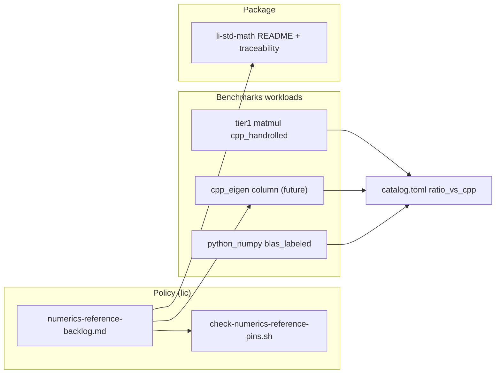

# Numerics reference policy — Eigen 5.0 / 3.4.x baseline + BLAS ABI (math-r)

**Issue:** [lic#33](https://github.com/li-langverse/lic/issues/33)  
**Explorer digest:** [2026-05-17-explorer](https://github.com/li-langverse/benchmarks/blob/main/docs/ecosystem/explorer-digests/2026-05-17-explorer.md)  
**Package home:** `li-std-math` (`packages/li-math`, org mirror `li-langverse/li-std-math`)  
**Benchmarks home:** `li-langverse/benchmarks` — harness, `cpp_eigen` column, tier-1 workload READMEs (not kernel code in lic)

---

## Problem

Gap explorer pass **2026-05-17** flags **Eigen 5.0.0** (2025-09-30) and **3.4.1** patch as active SOTA with **BLAS-facing ABI shifts** (C++17 minimum, SemVer, `EIGEN_USE_BLAS` wrapper return-type changes). Li tier-1 matmul parity and `li-std-math` documentation reference Eigen/MKL-class stacks, but **no canonical pin** exists — CI images, bench READMEs, and future `cpp_eigen` columns can drift silently.

| Signal | Current state (`main`) | math-r gap |
|--------|------------------------|------------|
| Tier-1 `matmul_*` cpp oracle | Hand-rolled IKJ C in `common/*_core.c` (BLIS-style), **not** Eigen | Honest labeling; optional `cpp_eigen` column unpinned |
| `cpp_eigen` column | Named in benchmarks plan; **not implemented** in workloads | No versioned reference build |
| BLAS linkage | NumPy/OpenBLAS for PH-ML rows; `LI_EXTRA_C` C cores unlabeled for BLAS | No ABI matrix (OpenBLAS vs MKL vs pure Eigen) |
| C++ baseline | `-std=c++17` in places; not centralized for numerics refs | Eigen 5.x requires C++17 — must be explicit |
| `li-std-math` docs | GEMM roadmap cites BLAS parity; no Eigen pin | Package README / traceability drift |
| `G-math` | Partial — tier-1 ratios vs "C++" without vendor column honesty | Reference policy row missing in provability gaps |
| Release cadence | [benchmarks#27](https://github.com/li-langverse/benchmarks/issues/27) tracks multi-vendor cadence | Eigen-specific pin is subset of #27 — this plan owns Eigen/BLAS |

**North star:** Dense LA credibility requires **pinned, documented reference stacks** before claiming parity with Eigen/MKL. Policy-first — do **not** weaken `threshold_ratio_cpp` to green rows when reference builds change.

**Duplicate check:** Not a duplicate of [benchmarks#27](https://github.com/li-langverse/benchmarks/issues/27) (multi-vendor cadence umbrella), [lic#463](https://github.com/li-langverse/lic/issues/463) (tier-1 red closure — codegen), or [lic#35](https://github.com/li-langverse/lic/issues/35) (SUNDIALS integrators). This plan owns **Eigen + BLAS reference pinning** only.

---

## Scope (this plan)

| In scope | Out of scope (defer) |
|----------|----------------------|
| Canonical `numerics-reference-backlog.md` + Eigen pin matrix | Full Eigen sparse decompositions in Li |
| `PINNED.md` for tier-1 matmul + future `cpp_eigen` builds | MKL-only CI (optional profile only) |
| BLAS ABI table (OpenBLAS default, MKL optional) | Kokkos/PETSc pins — see #27 / lic#110 |
| `scripts/check-numerics-reference-pins.sh` gate | Pure-Li SIMD matmul codegen (PH-7e — separate) |
| Cross-link benchmarks plan `cpp_eigen` row | Weakening `threshold_ratio_cpp` |
| `li-std-math` README / traceability pin block | `trusted.lean` BLAS axioms |
| Honest relabel: current cpp oracle = **hand-rolled C**, not Eigen | New org repo |

**Plan home:** `lic` (policy + gate scripts). **Benchmarks** PR (post-approval) adds workload `PINNED.md` and optional `cpp_eigen/` tree.

---

## Pinned reference matrix (v1 — human ack required)

| Axis | **Current CI default** | **Forward track** | Notes |
|------|------------------------|-------------------|-------|
| **Eigen** | **3.4.1** (patch line) | **5.0.0** | 5.x requires C++17; SemVer breaking BLAS wrappers |
| **C++ std** | **C++17** (`-std=c++17`) | C++17 (no change for 5.x) | Match Eigen 5.0 release notes |
| **BLAS backend** | **OpenBLAS** 0.3.x (system or CI image) | Same + optional MKL column | Label `blas_labeled` in competitive rows |
| **Eigen BLAS mode** | Pure Eigen (no `EIGEN_USE_BLAS`) for `cpp_eigen` v1 | `EIGEN_USE_BLAS` column after ABI gate | Eigen 5.0 void-return wrapper ABI — test before enabling |
| **NumPy reference** | Pinned in PH-ML competitive JSON | Same pin block | Already `blas_labeled` in `bench-ph-ml-competitive.sh` |
| **Li cpp oracle label** | `cpp_handrolled` (IKJ C core) | Keep as primary **correctness** column | Do not rename to `cpp_eigen` without Eigen build |

**External refs:**

- [Eigen releases index](https://libeigen.gitlab.io/releases/)
- [Eigen 5.0 release notes](https://libeigen.gitlab.io/releases/5.0/)
- [Eigen 3.4.1 news](https://libeigen.gitlab.io/news/eigen_3.4.1_released/)
- [Eigen BLAS/LAPACK topic (5.0)](https://libeigen.gitlab.io/eigen/docs-5.0/TopicUsingBlasLapack.html)

---

## Architecture



### Reference column honesty (tier-1 matmul)

| Column id | Build | Used for `ratio_vs_cpp` today? | Pin doc |
|-----------|-------|-------------------------------|---------|
| `cpp` / `cpp_handrolled` | `common/matmul_*_core.c` IKJ | **Yes** — primary gate | `benchmarks/.../PINNED.md` |
| `cpp_eigen` | Eigen `MatrixXd` GEMM (future) | **No** — not built | Same `PINNED.md` + policy |
| `python_numpy` | NumPy `@` → OpenBLAS | PH-ML rows only | `numerics-reference-backlog.md` |

---

## Work packages

todos:
- id: wp-math-r0-plan-doc
  content: "Canonical plan + orchestrator note + backlog stub (this doc)"
  status: completed
  agent: issue_planner
- id: wp-math-r1-backlog
  content: "docs/ecosystem/numerics-reference-backlog.md — Eigen/BLAS pin matrix, cpp column honesty, bump procedure"
  status: pending
  agent: code_implementer
- id: wp-math-r2-pinned-md
  content: "benchmarks: PINNED.md under tier1_micro/matmul_{naive,blocked}; relabel cpp oracle as hand-rolled C"
  status: pending
  agent: code_implementer
  depends: wp-math-r1-backlog
  handoff_to: benchmarks#27
- id: wp-math-r3-gate-script
  content: "scripts/check-numerics-reference-pins.sh — grep pin block in backlog + li-std-math PUBLISH.md; wire into check-hpc-competitive.sh"
  status: pending
  agent: code_implementer
  depends: wp-math-r1-backlog
- id: wp-math-r4-cpp-eigen-stub
  content: "benchmarks: optional cpp_eigen/main.cpp stub (Eigen 3.4.1, --verify checksum); catalog column planned until green"
  status: pending
  agent: code_implementer
  depends: wp-math-r2-pinned-md
- id: wp-math-r5-std-math-docs
  content: "packages/li-math README + traceability + org mirror li-std-math: cite numerics-reference-backlog pins"
  status: pending
  agent: code_implementer
  depends: wp-math-r1-backlog
- id: wp-math-r6-provability
  content: "docs/verification/provability-gaps.md: G-math reference-policy slice; plan-cross-links row"
  status: pending
  agent: code_implementer
  depends: wp-math-r1-backlog
- id: wp-math-r7-eigen5-migration-gate
  content: "docs/numerics/studies/YYYY-MM-DD-eigen5-blas-abi-migration.md + CI optional profile eigen-5-blaspinned"
  status: pending
  agent: numerics_researcher
  depends: wp-math-r4-cpp-eigen-stub

---

## Done gates

### `math-r1-policy` → **completed** when all pass

#### A — Backlog + pins (mandatory)

```bash
test -f docs/ecosystem/numerics-reference-backlog.md
grep -E 'Eigen.*3\.4\.1|Eigen.*5\.0\.0|C\+\+17|OpenBLAS' docs/ecosystem/numerics-reference-backlog.md
./scripts/check-numerics-reference-pins.sh
```

Expect: **exit 0**; pin block matches human-approved matrix above.

#### B — Package cross-link

```bash
grep -i 'numerics-reference-backlog' packages/li-math/README.md packages/li-math/PUBLISH.md
```

#### C — Honest cpp oracle labeling

```bash
grep -r 'hand-rolled\|cpp_handrolled\|not Eigen' benchmarks/tier1_micro/matmul_*/PINNED.md
```

Tier-1 README must **not** claim cpp column is Eigen unless `cpp_eigen` build exists.

#### D — No threshold weakening

```bash
! git diff --name-only | grep -q catalog.toml || echo "catalog.toml changes require human review"
```

---

### `math-r4-cpp-eigen-stub` → **completed** when

- `cpp_eigen` builds with Eigen **3.4.1** on CI image; `--verify` checksum matches hand-rolled oracle within fp tolerance.
- `catalog.toml` row adds `cpp_eigen` variant with `status=planned` until ratio measured.
- Eigen **5.0.0** migration documented in study; not default until `wp-math-r7` gate green.

---

## PH / REQ / test mapping

| ID | Requirement | Evidence |
|----|-------------|----------|
| **PH-5b** | Honest cross-lang numerics references | Pin matrix + labeled columns |
| **PH-7e** | Pure-Li vs reference cpp fairness | Primary gate stays hand-rolled C; Eigen is advisory column |
| **G-math** | Dense LA parity honesty | provability-gaps reference-policy slice |
| **G-meta** | FP eval / BLAS linkage documented | BLAS ABI table; no silent ABI drift |
| **REQ-MATH-R-01** | Eigen 3.4.1 pin in backlog | `check-numerics-reference-pins.sh` |
| **REQ-MATH-R-02** | C++17 baseline explicit | backlog + CI doc |
| **REQ-MATH-R-03** | BLAS backend labeled | `blas_labeled` on numpy/eigen-BLAS rows |
| **REQ-MATH-R-04** | Bump procedure documented | backlog § Release bump |
| **REQ-MATH-R-05** | No cpp_eigen without pin | gate script + PINNED.md |

### Tests / benches

| Artifact | Suite | Purpose |
|----------|-------|---------|
| `matmul_naive`, `matmul_blocked` | tier-1 micro | Primary `ratio_vs_cpp` vs hand-rolled C |
| `check-numerics-reference-pins.sh` | lic CI | Policy drift gate |
| `check-tier1-li-vs-cpp.sh` | lic CI | Unchanged thresholds |
| `bench-ph-ml-competitive.sh` | PH-ML | NumPy BLAS row (already labeled) |
| `cpp_eigen` (future) | tier-1 optional | Eigen GEMM advisory column |

### G-* gap updates (on implement)

| Gap | Before | After math-r1 | After math-r4 |
|-----|--------|---------------|---------------|
| **G-math** | Partial; cpp column unlabeled | + reference-policy slice | + optional cpp_eigen column |
| **G-meta** | Partial | + BLAS ABI documented | + Eigen5 migration study |

---

## Learned from

1. **Explorer digest 2026-05-17** — Eigen 5.0 / 3.4.1 BLAS ABI; P1 pin for G-math / PH-5b.  
   `benchmarks/docs/ecosystem/explorer-digests/2026-05-17-explorer.md`

2. **Benchmarks & simulations plan** — `cpp_eigen` column defined; NumPy BLAS must be labeled.  
   `docs/superpowers/plans/2026-05-14-benchmarks-and-simulations.md`

3. **Math linalg surface plan** — tier-1 matmul uses math `@` surface; Eigen optional column.  
   `docs/superpowers/plans/2026-05-16-li-math-linalg-surface.md`

4. **Matmul oracle init study** — hand-rolled IKJ C oracle is BLIS-style, not vendor BLAS.  
   `docs/numerics/studies/2026-05-30-bench-improver-matmul-oracle-init.md`

---

## Release bump procedure (backlog §)

1. Monitor [Eigen releases](https://libeigen.gitlab.io/releases/) + [benchmarks#27](https://github.com/li-langverse/benchmarks/issues/27) cadence issue.
2. File numerics study if **minor** Eigen bump affects BLAS wrapper ABI.
3. Update `numerics-reference-backlog.md` pin block + `PINNED.md` in same PR.
4. Re-run tier-1 ingest; **do not** change `threshold_ratio_cpp` — investigate ratio shift.
5. Human ack for Eigen **4.x → 5.x** default flip.

---

## Implement handoff

After human labels **`plan-approved`** on #33:

1. **`code_implementer`** executes `wp-math-r1-backlog` → `wp-math-r3-gate-script` → `wp-math-r5-std-math-docs` on branch `cursor/numerics-reference-loop`.
2. **Benchmarks PR** (sibling): `wp-math-r2-pinned-md`, `wp-math-r4-cpp-eigen-stub` — cross-link lic plan path.
3. **`numerics_researcher`**: `wp-math-r7-eigen5-migration-gate` if Eigen 5 BLAS ABI differs on CI image.
4. **`plan_verifier`**: confirm explorer rubric Eigen row cites math-r track.

**Do not:** weaken `threshold_ratio_cpp`; label hand-rolled C as Eigen; edit `trusted.lean` without human issue.

---

## Vision / defer checks

| Check | Result |
|-------|--------|
| Conflicts with strict-by-default? | **No** — honesty + pins before perf claims |
| Duplicates package mirror without P0 CI? | **No** — `li-std-math` has org mirror CI |
| Weaken `threshold_ratio_cpp` only? | **Rejected** |
| New org repo? | **No** |
| Duplicate of #27 / #463 / #35? | **No** — Eigen/BLAS pin vertical |

### Explicitly deferred

| Item | Reason |
|------|--------|
| Eigen sparse / decompositions in Li | Out of PH-5b v1 scope |
| MKL as default CI BLAS | License / image cost — optional column |
| Eigen 5.0 default before migration study | BLAS ABI breaking change |
| Full vendor BLAS for cpp primary oracle | Hand-rolled C preserves deterministic checksum |

---

## Human approval

- [ ] Review plan doc
- [ ] Label issue #33 `plan-approved`
- [ ] Remove `plan-needed`
- [ ] Do **not** self-merge draft PR
