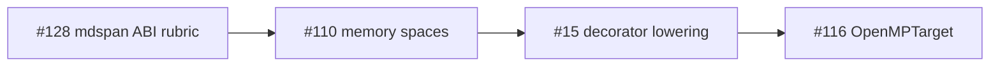

# Kokkos 4.6+ mdspan View refactor — tier-2 strided buffer ABI rubric (PH-7e, G-par)

> **Issue:** [#128](https://github.com/li-langverse/lic/issues/128) · **Repo:** li-langverse/lic  
> **Vision:** **Provable** (layout + copy contracts before device perf), **Easy** (SoA/AoS field buffers without C oracle), **Fast** (only after proof — no silent host↔device copies)  
> **north_star_fit:** HPC / tier-2 physics · **PH-7e**, **PH-7d**, **G-par**  
> **Learned from:** [master plan §7e](2026-05-14-li-master-plan.md), [phase 7 native HPC](2026-05-14-phase-07-native-hpc.md), [language design §Phase 3 shapes](../specs/2026-05-14-li-language-design.md), [Kokkos mdspan View refactor (2025)](https://kokkos.org/blog/2025-04-view-refactor)

## Goal

Define a **competitive rubric and Li ABI** for tier-2 physics field buffers that matches Kokkos 4.6+ **`std::mdspan`-backed Views** — extents, strides, layout (SoA vs AoS), and explicit copy/sync policy — so pure-Li tier-2 kernels can replace **`shared_c_kernel`** catalog rows without weakening proof or bench honesty.

This plan is the **layout / strided-buffer slice**. Execution-space enums, DualView deprecation semantics, and decorator lowering live in sibling issues ([#110](https://github.com/li-langverse/lic/issues/110), [#15](https://github.com/li-langverse/lic/issues/15), [#116](https://github.com/li-langverse/lic/issues/116)).

## Non-goals

- Implementing `ndview` / `devicebuffer` types in the compiler (**blocked** until this plan is **`plan-approved`** and #110 memory-space plan lands).
- Weakening `threshold_ratio_cpp` or re-labeling tier-2 rows green while still on shared C (**benchmarks** honesty violation).
- GPU offload codegen (defer to [#116](https://github.com/li-langverse/lic/issues/116) OpenMPTarget checklist + [#34](https://github.com/li-langverse/lic/issues/34) MLIR `omp` lowering).
- Editing `trusted.lean` (human-approved issues only).
- Duplicating [#110](https://github.com/li-langverse/lic/issues/110) — that issue owns execution-space + host/device **policy matrix**; #128 owns **mdspan layout ABI**.

## Dependencies

| Track | Issue / doc | Role |
|-------|-------------|------|
| **PH-7e** | [2026-05-16-li-math-linalg-surface.md](2026-05-16-li-math-linalg-surface.md) | Tier-1 math lowering precedes tier-2 field buffers |
| **PH-7d** | [#15](https://github.com/li-langverse/lic/issues/15) | `@cpu` / `@parallel` decorator elaboration → copy/sync hooks |
| **G-par** | [#66](https://github.com/li-langverse/lic/issues/66) (closed), [#129](https://github.com/li-langverse/lic/issues/129) | NUMA / affinity maps to parallel policies |
| **Sibling** | [#110](https://github.com/li-langverse/lic/issues/110) | Memory-space + View lifecycle (coordinate, do not duplicate) |
| **Benchmarks** | `catalog.toml` tier-2 `shared_c_kernel` rows, [explorer digest 2026-05-20](https://github.com/li-langverse/benchmarks/blob/main/docs/ecosystem/explorer-digests/2026-05-20-explorer.md) | Evidence + migration targets |

## Competitive rubric (Kokkos 4.6+ → Li must define)

| Kokkos 4.6+ / mdspan concept | Li ABI requirement | Proof / gate |
|------------------------------|-------------------|--------------|
| `extents` / `layout_left` / `layout_right` | `ndview[Shape, T]` with **static or dynamic** rank; document default layout for `grid[N,M,T]` | Shape types in MIR; no runtime shape drift in release |
| `layout_stride` / non-contiguous access | Stride tuple in type or proven view constructor; reject silent re-interpret cast | **G-par** disjoint rules apply per stride slice |
| SoA vs AoS field structs | Tier-2 physics **field bundle** type alias (`FieldSoA` / `FieldAoS`) with explicit migration note per bench | Catalog row notes which layout oracle uses |
| `Kokkos::View` host / device tags | `hostbuffer[T]` / `devicebuffer[T]` placement (spec-only until #110) | Copy/sync **must** be explicit in lowering — no implicit DualView |
| `deep_copy` / `DualView` deprecation | Decorator lowering emits **named** sync points (`@sync_host`, `@sync_device` — names TBD in #110) | Compile error on device read without prior sync proof obligation |
| Execution space + NUMA | Map to `parallel for` + `[execution]` config ([#129](https://github.com/li-langverse/lic/issues/129)) | **G-par** disjoint + documented affinity deferrals |

## Sub-phases

| Sub | Deliverable | Exit gate |
|-----|-------------|-----------|
| **A** | **Rubric doc** — `docs/hpc/kokkos-mdspan-tier2-rubric.md` with table above + Kokkos 4.6.0 release notes | Maintainer review; linked from #128 |
| **B** | **ABI spec** — extend [language design §Phase 3](../specs/2026-05-14-li-language-design.md) `ndview` / `hostbuffer` / `devicebuffer` with stride + layout enums | Spec PR; no codegen |
| **C** | **Field buffer patterns** — SoA vs AoS guidance for tier-2 physics (`heat_equation_2d`, `md_lennard_jones`) | One worked example per layout in spec |
| **D** | **Copy/sync contract** — document explicit sync points for decorator lowering; cross-link #110 policy matrix | Table: decorator stack → required sync (plan-only) |
| **E** | **Catalog honesty** — annotate tier-2 `shared_c_kernel` rows in **benchmarks** with target Li layout + migration phase (doc PR on benchmarks) | No threshold changes; `variant` stays honest until pure-Li lands |
| **F** | **Pilot migration plan** — single row (`heat_equation_2d`) staged path: shared-C oracle → pure-Li strided buffer + explicit host sync | Issue checklist on #128; implementation **after** `plan-approved` |
| **G** | **G-par gap note** — update [provability-gaps.md](../../verification/provability-gaps.md) **G-par** row with “strided view disjoint” open obligation (same PR as spec, not before) | Honest Partial; no Done claim |

## Tests / benches

| Artifact | Tier | Purpose |
|----------|------|---------|
| `heat_equation_2d` | 2 | Pilot migration target (`catalog.toml` id) |
| `md_lennard_jones` | 2 | SoA field stress (existing pure-Li driver — extend layout notes) |
| `li-tests/hpc/` (new suite, post-approval) | — | `compile_ok` / `compile_fail` for illegal device read without sync |
| `benchmarks/harness/bench.py --tier 2` | 2 | Checksum + ratio gates unchanged |

**Exit (plan phase):** rubric + spec docs merged; catalog annotations filed on **benchmarks** (separate PR, linked).

**Exit (implementation phase, post-approval):** one tier-2 row with `li_pure=True`, explicit sync in source, green checksum.

## Provability

| Gap | Move | Notes |
|-----|------|-------|
| **G-par** | Partial → documented Partial | Add strided-index disjoint obligations; Lean proofs remain open |
| **G-dec** | Partial | `@cpu` / device decorators must elaborate to sync MIR tags (#15) |
| **G-math** | No change in plan phase | Tier-2 layout is orthogonal to tier-1 matmul closed slice |

## Rollout

1. Merge **this plan** on **`plan-approved`** (lic PR from #128).
2. Sub-phase **A–D** — docs-only PRs on **lic** (can stack after approval).
3. Sub-phase **E** — **benchmarks** PR for catalog annotations (no harness in lic).
4. Sub-phase **F** — implementation PR(s) on **lic** + bench ingest; coordinate with #110 before device buffers.
5. Close #128 when rubric + ABI spec + catalog annotations + pilot migration **plan** are merged; track codegen in #110 / #15.

## Sequencing vs sibling issues

- **#128 first:** layout / stride / SoA-AoS rubric (this plan).
- **#110 next:** memory-space enums + View lifecycle.
- **#15 / #116:** lowering and offload after ABI is frozen.

## Human-only

- [ ] Label **`plan-approved`** on #128 after reviewing this doc (remove **`plan-needed`**).
- [ ] Approve final `ndview` / buffer type names before parser work.
- [ ] Approve **benchmarks** catalog annotation PR (no agent self-merge on cross-repo policy).
- [ ] Any `trusted.lean` axiom for device memory — separate human-approved issue.
