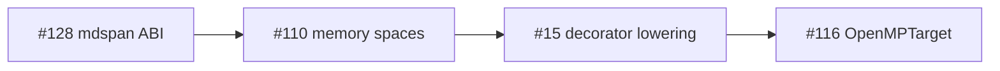

# Kokkos 4.6 Views + execution-space semantics — Li tier-2 memory model (PH-7e, G-par)

> **Issue:** [#110](https://github.com/li-langverse/lic/issues/110) · **Repo:** li-langverse/lic  
> **Vision:** **Provable** (explicit copy/sync before device access), **Easy** (host/device/unified enums without Kokkos headers), **Fast** (only after proof — no silent DualView)  
> **north_star_fit:** HPC / tier-2 physics · **PH-7e**, **PH-7d**, **G-par**, **G-gpu**  
> **Learned from:** [master plan §7e](2026-05-14-li-master-plan.md), [phase 7 native HPC](2026-05-14-phase-07-native-hpc.md), [execution decorators spec](../specs/2026-05-16-li-execution-decorators.md), [Kokkos 4.6.02 release](https://github.com/kokkos/kokkos/releases/tag/4.6.02)

## Goal

Define a **minimal, provable Li memory-space and execution-space model** — enums, View lifecycle, and explicit copy/sync contracts — that matches Kokkos 4.5–4.6 production semantics (SYCL backend, graph API, H100-oriented reductions, DualView deprecation) so tier-2 physics can migrate from **`shared_c_kernel`** catalog rows to pure-Li kernels **without silent host↔device copies**.

This plan owns the **memory-space / execution-space policy matrix**. Strided layout ABI (`ndview` extents, SoA/AoS) lives in sibling [#128](https://github.com/li-langverse/lic/issues/128); decorator lowering in [#15](https://github.com/li-langverse/lic/issues/15); GPU offload codegen in [#116](https://github.com/li-langverse/lic/issues/116).

## Non-goals

- Implementing `hostbuffer` / `devicebuffer` codegen or LKIR lowering (**blocked** until #128 layout ABI is frozen).
- Weakening `threshold_ratio_cpp` or re-labeling tier-2 rows green while still on shared C.
- SYCL/CUDA/HIP kernel emission (defer to [#116](https://github.com/li-langverse/lic/issues/116) OpenMPTarget checklist + [#34](https://github.com/li-langverse/lic/issues/34) MLIR `omp` lowering).
- Editing `trusted.lean` (human-approved issues only).
- Duplicating [#128](https://github.com/li-langverse/lic/issues/128) — that issue owns **mdspan layout / stride ABI**; #110 owns **where data lives and who may access it**.

## Dependencies

| Track | Issue / doc | Role |
|-------|-------------|------|
| **PH-7e** | [2026-05-16-li-math-linalg-surface.md](2026-05-16-li-math-linalg-surface.md) | Tier-1 math lowering precedes tier-2 device buffers |
| **PH-7d** | [#15](https://github.com/li-langverse/lic/issues/15) | `@cpu` / `@gpu` / `@parallel` elaboration → sync MIR tags |
| **G-par** | [#129](https://github.com/li-langverse/lic/issues/129) | NUMA / affinity maps to execution-space config |
| **G-gpu** | [#28](https://github.com/li-langverse/lic/issues/28), [#116](https://github.com/li-langverse/lic/issues/116) | PETSc–Kokkos exascale framing; OpenMPTarget offload |
| **Sibling** | [#128](https://github.com/li-langverse/lic/issues/128) | mdspan layout ABI (must land or approve in parallel) |
| **Benchmarks** | [#41](https://github.com/li-langverse/benchmarks/issues/41), [#27](https://github.com/li-langverse/benchmarks/issues/27) | pure-Li variant expansion; Kokkos vendor policy |
| **Digest** | [2026-05-20 explorer](https://github.com/li-langverse/benchmarks/blob/main/docs/ecosystem/explorer-digests/2026-05-20-explorer.md) | Evidence: Kokkos `missing` in `hpc_libraries` |

## Competitive rubric (Kokkos 4.6 → Li must define)

| Kokkos 4.6 concept | Li requirement | Proof / gate |
|--------------------|----------------|--------------|
| `Kokkos::MemorySpace` (`HostSpace`, `CudaSpace`, `HIPSpace`, `SYCLSpace`, `HBWSpace`) | `MemorySpace` enum: `Host`, `Device`, `Unified` (HBW alias documented) | Compile-time placement tag on buffer type; no runtime space discovery |
| `Kokkos::ExecutionSpace` (`Serial`, `OpenMP`, `Threads`, `Cuda`, `HIP`, `SYCL`) | `ExecutionSpace` enum: `Serial`, `OpenMP`, `Threads` (v1); `SYCL`/`Cuda`/`HIP` reserved for #116 | Decorator stack selects space; **Threads vs OpenMP** conflict documented (see Trilinos #1391) |
| `Kokkos::View` allocation + deallocation | `View[T, Space, Layout]` lifecycle: construct → use → destroy in **same** space unless explicit sync | Compile error on cross-space read without prior `@sync_*` |
| `deep_copy(src, dst)` | Named sync intrinsics: `@sync_host(view)`, `@sync_device(view)` (names TBD; spec-only in plan phase) | **G-par** + **G-gpu**: sync points appear in MIR telemetry |
| `DualView` deprecation (4.6) | **No implicit dual view** — host mirror is explicit `hostbuffer[T]` paired with `devicebuffer[T]` | Reject API that auto-syncs on read (Kokkos 4.6 breaking change alignment) |
| Graph API / composite loops (4.6 #7513) | Defer graph capture to #15 / #116; document **serial** staging path for tier-2 pilot | Plan-only note; no graph codegen in v1 |
| H100-oriented reductions | Map to `@parallel(reduction=…)` + execution-space tag; perf after proof | Tier-2 bench unchanged until pure-Li lands |
| OpenMP vs Threads pool conflict | **Policy:** default `OpenMP` execution space; `Threads` opt-in with runtime warning if libomp also linked | Document in [kokkos-execution-space-rubric.md](../../hpc/kokkos-execution-space-rubric.md) |

## Sub-phases

| Sub | Deliverable | Exit gate |
|-----|-------------|-----------|
| **A** | **Policy matrix doc** — [kokkos-memory-execution-spaces-rubric.md](../../hpc/kokkos-memory-execution-spaces-rubric.md) | Maintainer review; linked from #110 |
| **B** | **Spec enums** — extend [language design §Phase 3](../specs/2026-05-14-li-language-design.md) + `std/execution/memory_spaces.li` | Spec PR; no parser |
| **C** | **Copy/sync contract** — table: decorator stack → required sync points; cross-link #128 layout types | Feeds #15 elaboration |
| **D** | **shared_c_kernel → explicit copy migration rubric** — [shared-c-kernel-migration-appendix.md](../../hpc/shared-c-kernel-migration-appendix.md) | Annotate `heat_equation_2d`, `md_lennard_jones` |
| **E** | **Pilot row plan** — `heat_equation_2d` staged path in migration appendix | Checklist on #110; codegen after #128 ABI |
| **F** | **Vendor policy handoff** — [benchmarks-vendor-kokkos-4.6-handoff.md](../../hpc/benchmarks-vendor-kokkos-4.6-handoff.md) | Linked issue on benchmarks #27 |
| **G** | **G-par / G-gpu gap update** — [provability-gaps.md](../../verification/provability-gaps.md) | Honest Partial; no Done claim |

## Tests / benches

| Artifact | Tier | Purpose |
|----------|------|---------|
| `heat_equation_2d` | 2 | Pilot migration target — explicit host→device staging |
| `md_lennard_jones` | 2 | Secondary row — host-only path first (#128 SoA layout) |
| `li-tests/hpc/memory_spaces/` (post-approval) | — | `compile_fail` illegal device read without sync; `compile_ok` explicit sync chain |
| `benchmarks/harness/bench.py --tier 2` | 2 | Checksum + ratio gates unchanged |

**Exit (docs slice):** rubric + spec enums merged; migration appendix + benchmarks vendor checklist filed.

**Exit (codegen slice, deferred):** one tier-2 row with explicit sync in source, `li_pure=True`, green checksum, no silent copy in MIR dump.

## REQ / PH mapping

| ID | Requirement | Plan sub-phase |
|----|-------------|----------------|
| **REQ-MS-01** | `MemorySpace` enum with `Host`, `Device`, `Unified` | B |
| **REQ-MS-02** | Buffer types carry static space tag | B, C |
| **REQ-ES-01** | `ExecutionSpace` enum; OpenMP default for tier-2 | A, B |
| **REQ-ES-02** | Threads vs OpenMP conflict documented | A |
| **REQ-SYNC-01** | Explicit `@sync_host` / `@sync_device` (names TBD) | C, E |
| **REQ-SYNC-02** | Compile error on cross-space read without sync | G, post-approval tests |
| **PH-7e** | Tier-2 pure-Li path blocked until memory model defined | All |
| **PH-7d** | Decorators elaborate to space + sync MIR tags | C → #15 |
| **G-par** | Disjoint + execution-space affinity | A, G |
| **G-gpu** | Address-space separation proofs open | G |

## Sequencing vs sibling issues

- **#128 first (or parallel plan approval):** layout / stride / SoA-AoS ABI.
- **#110 (this plan):** memory-space + execution-space + View lifecycle.
- **#15 / #116:** lowering and offload after policy matrix is frozen.

## External signals (Learned from)

1. [Kokkos 4.6.02 release](https://github.com/kokkos/kokkos/releases/tag/4.6.02) — SYCL production, graph API, DualView deprecation trajectory.
2. [Kokkos 4.6 composite loops / reductions (#7513)](https://github.com/kokkos/kokkos/issues/7513) — H100 reduction patterns; defer graph to #15.
3. [Kokkos::OpenMP vs Threads conflict (Trilinos #1391)](https://github.com/trilinos/Trilinos/issues/1391) — Li default OpenMP; Threads opt-in with documented hazard.
4. [LAMMPS Kokkos+OpenMP practitioner guide](https://www.hpc-carpentry.org/tuning_lammps/07-kokkos-openmp/index.html) — tier-2 staging patterns for explicit execution-space choice.
