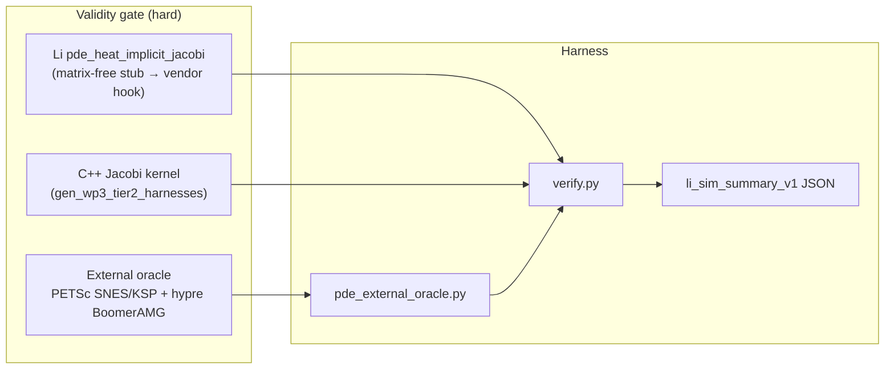

# PDE implicit oracle plan (`pde-r1-hypre-petsc-oracle-plan`)

**Issue:** [lic#108](https://github.com/li-langverse/lic/issues/108)  
**Runner:** `sim-pde-research` (new backlog; gates extend `sim-algo-research-gates.sh`)  
**Prior research:** none — this plan opens the PDE implicit-oracle track

---

## Problem

Li tier-2 PDE today proves **explicit / Jacobi** parity on small grids (`pde_heat_implicit_jacobi` shared-C kernel, `sim_scientific_oracle_checksum_heat()` explicit stencil). That is necessary but **not sufficient** for PH-5b simulation honesty on implicit PDE stacks competitive with PETSc+hypre:

| Signal | Current state | Gap |
|--------|---------------|-----|
| `verticals.toml` `pde_heat_2d` | `workload_class = stub`; `oracle = cpp` | No PETSc / hypre column |
| `registry.toml` | No `petsc` / `hypre` ecosystem rows | Layer A+B competitor missing |
| `algo_registry` `pde_heat_implicit_jacobi` | WP3 shared-C Jacobi only | No SNES/KSP + BoomerAMG path |
| Tier-2 physics benches | Explicit / shared-C time stepping | No implicit solver + AMG + distributed mesh story |
| `ecosystem-explorer.json` | `petsc`, `hypre` marked `missing` | G-math sparse LA beyond dense tier-1 |
| GPU preconditioners | PETSc 3.25 **PCBJKOKKOS** available | No Li `@gpu` / Kokkos hook policy (#28) |

**North star:** Correctness before speed. External oracle is a **validity column**, not a perf shortcut — we do not weaken `threshold_ratio_cpp` to green the dashboard.

---

## Scope (this plan)

| In scope | Out of scope (defer) |
|----------|----------------------|
| Oracle architecture doc + gate script contract | Full PETSc/hypre binary CI on every PR |
| Reference stack spec: DM → SNES/KSP → hypre BoomerAMG (CPU) | Distributed meshes / DMPartition (Phase 8+) |
| Minimal Li API surface (matrix-free vs assembled) for one 2D catalog row | OpenFOAM / CFD cavity oracle (PH-CAE separate) |
| `pde_oracle.toml` pins + `verticals.toml` honesty upgrade path | Pure-Li AMG implementation (vendor oracle first) |
| Bench policy: pinned PETSc/hypre versions aligned with [#33](https://github.com/li-langverse/lic/issues/33) | Weakening tier-0 stability or `threshold_ratio_cpp` |
| Cross-link [#28](https://github.com/li-langverse/lic/issues/28) Kokkos execution patterns for GPU PC slice | New org repo or `trusted.lean` changes |

**Plan home:** `lic` (language + harness contracts). **Benchmarks repo** owns catalog ingest paths only — no kernel code migration.

**Canonical catalog row:** `pde_heat_implicit_jacobi` (algo_registry family `pde`) — backward-Euler heat on 64×64 with inner Jacobi iterations today; oracle upgrade targets **same discretization** solved via PETSc SNES + hypre BoomerAMG.

---

## Architecture



### Oracle tiers

| Tier | Engine | Role | CI default |
|------|--------|------|------------|
| **T0** | Shared C (`pde_heat_implicit_jacobi`) | Cross-lang reference; existing WP3 kernel | **Always** |
| **T1** | Li composable (`scientific_oracle_bench.li` heat path) | Package smoke checksum (explicit stencil today) | **Always** |
| **T2** | PETSc **SNES** + **KSP** + hypre **PCBOOMER** (CPU) | External L2 / checksum oracle vs T0 | **Optional** profile `pde-external-oracle` |
| **T2b** | PETSc **PCBJKOKKOS** (GPU batched PC) | Second column after T2 CPU green; ties to #28 | Same optional profile + `LI_PETSC_GPU=1` |
| **T3** | Distributed DM + hypre parallel CSR | Exascale path — **defer** until T2 stable | Human-approved milestone |

**Pinned versions (implement phase):** document in `benchmarks/tier2_physics/pde_oracle_external/PINNED.md` — e.g. PETSc **3.25.x** + hypre **2.32.x**; no floating `apt install petsc`.

---

## Minimal Li API surface (implement phase)

Early slices may call **vendor hooks** with `modeling_gap` VCs; pure-Li sparse kernels are out of scope for this plan.

| Surface | Purpose | Proof posture |
|---------|---------|---------------|
| `apply_laplacian_2d(u, alpha, dx)` | Matrix-free 5-point stencil residual | `requires`/`ensures` on grid bounds; extern body `modeling_gap` until P-linalg sparse |
| `SparseMatrixCSR` (stub type) | Assembled path for hypre PC | Type exists; no user `unsafe`; vendor FFI behind `trusted` gate |
| `ImplicitHeatStep { u, dt, alpha, dx, pc: Preconditioner }` | One backward-Euler step API | Links to `algo_pde_heat_implicit_jacobi()` registry id |
| `@cpu` / `@parallel` on stencil loop | Phase 7d decorators on residual | Same MIR as explicit heat row; **no `@gpu`** until T2b plan slice approved |

**Package home:** `packages/li-sim-scientific` — extend `vertical_pde_heat_2d()` smoke; do not fork a new package until Wave A gates pass.

---

## Work packages

todos:
- id: wp-pde-oracle-doc
  content: "Canonical plan + competitive-pde-engines companion + orchestrator note (this doc)"
  status: completed
  agent: issue_planner
- id: wp-pde-stack-spec
  content: "Document PETSc DM→SNES/KSP→hypre BoomerAMG reference build + options string table in competitive-pde-engines-plan.md §3"
  status: pending
  agent: numerics_researcher
  study_only: true
- id: wp-pde-api-sketch
  content: "Add API sketch section to packages/li-sim-scientific RFC stub (matrix-free apply + ImplicitHeatStep); no vendor FFI yet"
  status: pending
  agent: numerics_researcher
  depends: wp-pde-stack-spec
- id: wp-pde-oracle-toml
  content: "Add benchmarks/competitive/pde_oracle.toml pins (petsc, hypre, PCBOOMER, PCBJKOKKOS status=stub)"
  status: pending
  agent: numerics_researcher
- id: wp-pde-registry-honesty
  content: "registry.toml petsc_hypre_heat_implicit watch rows; verticals.toml pde_heat_2d oracle=external_binary path; swarm-gap-registry link"
  status: pending
  agent: numerics_researcher
  depends: wp-pde-oracle-toml
- id: wp-pde-driver-stub
  content: "Add benchmarks/harness/pde_external_oracle.py stub + verify.py hook (--external-oracle petsc_hypre|skip)"
  status: pending
  agent: numerics_researcher
  depends: wp-pde-oracle-toml
- id: wp-pde-gate-wire
  content: "Extend sim-algo-research-gates.sh SIM_RESEARCH_VERTICAL=pde; sim-pde-research-backlog todo pde-r1"
  status: pending
  agent: numerics_researcher
  depends: wp-pde-driver-stub
- id: wp-pde-study
  content: "Study docs/numerics/studies/YYYY-MM-DD-pde-r1-hypre-petsc-oracle-plan.md with grade matrix + grid sizes 32/64/128"
  status: pending
  agent: numerics_researcher
  study_only: true
  depends: wp-pde-gate-wire

---

## Gate script reference (completion contract)

`pde-r1-hypre-petsc-oracle-plan` todo flips to **completed** only when **all** gates below pass.

### A — Research gates (study iteration)

```bash
cd lic
export SIM_RESEARCH_VERTICAL=pde
export SIM_RESEARCH_BACKLOG_STUDY_ONLY=1
export SIM_RESEARCH_REQUIRE_STUDY=docs/numerics/studies/YYYY-MM-DD-pde-r1-hypre-petsc-oracle-plan.md
./scripts/sim-algo-research-gates.sh
```

### B — Harness manifest cites oracle path

| File | Required entry |
|------|----------------|
| `packages/li-sim-scientific/li-tests/manifest.toml` | smoke note referencing `pde_external_oracle.py` |
| `li-tests/manifest.toml` | Monorepo mirror |
| `benchmarks/tier2_physics/pde_oracle_external/README.md` | `Oracle driver: benchmarks/harness/pde_external_oracle.py` |

Verify:

```bash
grep -E 'pde_external_oracle|pde_oracle_external' \
  packages/li-sim-scientific/li-tests/manifest.toml \
  li-tests/manifest.toml \
  benchmarks/tier2_physics/pde_oracle_external/README.md
```

### C — Tier-2 verify hook (implement phase)

```bash
python3 benchmarks/harness/verify.py --tier 2 --only pde_heat_implicit_jacobi --write-summary
python3 benchmarks/harness/pde_external_oracle.py --engine petsc_hypre --dry-run
./scripts/validate-sim-summary.sh benchmarks/results/pde_heat_implicit_jacobi/
```

### D — Competitive registry validate

```bash
./scripts/check-hpc-competitive.sh
grep -q 'petsc' benchmarks/competitive/registry.toml
grep -q 'pde_oracle' benchmarks/competitive/pde_oracle.toml
```

---

## PH / REQ / test mapping

| ID | Requirement | Evidence |
|----|-------------|----------|
| **PH-5b** | Tier-2 physics correctness + cross-lang CSV honesty | PETSc+hypre external oracle column documented |
| **PH-7e** | Math→SIMD only after validity | Oracle plan blocks PH-7e SIMD on PDE until T0+T2 green |
| **PH-7d** | Execution decorators / Kokkos patterns (#28) | T2b GPU PC deferred; `@cpu` stencil path documented |
| **G-math** | Sparse / implicit LA beyond dense tier-1 | Plan opens slice; no `threshold_ratio_cpp` weakening |
| **G-physics** | Tier-2 implicit PDE modeling_gap | `entries/physics-*.toml` cross-link; extern kernels labeled |
| **G-gpu** | Device preconditioner proofs | PCBJKOKKOS watch-only until human approves T2b slice |
| **REQ-PDE-ORACLE-01** | Pinned PETSc+hypre reproduces T0 checksum at 64×64 | Study size table + `pde_external_oracle.py` |
| **REQ-PDE-ORACLE-02** | BoomerAMG L2 error vs analytical sin at t=T (advisory ±1e-3 start) | Study grade matrix |
| **REQ-PDE-ORACLE-03** | `li_sim_summary_v1` records `variant=petsc_hypre` | `sim-output-contract.md` |
| **REQ-NUM-PIN-01** | Oracle pins align with [#33](https://github.com/li-langverse/lic/issues/33) numerics policy | `pde_oracle.toml` + cross-link |

### Tests / benches

| Artifact | Suite | Purpose |
|----------|-------|---------|
| `pde_heat_implicit_jacobi` | tier-2 | Primary implicit heat row (WP3 C kernel) |
| `pde_oracle_external` | tier-2 | Catalog external-oracle alias (new) |
| `heat_equation_2d` | tier-2 | Explicit heat (unchanged) |
| `scientific_oracle_bench.li` | smoke | Existing T0 Li↔C checksum |
| `sim-algo-research-gates.sh` | research | `SIM_RESEARCH_VERTICAL=pde` |

---

## Learned from

1. **Benchmarks & simulations plan §2f** — `heat_equation_2d` explicit Euler/Jacobi baseline; this plan extends to implicit + AMG oracle.  
   `docs/superpowers/plans/2026-05-14-benchmarks-and-simulations.md`

2. **Phase 7 native HPC** — `@cpu`/`@parallel` decorators elaborate to proved cores; GPU offload stays partial (**G-gpu**).  
   `docs/superpowers/plans/2026-05-14-phase-07-native-hpc.md`

3. **Algorithms & libraries plan §3** — HPC/physics sim vertical lists PETSc as incumbent; Layer B `verticals.toml` honesty required.  
   `docs/ecosystem/algorithms-and-libraries-plan.md`

4. **PETSc PCBJKOKKOS** — GPU batched preconditioner reference for T2b slice sizing.  
   https://petsc.org/release/manualpages/PC/PCBJKOKKOS/

---

## Implement handoff

After human labels **plan-approved** on #108:

1. **`numerics_researcher`** on `cursor/sim-pde-research-loop` executes `wp-pde-stack-spec` → `wp-pde-study`.
2. **`bench_improver`** optional: wire optional CI profile `pde-external-oracle` (no new `schedule:` cron).
3. **`plan_verifier`**: clear swarm gaps `gap-hpc-hypre-boomeramg-tier2-pde`, `gap-hpc-petsc-kokkos-implicit-pde`, `gap-vertical-stub-pde-heat-2d`.
4. **benchmarks catalog ingest**: add `pde_oracle_external` lic path once harness lands.

**Cross-link:** [#28](https://github.com/li-langverse/lic/issues/28) Kokkos execution patterns — reference in T2b slice only. [#33](https://github.com/li-langverse/lic/issues/33) — shared numerics pin table for oracle builds.

---

## Vision / defer checks

| Check | Result |
|-------|--------|
| Conflicts with strict-by-default? | **No** — external oracle strengthens validity |
| Duplicates package mirror without P0 CI? | **No** — harness-first in lic |
| Weaken `threshold_ratio_cpp` only? | **Rejected** — explicit in scope table |
| New org repo? | **No** |
| Distributed mesh without PH track? | **Deferred** — T3 milestone needs human checklist |

---

## Human approval

- [ ] Review plan doc
- [ ] Label issue #108 `plan-approved`
- [ ] Remove `plan-needed`
- [ ] Do **not** self-merge draft PR
