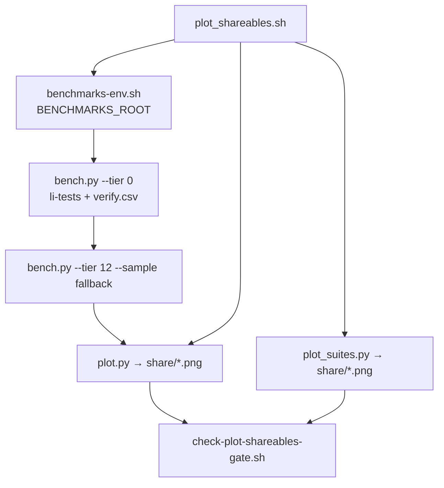

# PH-5b — plots-and-social exit gates close

**Issue:** [lic#459](https://github.com/li-langverse/lic/issues/459)  
**Parent plan:** [2026-05-14-plots-and-social.md](2026-05-14-plots-and-social.md)  
**Master plan row:** Phase **5b** — Benchmarks & sims (X plots slice)

---

## Problem

`plan-completion-audit.py` (2026-05-29) reports **4 open `plan_gate` rows** in the parent plots plan while the master plan Phase **5b** tracker reads complete. Skeleton code exists (`scripts/plot_shareables.sh`, `benchmarks/harness/plot.py`, `plot_theme.py`, `li-tests/harness/plot_suites.py`) but the exit gates were never closed in a single audited PR.

| Gate (parent plan) | Current state | Root cause |
|--------------------|---------------|------------|
| `./scripts/plot_shareables.sh` exits 0, ≥4 PNGs | Script exists; audit not green | `BENCHMARKS_ROOT` resolution fragile on `main` (lite tree); `plot_suites.py` hardcodes in-repo harness path; no CI smoke gate |
| 16:9 + dark theme | Theme module matches spec | No automated PNG dimension / palette check |
| README or docs link to `results/share/` | `docs/benchmarks.md` shows script only | No stable docs anchor to output directory |
| `bench.py --tier 0` feeds correctness plot | `bench.py --tier 0` runs verify; plot reads `verify.csv` | `plot_shareables.sh` calls `verify.py` directly, not `bench.py --tier 0`; wiring undocumented |

**North star:** Proof → easy → fast. Shareable plots are the **easy** publication layer on top of tier-0 verify + bench CSV — not perf claims. Do **not** weaken `threshold_ratio_cpp` or skip verify to green plots.

**Duplicate check:** Not a second plots design plan. Parent doc remains canonical for theme table and asset list. This plan closes gates only. Related: [lic#1106](https://github.com/li-langverse/lic/issues/1106) (LIC_ROOT vs sibling benchmarks for audit) — cite in implement PR, do not block gate close.

---

## Scope

| In scope | Out of scope |
|----------|--------------|
| Green `./scripts/plot_shareables.sh` locally + CI smoke | Animated GIF polish; blog SVG export |
| Automated theme gate (16:9 @ retina DPI, dark BG) | New chart types or dashboard ingest |
| Docs link to `benchmarks/results/share/` | Committed PNG artifacts in git |
| Wire `bench.py --tier 0` before `plot.py` in shareables script | Full tier-1/2 timing sweep in CI smoke |
| Check parent plan boxes + audit green in implement PR | Re-open master plan Phase 5b row until sub-plan gates close |

**Plan home:** `lic` (harness + share script). **Benchmarks** org repo: sibling checkout only — never duplicate harness ([engineering-standards](https://github.com/li-langverse/roadmap/blob/main/docs/ecosystem/engineering-standards.md)).

---

## Architecture

**Minimum PNG set (≥4):** any four of `bench_speed_*.png`, `speedup_vs_cpp.png`, `correctness_tier0.png`, `test_suite_pass_rate.png`, `test_suite_matrix.png`, `ci_summary_card.png`.

---

## Work packages

| ID | Deliverable | Exit gate | Agent |
|----|-------------|-----------|-------|
| **WP-plot-env** | Fix `plot_suites.py` to import `plot_theme` via `HARNESS` from env / `benchmarks-env.sh` (not hardcoded `REPO/benchmarks/harness` only) | `plot_shareables.sh` works with sibling `../benchmarks` checkout | code_implementer |
| **WP-plot-wire** | Reorder `plot_shareables.sh`: `bench.py --tier 0` (or verify fallback) **before** `plot.py`; keep `--sample` fallback when `lic` missing | `correctness_tier0.png` emitted when tier-0 sources exist | code_implementer |
| **WP-plot-theme** | Add `scripts/check-plot-shareables-gate.sh`: run shareables (or dry-run sample path in CI), assert ≥4 PNGs, 3200×1800 px (16:9 @ `RETINA_SCALE`), dominant `#0d1117` band | Gate script exit 0 in `scripts/ci.sh` smoke profile | code_implementer |
| **WP-plot-docs** | Add **Social share assets** subsection to `docs/benchmarks.md` + one-line pointer in `README.md` Learn more table → `benchmarks/results/share/` | Human-readable regen path without reading shell | code_implementer |
| **WP-plot-close** | Check all four boxes in `2026-05-14-plots-and-social.md`; run `LIC_ROOT=$PWD python3 ../benchmarks/scripts/plan-completion-audit.py` (or in-repo audit when #1106 lands) | `plan_gate` rows for plots plan = 0 open | code_implementer |

**Depends on:** `./scripts/build.sh` (tier-0 verify needs `lic` binary). CI smoke may use `bench.py --sample` + fixture `verify.csv` when compiler job is skipped — document in gate script.

---

## Tests / benches

| Check | Command |
|-------|---------|
| Full shareables (local) | `./scripts/build.sh && ./scripts/plot_shareables.sh` |
| Tier-0 wiring | `python3 benchmarks/harness/bench.py --tier 0 && test -f benchmarks/results/verify.csv` |
| Theme + count gate | `./scripts/check-plot-shareables-gate.sh` |
| Parent plan audit | `LIC_ROOT=$PWD python3 ../benchmarks/scripts/plan-completion-audit.py` |
| li-tests (unchanged) | `LI_REPO_ROOT=$PWD ./li-tests/run_all.sh` |

**Bench ids:** tier-0 correctness sources under `li-tests/benchmarks/tier0_correctness/*.li`; sample CSV rows in `bench.py` `write_sample_csv`.

---

## Provability

| G-* | Movement |
|-----|----------|
| **G-par** | Partial → **Done** when share gate proves tier-0 verify CSV drives correctness plot (no hand-edited PNGs) |
| Proof pillar | Plots illustrate **proved** tier-0 + suite pass rates — tweet copy must lead with Lean/proof, not raw speedup |

No `trusted.lean` edits. No `threshold_ratio_cpp` changes.

---

## Rollout

1. Human labels **#459** `plan-approved`; remove `plan-needed`.
2. Implementer PR (single): WP-plot-env → wire → theme gate → docs → checkbox close.
3. Wire `check-plot-shareables-gate.sh` into CI smoke (no new `schedule:` cron).
4. After merge: master plan Phase 5b **sub-row** for plots stays honest — only mark plots slice done when audit shows 0 open gates (do not revert master `[x]` without human ack).

---

## Exit gate mapping (this plan → parent checkboxes)

| Parent checkbox | Closed when |
|-----------------|-------------|
| `plot_shareables.sh` exits 0, ≥4 PNGs | WP-plot-env + WP-plot-wire + WP-plot-theme green |
| 16:9 + dark theme | WP-plot-theme PNG assertions pass |
| README/docs link | WP-plot-docs merged |
| `bench.py --tier 0` → correctness plot | WP-plot-wire; `correctness_tier0.png` from `verify.csv` after tier 0 |
