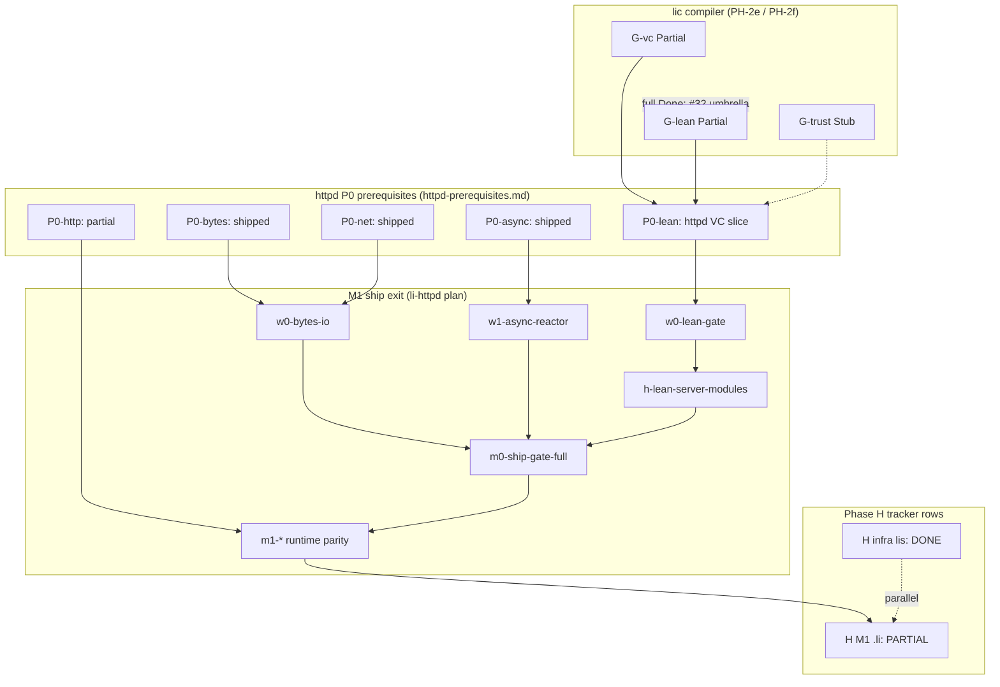

# PH-H: li-httpd M1 `.li` blocked-by exit graph (2e/2f ↔ P0 ↔ G-lean/G-vc)

> **Issue:** [#30](https://github.com/li-langverse/lic/issues/30) · **Repo:** li-langverse/lic  
> **Vision:** **Provable** first — Phase H M1 closes only when named shell gates pass; no narrative-only tracker edits  
> **North star fit:** web / agent gateway — **PH-H**, **PH-2e**, **PH-2f**, **G-lean**, **G-vc**, **G-net**, **G-async**  
> **Learned from:** [master plan §Phase H](2026-05-14-li-master-plan.md), [httpd-prerequisites](../../ecosystem/httpd-prerequisites.md), [provability-gaps](../../verification/provability-gaps.md), [li-httpd plan](2026-05-16-li-httpd-plan.md)

## Goal

Provide a **single readable dependency graph and exit list** so roadmap agents stop re-deriving “when can Phase H — li-httpd M1 `.li` close?” from prose spread across the master-plan tracker, v2 backlog, [httpd-prerequisites](../../ecosystem/httpd-prerequisites.md), and **G-lean** / **G-vc** rows.

This plan is **traceability only** — no runtime or compiler implementation in the plan PR.

## Non-goals

- Marking **G-lean** or **G-vc** **Done** (umbrella evidence is [#32](https://github.com/li-langverse/lic/issues/32) / [2026-06-07-ph2e-2f-7e-lean-vc-math-evidence.md](2026-06-07-ph2e-2f-7e-lean-vc-math-evidence.md)).
- Implementing li-httpd M1 runtime parity (`m1-serve-production`, tier5 bench vs nginx) — tracked in [li-httpd plan](2026-05-16-li-httpd-plan.md) parity milestones.
- Weakening `HTTPD_LEAN_GATE_MAX_OPEN` or `--allow-open-vc` to green-wash M1 closure.
- Editing `trusted.lean` without a human-approved issue.
- Self-merging governance or master-plan tracker checkbox edits beyond Doc-c cross-links.

## Problem (tracker drift)

| Source | Says today | Drift |
|--------|------------|-------|
| Master plan tracker ~L459 | Phase H **infra** `[x]` | Correct — **`lis`** harness complete |
| Master plan tracker ~L460 | Phase H M1 `.li` `[x]` **partial** | Checkbox ticked but **next** still lists ship gate + Lean |
| Master plan v2 backlog ~L506 | **H** still open | “M1 ship gate (exploits A+B, li-log, full Lean on server)” |
| [httpd-prerequisites](../../ecosystem/httpd-prerequisites.md) P0-lean | **Gated for httpd** via `check-httpd-lean-gate.sh` | Not the same as **G-lean Done** |
| [httpd-prerequisites](../../ecosystem/httpd-prerequisites.md) P0-bytes/async/net | **Shipped** | Issue #18 verifier digest (2026-05-17) still listed Partial — stale |
| [provability-gaps](../../verification/provability-gaps.md) **G-lean** / **G-vc** | **Partial** | P0-lean “gate” is a **closed slice** for httpd parse path, not universal certificate |

**Root cause:** three closure notions were conflated:

1. **P0-lean (httpd slice)** — httpd modules build under bounded open-VC budget.
2. **PH-2e / PH-2f (compiler phases)** — contracts + Lean on `lic build` (partial globally).
3. **Phase H M1 `.li` ship** — `build/li-httpd` + runtime gates in `httpd-plan-gates.sh`.

Agents must use this plan’s **exit tiers** table — not any single checkbox.

---

## Dependency graph

**Read order:** bottom-up for **M1 ship**; left branch (**G-lean** / **G-vc**) for **compiler certificate** honesty.

---

## Exit tiers (canonical)

| Tier | Name | Closes when | Does **not** imply |
|------|------|-------------|-------------------|
| **T0** | **lis infra** | [lis implementation-status](https://github.com/li-langverse/lis/blob/main/docs/implementation-status.md) green | M1 `.li` code complete |
| **T1** | **P0 compiler slice** | All P0 rows in [httpd-prerequisites](../../ecosystem/httpd-prerequisites.md) ≥ **Gated** or **Shipped** | **G-lean** / **G-vc** Done |
| **T2** | **httpd Lean slice (w0)** | `check-httpd-lean-gate.sh` green; open VC ≤ `HTTPD_LEAN_GATE_MAX_OPEN` (default 8) on `parse_request_smoke` | Strict `--strict-lean` on all server modules |
| **T3** | **M0 ship compile** | `build-li-httpd.sh` + `httpd-plan-gates.sh` compile section (no runtime skips) | nginx parity / exploit runtime |
| **T4** | **M1 runtime ship** | `httpd-plan-gates.sh` full (Bearer, active health, exploit runtime, serve-production, …) | M1.5 SSE/TLS live parity |
| **T5** | **Phase H M1 `.li` tracker Done** | T0–T4 + `check-httpd-server-lean-gate.sh` on server modules + Doc-c cross-links updated | **G-lean** / **G-vc** Done |
| **T6** | **G-lean / G-vc Done** | [#32](https://github.com/li-langverse/lic/issues/32) sub-phases B–E + H | Required for “master plan done”, not for T5 |

**Phase H M1 `.li` row closes at T5.** v2 backlog **H** row closes at T5 for M1 scope; M1.5/M2 remain separate backlog items.

---

## P0 ↔ PH ↔ G-* mapping

| P0 ID | [httpd-prerequisites](../../ecosystem/httpd-prerequisites.md) | PH phase | G-* rows | Exit gate (script) | Status (2026-06-07) |
|-------|--------------------------------------------------------------|----------|----------|-------------------|---------------------|
| **P0-lean** | VC + Lean on `lic build` (real discharge) | **2e**, **2f** | **G-vc**, **G-lean**, **G-trust** | `check-httpd-lean-gate.sh`, `discharge_http_forward_lean.sh`, `contracts_discharge_corpus.sh` | **Gated (httpd slice)** — bounded open VC; global **Partial** |
| **P0-bytes** | `std` bytes, stringview, Reader/Writer | **4** | **G-stdlib** (coverage) | `check-w0-bytes-io.sh` | **Shipped** |
| **P0-net** | `raises Net`, trusted syscall RFC | **H**, **2f** | **G-net**, **G-trust** | `li-tests/net_trusted/`, `check-w0-bytes-io.sh` (net slice) | **Shipped** |
| **P0-async** | async/await + epoll/kqueue | **H**, **7d** | **G-async** | `check-w1-async-reactor.sh`, tier5 `tcp_echo` | **Shipped** |
| **P0-http** | HTTP/1.1 parser proofs | **H** | **G-vc** (P-http backlog) | `http_parse_forward_closed.li`, `discharge_http_forward_lean.sh` | **Partial** — Li reactor + full FSM next |

### G-lean / G-vc closure criteria (httpd-relevant slices)

From [provability-gaps](../../verification/provability-gaps.md) — **what M1 may claim**:

| G-* | Httpd-relevant “closed slice” | Still open (blocks T6, not T5) |
|-----|------------------------------|--------------------------------|
| **G-vc** | Call-site `requires`, const-local discharge; `http_parse_forward_closed.li` witness | Opaque returns; loop body vs closed-form `ensures`; full **P-http** |
| **G-lean** | Tier B `lake build AutoVC`; `discharge_http_forward_lean.sh`; ≤8 open VC on httpd smokes with `--allow-open-vc` | Universal kernel discharge; `sqrt_open_bound` story per [#32](https://github.com/li-langverse/lic/issues/32); strict Lean on all modules without downgrade doc |
| **G-net** | Effect propagation + `trusted.lean` v1 net axioms | Full syscall codegen proofs |
| **G-async** | MIR `AsyncAwait` + `li_async_poll` reactor | Structured concurrency proofs |

**Honest wording for agents:** P0-lean **pass** = T2. **G-lean Done** = T6 only.

---

## M1 ship exit checklist (T3–T5)

Ordered gates from [li-httpd plan](2026-05-16-li-httpd-plan.md) ↔ `scripts/httpd-plan-gates.sh`:

| Step | Todo / milestone | Gate command | Blocks |
|------|------------------|--------------|--------|
| 1 | `w0-lean-gate` | `check-httpd-lean-gate.sh` | All Li httpd compiles |
| 2 | `w0-bytes-io` | `check-w0-bytes-io.sh` | Reader/Writer path |
| 3 | `w1-async-reactor` | `check-w1-async-reactor.sh` | Event loop |
| 4 | `h-lean-server-modules` | `check-httpd-server-lean-gate.sh` | Server `.li` Lean budget |
| 5 | `m0-ship-gate-full` | `build-li-httpd.sh` + `test-auth-bearer.sh` | Binary exists |
| 6 | `m1-exploit-runtime` | `check-tier5-exploit-runtime.sh` | Live exploit suite |
| 7 | `m1-serve-production` | `test-serve-production.sh` | Daemon + static + proxy |
| 8 | `m1-active-health` | `test-active-upstream-health.sh` | Upstream health |
| 9 | Config/oracle suite | `run_httpd_config.sh`, overlap/validate scripts | Routing + TOML |
| 10 | **Tracker sync** | Doc PR: master plan ~L460, v2 backlog ~L506, httpd-prerequisites status column | Agent stop re-deriving |

**Aggregate gate:** `./scripts/httpd-plan-gates.sh` (CI: `scripts/ci.sh` httpd section).

**M1.5+ (out of #30 scope):** SSE/TLS/H2 runtime rows (`m15-*`, `m2-*`) — separate tracker bullets; do not block T5 M1 `.li` config/HTTP/1.1 ship if explicitly scoped.

---

## Sub-phases (after `plan-approved`)

| Sub | Deliverable | Exit gate |
|-----|-------------|-----------|
| **A** | This plan merged; cross-link from master plan Phase H rows + [httpd-prerequisites](../../ecosystem/httpd-prerequisites.md) | Plan PR + issue #30 comment |
| **B** | **Exit matrix appendix** on #30 — paste T1–T5 table with current pass/fail from one `httpd-plan-gates.sh` run | Issue comment with script output tail |
| **C** | Reconcile #18 verifier digest — P0-bytes/async/net **Shipped**; point to this plan | Close #18 as superseded or update body |
| **D** | Master plan ~L460: replace ambiguous `[x] partial` with **T-tier** wording (“closes at **T5** when …”) | Doc PR cites **G-lean**, **G-vc** |
| **E** | [httpd-prerequisites](../../ecosystem/httpd-prerequisites.md): add **Exit tier** column (T1/T2) per P0 row | Same Doc PR as D |
| **F** | `2026-05-16-li-httpd-plan.md` frontmatter: link this plan in overview; clarify w0 todos = **T2** not **G-lean Done** | Doc PR |
| **G** | Implementation track (separate PRs): land remaining T3–T4 gates; post evidence on #30 | `httpd-plan-gates.sh` green without skips |

---

## Tests / verification

| Check | Command | Tier |
|-------|---------|------|
| Httpd P0 lean slice | `./scripts/check-httpd-lean-gate.sh` | T2 |
| Server module Lean | `./scripts/check-httpd-server-lean-gate.sh` | T5 |
| Bytes / async P0 | `./scripts/check-w0-bytes-io.sh`, `./scripts/check-w1-async-reactor.sh` | T1 |
| Full httpd plan gates | `./scripts/httpd-plan-gates.sh` | T3–T4 |
| Global VC corpus | `./li-tests/tooling/contracts_discharge_corpus.sh` | T6 ([#32](https://github.com/li-langverse/lic/issues/32)) |
| Open VC inventory | `./scripts/check-autovc-open-goals.sh build/generated/AutoVC.lean` | T6 |
| HTTP forward witness | `./li-tests/tooling/discharge_http_forward_lean.sh` | T2 |
| Doc claim guard | `./scripts/check-doc-provability-claims.sh` | Doc-c |

---

## Related issues

| Issue | Relationship |
|-------|--------------|
| [#30](https://github.com/li-langverse/lic/issues/30) | **This plan** — exit graph / traceability |
| [#18](https://github.com/li-langverse/lic/issues/18) | Superseded by A–E; stale P0 status |
| [#32](https://github.com/li-langverse/lic/issues/32) | **T6** — global **G-lean** / **G-vc** evidence |
| [#25](https://github.com/li-langverse/lic/issues/25) | Partial-row evidence umbrella |
| [#17](https://github.com/li-langverse/lic/issues/17), [#21](https://github.com/li-langverse/lic/issues/21) | 2f / 2e sub-tracks under #32 |

---

## Rollout

1. Merge this **plan** PR; human adds **`plan-approved`** on #30.
2. Sub-phase **B** — post exit-matrix pass/fail on #30 (one gate run).
3. Sub-phases **D–F** — docs-only PR updating master plan, httpd-prerequisites, li-httpd plan cross-links.
4. Sub-phase **G** — implementation agents use T3–T4 checklist; do not edit tracker to Done until T5 gates green.
5. Do **not** conflate T5 (M1 ship) with T6 (**G-lean** Done) or master plan “done”.

## Human-only

- [ ] Label **`plan-approved`** on #30 before doc sync PR (D–F).
- [ ] Remove **`plan-needed`** from #18 when sub-phase C lands.
- [ ] Acknowledge any increase to `HTTPD_LEAN_GATE_MAX_OPEN` via explicit issue (no silent widen).
- [ ] Approve `trusted.lean` net/TLS axiom growth via separate human issue.
