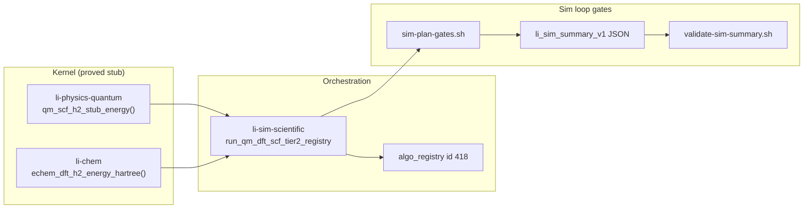

# Sim plan loop — `sim-p2-qm-dft-scf` (algo_id=418)

**Issue:** [lic#478](https://github.com/li-langverse/lic/issues/478)  
**Runner:** `sim` · **Branch:** `cursor/sim-algo-plan-loop`  
**Registry gap:** `gap-plan-pending-sim-sim-p2-qm-dft-scf`  
**Upstream research:** [chem-r2 plan](2026-06-05-chem-r2-r3-qm-dft-plan.md) (#522) · [chem-r2 done gate](../../numerics/studies/2026-06-06-chem-r2-dft-scf-done-gate.md) (PR #932)

---

## Problem

The **sim** goal-directed runner (`cursor/sim-algo-plan-loop`) stalled with `sim-p2-qm-dft-scf` pending while the supervisor was off. Plan verifier **2026-05-30** reported **1/5** todos open; registry row `gap-plan-pending-sim-sim-p2-qm-dft-scf` remains **open** on `main`.

| Signal | Current state (`main`) | Gap |
|--------|------------------------|-----|
| `algo_registry` id **418** `qm_dft_scf_energy` | `run_algo_registry_stub` → checksum **1.001** | No real SCF energy / summary metrics |
| `run_algo_registry_tier2.li` | Asserts `qm418.checksum == 1.001` | Smoke **requires** stub honesty — must flip after implement |
| `sim-algorithm-backlog.md` | `sim-p2-qm-dft-scf` **pending** | Drift vs stale snapshot rows marking completed |
| `implemented_smoke` (registry JSON) | **false** for 418 | Registry parity incomplete (43/126) |
| `verticals.toml` `qm_dft` | `workload_class=stub` | Cannot claim QC validity from TDSE template |
| chem-r2 track (#522, #932) | Oracle + `li-chem` dispatch drafted in open PR | Sim loop plan gate still required on #478 |

**North star:** Correctness before speed. Replace checksum **1.001** with a **minimal proved SCF scaffold** (H₂ STO-3G class) and emit **`li_sim_summary_v1`** QM keys — do **not** weaken `threshold_ratio_cpp` to green the dashboard.

**Duplicate check:** This plan is **not** a second chem-r2 research plan (#522 / #873). It defines **sim-loop Done gates** and registry closure for `sim-p2-qm-dft-scf`. Oracle architecture and package ADR remain in the chem-r2/r3 plan; implementation may land via **#932** once #478 is `plan-approved`.

---

## Scope (this plan)

| In scope | Out of scope (defer) |
|----------|----------------------|
| sim-p2: minimal SCF stub + summary metrics for algo **418** | Full native RKS / 401–404 integral chain |
| `li-physics-quantum` microkernel stub (H₂-class energy scaffold) | Production DFT accuracy claims |
| `li-sim-scientific` dispatch + registry `implemented_smoke: true` | Gaussian/ORCA binary on default CI |
| `sim-plan-gates.sh` + composable smoke contract | Post-HF rows 422–425 |
| Reconcile backlog / snapshot / registry honesty | New org repo; `trusted.lean` edits |
| Cross-link closure with chem-r2 (#932) when merged | Weakening tier-0 tolerances |

**Plan home:** `lic` (sim vertical + harness contracts). **Benchmarks** repo: catalog ingest only ([benchmarks#179](https://github.com/li-langverse/benchmarks/issues/179)).

**Package note:** Issue text cites `li-physics-qm`; canonical package is **`li-physics-quantum`** (`import physics.quantum`). User-facing DFT API lives in **`li-chem`** per chem-r3 ADR; **`li-sim-scientific`** owns algo_registry routing.

---

## Architecture



### Stub tiers (v1)

| Tier | Surface | Role | CI default |
|------|---------|------|------------|
| **T0** | `li-physics-quantum` H₂ mini SCF scaffold | Proved energy scalar + `converged` flag | **Always** |
| **T1** | `li-chem` `echem_dft_h2_energy_hartree()` | User API entry (chem-r2) | **Always** after #932 pattern |
| **T2** | PySCF subprocess (`pyscf_sto3g_h2_energy.py`) | External Ha oracle column | Optional profile `chem-external-oracle` |

**Reference geometry (v1):** H₂ bond **0.74 Å**, basis **STO-3G**, method **RKS/LDA** (418 row). Document pinned refs in `benchmarks/tier2_physics/qm_dft_scf_energy/PINNED.md` during implement.

---

## Work packages

todos:
- id: wp-sim-p2-plan-doc
  content: "Canonical plan + orchestrator note (this doc)"
  status: completed
  agent: issue_planner
- id: wp-sim-p2-kernel-stub
  content: "Add qm_scf_h2_stub_energy() in li-physics-quantum with contracts (energy_hartree, converged, scf_iterations)"
  status: pending
  agent: code_implementer
  package: li-physics-quantum
- id: wp-sim-p2-dispatch
  content: "li-sim-scientific: run_qm_dft_scf_tier2_registry replaces stub 1.001; wire vertical_qm_dft()"
  status: pending
  agent: code_implementer
  depends: wp-sim-p2-kernel-stub
  handoff_from: lic#932
- id: wp-sim-p2-summary
  content: "Emit li_sim_summary_v1 QM metrics (total_energy_hartree, converged, scf_iterations, method, basis) via sim-write-summary / bench_sim"
  status: pending
  agent: code_implementer
  depends: wp-sim-p2-dispatch
- id: wp-sim-p2-smoke
  content: "Update run_algo_registry_tier2.li + qm_dft_scf_interface_smoke.li; add composable import_chem_dft_smoke.li mirror"
  status: pending
  agent: code_implementer
  depends: wp-sim-p2-dispatch
- id: wp-sim-p2-registry
  content: "algo_registry.json implemented_smoke:true for id 418; docs/reports/sim-plan/algos/qm_dft_scf_energy.md"
  status: pending
  agent: code_implementer
  depends: wp-sim-p2-smoke
- id: wp-sim-p2-reconcile
  content: "Mark sim-p2-qm-dft-scf completed in sim-algorithm-backlog.md; swarm-gap-ingest closes gap-plan-pending-sim-sim-p2-qm-dft-scf"
  status: pending
  agent: code_implementer
  depends: wp-sim-p2-registry

---

## Done gates

### `sim-p2-qm-dft-scf` → **completed** when all pass

#### A — Sim plan gates (mandatory)

```bash
cd lic
export SIM_PLAN_PACKAGE=li-sim-scientific
./scripts/sim-plan-gates.sh
```

Expect: composable validity, `validate-sim-summary.sh`, scoped tier-2 verify, iteration report — **exit 0**.

#### B — Stub honesty (no checksum 1.001)

```bash
grep -n 'qm418.checksum != 1.001' packages/li-sim-scientific/li-tests/smoke/run_algo_registry_tier2.li
LI_REPO_ROOT=$PWD ./li-tests/run_all.sh composable
```

`run_algo(algo_qm_dft_scf_energy(), detail)` must return **ok=1** with checksum **≠ 1.001** and finite `total_energy_hartree` in summary JSON.

#### C — Summary contract (QM keys)

Per [sim-output-contract.md](../../ecosystem/sim-output-contract.md):

| Key | Required |
|-----|----------|
| `metrics.total_energy_hartree` | float, documented ref band |
| `metrics.converged` | bool |
| `metrics.scf_iterations` | int ≥ 1 |
| `metrics.method` | e.g. `RKS/LDA` |
| `metrics.basis` | e.g. `STO-3G` |

```bash
./scripts/validate-sim-summary.sh benchmarks/results/qm_dft_scf_energy/
python3 -c "import json,glob; p=glob.glob('benchmarks/results/qm_dft_scf_energy/*.summary.json')[0]; m=json.load(open(p))['metrics']; assert 'total_energy_hartree' in m"
```

#### D — Registry + backlog

| Artifact | Requirement |
|----------|-------------|
| `benchmarks/competitive/algo_registry.json` | `"implemented_smoke": true` for id **418** |
| `docs/ecosystem/sim-algorithm-backlog.md` | `sim-p2-qm-dft-scf` → `status: completed` |
| `docs/reports/sim-plan/algos/qm_dft_scf_energy.md` | Validity note + oracle tier table |
| `data/swarm-gap-registry/registry.yaml` | `gap-plan-pending-sim-sim-p2-qm-dft-scf` closed via ingest |

```bash
python3 scripts/goal-directed-agents-snapshot.py
python3 scripts/swarm-gap-ingest.py
# expect sim.plan_pending=[] and gap closed
```

#### E — chem-r2 alignment (when #932 merges)

- Reuse `run_qm_dft_scf_tier2_registry` + `echem_dft_h2_energy_hartree()` from chem-r2 — **do not fork** a second dispatch path.
- External oracle optional gate: `python3 benchmarks/competitive/pyscf_sto3g_h2_energy.py` (profile `chem-external-oracle`).
- Issue [#355](https://github.com/li-langverse/lic/issues/355) closes when gates B+C+E pass.

---

## PH / REQ / test mapping

| ID | Requirement | Evidence |
|----|-------------|----------|
| **PH-SCI** | QM vertical sim registry parity | `implemented_smoke: true` for 418 |
| **PH-5b** | Tier-2 physics/QM honesty | Summary metrics + optional PySCF column |
| **PH-QM** | Proved kernel surface in `li-physics-quantum` | `qm_scf_h2_stub_energy` contracts |
| **G-math** | No stub masquerading as implemented | Reject checksum **1.001** in tier-2 smoke |
| **REQ-SIM-QM-01** | `sim-plan-gates.sh` green on PR | CI + local repro |
| **REQ-SIM-QM-02** | `li_sim_summary_v1` QM keys present | `validate-sim-summary.sh` |
| **REQ-SIM-QM-03** | Registry gap closed when todo completed | `swarm-gap-ingest.py` |

### Tests / benches

| Artifact | Suite | Purpose |
|----------|-------|---------|
| `run_algo_registry_tier2.li` | smoke | Registry dispatch incl. 418 |
| `qm_dft_scf_interface_smoke.li` | smoke | Package-level SCF interface |
| `import_chem_dft_smoke.li` | composable | chem-r2 cross-link |
| `qm_dft_scf_energy` | tier-2 | Catalog bench id 418 |
| `sim-plan-gates.sh` | sim loop | Loop grade + iteration report |

---

## Learned from

1. **chem-r0 SOTA survey** — algo 418 is v1 QM implement target; integral chain 401–404 precedes production RKS.  
   `docs/numerics/studies/2026-05-27-chem-r0-qm-sota-survey.md`

2. **Sim output contract** — QM summary keys are fixed; gates must parse JSON, not stdout prose.  
   `docs/ecosystem/sim-output-contract.md`

3. **Algorithms & libraries plan** — Layer A requires external oracle column before perf claims on `qm_dft`.  
   `docs/ecosystem/algorithms-and-libraries-plan.md`

4. **chem-r2/r3 plan (#522)** — Oracle tiers, package boundaries (`li-chem` / `li-physics-quantum` / `li-sim-scientific`); sim-p2 consumes, does not duplicate.  
   `docs/superpowers/plans/2026-06-05-chem-r2-r3-qm-dft-plan.md`

---

## Implement handoff

After human labels **`plan-approved`** on #478:

1. **`code_implementer`** on `cursor/sim-algo-plan-loop` executes `wp-sim-p2-kernel-stub` → `wp-sim-p2-reconcile`.
2. **Prefer rebasing onto / merging with [lic#932](https://github.com/li-langverse/lic/pull/932)** if landed first — same dispatch path, avoids duplicate stubs.
3. **`plan_verifier`**: re-run snapshot; confirm `sim.plan_pending=[]` matches real stub state.
4. **benchmarks#179**: catalog lic path after tier-2 `qm_dft_scf_energy/` is non-stub.

**Do not:** weaken `threshold_ratio_cpp`; mark snapshot completed without gates A–D green.

---

## Vision / defer checks

| Check | Result |
|-------|--------|
| Conflicts with strict-by-default? | **No** — stub honesty + summary contract |
| Duplicates package mirror without P0 CI? | **No** — harness-first in lic |
| Weaken `threshold_ratio_cpp` only? | **Rejected** |
| New org repo? | **No** |
| Duplicate of #522 plan? | **No** — sim-loop orchestration only; cites chem-r2 |

---

## Human approval

- [ ] Review plan doc
- [ ] Label issue #478 `plan-approved`
- [ ] Remove `plan-needed`
- [ ] Do **not** self-merge draft PR
