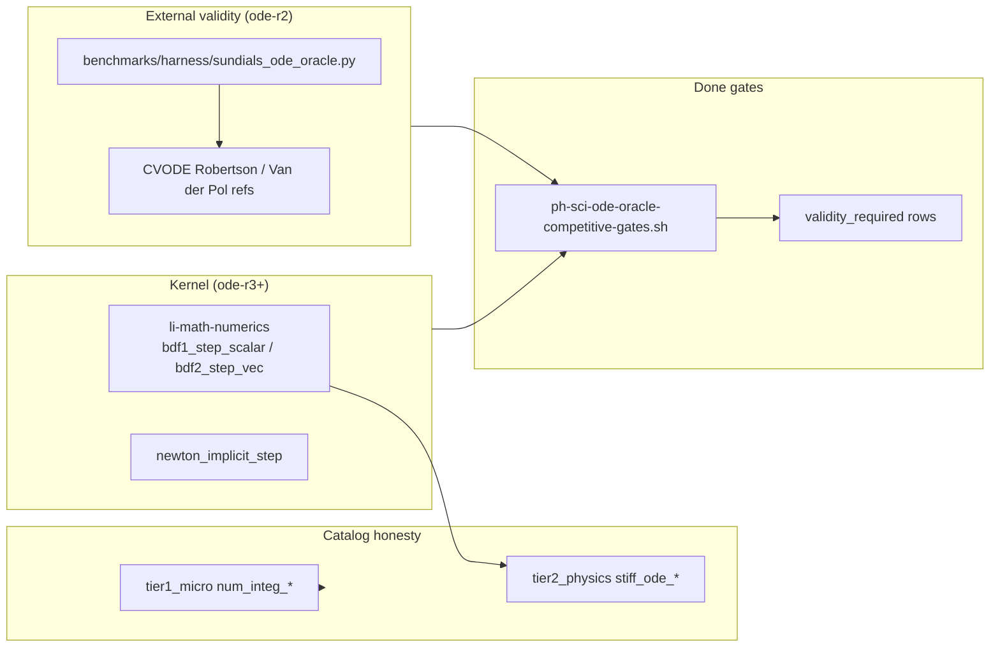

# Numerics integrator plan — SUNDIALS-class stiff ODE + sensitivity (ode-r)

**Issue:** [lic#35](https://github.com/li-langverse/lic/issues/35)  
**Explorer digest:** [2026-05-17-explorer](https://github.com/li-langverse/benchmarks/blob/main/docs/ecosystem/explorer-digests/2026-05-17-explorer.md)  
**Package home:** `li-math-numerics` (`import math.numerics`)  
**Benchmarks home:** `li-langverse/benchmarks` — harness, catalog rows, tier-2 workloads (not kernel code in lic)

---

## Problem

Gap explorer pass **2026-05-17** marks **SUNDIALS** as a **partial** analog: Li has tier-1 micro integrator rows and `li-math-numerics` fixed-step helpers, but **no stiff BDF**, **no adaptive error control**, and **no forward/adjoint sensitivity** path comparable to CVODE/CVODES.

| Signal | Current state (`main`) | SUNDIALS-class gap |
|--------|------------------------|-------------------|
| Tier-1 catalog | `num_integ_euler`, `rk4`, `symplectic`, `verlet`, `semi_implicit` | Fixed-step only; workloads often `extern` C kernels |
| `li-math-numerics` | `euler_step_vec2`, `verlet_step_vec2`, `rk4_step_4`, `cg_iteration` | No BDF; `rk4_step_4` reuses `dydt` (smoke scaffold, not full RK4 callback) |
| Stiff problems | None in tier-2 physics catalog | Robertson, Van der Pol, chemical kinetics stiff suites missing |
| Adaptive stepping | None | No embedded error estimate / step rejection |
| Sensitivity | None | No ∂y/∂p forward or adjoint column |
| External oracle | md-r3 / chem-r2 patterns exist | No CVODE reference harness for ODE validity |
| `G-math` / `G-num` | Partial / stub | Time-integration depth not tracked in provability gaps |

**North star:** Simulation credibility requires **proved or oracle-validated** time integration before perf claims. Replace “tier-2 stub” integrator rows with an **ode-r** track that cites **CVODE** (or pinned SUNDIALS build) as the validity column — do **not** weaken `threshold_ratio_cpp` to green stiff rows.

**Duplicate check:** This plan is **not** a duplicate of [lic#28](https://github.com/li-langverse/lic/issues/28) (PETSc–Kokkos exascale memory model) or [lic#523](https://github.com/li-langverse/lic/issues/523) (MD external oracle). It is the **numerics integrator vertical** scoped to **G-math** + **physics tier-2** integrator catalog honesty.

---

## Scope (this plan)

| In scope | Out of scope (defer) |
|----------|----------------------|
| Gap matrix: Li tier-1/2 vs SUNDIALS feature surface | Full native CVODE port in Li |
| `ode-r1` catalog + registry honesty rows | IDA/DAE implicit algebraic systems (ode-r7) |
| `ode-r2` external CVODE oracle harness + pinned refs | ARKODE additive-RK family |
| `ode-r3` BDF-1/2 **fixed-step** scalar stub in `li-math-numerics` | Variable-order BDF (ode-r5) |
| `ode-r4` Newton wrapper for implicit step (reuse `cg_iteration` patterns) | Adjoint sensitivity (ode-r6) |
| Tier-2 stiff workloads: Robertson + Van der Pol | New org repo; `trusted.lean` edits |
| Cross-link [benchmarks#179](https://github.com/li-langverse/benchmarks/issues/179) lic paths | Weakening tier-0/1 tolerances |

**Plan home:** `lic` (package + harness contracts). **Benchmarks** repo owns catalog ingest, oracle scripts, and tier-2 workload trees.

---

## Architecture



### Integrator tiers (v1)

| Tier | Surface | Role | CI default |
|------|---------|------|------------|
| **T0** | Tier-1 micro `num_integ_*` | Perf smoke; extern C parity | **Always** (existing) |
| **T1** | `li-math-numerics` fixed-step | Euler / Verlet / semi-implicit / BDF-1 stub | **Always** after ode-r3 |
| **T2** | Tier-2 `stiff_ode_robertson` | Validity vs CVODE oracle | **Always** after ode-r2 |
| **T3** | CVODE subprocess oracle | External reference column | Optional profile `ode-external-oracle` |
| **T4** | Adaptive + sensitivity | Embedded estimate; CVODES ∂y/∂p | **Deferred** (ode-r5/ode-r6) |

### SUNDIALS feature matrix (honest partial → target)

| SUNDIALS module | Capability | Li today | ode-r milestone |
|-----------------|------------|----------|-----------------|
| **CVODE** | Adams / BDF, adaptive | Tier-1 fixed-step only | ode-r3 (BDF fixed), ode-r5 (adaptive) |
| **CVODES** | Forward sensitivity | None | ode-r6 (deferred) |
| **IDA** | DAE index-1/2 | None | ode-r7 (deferred) |
| **ARKODE** | IMEX / additive RK | `rk4_step_4` scaffold only | ode-r8 (deferred) |
| **KINSOL** | Nonlinear solve | `cg_iteration` micro-slice | ode-r4 |

**Reference problems (v1):**

| Problem | Stiffness | Ref tolerances | Pinned doc |
|---------|-----------|----------------|------------|
| Robertson (3-species) | High | `rtol=1e-4`, `atol=1e-11` | `benchmarks/tier2_physics/stiff_ode_robertson/PINNED.md` |
| Van der Pol (μ=1000) | Moderate–high | `rtol=1e-6`, `atol=1e-8` | `benchmarks/tier2_physics/stiff_ode_van_der_pol/PINNED.md` |

---

## Work packages

todos:
- id: wp-ode-r0-plan-doc
  content: "Canonical plan + orchestrator note (this doc)"
  status: completed
  agent: issue_planner
- id: wp-ode-r1-gap-matrix
  content: "Gap matrix in numerics-integrator-backlog.md; mark explorer SUNDIALS partial → ode-r track; catalog tier-2 stiff row proposals"
  status: pending
  agent: code_implementer
- id: wp-ode-r2-oracle-harness
  content: "benchmarks: sundials_ode_oracle.py + competitive/ode_oracle.toml + tier2 README; optional profile ode-external-oracle"
  status: pending
  agent: code_implementer
  depends: wp-ode-r1-gap-matrix
- id: wp-ode-r3-bdf-stub
  content: "li-math-numerics: bdf1_step_scalar + bdf2_step_vec2 with contracts; fix rk4 callback shape doc (smoke vs production)"
  status: pending
  agent: code_implementer
  depends: wp-ode-r1-gap-matrix
- id: wp-ode-r4-newton-implicit
  content: "Newton iteration wrapper for implicit BDF step; link to cg_iteration; smoke in li-tests"
  status: pending
  agent: code_implementer
  depends: wp-ode-r3-bdf-stub
- id: wp-ode-r2-tier2-workloads
  content: "tier2_physics stiff_ode_robertson + stiff_ode_van_der_pol workloads; validity_required=true"
  status: pending
  agent: code_implementer
  depends: wp-ode-r2-oracle-harness
- id: wp-ode-r2-gates
  content: "scripts/ph-sci-ode-oracle-competitive-gates.sh + li-tests/tooling/ode_external_oracle_stub.sh"
  status: pending
  agent: code_implementer
  depends: wp-ode-r2-oracle-harness
- id: wp-ode-r1-provability
  content: "docs/verification/provability-gaps.md: G-math/G-num stiff-ODE slice; proof-database/entries/num-ode-*.toml stubs"
  status: pending
  agent: code_implementer
  depends: wp-ode-r3-bdf-stub
- id: wp-ode-r1-catalog
  content: "benchmarks catalog.toml: stiff_ode_* rows + lic paths; close partial SUNDIALS rubric row"
  status: pending
  agent: code_implementer
  depends: wp-ode-r2-tier2-workloads
  handoff_to: benchmarks#179

---

## Done gates

### `ode-r2-oracle` → **completed** when all pass

#### A — Oracle harness (mandatory)

```bash
cd lic
bash scripts/ph-sci-ode-oracle-competitive-gates.sh
./li-tests/tooling/ode_external_oracle_stub.sh
```

Expect: Robertson + Van der Pol reference JSON within pinned rtol/atol bands — **exit 0**.

#### B — Tier-2 validity (no stub checksum)

```bash
grep -E 'stiff_ode_robertson|stiff_ode_van_der_pol' benchmarks/competitive/ode_oracle.toml
python3 benchmarks/harness/sundials_ode_oracle.py --problem robertson --check
```

Li tier-2 driver must emit `li_sim_summary_v1` or harness `validity_ok: true` when native BDF stub is within oracle band (post ode-r3).

#### C — Catalog honesty

| Row | `validity_required` | `threshold_ratio_cpp` |
|-----|---------------------|----------------------|
| `stiff_ode_robertson` | **true** | unchanged (no weakening) |
| `stiff_ode_van_der_pol` | **true** | unchanged |

```bash
grep -A6 'id = "stiff_ode_robertson"' ../benchmarks/catalog.toml
```

#### D — Package surface

```bash
grep -E 'bdf1_step_scalar|bdf2_step' packages/li-math-numerics/src/lib.li
LI_REPO_ROOT=$PWD ./li-tests/run_all.sh composable  # li-math-numerics smoke
```

---

### `ode-r3-bdf-stub` → **completed** when

- `bdf1_step_scalar` integrates linear test \(y' = -y\), \(y(1) \approx e^{-1}\) within `1e-6` rel error at fixed \(h\).
- Tier-1 `num_integ_*` rows remain green; no regression on Euler/Verlet smoke.
- `docs/verification/provability-gaps.md` lists **G-math** stiff-ODE slice as **planned** (not closed until Lean witness).

---

## PH / REQ / test mapping

| ID | Requirement | Evidence |
|----|-------------|----------|
| **PH-5b** | Tier-2 physics integrator catalog honesty | `stiff_ode_*` rows + validity column |
| **PH-SCI** | Simulation time-integration credibility | Oracle gate before native BDF perf claims |
| **PH-7e** | Pure-Li numerics microkernel path | `li-math-numerics` BDF stubs + tier-1 micro |
| **G-math** | Time integration depth tracked | provability-gaps stiff slice + catalog |
| **G-num** | ODE stability / stepping axioms | `proof-database/entries/num-ode-*.toml` |
| **G-physics** | Tier-2 modeling_gap closure path | stiff workloads with `ensures` contracts |
| **REQ-ODE-01** | External CVODE oracle within rtol band | `sundials_ode_oracle.py` |
| **REQ-ODE-02** | No SUNDIALS partial without roadmap | explorer rubric → ode-r todos |
| **REQ-ODE-03** | BDF stub contracts documented | `li-math-numerics` + PINNED.md |

### Tests / benches

| Artifact | Suite | Purpose |
|----------|-------|---------|
| `num_integ_euler` | tier-1 micro | Existing fixed-step perf row |
| `num_integ_symplectic` | tier-1 micro | Symplectic baseline |
| `num_integ_rk4` | tier-1 micro | RK4 baseline (extern C) |
| `stiff_ode_robertson` | tier-2 physics | Stiff validity vs CVODE |
| `stiff_ode_van_der_pol` | tier-2 physics | Stiff oscillatory validity |
| `ode_external_oracle_stub.sh` | tooling | CI stub when SUNDIALS not installed |
| `ph-sci-ode-oracle-competitive-gates.sh` | numerics | Competitive gate bundle |

### G-* gap updates (on implement)

| Gap | Before | After ode-r2 | After ode-r3 |
|-----|--------|--------------|--------------|
| **G-math** | Partial (tier-1 fixed-step) | + stiff oracle column | + BDF stub contracts |
| **G-num** | Stub | Planned `num-ode-bdf1` entry | Axiomatic stability slice |
| **G-physics** | tier-2 modeling_gap on extern | stiff rows `validity_required` | native BDF in package |

---

## Learned from

1. **Explorer digest 2026-05-17** — SUNDIALS marked *partial* alongside Eigen/OpenMP; issues #33–#35 are the routed planning queue.  
   `benchmarks/docs/ecosystem/explorer-digests/2026-05-17-explorer.md`

2. **Benchmarks & simulations plan** — Tier-1/2 integrator choices (Verlet, RK4, symplectic) and deterministic seeds; tier-2 physics requires parallel + validity.  
   `docs/superpowers/plans/2026-05-14-benchmarks-and-simulations.md`

3. **`li-math-numerics` surface** — Existing Euler/Verlet/RK4/CG helpers; RK4 is smoke-shaped; BDF and adaptive paths are absent.  
   `packages/li-math-numerics/src/lib.li`

4. **Algorithms & libraries plan** — `math.numerics` is `exists-partial`; extend ODE/integrators in place (no new org repo).  
   `docs/ecosystem/algorithms-and-libraries-plan.md`

---

## Implement handoff

After human labels **`plan-approved`** on #35:

1. **`code_implementer`** executes `wp-ode-r1-gap-matrix` → `wp-ode-r2-gates` → `wp-ode-r3-bdf-stub` on branch `cursor/numerics-integrator-loop`.
2. **`numerics_researcher`** may add study `docs/numerics/studies/YYYY-MM-DD-ode-r2-sundials-oracle-survey.md` if CVODE version pinning needs ADR.
3. **`plan_verifier`**: re-run explorer rubric; confirm SUNDIALS row shows ode-r track (not silent partial).
4. **benchmarks#179**: ingest `lic` paths for new `stiff_ode_*` rows after harness lands.

**Do not:** weaken `threshold_ratio_cpp`; claim SUNDIALS parity from tier-1 micro rows alone; edit `trusted.lean` without human issue.

---

## Vision / defer checks

| Check | Result |
|-------|--------|
| Conflicts with strict-by-default? | **No** — oracle + contracts before perf |
| Duplicates package mirror without P0 CI? | **No** — `li-math-numerics` has CI workflow |
| Weaken `threshold_ratio_cpp` only? | **Rejected** |
| New org repo? | **No** |
| Duplicate of #28 / #523? | **No** — integrator vertical only |

### Explicitly deferred (ode-r5+)

| Item | Reason |
|------|--------|
| Adaptive step control | Requires embedded error estimator proofs — separate human gate |
| Forward/adjoint sensitivity (CVODES) | Tier-3 research; depends on ode-r3 stability |
| IDA / DAE | Index analysis + proof backlog not scoped |
| Full SUNDIALS FFI in Li | External oracle sufficient for v1 validity |

---

## Human approval

- [ ] Review plan doc
- [ ] Label issue #35 `plan-approved`
- [ ] Remove `plan-needed`
- [ ] Do **not** self-merge draft PR
