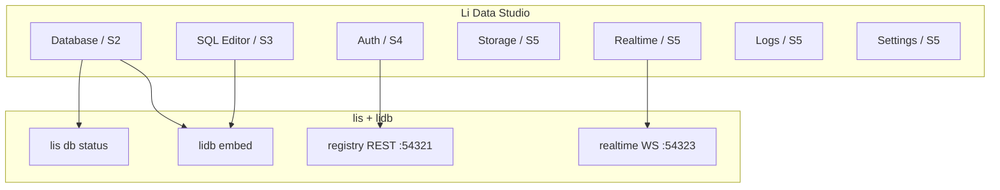

---
workflow_repo: lic
ph_ids: [PH-DB-11]
predecessor: docs/superpowers/plans/ph-db-swarm-plan.md
tracker: docs/superpowers/plans/ph-db-execution-tracker.md
loop_state: data/ph-studio-plan-loop/state.json
implementation_repo: lis
implementation_path: data-studio-ui/
status: active
---

# PH-DB-11 — Li Data Studio (Supabase Studio parity)

**Epic:** Browser console for the native Li data platform (`lidb` + `lis db`), aligned with [Supabase Studio](https://supabase.com/docs/guides/platform/studio) information architecture.

**Prerequisite (complete):** PH-DB swarm 13/13 — `lidb` on `main`, `lis` compose + `lis db status`, registry OLTP, agents default `lidb` ([ph-db-swarm-plan.md](./ph-db-swarm-plan.md)).

| Repo | Branch | Deliverable |
|------|--------|-------------|
| `lic` | `cursor/ph-db-11-li-data-studio` | Plans, plan-loop state, cross-links |
| `lis` | `feat/ph-db-11-data-studio-ui` | `data-studio-ui/` Next.js shell |

## Workpackages (WP-S1 … WP-S5)

| WP | ID | Supabase Studio tab | User story | Depends on |
|:--:|----|---------------------|------------|------------|
| **S1** | `wp-s1-shell` | Shell + **Database** overview | As a platform operator I open Li Data Studio and see sidebar nav (Database, SQL, Auth, Storage, Realtime, Logs, Settings) with live `lis db status` / lidb embed health on Database. | PH-DB WP-B, WP-H compose |
| **S2** | `wp-s2-table-editor` | **Database** → Tables | As a developer I browse schemas/tables and edit rows (read-only first, then CRUD via liorm). | S1, lidb catalog API |
  status: completed
| **S4** | `wp-s4-auth-studio` | **Authentication** | As an admin I manage auth providers/users (stub → lip SSO parity). | S1, PH-DB-4 registry |
| **S5** | `wp-s5-realtime-logs-storage` | **Realtime**, **Logs**, **Storage**, **Settings** | As an operator I inspect changefeeds, supervisor logs, object storage buckets, and project settings. | S1, lis#10 realtime, future storage |

## User stories ↔ Studio tabs

## Exit gates

| WP | Gate |
|----|------|
| S1 | `cd data-studio-ui && npm run build`; `/database` shows parsed status; nav renders 7 sections |
| S2 | Table list from lidb catalog; row viewer smoke |
| S3 | SQL run + export CSV |
| S4 | Auth panel reads registry-min config |
| S5 | Realtime channel list; log tail; storage placeholder with honest "not configured" |

## Plan loop

- State: [data/ph-studio-plan-loop/state.json](../../../data/ph-studio-plan-loop/state.json)
- Driver: [scripts/ph-studio-plan-loop.py](../../../scripts/ph-studio-plan-loop.py)
- Branch: `cursor/ph-db-11-li-data-studio` (lic) + `feat/ph-db-11-data-studio-ui` (lis)

todos:
- id: wp-s1-shell
  content: "WP-S1 Studio shell, Supabase IA nav, Database status from lis db status"
  status: completed
- id: wp-s2-table-editor
  content: "WP-S2 Database table browser + row viewer"
  status: pending
- id: wp-s3-sql-editor
  content: "WP-S3 SQL editor with liorm-backed execution"
  status: pending
- id: wp-s4-auth-studio
  content: "WP-S4 Auth studio (providers, users stub)"
  status: pending
- id: wp-s5-realtime-logs-storage
  content: "WP-S5 Realtime, Logs, Storage, Settings panels"
  status: pending

---
