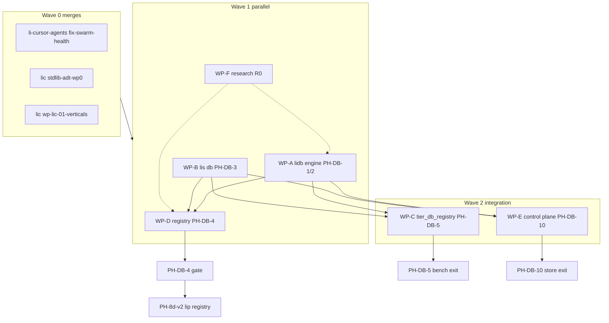

# PH-DB battle plan — parallel execution

**Status:** Active execution guide (2026-05-26)  
**Supersedes:** scaffolding-only sprint; does **not** replace [ph-db-lidb-platform.md](ph-db-lidb-platform.md) (phase index) or roadmap ADR detail.  
**Research:** [db-r0-vertical-seed](https://github.com/li-langverse/research-findings/blob/main/whitepapers/2026-05/database_platform/db-r0-vertical-seed/README.md)  
**Control plane:** [lidb-migration-control-plane.md](https://github.com/li-langverse/li-cursor-agents/blob/main/docs/plans/lidb-migration-control-plane.md)

---

## 1. Executive summary

The PH-DB **stub layer is largely done**: `lidb` ships a native embed engine on `main` (smoke green at **6d2632d**), **liorm/liq** Python surfaces and security harness skeletons exist, **lis** handoff contracts are documented, **tier_db_registry** manifests are **stub** (dashboard honest), **li-cursor-agents** has PH-DB-10 store/MCP/e2e harness (mock persist), and **research-findings** R0 vertical seed is on `main`. Production agents still default to **`LI_CONTROL_PLANE_STORE=supabase`**; bench rows must stay **unknown**, not green.

**This sprint’s theme:** *replace stubs with real paths* — wire `liorm.execute` to the C++ engine, finish **`lis db`**, run real **tier_db_registry** harness against lidb, land **PH-DB-4** registry central DB schema/API alignment (unblocks **PH-8d-v2**), and complete **PH-DB-10** persist + liq MCP against a real `LI_LIDB_URL`. Parallel workpackages (WP-A…F) below maximize throughput while respecting phase gates; merge open PR branches in **Wave 0** before starting Wave 1 engine/integration work.

---

## 2. Phase ladder

| Phase | ID | Status (verified 2026-05-26) | Exit gate | Owner repo |
|-------|-----|------------------------------|-----------|------------|
| 0 | **PH-DB-0** | **Done** (ADR + lic cross-link) | Roadmap ADR merged; honesty rules in bench dashboard | `roadmap`, `lic` docs |
| 1 | **PH-DB-1** | **Partial → real** | `lidb`: `scripts/smoke.sh` + native embed; `001_registry.sql` applied via engine; no sqlite3 (PH-DB-3.1) | **`lidb`** |
| 2 | **PH-DB-2** | **Stub → finish** | `liorm` + `liq` compile to parameterized plans; `tests/security/run_all.sh` green; pytest suite green (fix 6 failures on main) | **`lidb`** |
| 3 | **PH-DB-3** | **Stub → finish** | `lis db start\|migrate\|status`; `LI_DATA_DIR` + `registry-min` profile; health gate for e2e | **`lis`** (embeds **`lidb`**) |
| 4 | **PH-DB-4** | **Not started (real)** | Registry v2 central DB schema + **lip** OpenAPI alignment; migration parity with `registry-v1.sql` | **`lidb`**, **`lip`**, **`lic`** docs |
| 5 | **PH-DB-5** | **Bench stub** | `tier_db_registry`: lidb P95 ≤ 1.2× Postgres 15+ on 3 scenarios; harness not stub | **`benchmarks`**, **`lidb`** |
| 6 | **PH-DB-6** | **Deferred** | Realtime slice for registry/control-plane (only if product needs) | **`lidb`** |
| 7 | **PH-DB-7** | **Deferred** | Auth/tenant + RLS probes (`002_rls_registry.sql`) | **`lidb`** |
| 8 | **PH-DB-8** | **Research** | Vector ANN decision (in-engine vs extension) | **`lidb`**, research |
| 9 | **PH-DB-9** | **Research** | Replication/sync design (no ship claim) | **`lidb`**, research |
| 10 | **PH-DB-10** | **Harness only** | `LI_CONTROL_PLANE_STORE=lidb`: real persist, liq MCP, e2e green; optional CI `LI_E2E_LIDB=1` | **`li-cursor-agents`** |
| G0 | **PH-DB-G0** | **Research active** | Multi-model GPU/graph ADR; tier stubs stay honest | **`research-findings`**, `roadmap` |

**Hard dependency:** **`PH-8d-v2`** (lip remote registry v2) **must not ship** until **PH-DB-4** exit gate is met.

---

## 3. Parallel workpackages

### WP-A — lidb engine hardening (PH-DB-1, PH-DB-2)

| Field | Detail |
|-------|--------|
| **Goal** | Stabilize native embed engine, green pytest, real `liorm.execute` → C++ catalog/WAL path |
| **Repos** | `li-langverse/lidb` |
| **Branch strategy** | Branch from `main` per slice: `feat/ph-db-2-pytest-green`, `feat/ph-db-2-liorm-wire`, `feat/ph-db-2-security-ci` — merge to `main` frequently |

**Tasks (1–2 days each)**

- [ ] Reproduce and fix **6 pytest failures** on `main` (`scripts/run_tests.sh` in venv); document root cause in release note
- [ ] Close gap: `liorm/embed_engine.py` uses `lidb_embed` only — no fallback paths
- [ ] Wire `liorm.execute` for registry-min plans (`agent_runs.recent`, etc.) against live catalog
- [ ] Expand `tests/security/` from stub to failing-closed on injection/RawSqlCapability
- [ ] CI: ensure `check_no_sqlite.sh`, smoke, pytest, security `run_all.sh` on every PR
- [ ] Update `docs/pg-subset-v1.md` status table to match implemented surface

**Dependencies**

- Blocks: **WP-C** (bench needs real engine), **WP-E** (liorm persist), partially **WP-B** (lis needs stable embed API)
- Blocked by: nothing (start immediately after Wave 0 merges)

**Definition of done**

- `main`: smoke + full pytest green; security harness runs in CI with zero skipped critical cases
- `liorm.execute` demonstrated against native embed in integration test (not mock connection)

**Suggested parallel agent prompt**

> You own **lidb** `main` hardening for PH-DB-2. Read `docs/liq-spec.md`, `liorm/README.md`, `tests/security/README.md`, and `scripts/run_tests.sh`. Fix all pytest failures on `main` without reintroducing sqlite3. Wire `liorm.execute` to the native embed engine for at least one registry-min plan; extend security tests so RawSql and injection probes fail closed. Run `bash scripts/smoke.sh && bash scripts/run_tests.sh` before opening a PR. Do not add new scaffolding files unless a test requires them.

**Risks / blockers**

- Flaky native embed on CI runners (cmake/toolchain)
- Python/C++ boundary bugs in catalog migration apply
- Scope creep into PG wire (defer to post-PH-DB-4)

---

### WP-B — `lis` db supervisor (PH-DB-3)

| Field | Detail |
|-------|--------|
| **Goal** | Ship `lis db start|migrate|status|stop` with `LI_DATA_DIR`, `LI_PROFILE=registry-min`, in-process embed |
| **Repos** | `lis` (primary), consumes **`lidb`** |
| **Branch strategy** | `feat/ph-db-3-lis-bundle` per `lidb/docs/handoff-wp5-lis.md`; rebase on lidb `main` weekly |

**Tasks**

- [ ] Implement CLI commands per handoff pseudo (`lis db start` loads profile, runs migrations, registers liq plans)
- [ ] Add `profiles/registry-min.toml` (verticals + pre-registered plans)
- [ ] In-process embed: pass `&mut Engine` to `liorm::execute` — no TCP for registry-min unless profile says so
- [ ] `lis db status` JSON/exit code for **li-cursor-agents** `assertStoreReady()` when `LI_DATA_DIR` set
- [ ] Document env contract in `lis` README; link from `lidb/docs/handoff-wp5-lis.md`
- [ ] Smoke script: start → migrate → status → stop on clean `LI_DATA_DIR`

**Dependencies**

- **Soft-depends on WP-A** for real migrate/execute (can stub engine calls until WP-A lands first liorm wire)
- Blocks: **WP-C** (bench invokes `lis db`), **WP-E** (e2e uses `lis db status`)

**Definition of done**

- Fresh clone: `export LI_DATA_DIR=./.li-data && lis db start && lis db status` exits 0 with catalog migrated
- No sqlite3 on PATH in lis CI

**Suggested parallel agent prompt**

> Implement PH-DB-3 **`lis db`** supervisor per `lidb/docs/handoff-wp5-lis.md`. Add `profiles/registry-min.toml`, CLI `start|migrate|status|stop`, and in-process lidb embed (no loopback TCP for registry-min). Expose health via `lis db status` for downstream e2e. Coordinate with latest **lidb** `main` embed API; stub only where WP-A has not merged yet, and list explicit TODOs linked to lidb PRs.

**Risks / blockers**

- **lis** repo availability / human repo creation if not pushed
- Duplicating connection pools (violates handoff: single in-process engine)

---

### WP-C — `tier_db_registry` real bench (PH-DB-5)

| Field | Detail |
|-------|--------|
| **Goal** | Replace stub harness with lidb vs Postgres timings; ingest to benchmarks dashboard (honest status) |
| **Repos** | `benchmarks` (tier), **`lidb`** (harness hooks), optional **`lic`** docs |
| **Branch strategy** | `feat/tier-db-registry-harness` on **benchmarks**; small lidb PR for `BENCH_DB_REGISTRY_RUN_HARNESS=1` if needed |

**Tasks**

- [ ] Implement `benchmarks/tier_db_registry/harness/registry_oltp_stub.py` → real driver (lidb embed + Postgres 15+)
- [ ] Sync DDL: `schema/registry-v1.sql` ↔ `lidb/migrations/001_registry.sql`
- [ ] Run scenarios: `registry_publish`, `registry_read_by_name`, `registry_read_latest`
- [ ] Emit `results/latest.csv` + JSON for ingest; set `status` from data (not hardcoded stub)
- [ ] Document `BENCH_DB_REGISTRY_THRESHOLD` (default 1.2) in tier README
- [ ] CI: `ci` profile Postgres-only path until lidb ratio known; nightly optional full compare

**Dependencies**

- **Blocked on WP-A** (engine) and **WP-B** (optional: `lis db` for profiled start)
- **Blocked on WP-D** for full registry-v2 scenarios (can run v1 DDL before PH-DB-4 completes)
- Does not block PH-DB-4 start (parallel prep)

**Definition of done**

- At least one scenario reports numeric lidb P95 and `ratio_vs_postgres` in `tier-db-registry.json`
- Dashboard shows **measured** or **failed**, never fake green

**Suggested parallel agent prompt**

> Own **tier_db_registry** real harness (PH-DB-5 prep). Read `benchmarks/tier_db_registry/suite.toml`, `schema/registry-v1.sql`, and `lidb/migrations/001_registry.sql`. Replace stub harness with lidb embed + Postgres 15 oracle; produce CSV/JSON for ingest. Keep dashboard honesty: stub only when engine URL missing. Do not claim PH-DB-5 exit until ratio ≤ threshold on all three scenarios.

**Risks / blockers**

- Postgres not available in CI (document skip vs fail)
- DDL drift between lip and lidb migrations

---

### WP-D — Registry central DB / PH-DB-4

| Field | Detail |
|-------|--------|
| **Goal** | Registry v2 central DB on lidb; schema + API alignment with **lip** OpenAPI; unblocks **PH-8d-v2** |
| **Repos** | **`lidb`**, **`lip`**, **`lic`** (docs/traceability only) |
| **Branch strategy** | `feat/ph-db-4-registry-v2-schema` (lidb); `feat/ph-db-4-lip-openapi-align` (lip) — coordinate via shared migration ID |

**Tasks**

- [ ] Diff **DB-R0-1**: `registry-v1.sql` vs lip OpenAPI fields → gap table in lidb or roadmap
- [ ] Add migrations for v2 central tables (beyond `001_registry.sql` if required)
- [ ] lip: document/store OpenAPI fields that map to lidb catalog (no fake 8d v2 ship)
- [ ] RLS policies (`002_rls_registry.sql`) design review for multi-tenant registry
- [ ] Traceability: update `lic` PH-DB plan cross-link when PH-DB-4 gate checklist exists
- [ ] Issue gate: label lip PRs **blocked-on-PH-DB-4** until schema merged

**Dependencies**

- **Requires WP-A** minimal catalog + migrate path
- **Requires WP-B** for operational `lis db` profile (recommended)
- Blocks: **PH-8d-v2**, full **WP-C** v2 scenarios, **WP-E** if control-plane tables overlap registry schema

**Definition of done**

- Signed schema migration on lidb `main`; lip OpenAPI gap table = zero blocking fields for v2 read paths
- Human sign-off recorded for **PH-8d-v2** unblock (per master plan)

**Suggested parallel agent prompt**

> Drive PH-DB-4 registry central DB alignment. Produce schema migrations in **lidb** and a lip OpenAPI field parity table; do not implement remote registry v2 endpoints until exit gate checklist is complete. Coordinate DDL with `benchmarks/tier_db_registry/schema/registry-v1.sql`. Flag anything that would block PH-8d-v2 with explicit `blocked-on-PH-DB-4` labels.

**Risks / blockers**

- lip / 8d scope creep
- Attestation/crypto out of scope — cite lip plan only

---

### WP-E — Control plane `liorm` finish (PH-DB-10)

| Field | Detail |
|-------|--------|
| **Goal** | Real `LI_CONTROL_PLANE_STORE=lidb` persist + liq MCP against engine; un-skip e2e todos |
| **Repos** | **`li-cursor-agents`** (primary), **`lidb`**, **`lis`** |
| **Branch strategy** | Continue on `cursor/fix-swarm-health-9031` or `feat/ph-db-10-liorm-persist` after Wave 0 merge |

**Tasks**

- [ ] Schema parity: diff `supabase/migrations/` vs lidb control-plane migration list (**DB-R0-4**)
- [ ] Implement `persistControlPlaneStateLidb` via liorm (remove no-op stub)
- [ ] Wire `runLiqQuery` to real liorm when `LI_LIDB_URL` or `LI_DATA_DIR` + `lis db`
- [ ] Remove `test.todo` rows in `lidb-control-plane.e2e.ts` as gates pass
- [ ] Backfill: extend `scripts/backfill-control-plane-db.mjs` for lidb import from disk cache
- [ ] Optional CI job: `LI_E2E_LIDB=1` (non-blocking until stable)
- [ ] Update `.cursor/skills/explore-control-plane-db/SKILL.md` for liq MCP

**Dependencies**

- **Blocked on WP-A** (liorm), **WP-B** (`lis db status`), **WP-D** only if schema gaps for control-plane tables
- Can proceed with mock-free read path before full persist

**Definition of done**

- `LI_CONTROL_PLANE_STORE=lidb LI_E2E_LIDB=1 npm run test:e2e:lidb` passes persist + read without `LI_LIDB_MOCK=1`
- Supabase remains available; default store flip is a **separate human decision**

**Suggested parallel agent prompt**

> Finish PH-DB-10 in **li-cursor-agents**: read `docs/plans/lidb-migration-control-plane.md`. Wire `persist.ts` and `liq-query.ts` to real liorm/lidb (no mock persist in e2e). Complete schema parity table vs Supabase migrations before enabling persist tests. Keep MCP off by default; preserve `CONTROL_PLANE_TABLES` allowlist. Run `npm run build && npm test` and lidb e2e with `LI_E2E_LIDB=1`.

**Risks / blockers**

- Fake-passing e2e against Supabase URL (explicitly forbidden in migration plan)
- Security regression if raw SQL MCP re-enabled

---

### WP-F — Research / R0 experiments (PH-DB-G0, optional)

| Field | Detail |
|-------|--------|
| **Goal** | Study-only evidence for ADR inputs; no engine claims |
| **Repos** | **`research-findings`**, occasional **`roadmap`** PRs |
| **Branch strategy** | `docs/db-r0-*` on research-findings `main` |

**Tasks**

- [ ] **DB-R0-1** Postgres-subset boundary table (registry DDL vs lip)
- [ ] **DB-R0-4** Control-plane schema gap + liq threat notes
- [ ] **DB-R0-5** Agent read-path threat model → PH-DB-2 scenarios
- [ ] **DB-R0-2 / DB-R0-6** Embedded OLTP / Postgres-embedded surveys (parallel)
- [ ] Keep `tier_db_*` dashboard rows **unknown** until WP-C lands

**Dependencies**

- None for starting; feeds **WP-D** and **WP-A** design
- Does not block implementation waves

**Definition of done**

- New or updated notes under `research-findings/.../database_platform/` with `validity_grade: study-only`
- Handoff tickets for `issue_planner` where experiments spawn repo work

**Suggested parallel agent prompt**

> Run PH-DB R0 experiments per `db-r0-vertical-seed/README.md`. Output study-only markdown under `research-findings/whitepapers/2026-05/database_platform/`. Do not claim lidb engine shipped; link to bench stubs honestly. Prioritize DB-R0-1, DB-R0-4, DB-R0-5 for registry + control-plane consumers.

**Risks / blockers**

- Research mistaken for product status in dashboard/marketing

---

## 4. Execution waves

### Wave 0 — Merge existing PR branches (sequential, low conflict)

| Order | Repo | Branch | Tip (verified) | Action |
|-------|------|--------|----------------|--------|
| 1 | `li-cursor-agents` | `cursor/fix-swarm-health-9031` | `2ab875c` (contains `c7e0821` PH-DB-10 stub) | Merge after review; keeps swarm health + lidb harness |
| 2 | `lic` | `cursor/stdlib-adt-wp0` | `99b7b024` | Merge WP0 stdlib stubs; resolve conflict with active verticals branch |
| 3 | `lic` | `cursor/wp-lic-01-verticals-toml` | `d158456d` | Merge after stdlib-adt; verticals TOML + httpd fixes |

**Gate:** CI green per repo; no default flip to `lidb` store.

### Wave 1 — Maximum parallel WPs

| Parallel track | WP | Owner | Starts when |
|----------------|-----|-------|-------------|
| Engine | **WP-A** | lidb agent | Wave 0 done |
| Supervisor | **WP-B** | lis agent | Immediately (stub engine OK) |
| Research | **WP-F** | research agent | Immediately |
| Registry schema | **WP-D** | lidb + lip agents | WP-A smoke stable (day 2–3) |

**Not yet parallel:** **WP-C** (needs WP-A + preferably WP-B), **WP-E** persist (needs WP-A liorm wire).

### Wave 2 — Integration and phase gates

| Sequence | Work | Exit |
|----------|------|------|
| 1 | WP-A complete → WP-C harness | PH-DB-5 prep measured |
| 2 | WP-D schema merged → lip alignment sign-off | **PH-DB-4** gate |
| 3 | WP-A + WP-B → WP-E e2e | **PH-DB-10** gate |
| 4 | Optional WP-6/7/8/9 slices | Per product need |
| 5 | Human: **PH-8d-v2** kickoff | Only after PH-DB-4 |

---

## 5. Mermaid — phases, WPs, parallelism

---

## 6. PR merge order (existing branches)

| Priority | Repo | Branch | Tip commit | Contains | Merge notes |
|----------|------|--------|------------|----------|-------------|
| **1** | `li-cursor-agents` | `cursor/fix-swarm-health-9031` | `2ab875c` / PH-DB at `c7e0821` | Swarm health WP-INF-02 + **PH-DB-10** lidb store/MCP/e2e stub | Merge first; unblocks agents using liq harness |
| **2** | `lic` | `cursor/stdlib-adt-wp0` | `99b7b024` | WP0-B std collections/heap/algorithms stubs | Merge before verticals; benchmarks repo may have related matrix on same branch name |
| **3** | `lic` | `cursor/wp-lic-01-verticals-toml` | `d158456d` | Verticals TOML + httpd exploit/perf scripts | Rebase onto post-stdlib-adt `main`; resolve TOML conflicts |

**After merge:** cut feature branches from updated `main` per WP branch strategy above.

---

## 7. Anti-goals (this battle)

Do **not** unless explicitly listed in a WP task:

- Add new **scaffolding-only** PRs (empty MCP, mock persist, stub harness) without a follow-up WP task in the same sprint
- Mark **tier_db_*** or dashboard rows green without measured lidb timings
- Ship **PH-8d-v2** or remote registry v2 before **PH-DB-4** exit
- Default **`LI_CONTROL_PLANE_STORE=lidb`** in production without security harness + e2e gate
- Reintroduce **sqlite3** smoke or `embed_engine.py` sqlite paths (PH-DB-3.1 violation)
- Port nginx/C patterns verbatim — document “Learned from” instead
- Expand scope to PG wire, full Postgres compatibility, GPU OLTP, or replication (**PH-DB-8/9/G0** research only)

---

## 8. Verified current state (2026-05-26)

| Asset | State | Notes |
|-------|-------|-------|
| `lidb` `main` | `6d2632d` | Native integration merged; smoke script native-only |
| `lidb` pytest | **6 failures reported** | Re-verify with `scripts/run_tests.sh` (venv); WP-A owns fix |
| `lic` | Active: `cursor/wp-lic-01-verticals-toml` | stdlib-adt on `cursor/stdlib-adt-wp0` |
| `li-cursor-agents` | PH-DB-10 stub on `cursor/fix-swarm-health-9031` | Production default still **supabase** |
| `benchmarks` `tier_db_registry` | `status: stub` | `tier-db-registry.json` honest |
| `research-findings` | R0 seed on `main` `1fb7204` | study-only |

---

## 9. References

| Doc | Path |
|-----|------|
| Phase index | [ph-db-lidb-platform.md](ph-db-lidb-platform.md) |
| Master plan row | [2026-05-14-li-master-plan.md](2026-05-14-li-master-plan.md) § PH-DB |
| Control plane migration | [li-cursor-agents/docs/plans/lidb-migration-control-plane.md](https://github.com/li-langverse/li-cursor-agents/blob/main/docs/plans/lidb-migration-control-plane.md) |
| R0 vertical seed | [db-r0-vertical-seed/README.md](https://github.com/li-langverse/research-findings/blob/main/whitepapers/2026-05/database_platform/db-r0-vertical-seed/README.md) |
| lis handoff | [lidb/docs/handoff-wp5-lis.md](https://github.com/li-langverse/lidb/blob/main/docs/handoff-wp5-lis.md) |
| Tier registry bench | [tier-db-registry-benchmark.md](https://github.com/li-langverse/benchmarks/blob/main/docs/ecosystem/tier-db-registry-benchmark.md) |
