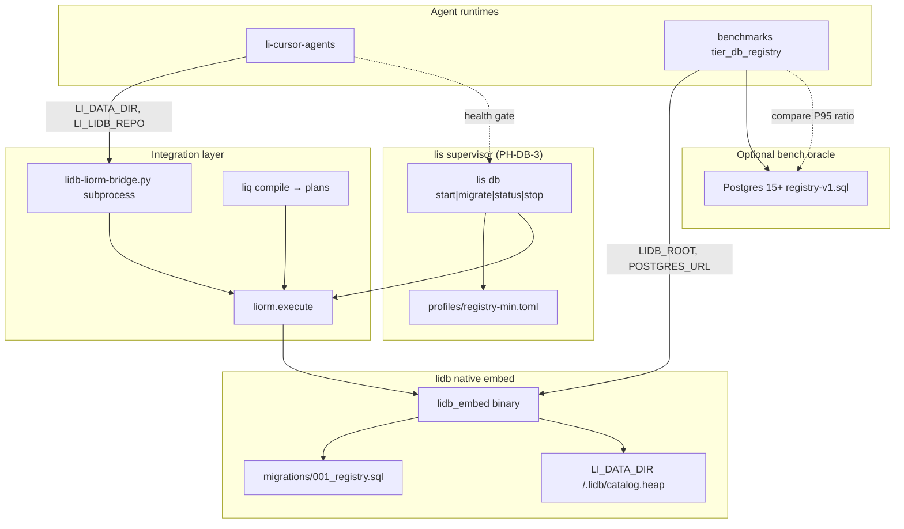
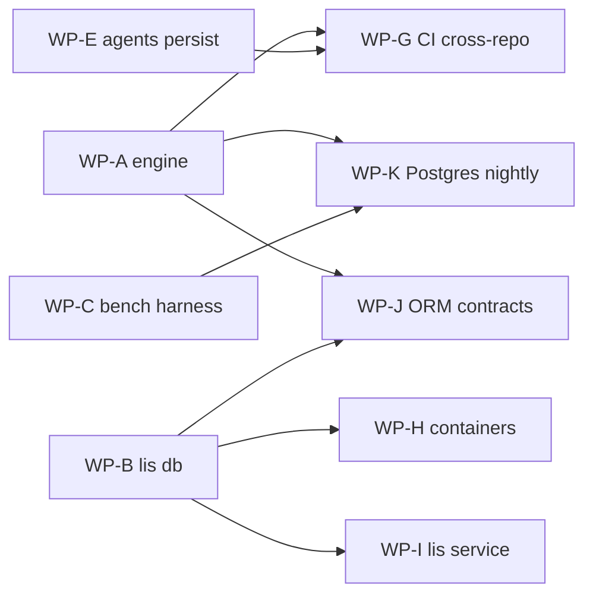

# PH-DB CI, hosting, containers, and ORM integration plan

**Status:** Active planning (2026-05-26)  
**Companion:** [ph-db-battle-plan.md](ph-db-battle-plan.md) (engine + WPs A–F) · [ph-db-lidb-platform.md](ph-db-lidb-platform.md) (phase index)  
**Control plane:** [lidb-migration-control-plane.md](https://github.com/li-langverse/li-cursor-agents/blob/main/docs/plans/lidb-migration-control-plane.md)

---

## 1. Executive summary

### Current state (verified 2026-05-26)

| Layer | Status | Honest assessment |
|-------|--------|-------------------|
| **CI** | **Partial** | Per-repo smoke exists; **no cross-repo PH-DB gate**; **no Postgres service**; **no `test:e2e:lidb-engine` in cloud CI** |
| **ORM interface** | **Partial** | `liorm` + `liq` in **lidb** call native `lidb_embed`; **lis** supervisor is in-process Python; **li-cursor-agents** uses a **Python subprocess bridge** (not shared in-process ORM) |
| **lis hosting** | **Dev-ready, not prod** | `lis db start\|migrate\|status\|stop` + `registry-min` profile land on WP-B branch; smoke green locally/CI when lidb checkout + cmake present |
| **Containers** | **Not started for PH-DB** | **No** lidb/lis Dockerfiles or compose; **lic** publishes **LLVM toolchain** images only (`ghcr.io/li-langverse/lic-ci`) |

Production agents still default to **`LI_CONTROL_PLANE_STORE=supabase`**. Benchmark dashboard rows for `tier_db_*` must remain **unknown** until measured lidb vs Postgres ratios exist.

### Target state (MVP)

A developer or CI runner can:

1. `docker compose up` (or `lis db start` on a host with sibling **lidb**) → migrated registry-min catalog + health JSON.
2. Run **li-cursor-agents** with `LI_CONTROL_PLANE_STORE=lidb` + `LI_DATA_DIR` (or `LI_LIDB_URL`) and pass **engine e2e** without `LI_LIDB_MOCK=1`.
3. PR CI proves: lidb smoke/pytest, lis db-smoke (cross-checkout lidb), optional non-blocking engine e2e.
4. Nightly CI proves: **Postgres 15+ service** + `tier_db_registry` compare harness → honest P95 ratio ingest.

---

## 2. Architecture diagram



**Connection modes**

| Mode | When | Env |
|------|------|-----|
| **Embed + data dir** | Local dev, CI engine tests | `LI_DATA_DIR`, `LIDB_REPO` / `LI_LIDB_REPO` |
| **lis supervisor** | Recommended host for agents | `lis db start` then `LI_DATA_DIR` or `LI_LIDB_URL=lidb://embedded` |
| **Subprocess bridge** | Node agents today | `scripts/lidb-liorm-bridge.py` spawned from `lidb-liorm.ts` |
| **TCP wire** | Future profiles (`tcp_port > 0`) | Not implemented; registry-min uses in-process only |

---

## 3. CI matrix

| Repo | Job / workflow | Triggers | What it proves today | Gaps |
|------|----------------|----------|----------------------|------|
| **lidb** | `ci` → `native-smoke-and-tests` | PR, push `main`/`dev` | No sqlite3; cmake smoke; pytest + security harness | No cross-repo consumers; security job has known failures on WP-A branch; no published embed artifact |
| **lidb** | `ci` → `audit-suite` | PR, push | WP-N5 audit scripts with `LIDB_ENGINE_READY=1` | Valgrind skipped; not wired to lis/agents |
| **lis** | `CI` → `infra-security-load` (matrix OS) | PR, push `main`/`dev` | Infra TOML, security/load stubs; **checkout lidb** on Linux/macOS | Windows skips lidb checkout; db-smoke only if cmake + `LIDB_REPO`; no formal pytest gate in workflow name |
| **lis** | `CI` → `merge-gate` | PR only | Meta merge gate | Does not run engine e2e |
| **li-cursor-agents** | `CI` → `test-mock-agents` | **push `main`**, `workflow_dispatch` only | Unit tests with `CURSOR_MOCK=1` | **No PR CI**; **no** `test:e2e:lidb` or `test:e2e:lidb-engine`; cloud quota note in workflow |
| **benchmarks** | `Benchmarks CI` → `ingest-smoke` | PR, push `main` | lic/lis checkout; lic build; tier_db_registry **validate-only stub** manifests | `BENCH_DB_REGISTRY_RUN_HARNESS` not set in CI; **no Postgres service**; ratio never measured in CI |
| **benchmarks** | `Benchmarks CI` → `dashboard-build` | PR | Next dashboard build | No db timing |
| **lic** | `Benchmarks` → `tier1-smoke` | Weekly cron, push `benchmarks/**`, dispatch | lic tier-1 bench smoke | Does not include tier_db_registry Postgres compare |
| **lic** | `Publish CI Docker image` | push `main` (docker paths) | **Toolchain** image LLVM22 | Not a lidb/lis runtime image |

**PR vs nightly summary**

| Concern | PR today | Nightly / scheduled today |
|---------|----------|---------------------------|
| lidb native build | Yes (lidb repo) | Same |
| lis + lidb cross-checkout | Yes (non-Windows) | Same |
| Postgres oracle for bench | **No** | **No** (tier_db_registry nightly profile exists in suite.toml but no workflow runs compare) |
| `LI_E2E_LIDB=1` / engine e2e | **No** | **No** |
| Control-plane persist vs Supabase | **No** | Swarm cron jobs unrelated to lidb store |

---

## 4. ORM integration layers

| Layer | Location | Role | Production-ready? | Notes |
|-------|----------|------|-------------------|-------|
| **lidb_embed** | `lidb/build/.../lidb_embed` | C++ engine: open, migrate, exec-json | **Yes (embed path)** | Built via cmake; PH-DB-3.1 forbids sqlite3 |
| **liorm** | `lidb/liorm/` | Plan registry, param binding, `execute()` → embed | **Partial** | Python reference impl; `_run_engine` calls `embed_engine.execute_sql`; Rust/Li liorm future per README |
| **embed_engine** | `lidb/liorm/embed_engine.py` | Subprocess wrapper around `lidb_embed` CLI | **Dev/CI** | Spawns binary per operation batch; not zero-copy in-process C API |
| **liq** | `lidb/liq/` | `compile(source) → {ir, sql, param_schema}` | **Partial** | Used by lis profile plan registration and bridge `read_liq` |
| **lis db supervisor** | `lis/lis/db/supervisor.py` | Migrate, register plans, state JSON | **Dev-ready (WP-B)** | True in-process Python import of liorm stack; single engine session contract |
| **lidb-liorm bridge** | `li-cursor-agents/scripts/lidb-liorm-bridge.py` + `src/db/lidb-liorm.ts` | Node ↔ Python ↔ liorm | **Harness / staging** | Subprocess per call; `LI_LIDB_MOCK=1` for mock e2e |
| **persist / liq-query** | `li-cursor-agents/src/db/persist.ts`, `liq-query.ts` | Control-plane writes/reads | **Partial** | `upsertAgentRunLidb` wired; 2 engine e2e todos (handoffs, control_plane_reports); default store **supabase** |
| **lip registry** | `lip` (remote) | Package registry API | **Not on lidb** | Blocked on **PH-DB-4**; reads still Postgres/API-shaped |

### Who calls what

```
Agent (Node)  →  runLidbBridge()  →  lidb-liorm-bridge.py  →  liorm.execute / embed_engine
lis db start  →  DbSupervisor     →  liq.compile + register_plan  →  embed_engine.EmbeddedSession
benchmarks    →  registry_oltp.py →  lidb_embed subprocess + psycopg (Postgres)
```

**Contract hardening (WP-J):** document stable JSON for `lis db status`, bridge command stdout, and `exec-json` lidb_embed responses; forbid RawSql in agent profiles; single-writer semantics for `LI_DATA_DIR`.

---

## 5. Hosting model

| Environment | Store / host | How agents connect | Status |
|-------------|--------------|-------------------|--------|
| **Dev local** | `lis db start` + `LI_DATA_DIR=./.li-data` | `LI_CONTROL_PLANE_STORE=lidb`, `LI_LIDB_REPO=../lidb`, optional `LI_LIDB_URL=lidb://embedded` | WP-B smoke path works |
| **Dev local (alt)** | Disk cache only | `LI_CONTROL_PLANE_STORE=disk` | CI-friendly, no engine |
| **CI** | Ephemeral dir + cross-checkout lidb | Same env as dev; compose optional (WP-H) | Partial — no engine e2e in GHA |
| **Staging** | **Supabase** (today) or lidb volume on VM | Supabase URL + Docker compose **or** `lis db` systemd sidecar | lidb path **not default** |
| **Production** | **Supabase** default | `LI_CONTROL_PLANE_STORE=supabase` | lidb flip is **human gate** after PH-DB-10 + security |

### lis hosting commands (target contract)

```bash
export LI_DATA_DIR="${LI_DATA_DIR:-./.li-data}"
export LI_PROFILE="${LI_PROFILE:-registry-min}"
export LIDB_REPO="${LIDB_REPO:-../lidb}"

lis db start      # migrate + register plans + write .lis/db-state.json
lis db status     # JSON, exit 0 when ready — assertStoreReady() in agents
lis db migrate    # idempotent
lis db stop       # clear supervisor state; keeps heap
```

**Agent env (li-cursor-agents)**

| Variable | Purpose |
|----------|---------|
| `LI_CONTROL_PLANE_STORE` | `supabase` (default), `disk`, `lidb` |
| `LI_DATA_DIR` | Data dir shared with lis / embed |
| `LI_LIDB_REPO` | Path to lidb checkout for bridge build |
| `LI_LIDB_URL` | `file://…` or `lidb://embedded` when engine up |
| `LI_LIDB_MOCK` | `1` = harness only (must not fake engine e2e pass) |
| `LI_E2E_LIDB` / `LI_E2E_LIDB_ENGINE` | Enable e2e suites locally |

---

## 6. Container plan

**Today:** zero PH-DB runtime containers. **lic** images = compiler CI toolchain only.

### Wave 1 — Dev compose (WP-H)

**Goal:** one-command local stack for agents + bench dev.

| Artifact | Contents |
|----------|----------|
| `lidb/docker/Dockerfile.embed` | Multi-stage: cmake build `lidb_embed`, copy migrations + liorm/liq Python tree |
| `lis/docker/Dockerfile.supervisor` | Python 3.12, `pip install -e .`, copy profiles, depend on embed stage or sidecar |
| `docker-compose.ph-db.yml` (lis or lic docs mirror) | Service `lis-db`: `lis db start`, volume `li-data`, publish healthcheck via `lis db status` |

```yaml
# Sketch — not shipped yet
services:
  lis-db:
    build:
      context: ..
      dockerfile: lis/docker/Dockerfile.supervisor
    environment:
      LI_DATA_DIR: /data
      LI_PROFILE: registry-min
      LIDB_REPO: /opt/lidb
    volumes:
      - li-data:/data
    healthcheck:
      test: ["CMD", "lis", "db", "status"]
  postgres-oracle:
    image: postgres:16-alpine
    profiles: ["bench"]
    environment:
      POSTGRES_DB: registry_bench
```

**Single-image vs sidecar:** prefer **single image** (lis + baked lidb embed) for MVP; sidecar only if embed build times force split.

### Wave 2 — CI image (WP-H + WP-G)

| Artifact | Purpose |
|----------|---------|
| `ghcr.io/li-langverse/lidb-ci:ubuntu24` (proposed) | Prebuilt `lidb_embed` + cmake deps; consumed by lidb/lis/benchmarks/workflows |
| Reuse **lic-ci** base | Extend with Python 3.12, postgres client libs — do not fork LLVM unnecessarily |

CI jobs mount no persistent volume; use `mktemp` data dir per job.

### Wave 3 — Deploy profile (optional)

| Profile | Services |
|---------|----------|
| `registry-min` | lis-db only |
| `control-plane` | lis-db + li-cursor-agents runner env file |
| `bench-nightly` | postgres-oracle + benchmarks harness sidecar |

**Not in MVP:** PG wire listener, Kubernetes operators, Supabase replacement in prod.

---

## 7. Workpackages

Parallel where noted. Builds on [ph-db-battle-plan.md](ph-db-battle-plan.md) WP-A…F.

### WP-G — CI cross-repo gate

| Field | Detail |
|-------|--------|
| **Goal** | One honest PH-DB PR signal across lidb + lis + li-cursor-agents |
| **Repos** | `lidb`, `lis`, `li-cursor-agents`, optional `lic` workflow_dispatch aggregator |
| **Tasks** | Re-enable li-cursor-agents PR job (or path-filtered); add job `lidb-engine-e2e` with checkout lidb + cmake + `npm run test:e2e:lidb-engine` (`continue-on-error` until green); pin lidb ref via `LIDB_CI_REF`; artifact `lidb_embed` from lidb workflow for downstream reuse |
| **Depends** | WP-A smoke stable, WP-E engine e2e todos cleared |
| **DoD** | PR comment shows pass/fail for engine e2e; mock e2e runs on every agents PR |

### WP-H — Container images

| Field | Detail |
|-------|--------|
| **Goal** | Reproducible embed build + `docker compose up` dev stack |
| **Repos** | `lidb`, `lis`, optional `lic` docs mirror |
| **Tasks** | Dockerfiles Wave 1–2; compose with volume; document `LI_DATA_DIR` mount; publish `lidb-ci` to GHCR on lidb `main` |
| **Depends** | WP-B lis db CLI stable |
| **DoD** | Fresh machine: `docker compose -f docker-compose.ph-db.yml up` → `lis db status` exit 0 |

### WP-I — lis service profile

| Field | Detail |
|-------|--------|
| **Goal** | Production-shaped **hosting** without TCP wire |
| **Repos** | `lis` |
| **Tasks** | systemd unit sample; `lis db start --foreground`; structured logging; merge WP-B; formal pytest in CI (not only shell smoke); README env contract sign-off |
| **Depends** | WP-A liorm execute parity |
| **DoD** | CI always runs `db-smoke.sh` on ubuntu + macOS; Windows documents skip |

### WP-J — ORM contract hardening

| Field | Detail |
|-------|--------|
| **Goal** | Stable interfaces between embed, liorm, lis, Node bridge |
| **Repos** | `lidb`, `lis`, `li-cursor-agents` |
| **Tasks** | JSON schema for `lis db status` and bridge responses; version field; reduce subprocess overhead (session reuse in bridge); document embed vs in-process roadmap |
| **Depends** | WP-A, WP-B |
| **DoD** | Breaking change requires semver bump in bridge protocol doc |

### WP-K — Bench Postgres in CI

| Field | Detail |
|-------|--------|
| **Goal** | Nightly measured `tier_db_registry` ratio ingest |
| **Repos** | `benchmarks`, `lidb` |
| **Tasks** | GHA `services: postgres:16`; job on schedule + `workflow_dispatch`; `BENCH_DB_REGISTRY_RUN_HARNESS=1`, `BENCH_DB_REGISTRY_PROFILE=nightly`, `BENCH_DB_REGISTRY_ENGINE=compare`; upload `tier-db-registry.json`; fail closed if Postgres up but ratio missing |
| **Depends** | WP-A engine, WP-C harness |
| **DoD** | Nightly artifact shows numeric P95 + `ratio_vs_postgres` or explicit `failed`; PR stays validate-only |

**Parallelism:** WP-H + WP-I after WP-B merge; WP-G + WP-K after WP-A; WP-J overlaps WP-G.

---

## 8. Dependencies and merge order

Reference [ph-db-battle-plan.md §4–6](ph-db-battle-plan.md):

| Order | Branch / WP | Unblocks |
|-------|-------------|----------|
| Wave 0 merges | `cursor/fix-swarm-health-9031`, `cursor/stdlib-adt-wp0`, `cursor/wp-lic-01-verticals-toml` | Baseline agents + lic |
| **WP-A** | `cursor/wp-a-ph-db-2-engine` | lidb CI green, liorm execute |
| **WP-B** | `cursor/wp-b-ph-db-3-lis-db` | **WP-I**, **WP-H** compose |
| **WP-E** | `cursor/wp-e-ph-db-10-liorm` | **WP-G** engine e2e |
| **WP-C** | `cursor/wp-c-ph-db-5-registry-bench` | **WP-K** nightly compare |
| **WP-D** | `cursor/wp-d-ph-db-4-registry` | lip / PH-8d-v2 (not CI MVP) |
| **WP-G…K** (this plan) | `cursor/ph-db-ci-hosting-plan` implementation branches | CI + containers MVP |



---

## 9. Definition of done — CI + ORM + lis hosting + container MVP

All must be true:

1. **lidb** PR CI: smoke + pytest + security (zero critical skips) + optional embed artifact upload.
2. **lis** PR CI: cross-checkout lidb + **`db-smoke.sh` mandatory** on Linux/macOS.
3. **li-cursor-agents** PR CI: `test:e2e:lidb` (mock) required; `test:e2e:lidb-engine` required or `continue-on-error` with tracked issue — **no** `LI_LIDB_MOCK` in engine job.
4. **benchmarks** PR CI: validate-only unchanged; **nightly** job with Postgres service produces honest ratio or `failed`.
5. **ORM:** `liorm.execute` + bridge `upsert_agent_run` / `read_liq` against same `LI_DATA_DIR` without mock.
6. **lis hosting:** documented quickstart; `lis db status` is the health gate for agents.
7. **Container:** published dev image or compose file; README runbook ≤ 10 commands from clone to agent e2e.
8. **Honesty:** dashboard `tier_db_*` not green without WP-K measurements; production default store remains supabase until human flip.

---

## 10. Anti-goals

- **No** fake-green bench manifests in PR CI (keep validate-only stub).
- **No** default `LI_CONTROL_PLANE_STORE=lidb` in production without §9 complete.
- **No** sqlite3 oracle or `embed_engine.py` sqlite fallback (PH-DB-3.1).
- **No** full Postgres wire compatibility or replication in container MVP.
- **No** replacing **lic-ci** toolchain images with a monolithic “everything” image before embed CI is stable.
- **No** TCP loopback requirement for registry-min (embed stays default).
- **No** claiming lip registry v2 ships on lidb before **PH-DB-4** (see battle plan).

---

## References

| Doc | Path |
|-----|------|
| Battle plan (WP-A–F) | [ph-db-battle-plan.md](ph-db-battle-plan.md) |
| Phase index | [ph-db-lidb-platform.md](ph-db-lidb-platform.md) |
| lis db | [lis/docs/db.md](https://github.com/li-langverse/lis/blob/main/docs/db.md) |
| liorm | [lidb/liorm/README.md](https://github.com/li-langverse/lidb/blob/main/liorm/README.md) |
| Tier registry bench | [tier-db-registry-benchmark.md](https://github.com/li-langverse/benchmarks/blob/main/docs/ecosystem/tier-db-registry-benchmark.md) |
| Control plane migration | [lidb-migration-control-plane.md](https://github.com/li-langverse/li-cursor-agents/blob/main/docs/plans/lidb-migration-control-plane.md) |
