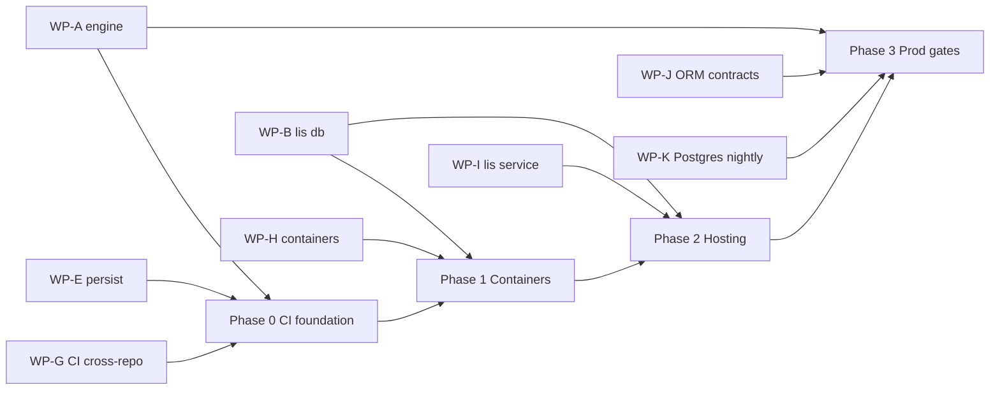
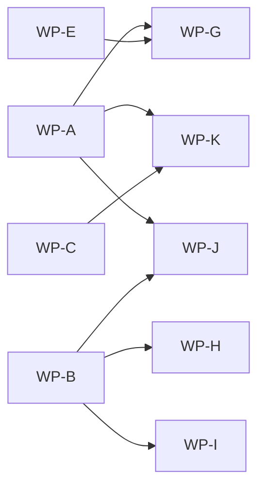

# PH-DB execution tracker — phases, workpackages, cross-links

**Status:** Active (2026-05-26)  
**Sprint:** Wave 3 = **WP-G … WP-K** (CI, containers, hosting, production gates)  
**Plans:** [ph-db-battle-plan.md](ph-db-battle-plan.md) (engine WPs A–F) · [ph-db-ci-hosting-plan.md](ph-db-ci-hosting-plan.md) (CI/hosting WPs G–K) · [ph-db-lidb-platform.md](ph-db-lidb-platform.md) (phase index)

---

**Swarm todos (canvas):** [ph-db-swarm-plan.md](./ph-db-swarm-plan.md)

## 1. Execution phases (Wave 3 ladder)

Cross-repo **CI + hosting MVP** phases from [ph-db-ci-hosting-plan.md §6–9](ph-db-ci-hosting-plan.md). Status reflects verified state **2026-05-26**; update this table when a phase exit gate closes.

| Phase | Theme | Primary WPs | Exit gate (summary) | CI | Containers | Hosting | Prod gates | Owner / notes |
|:-----:|-------|-------------|---------------------|:--:|:----------:|:-------:|:----------:|---------------|
| **0** | **CI foundation** | WP-G (+ WP-A, WP-E prereqs) | Cross-repo PR signal: lidb smoke + lis db-smoke + agents mock e2e; engine e2e tracked (`continue-on-error` until green) | **Partial** | — | — | — | `lidb`, `lis`, `li-cursor-agents`; optional `lic` aggregator |
| **1** | **Containers** | WP-H | `docker compose -f docker-compose.ph-db.yml up` → `lis db status` exit 0; optional `ghcr.io/li-langverse/lidb-ci` | Partial (per-repo only) | **Not started** | — | — | `lidb`, `lis`; docs mirror in `lic` |
| **2** | **Hosting** | WP-I (+ WP-B) | `lis db start\|status` is agent health gate; CI runs `db-smoke.sh` on Linux + macOS; systemd/foreground sample | Partial | — | **Dev-ready** | — | `lis` (embeds `lidb`) |
| **3** | **Production gates** | WP-J, WP-K (+ WP-C) | ORM contract semver; nightly Postgres compare → honest P95 ratio; [§9 DoD](ph-db-ci-hosting-plan.md) complete before default `LI_CONTROL_PLANE_STORE=lidb` | **No Postgres nightly** | — | Staging = Supabase default | **Blocked** | `benchmarks`, `lidb`, agents; **human flip** required |

**Phase dependency sketch**

---

## 2. Workpackage registry (WP-A … WP-K)

**PR URL pattern (new):** `https://github.com/li-langverse/{owner-repo}/compare/main...{branch}?expand=1`  
**Shortcut:** `https://github.com/li-langverse/{owner-repo}/pull/new/{branch}`

| WP | Wave | Owner repo(s) | Branch pattern | Tip (2026-05-26) | Depends on | Phase | §10 verified | Ready merge? | DoD |
|:--:|:----:|---------------|----------------|------------------|------------|:-----:|:------------:|:------------:|:---:|
| **A** | 1 | [`lidb`](https://github.com/li-langverse/lidb) | `cursor/wp-a-ph-db-2-engine` | `7ef9509` | Wave 0 | — | [§10.1](#101-prior-sprint-wpaf-verification-matrix) | **No** | - [ ] smoke + pytest green on `main` - [ ] security harness: zero critical skips/fails - [ ] `liorm.execute` vs native embed (integration test) - [ ] PR: [lidb/pull/new/cursor/wp-a-ph-db-2-engine](https://github.com/li-langverse/lidb/pull/new/cursor/wp-a-ph-db-2-engine) |
| **B** | 1 | [`lis`](https://github.com/li-langverse/lis) | `cursor/wp-b-ph-db-3-lis-db` | `ceac11e` | soft WP-A | 2 | [§10.1](#101-prior-sprint-wpaf-verification-matrix) | **Yes** | - [x] `db-smoke.sh` start→status→migrate→stop - [ ] formal pytest in CI - [ ] README env contract sign-off - [ ] PR: [lis/pull/new/cursor/wp-b-ph-db-3-lis-db](https://github.com/li-langverse/lis/pull/new/cursor/wp-b-ph-db-3-lis-db) |
| **C** | 2 | [`benchmarks`](https://github.com/li-langverse/benchmarks), `lidb` | `cursor/wp-c-ph-db-5-registry-bench` | `fee9582` | WP-A; soft WP-B | 3 | [§10.1](#101-prior-sprint-wpaf-verification-matrix) | **No** | - [x] real harness code path; validate-only CI - [x] honest `status=unknown` without Postgres - [ ] Postgres P95 + `ratio_vs_postgres` ≤ 1.2 (3 scenarios) - [ ] PR: [benchmarks/pull/new/cursor/wp-c-ph-db-5-registry-bench](https://github.com/li-langverse/benchmarks/pull/new/cursor/wp-c-ph-db-5-registry-bench) |
| **D** | 1–2 | [`lidb`](https://github.com/li-langverse/lidb), [`lip`](https://github.com/li-langverse/lip), [`lic`](https://github.com/li-langverse/lic) (docs) | `cursor/wp-d-ph-db-4-registry` | `4e34f0a` | WP-A; soft WP-B | — | [§10.1](#101-prior-sprint-wpaf-verification-matrix) | **No** | - [ ] `registry_smoke` green - [ ] pytest green on branch - [ ] lip OpenAPI parity table; zero blocking v2 read fields - [ ] human PH-8d-v2 unblock sign-off - [ ] PR: [lidb/pull/new/cursor/wp-d-ph-db-4-registry](https://github.com/li-langverse/lidb/pull/new/cursor/wp-d-ph-db-4-registry) · [lic/pull/new/cursor/wp-d-ph-db-4-registry](https://github.com/li-langverse/lic/pull/new/cursor/wp-d-ph-db-4-registry) |
| **E** | 2 | [`li-cursor-agents`](https://github.com/li-langverse/li-cursor-agents) | `cursor/wp-e-ph-db-10-liorm` | `ac8c656` | WP-A, WP-B | 0 | [§10.1](#101-prior-sprint-wpaf-verification-matrix) | **No** | - [x] `npm test`; mock e2e green - [ ] engine e2e: clear 2 todos (handoffs, control_plane_reports) - [ ] persist via liorm without `LI_LIDB_MOCK=1` - [ ] PR: [li-cursor-agents/pull/new/cursor/wp-e-ph-db-10-liorm](https://github.com/li-langverse/li-cursor-agents/pull/new/cursor/wp-e-ph-db-10-liorm) |
| **F** | 1 | [`research-findings`](https://github.com/li-langverse/research-findings) | `cursor/wp-f-db-r0-experiments` | `826285a` | — | — | [§10.1](#101-prior-sprint-wpaf-verification-matrix) | **Yes** (study) | - [x] DB-R0-1, DB-R0-4 reproduce scripts green - [x] `validity_grade: study-only` artifacts - [ ] PR: [research-findings/pull/new/cursor/wp-f-db-r0-experiments](https://github.com/li-langverse/research-findings/pull/new/cursor/wp-f-db-r0-experiments) |
| **G** | **3** | `lidb`, `lis`, `li-cursor-agents`, optional `lic` | `cursor/wp-g-ph-db-ci-cross-repo` | — | WP-A, WP-E | **0** | not run | **Not started** | - [ ] agents PR CI re-enabled (path-filtered OK) - [ ] job `lidb-engine-e2e` with lidb checkout + cmake - [ ] mock e2e on every agents PR - [ ] PR: [li-cursor-agents/pull/new/cursor/wp-g-ph-db-ci-cross-repo](https://github.com/li-langverse/li-cursor-agents/pull/new/cursor/wp-g-ph-db-ci-cross-repo) |
| **H** | **3** | `lidb`, `lis`, `lic` (docs) | `cursor/wp-h-ph-db-containers` | — | WP-B | **1** | not run | **Not started** | - [ ] `lidb/docker/Dockerfile.embed` - [ ] `lis/docker/Dockerfile.supervisor` - [ ] `docker-compose.ph-db.yml` healthcheck - [ ] PR: [lis/pull/new/cursor/wp-h-ph-db-containers](https://github.com/li-langverse/lis/pull/new/cursor/wp-h-ph-db-containers) |
| **I** | **3** | `lis` | `cursor/wp-i-ph-db-lis-service` | — | WP-A, WP-B | **2** | not run | **Not started** | - [ ] merge WP-B; formal pytest in CI - [ ] `lis db start --foreground`; systemd sample - [ ] db-smoke mandatory ubuntu + macOS - [ ] PR: [lis/pull/new/cursor/wp-i-ph-db-lis-service](https://github.com/li-langverse/lis/pull/new/cursor/wp-i-ph-db-lis-service) |
| **J** | **3** | `lidb`, `lis`, `li-cursor-agents` | `cursor/wp-j-ph-db-orm-contracts` | — | WP-A, WP-B | **3** | not run | **Not started** | - [ ] JSON schema: `lis db status`, bridge stdout - [ ] bridge session reuse; protocol semver doc - [ ] PR: [lidb/pull/new/cursor/wp-j-ph-db-orm-contracts](https://github.com/li-langverse/lidb/pull/new/cursor/wp-j-ph-db-orm-contracts) |
| **K** | **3** | `benchmarks`, `lidb` | `cursor/wp-k-ph-db-bench-postgres-ci` | — | WP-A, WP-C | **3** | not run | **Not started** | - [ ] GHA `services: postgres:16` nightly + dispatch - [ ] `BENCH_DB_REGISTRY_RUN_HARNESS=1` compare profile - [ ] artifact: numeric P95 + ratio or explicit `failed` - [ ] PR: [benchmarks/pull/new/cursor/wp-k-ph-db-bench-postgres-ci](https://github.com/li-langverse/benchmarks/pull/new/cursor/wp-k-ph-db-bench-postgres-ci) |

**Wave legend**

| Wave | WPs | Sprint |
|:----:|-----|--------|
| 0 | merge stubs | `fix-swarm-health-9031`, `stdlib-adt-wp0`, `wp-lic-01-verticals-toml` — see [battle plan §6](ph-db-battle-plan.md) |
| 1 | A, B, D, F | Prior sprint (engine + supervisor + schema prep) |
| 2 | C, E | Integration (bench harness + control-plane persist) |
| **3** | **G, H, I, J, K** | **This sprint** — [ci-hosting plan](ph-db-ci-hosting-plan.md) |

**Tracker branch (lic):** [`cursor/ph-db-execution-tracker`](https://github.com/li-langverse/lic/compare/main...cursor/ph-db-execution-tracker?expand=1) · [open PR](https://github.com/li-langverse/lic/pull/new/cursor/ph-db-execution-tracker)

---

## 3. Merge order and parallelism

From [ph-db-ci-hosting-plan.md §8](ph-db-ci-hosting-plan.md) and [ph-db-battle-plan.md §4–6](ph-db-battle-plan.md).

| Order | WP / branch | Unblocks |
|:-----:|-------------|----------|
| Wave 0 | agents `cursor/fix-swarm-health-9031`; lic `cursor/stdlib-adt-wp0`, `cursor/wp-lic-01-verticals-toml` | baseline |
| 1 | **WP-A** `cursor/wp-a-ph-db-2-engine` | lidb CI, liorm execute, **WP-G**, **WP-K** |
| 2 | **WP-B** `cursor/wp-b-ph-db-3-lis-db` | **WP-H**, **WP-I** |
| 3 | **WP-E** `cursor/wp-e-ph-db-10-liorm` | **WP-G** engine e2e |
| 4 | **WP-C** `cursor/wp-c-ph-db-5-registry-bench` | **WP-K** nightly compare |
| 5 | **WP-D** `cursor/wp-d-ph-db-4-registry` | PH-8d-v2 (not CI MVP) |
| 6 | **WP-G…K** (this sprint) | Phase 0–3 exit |

---

## 4. Cross-link index

| Topic | Document | Section |
|-------|----------|---------|
| Engine WPs A–F, Wave 0–2 | [ph-db-battle-plan.md](ph-db-battle-plan.md) | §3 WPs, §4 waves, §10 verification |
| CI matrix, ORM layers, hosting | [ph-db-ci-hosting-plan.md](ph-db-ci-hosting-plan.md) | §3 CI, §4 ORM, §5 hosting, §6 containers |
| Wave 3 WPs G–K | [ph-db-ci-hosting-plan.md](ph-db-ci-hosting-plan.md) | §7 workpackages |
| Phase 0–3 exit / anti-goals | [ph-db-ci-hosting-plan.md](ph-db-ci-hosting-plan.md) | §9 DoD, §10 anti-goals |
| PH-DB-0…10 phase IDs | [ph-db-lidb-platform.md](ph-db-lidb-platform.md) | phase table |
| Control plane migration | [lidb-migration-control-plane.md](https://github.com/li-langverse/li-cursor-agents/blob/main/docs/plans/lidb-migration-control-plane.md) | agents |
| lis db handoff | [handoff-wp5-lis.md](https://github.com/li-langverse/lidb/blob/main/docs/handoff-wp5-lis.md) | WP-B |
| Tier registry bench | [tier-db-registry-benchmark.md](https://github.com/li-langverse/benchmarks/blob/main/docs/ecosystem/tier-db-registry-benchmark.md) | WP-C, WP-K |
| R0 research seed | [db-r0-vertical-seed](https://github.com/li-langverse/research-findings/blob/main/whitepapers/2026-05/database_platform/db-r0-vertical-seed/README.md) | WP-F |

---

## 5. Phase 3 production gate checklist

All required before default **`LI_CONTROL_PLANE_STORE=lidb`** ([ci-hosting §9](ph-db-ci-hosting-plan.md)):

- [ ] **Phase 0:** lidb + lis + agents PR CI as specified in WP-G
- [ ] **Phase 1:** compose or published dev image (WP-H)
- [ ] **Phase 2:** `lis db status` health gate documented + CI smoke (WP-I)
- [ ] **Phase 3:** ORM contract semver (WP-J); nightly Postgres ratio or honest `failed` (WP-K)
- [ ] **WP-A** security harness green; **WP-E** engine e2e todos cleared
- [ ] **WP-C / PH-DB-5:** measured P95 ≤ 1.2× Postgres on 3 scenarios
- [ ] **Human sign-off:** production store flip (separate from merge)

---

## 10. Prior-sprint WP-A…F verification (inherited)

Copied from [ph-db-battle-plan.md §10](ph-db-battle-plan.md) (2026-05-26). **Wave 3 WPs G–K not yet verified.**

### 10.1 Prior-sprint WP-A…F verification matrix

| WP | Repo | Branch | Tip | Tests run? | Command(s) | Result | Ready to merge? |
|:--:|------|--------|-----|:----------:|------------|--------|:---------------:|
| **A** | `lidb` | `cursor/wp-a-ph-db-2-engine` | `7ef9509` | Yes | `smoke.sh`; `run_tests.sh`; `check_no_sqlite.sh` | smoke **PASS**; pytest **37 passed**; security **5 pass, 4 skip, 1 fail**; exit **1** | **No** |
| **B** | `lis` | `cursor/wp-b-ph-db-3-lis-db` | `ceac11e` | Yes | `db-smoke.sh` | **PASS** | **Yes** |
| **C** | `benchmarks` | `cursor/wp-c-ph-db-5-registry-bench` | `fee9582` | Yes | validate-only; harness without `POSTGRES_URL` | validate **PASS**; `unknown` honest | **No** |
| **D** | `lidb` | `cursor/wp-d-ph-db-4-registry` | `4e34f0a` | Yes | smoke; registry_smoke; run_tests | registry_smoke **FAIL**; **31 pass, 9 fail** | **No** |
| **D** | `lic` | `cursor/wp-d-ph-db-4-registry` | (docs) | N/A | — | traceability only | **N/A** |
| **E** | `li-cursor-agents` | `cursor/wp-e-ph-db-10-liorm` | `ac8c656` | Yes | `npm test`; e2e mock + engine | unit **293/1 skip**; engine **8 pass, 2 todo** | **No** |
| **F** | `research-findings` | `cursor/wp-f-db-r0-experiments` | `826285a` | Yes | db-r0-1 + db-r0-4 reproduce | **PASS** (study-only) | **Yes** |

### 10.2 DoD gap snapshot (WP-A…F)

| WP | DONE (verified) | OPEN |
|:--:|-----------------|------|
| **A** | Native smoke; pytest green; no sqlite3; liorm native path | Security `parallel-race-plan-registry` fail; RLS skips |
| **B** | `lis db` smoke; registry-min profile; in-process embed | Formal pytest; README sign-off |
| **C** | Harness path; validate-only; honest unknown | Postgres P95; PH-DB-5 ratio gate |
| **D** | Schema/migration work on branch | registry_smoke + 9 pytest fails; lip parity |
| **E** | unit + mock e2e; partial engine e2e | handoffs / control_plane_reports todos |
| **F** | DB-R0-1, DB-R0-4 reproduce | dashboard stays unknown until WP-C |

### 10.3 Human / infra still required

| Item | Blocks |
|------|--------|
| lip OpenAPI alignment sign-off | PH-DB-4, PH-8d-v2 |
| Postgres 15+ in CI | WP-K, PH-DB-5 |
| Measured P95 ≤ 1.2× on 3 scenarios | PH-DB-5 exit |
| Default `LI_CONTROL_PLANE_STORE=lidb` flip | Phase 3 |
| Wave 0 PR merges on lic verticals | Wave 1 start |

---

## Changelog

| Date | Change |
|------|--------|
| 2026-05-26 | Initial tracker: phases 0–3, WP-A…K registry, Wave 3 sprint, §10 verification cross-link |
