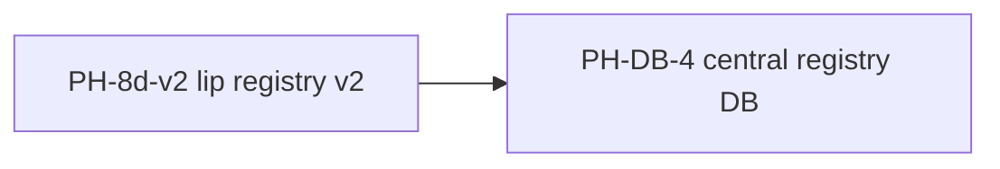

# Li data platform (PH-DB-0 … PH-DB-10)

**Status:** Roadmap-tracked; runtime not in **`lic`**.  
**Canonical ADR:** [lidb-li-data-platform](https://github.com/li-langverse/roadmap/blob/main/proposals/lidb-li-data-platform.md)  
**Research (PH-DB-G0):** [lidb-multi-model-gpu-research](https://github.com/li-langverse/roadmap/blob/main/proposals/lidb-multi-model-gpu-research.md)  
**Ecosystem copy:** [vision-and-roadmap § PH-DB](https://github.com/li-langverse/roadmap/blob/main/docs/ecosystem/vision-and-roadmap.md#li-data-platform-ph-db-0--ph-db-10) · **PKG-lidb:** [official-packages](https://github.com/li-langverse/roadmap/blob/main/docs/ecosystem/official-packages.md)

**Execution tracker:** [ph-db-execution-tracker.md](ph-db-execution-tracker.md) (phases 0–3, WP-A…K) · **Battle plan:** [ph-db-battle-plan.md](ph-db-battle-plan.md) · **CI/hosting:** [ph-db-ci-hosting-plan.md](ph-db-ci-hosting-plan.md) · **Gate registry:** [2026-06-07-ph-db-gate-decomposition.md](2026-06-07-ph-db-gate-decomposition.md) ([lic#423](https://github.com/li-langverse/lic/issues/423))

**Cross-phase dependency (lip):** **`PH-8d-v2`** (remote registry, full trust store) **depends on `PH-DB-4`** (registry v2 central DB on `lidb`). Do not ship **8d v2** until PH-DB-4 exit gate is met.

```mermaid
flowchart LR
  lip8d["PH-8d-v2 lip registry v2"]
  phdb4["PH-DB-4 central registry DB"]
  lip8d --> phdb4
```

## Phase table

| Phase | ID | Depends |
|-------|-----|---------|
| 0 | **PH-DB-0** | — |
| 1 | **PH-DB-1** | PH-DB-0; human: create `li-langverse/lidb` |
| 2 | **PH-DB-2** | PH-DB-1 |
| 3 | **PH-DB-3** | PH-DB-1 |
| 4 | **PH-DB-4** | PH-DB-1–3, lip OpenAPI; **blocks PH-8d-v2** |
| 5 | **PH-DB-5** | PH-DB-4 |
| 6 | **PH-DB-6** | PH-DB-4 |
| 7 | **PH-DB-7** | PH-DB-4 |
| 8 | **PH-DB-8** | PH-DB-1 |
| 9 | **PH-DB-9** | PH-DB-4 |
| 10 | **PH-DB-10** | PH-DB-4 |

Deliverable detail (WAL, `liorm`, `lis db`, bench evidence) lives in the roadmap ADR — this file is the **lic master-plan cross-link** only.

## Phased implementation issues (file after plan-approved)

| Phase | File in owner repo | Gates |
|-------|-------------------|-------|
| PH-DB-2 | `lidb` | [§5 WP-A](2026-06-07-ph-db-gate-decomposition.md#ph-db-2--wp-a--lidb-engine-6-gates) |
| PH-DB-3 | `lis` | [§5 WP-B](2026-06-07-ph-db-gate-decomposition.md#ph-db-3--wp-b--lis-db-supervisor-6-gates) |
| PH-DB-5 | `benchmarks` | [§5 WP-C](2026-06-07-ph-db-gate-decomposition.md#ph-db-5--wp-c--benchmarks-tier_db_registry-6-gates) |
| PH-DB-4 | `lidb`, `lip` | [§5 WP-D](2026-06-07-ph-db-gate-decomposition.md#ph-db-4--wp-d--registry-central-db-6-gates) |
| PH-DB-10 | `li-cursor-agents` | [§5 WP-E](2026-06-07-ph-db-gate-decomposition.md#ph-db-10--wp-e--control-plane-7-gates) |
| PH-DB-G0 | `research-findings` | [§5 WP-F](2026-06-07-ph-db-gate-decomposition.md#ph-db-g0--wp-f--research-5-gates) |
| PH-DB-W3 | multi | [§6 tracker](2026-06-07-ph-db-gate-decomposition.md#6-gate-registry--execution-tracker-44-gates) |

## Repo home

| Trigger | Org repo | Agent rule |
|---------|----------|------------|
| **PH-DB-1** | [`lidb`](https://github.com/li-langverse/lidb) (*proposed*) | Ask human to create repo before engine work; supervisor stays in **`lis`** |

**Benchmark evidence:** [`tier_db_registry`](https://github.com/li-langverse/benchmarks/blob/main/docs/ecosystem/tier-db-registry-benchmark.md) — see [benchmark tier index](https://github.com/li-langverse/roadmap/blob/main/docs/ecosystem/benchmark-tier-index.md).
