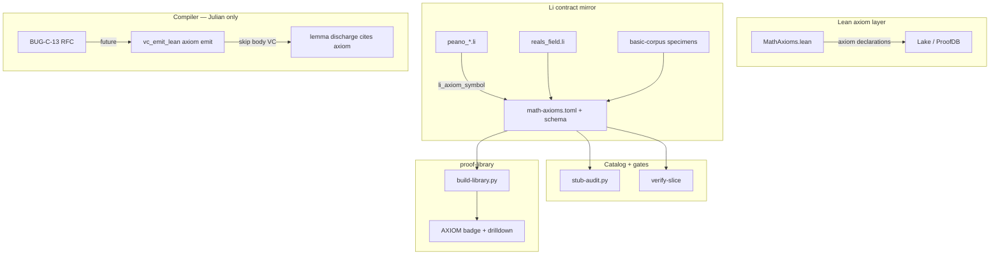

# Proof Explorer Phase 10 — axiom layer & proof-base formulations

**Branch:** `cursor/proof-explorer-phase10-axiom-layer` (merge to `main` after review)  
**Goal sprint:** `data/goal-directed-sprints/proof-explorer-phase10-axiom-layer.md`  
**Completion gate:** `scripts/proof-explorer-phase10-completion-gate.sh`  
**Compiler RFC (Julian):** `docs/reports/compiler-audit/BUG-C-13-li-axiom-declarations.md`

## 1. Executive summary & goals

Phase 10 upgrades the **proof base** from placeholder axiom witnesses (`ensures result == 0` / `return 0` only) to **statement-aligned Li contracts** that mirror Lean `MathAxioms.lean` and catalog rows. It adds catalog metadata (`li_axiom_symbol`, `specimen_role`), proof-library **AXIOM** presentation, and a **compiler RFC** for `axiom proc` / VC-skip emit — without agents editing `compiler/` or `trusted.lean`.

| Goal | Outcome |
|------|---------|
| Math Peano/order | One specimen file per `M-AX-PEANO-*` / `M-AX-ORDER-*` with non-trivial `ensures` |
| ℝ field | `reals_field.li` contracts match field laws (already partial) |
| Basic corpus | Replace `*_axiom_witness` stubs where feasible; enrich Erdős open rows |
| Catalog | TOML + schema v3 extensions; stub-audit gate for referenced specimens |
| Site | proof-library AXIOM badge; hide `witness_stub` snippets |
| Compiler | BUG-C-13 RFC for Julian — axiom emit in `vc_emit_lean` |

## 2. Non-goals

- **No** new axioms in `docs/semantics/trusted.lean` or production Lean math libraries.
- **No** agent edits to `compiler/`, `vc_emit_lean.cpp`, `vc_witness.cpp`, or `Discharge.lean` (report-only WP-AX-07).
- **No** claiming `proof_status = proved` for rows still on open gap scripts (phase 9 honesty carries forward).
- **No** full formalization of Erdős problems — open targets stay open; comments/contracts enriched only.

## 3. Architecture

| Layer | Responsibility |
|-------|----------------|
| Lean `proof-db/math/axioms/MathAxioms.lean` | Source of truth for `Li.ProofDb.Math.*` axioms |
| Li specimens | Executable contracts for explorer + future VC |
| Catalog TOML | `li_axiom_symbol`, `specimen_role`, `lean_thm`, `li_specimen` |
| Compiler (post-RFC) | `axiom proc` or `@axiom def` in proof-db only; emit `lean_thm` reference, skip body VC |
| proof-library | Ingest catalog + Lean scan; learner-facing badges |

## 4. Phases overview

| Phase | Focus | Gate |
|-------|-------|------|
| **10** (this) | Axiom formulations + catalog + site + RFC | `proof-explorer-phase10-completion-gate.sh` |
| 9 (done) | Compiler gap honesty | `proof-explorer-phase9-completion-gate.sh` |
| 8 (done) | Basic corpus scale | `proof-explorer-phase8-completion-gate.sh` |

## 5. Work packages

| WP | Owner | Deliverables | Acceptance |
|----|-------|--------------|------------|
| **WP-AX-01** | agent | Split Peano/order: `peano_zero_not_succ.li`, `peano_succ_injective.li`, `peano_induction.li`, `order_trichotomy_nat.li`, `order_antisym.li` | `wp-ax-01-math-peano-contracts.sh` exit 0; no axiom def with *only* `ensures result == 0` |
| **WP-AX-02** | agent | `reals_field.li` — four field laws with statement-aligned `ensures` | `wp-ax-02-math-reals-field.sh` exit 0 |
| **WP-AX-03** | agent | basic-corpus: replace `*_axiom_witness` with statement defs where feasible | `wp-ax-03-basic-corpus-axioms.sh` — ≥30% non-witness primary defs in axiom_layer slice |
| **WP-AX-04** | agent | Erdős open: enrich comment/contract on feasible subset | `wp-ax-04-erdos-open-enrich.sh` — P0/P1 rows have `context` or non-trivial `li_specimen` |
| **WP-AX-05** | agent | Catalog `li_axiom_symbol`, `specimen_role`; schema doc | `wp-ax-05-catalog-axiom-fields.sh` — all `M-AX-*` in math-axioms.toml |
| **WP-AX-06** | agent | proof-library AXIOM badge; hide `*_axiom_witness` in snippets | `wp-ax-06-proof-library-axiom-ui.sh` (proof-library PR) |
| **WP-AX-07** | Julian | `BUG-C-13-li-axiom-declarations.md` RFC | File exists; no `compiler/` diff in agent PR |
| **WP-AX-08** | agent | stub-audit on catalog-referenced specimens | `wp-ax-08-stub-audit-catalog.sh` exit 0 for math axiom paths |
| **WP-AX-09** | agent | Rebuild `proof-library/data/library.json` | `wp-ax-09-rebuild-library-json.sh` |
| **WP-AX-10** | agent | `iteration-log.md` + `state.json` phase 10 | `wp-ax-10-loop-state.sh` |
| **WP-AX-11** | agent | `export-math.py` exports new catalog fields | Covered in WP-AX-05 gate |
| **WP-AX-12** | agent | Sign-off `data/proof-explorer-loop/wp-ax-axiom-layer.signoff` | Phase completion gate |

**Agent sprint scope:** WP-AX-01 … 06, 08 … 10 (and 11/12 via gates). **WP-AX-07** report-only.

## 6. Verification matrix

| Gate | Script | Requires `lic` built |
|------|--------|---------------------|
| Schema v3 | `wp0-schema.sh` | no |
| WP-AX-01 | `wp-ax-01-math-peano-contracts.sh` | no |
| WP-AX-02 | `wp-ax-02-math-reals-field.sh` | no |
| WP-AX-03 | `wp-ax-03-basic-corpus-axioms.sh` | no |
| WP-AX-04 | `wp-ax-04-erdos-open-enrich.sh` | no |
| WP-AX-05 | `wp-ax-05-catalog-axiom-fields.sh` | no |
| WP-AX-06 | `wp-ax-06-proof-library-axiom-ui.sh` | no |
| WP-AX-07 | `wp-ax-07-compiler-rfc-present.sh` | no |
| WP-AX-08 | `wp-ax-08-stub-audit-catalog.sh` | no |
| WP-AX-09 | `wp-ax-09-rebuild-library-json.sh` | no |
| WP-AX-10 | `wp-ax-10-loop-state.sh` | no |
| Catalog slice | `proof-db.py verify-slice` | no |
| Phase | `proof-explorer-phase10-completion-gate.sh` | no |

## 7. Risks & dependencies

| Risk | Mitigation |
|------|------------|
| Li Nat/ℝ types incomplete | Contracts use `int`/`float` + comments; Lean remains authoritative |
| Compiler lacks axiom emit | RFC BUG-C-13; specimens compile as `def` witnesses until Julian ships |
| proof-library separate repo | WP-AX-06 PR against proof-library; gate checks handoff signoff path |
| stub-audit noise on corpus | WP-AX-08 scopes to `gap_kind = axiom_layer` + math paths first |
| Phase 9 open BUG-C rows | Do not mark proved; axiom layer independent |

**Dependencies:** phase 9 completion (handoff), `proof-db.py verify-slice`, proof-library ingest script.

## 8. Definition of done

1. All WP-AX-01 … 06, 08 … 12 gates pass; WP-AX-07 RFC merged or on branch for Julian review.
2. `bash scripts/proof-explorer-phase10-completion-gate.sh` exit 0.
3. `python3 scripts/proof-db/proof-db.py verify-slice` exit 0.
4. K8s `li-proof-explorer` logs show `phase10` goal spawn; branch pushed.
5. PR(s) open: **lic** (phase10), **li-cursor-agents** (handoff), optional **proof-library** (AXIOM UI).

## K8s handoff

- `LI_PROOF_EXPLORER_BRANCH=cursor/proof-explorer-phase10-axiom-layer`
- `LI_PROOF_EXPLORER_GOAL_FILE=data/goal-directed-sprints/proof-explorer-phase10-axiom-layer.md`
- `LI_PROOF_EXPLORER_PHASE_HANDOFF=0` or `LI_PROOF_EXPLORER_PHASES_JSON` with only `phase10`
- After phase 9 gate passes on worker: `LI_PROOF_EXPLORER_PHASE_HANDOFF=1` for auto-advance

## References

- `proof-db/math/axioms/MathAxioms.lean`
- `docs/verification/proof-database/entries/math-axioms.toml`
- `docs/reports/compiler-audit/BUG-C-13-li-axiom-declarations.md`
- `scripts/formalization/stub-audit.py`
