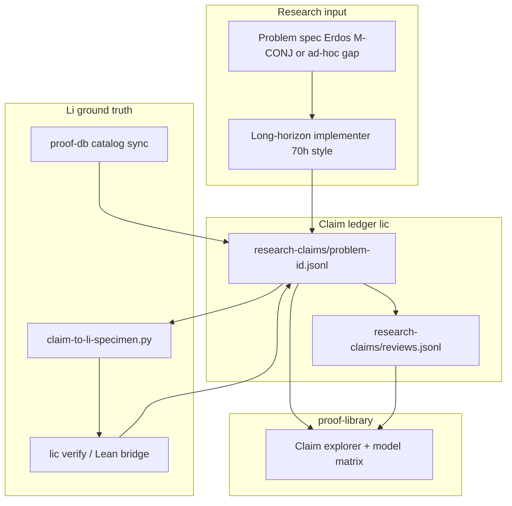

# Proof Explorer Phase 3 — Research audit (Ennis-style autonomy, Li-grounded)

## Motivation

External autonomous research stacks (e.g. John Ennis / Aigora **elves_skill** + Codex on open problems such as the **horoconvex-domain fundamental gap**) can run for tens of hours: plan → prove attempt → test → revise, with **multiple LLMs reviewing** intermediate steps. Strong lemmas may emerge before any paper is written.

Li-langverse should **not** treat model prose as proved math. Phase 3 adds a **claim ledger** and **Li verification lane** so every assertion is classified against what Li can actually discharge (Lean / proof-db / literature), and multi-model disagreements are surfaced explicitly.

**Human role (fixed):** intuition, problem selection, and sign-off on `proof_status = proved` — same as Phase 1 style guide.

---

## North star

Given a research problem (Erdős row, M-CONJ, or ad-hoc gap like horoconvex):

1. Agents produce **structured claims** (not only chat prose).
2. **Reviewer models** score each claim independently.
3. **Li** attempts formalization + `lic verify` / Lean bridge where possible.
4. The explorer UI shows **claim vs provability** — no “proved” without machine or literature backing.

---

## Epistemic status (claim ledger)

Every claim row carries exactly one `epistemic_status`:

| Status | Meaning | UI badge |
|--------|---------|----------|
| `li_proved` | Li specimen + Lean discharge (or catalog row already `proof_status = proved`) | Proved (Li) |
| `li_open` | Formalized in Li/proof-db as target; no discharge | Open (formal) |
| `literature_proved` | Matches published result; `sources[]` required; not re-proved in Li | Literature |
| `heuristic` | Model narrative only; not formalized | Heuristic |
| `model_consensus` | ≥2 reviewers agree; still not Li-proved | Consensus (unproved) |
| `model_conflict` | Reviewers disagree | Disputed |
| `refuted` | Counterexample or failed Li check | Refuted |

**Hard rule:** Never map `heuristic` or `model_consensus` → catalog `proof_status = proved`.

---

## Architecture



---

## Work packages (Phase 3 order)

| WP | Name | Deliverable | Gate |
|----|------|-------------|------|
| **WP-RA** | Research autonomy | Long-horizon K8s profile: `LI_PROOF_EXPLORER_LOOP_SLEEP_SEC`, problem pick from register/P0 | `wp-ra-problem.sh` |
| **WP-CL** | Claim ledger schema | `proof-db/research-claims/schema.toml` + JSONL append API | `wp-claim-ledger.sh` |
| **WP-MR** | Multi-model review | Reviewer agent lane: same claim set → `reviews.jsonl` with model id + verdict | `wp-multi-review.sh` |
| **WP-LV** | Li verification | `scripts/research-audit/claim-to-li-specimen.py`, `lic verify` batch, status upgrade rules | `wp-li-verify-claims.sh` |
| **WP-CM** | Compare & report | `scripts/research-audit/compare-claims.py` — model matrix vs Li status | `wp-claim-compare.sh` |
| **WP-AU** | Audit UI | proof-library: claim detail page, reviewer matrix, Li specimen link | manual sign-off file |

---

## WP-CL — Claim ledger (canonical shape)

Path: `proof-db/research-claims/{problem_id}/claims.jsonl`

```json
{
  "claim_id": "CLM-horoconvex-001",
  "problem_id": "ADHOC-HOROCONVEX-GAP",
  "parent_claim_id": null,
  "statement_plain": "...",
  "statement_latex": "...",
  "author_agent": "code_implementer",
  "author_model": "composer-2.5-fast",
  "created_at": "2026-05-31T12:00:00Z",
  "epistemic_status": "heuristic",
  "li_specimen": null,
  "lean_thm": null,
  "sources": [],
  "notes": "Intermediate lemma from iteration 12"
}
```

Reviews path: `proof-db/research-claims/{problem_id}/reviews.jsonl`

```json
{
  "claim_id": "CLM-horoconvex-001",
  "reviewer_model": "claude-4.6-sonnet",
  "verdict": "plausible|proved|wrong|unclear",
  "confidence": 0.72,
  "reviewed_at": "2026-05-31T13:00:00Z",
  "rationale_plain": "..."
}
```

---

## WP-LV — Li verification rules

1. **Formalization attempt** — map claim text → `.li` specimen (conservative; reject ambiguous quantifiers).
2. **`lic verify`** — if discharge succeeds → set `epistemic_status = li_proved`, link `li_specimen` + `lean_thm`.
3. **Catalog match** — if claim normalizes to existing proof-db id → inherit status (never upgrade without check).
4. **Literature hook** — if agent cites DOI/arXiv and statement matches → `literature_proved` (human or script verify citation exists).
5. **Otherwise** — stay `heuristic` until review lane runs.

Compare script output: `data/research-audit/{problem_id}/compare-report.json`

```json
{
  "problem_id": "ADHOC-HOROCONVEX-GAP",
  "claims_total": 42,
  "by_epistemic_status": { "heuristic": 30, "model_consensus": 8, "li_open": 4 },
  "model_conflicts": 3,
  "li_proved": 0,
  "unprovable_language_flags": ["CLM-horoconvex-007", "CLM-horoconvex-019"]
}
```

`unprovable_language_flags` = claims where reviewers said “proved” but Li status is not `li_proved` or `literature_proved`.

---

## WP-MR — Multi-model review (homelab)

ConfigMap keys (future):

- `LI_RESEARCH_REVIEW_MODELS` — comma-separated reviewer slugs
- `LI_RESEARCH_REVIEW_MIN` — minimum reviewers per claim before consensus logic

Orchestration: after each implementer iteration, spawn **review-only** passes (no repo write except reviews.jsonl). Disagreement → `model_conflict` automatically.

---

## WP-RA — Long-horizon autonomy

Inspired by ~70h Ennis runs:

| Setting | Phase 2 | Phase 3 |
|---------|---------|---------|
| Loop sleep | 120s | 300s |
| Max iterations | unlimited | unlimited until phase gate |
| Problem binding | whole program | single `problem_id` in state.json |
| Completion | phase2 gate | all P0 claims reviewed + compare report |

State extension (`data/proof-explorer-loop/state.json`):

```json
{
  "phase": 3,
  "research_problem_id": "E-52",
  "claim_count": 0,
  "review_round": 0
}
```

---

## Gates (Phase 3 completion)

```bash
bash scripts/proof-explorer-phase3-completion-gate.sh
```

Requires:

- Claim ledger schema on disk
- ≥1 ad-hoc or catalog problem with ≥10 claims
- Each claim has ≥2 reviews OR explicit `skip_review` with reason
- `compare-claims.py` runs clean (no reviewer “proved” without Li/literature backing unless flagged)
- `wp-li-verify-claims.sh` — at least one claim formalized to `li_open` or `li_proved`

---

## Relation to Phase 1–2

| Phase | Focus |
|-------|--------|
| 1 | Ingest + schema v3 (merged) |
| 2 | Explorer UI, overlays, Tier-B (in progress on K8s) |
| 3 | **Autonomous research + Li audit of model claims** |

Phase 3 starts when Phase 2 gate passes; K8s worker switches goal file to `proof-explorer-phase3-research-audit.md`.

---

## Attribution

Same dual footer as Phase 1: Li Proof Library + Julian Kleber ([julianmkleber.com](https://julianmkleber.com) / [@capjmk](https://x.com/capjmk)).

Research claims authored by agents must include `author_agent` + `author_model`; reviewer rows include `reviewer_model`. No claim of human proof without curator sign-off in iteration log.
