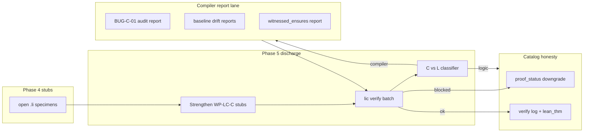

# Proof Explorer Phase 5 — Discharge sprint (compiler **reports** + core lemma discharges)

## Motivation

Phase 4 achieved **100% Li specimen coverage** (1290/1290 catalog rows have on-disk stubs or discharged proofs). Coverage is necessary but not sufficient: many stubs are open targets, and the formalization audit surfaced **compiler bugs** (AutoVC mis-wiring, baseline drift) and **logic/catalog conflicts** (float vs real, cross-field duplicates) that block honest `lic verify` discharges.

Phase 5 turns the proof explorer into a **research tool for finding lic bugs** — every failed discharge is classified as **compiler (C)** vs **logic/catalog (L)** before any `proof_status` upgrade.

**Human role:** sign-off on compiler fixes and on each `proof_status = proved` upgrade.

---

## North star

Core math/linalg lemmas (dot4, sqrt, witnessed ensures) discharge through `lic verify` with evidence on disk. Known audit bugs are **documented** (report-only) or catalog rows are **honestly downgraded**. At least three new verified discharges land in the core corpus with verify logs linked in proof-db.

---

## Prerequisite

Phase 4 gate must pass:

```bash
bash scripts/proof-explorer-phase4-completion-gate.sh
```

---

## Audit bug tie-in

| Bug ID | Class | Summary | Phase 5 WP |
|--------|-------|---------|------------|
| **BUG-C-01** | Compiler | `linalg_dot4_*_loop_open` AutoVC emits `Prop := True` instead of wiring to `Li.Discharge.dot4_*_loop_eval_spec` | WP-DS-01 |
| **BUG-C-05** | Compiler | Missing `witnessed_ensures_ident.li` in contracts_verify corpus | WP-DS-02 |
| **BUG-C-06** | Compiler | `baseline.jsonl` out of sync with catalog entries (hash drift) | WP-DS-03 |
| **BUG-C-07** | Compiler | Baseline slice verify fails on recently patched rows | WP-DS-03 |
| **BUG-L-01** | Logic | Float specimens claim real-valued theorems; discharge policy ambiguous | WP-DS-04 |
| **BUG-L-05** | Logic | Duplicate `li_specimen` paths across Erdős / math fields | WP-DS-06 |
| **BUG-L-06** | Logic | Conflicting `proof_status` vs `formalization_status` on literature-proved rows | WP-DS-06 |

Classification rule: if `lic verify` fails on a syntactically valid specimen and Lean bridge is correct → **compiler**; if statement is ill-typed or catalog semantics disagree → **logic**.

---

## Architecture



---

## Work packages

| WP | Name | Deliverable | Completion criteria | Gate |
|----|------|-------------|---------------------|------|
| **WP-DS-01** | dot4 loop discharge | Fix BUG-C-01: loop witness → Discharge spec **or** catalog downgrade + `gap_id` | `linalg_dot4_int_loop_open.li` / float variant passes `lic verify` **or** catalog row honestly `target` with audit note | `wp-discharge-dot4.sh` |
| **WP-DS-02** | witnessed ensures | Add `li-tests/contracts_verify/witnessed_ensures_ident.li` + Lean bridge (BUG-C-05) | File exists; `lic verify` green in CI slice | manual + core gate |
| **WP-DS-03** | baseline sync | Regenerate `proof-db/baseline.jsonl`; fix BUG-C-06/07 | `proof-db.py verify-slice` + `check-proof-db.sh` pass | `wp-baseline-sync.sh` |
| **WP-DS-04** | float policy | Document + enforce float vs real discharge policy (BUG-L-01) | `docs/verification/float-discharge-policy.md`; float specimens tagged `gap_kind=float_open` until real bridge | `wp-float-policy.sh` |
| **WP-DS-05** | core discharge sprint | Strengthen ≥3 core stubs → partial/full discharge (dot4, sqrt, identity/trivial) | ≥3 new rows in `data/proof-explorer-loop/discharge-log.jsonl` with `# discharge: ok` | `wp-discharge-core.sh` |
| **WP-DS-06** | catalog conflicts | Resolve BUG-L-05/06 cross-field duplicates and status conflicts | Zero duplicate specimen paths; literature-proved rows use `target` + `formalization_status` | wp4-audit + manual |
| **WP-DS-SIGN** | sign-off | Human review of discharge evidence | `data/proof-explorer-loop/wp-discharge.signoff` with PR URL + bug disposition table | phase gate |

---

## WP-DS-05 — Core corpus targets (minimum)

Priority order for real discharges (not exhaustive):

1. `Li.Discharge.dot4_int_loop_eval_spec` — int loop dot4 (depends WP-DS-01)
2. `discharge_sqrt_contract.li` / open sqrt variant — partial or closed
3. `discharge_identity.li` / `discharge_trivial.li` — regression anchors
4. Any one `proof-db/math/specimens/M-LM-*` lemma upgraded from stub

Discharge log shape (`data/proof-explorer-loop/discharge-log.jsonl`):

```json
{
  "entry_id": "M-LM-DOT4-INT",
  "li_specimen": "li-tests/contracts_verify/linalg_dot4_int_loop_closed.li",
  "verified_at": "2026-05-31T18:00:00Z",
  "bug_class": null,
  "proof_status_before": "target",
  "proof_status_after": "proved",
  "evidence": "lic verify exit 0; lean_thm=Li.Discharge.dot4_int_loop_eval_spec"
}
```

---

## Do not

- Set `proof_status = proved` without `lic verify` exit 0 or existing Lean discharge evidence.
- Mark BUG-C-01 fixed by silencing AutoVC (`Prop := True`) without linking a Discharge spec.
- Upgrade float specimens to `proved` under real semantics without explicit float policy (BUG-L-01).
- Regress Phase 4 Li coverage below 100%.
- Batch-upgrade literature-proved Erdős rows in Phase 5 — that is Phase 6 scope.

---

## Completion gate

```bash
bash scripts/proof-explorer-phase5-completion-gate.sh
```

Thresholds (realistic — not 1217 discharges):

| Check | Threshold |
|-------|-----------|
| BUG-C-01 | Fixed (verify pass) **or** honest catalog downgrade documented |
| baseline.jsonl | Synced (`wp-baseline-sync.sh`) |
| New discharges | ≥ 3 core corpus `lic verify` successes logged |
| Sign-off | `data/proof-explorer-loop/wp-discharge.signoff` present |

When exit 0 → `GOAL_COMPLETE` → handoff to Phase 6.
