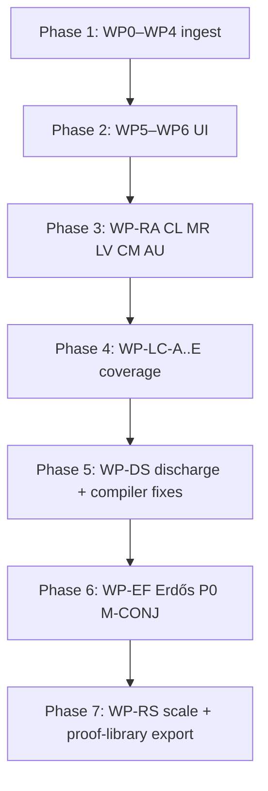

# Proof Explorer — Program roadmap (Phases 1–7)

Master index for the Proof Explorer / formal proof program. Each phase has a **plan** (design), **goal sprint** (agent iteration), and **completion gate** (machine check).

**North star (program):** Learners and researchers explore ~1,200 Erdős problems and math-field conjectures with honest proof status — Li specimens, Lean discharges, literature anchors, and research claim ledgers — never model prose masquerading as proved math.

---

## Phase map

| Phase | Name | Status | Plan | Goal sprint | Gate |
|-------|------|--------|------|-------------|------|
| **1** | Schema + ingest | ✅ Merged | [proof-explorer-program.md](proof-explorer-program.md) | [goal](../../data/goal-directed-sprints/proof-explorer-program.md) | `scripts/proof-explorer-completion-gate.sh` |
| **2** | proof-library UI + Tier-B | ✅ Merged | [proof-explorer-program.md](proof-explorer-program.md) | [goal](../../data/goal-directed-sprints/proof-explorer-program.md) | `scripts/proof-explorer-phase2-completion-gate.sh` |
| **3** | Research audit (E-52 pilot) | ✅ Merged | [phase3](proof-explorer-phase3-research-audit.md) | [goal](../../data/goal-directed-sprints/proof-explorer-phase3-research-audit.md) | `scripts/proof-explorer-phase3-completion-gate.sh` |
| **4** | Li coverage invariant | ✅ Complete (1290/1290) | [li-coverage-invariant.md](../../verification/proof-database/li-coverage-invariant.md) | [goal](../../data/goal-directed-sprints/proof-explorer-phase4-li-coverage.md) | `scripts/proof-explorer-phase4-completion-gate.sh` |
| **5** | Discharge sprint | 🔜 Active | [phase5](proof-explorer-phase5-discharge-sprint.md) | [goal](../../data/goal-directed-sprints/proof-explorer-phase5-discharge-sprint.md) | `scripts/proof-explorer-phase5-completion-gate.sh` |
| **6** | Erdős P0 + M-CONJ | 📋 Planned | [phase6](proof-explorer-phase6-erdos-formalization.md) | [goal](../../data/goal-directed-sprints/proof-explorer-phase6-erdos-formalization.md) | `scripts/proof-explorer-phase6-completion-gate.sh` |
| **7** | Research at scale | 📋 Planned | [phase7](proof-explorer-phase7-research-at-scale.md) | [goal](../../data/goal-directed-sprints/proof-explorer-phase7-research-at-scale.md) | `scripts/proof-explorer-phase7-completion-gate.sh` |

---

## Work package lineage



### Phase 5 WPs (7)

WP-DS-01 dot4 · WP-DS-02 witnessed ensures · WP-DS-03 baseline sync · WP-DS-04 float policy · WP-DS-05 core discharge · WP-DS-06 catalog conflicts · WP-DS-SIGN

### Phase 6 WPs (7)

WP-EF-01 E-52 · WP-EF-02 Bloom Top-10 · WP-EF-03 P0 discharge · WP-EF-04 M-CONJ · WP-EF-05 export li_specimen · WP-EF-06 claim sync · WP-EF-SIGN

### Phase 7 WPs (7)

WP-RS-01 multi-problem ledgers · WP-RS-02 Li verify scale · WP-RS-03 compare matrix · WP-RS-04 export full field · WP-RS-05 proof-library · WP-RS-06 long-horizon loop · WP-RS-SIGN

---

## Audit bug disposition (Phases 5–6)

| Bug | Phase | Owner WP |
|-----|-------|----------|
| BUG-C-01 dot4 AutoVC | 5 | WP-DS-01 |
| BUG-C-05 witnessed_ensures | 5 | WP-DS-02 |
| BUG-C-06/07 baseline drift | 5 | WP-DS-03 |
| BUG-L-01 float vs real | 5 | WP-DS-04 |
| BUG-L-05/06 cross-catalog | 5 | WP-DS-06 |

---

## Agent worker handoff

`li-cursor-agents` runs phases sequentially via `proof-explorer-phase-handoff.ts`:

```
phase2 → phase3 → phase4 → phase5 → phase6 → phase7 → exit (all gates pass)
```

Branch convention: `cursor/proof-explorer-phase{N}` or `cursor/proof-explorer-phase5-planning` during plan authoring.

---

## Key artifacts

| Artifact | Path |
|----------|------|
| Catalog schema v3 | `docs/verification/proof-database/schema.toml` |
| Style guide | `docs/verification/proof-database/proof-explorer-style-guide.md` |
| Li coverage report | `data/proof-explorer-loop/li-coverage-report.json` |
| Discharge log | `data/proof-explorer-loop/discharge-log.jsonl` |
| Loop state | `data/proof-explorer-loop/state.json` |
| WP gates | `scripts/proof-explorer-gates/` |

---

## Do not (program-wide)

- Set `proof_status = proved` without verify evidence.
- Skip phase gates to "move faster."
- Treat stub coverage (Phase 4) as mathematical proof.
- Use model reviewer verdict as ground truth.
